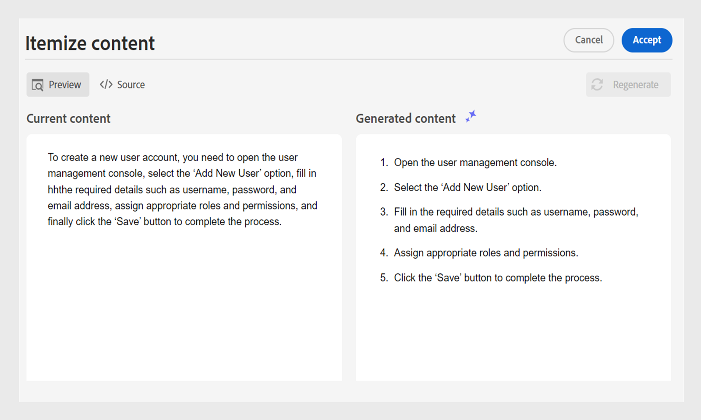

# Asistente de IA para crear documentos con eficiencia inteligente

Experience Manager Guides proporciona una herramienta de asistente de IA que le ayuda a hacer que la creación sea más inteligente y rápida. Experimenta la gestión simplificada de documentos mediante sugerencias inteligentes y optimización. Con esta herramienta, vea las sugerencias inteligentes para reutilizar el contenido del repositorio de contenido existente. Utilice la función de mensaje de texto para proporcionar un mensaje y cambiar el contenido o generar una salida según sus necesidades. Utilice el asistente de IA para convertir de forma inteligente un párrafo en una lista. Puede crear una breve descripción para el tema actual. Esta función también le ayuda a mejorar y traducir fácilmente el contenido seleccionado.

>[!NOTE]
>
> Para agregar la función Asistente de IA en el panel derecho, el administrador del sistema debe seleccionar la opción **Asistente de IA** en la pestaña **Paneles** del **icono Configuración del editor** .
> Además, debe retirar el documento para ver el icono del asistente de IA.

Esta función sólo está disponible para temas DITA. Después de seleccionar el texto de un tema, puede elegir realizar cualquiera de las acciones del Asistente de IA:

## Sugerir contenido reutilizable

Use la característica **Sugerir contenido reutilizable**  para crear contenido de manera consistente y precisa. Puede seleccionar el contenido y Experience Manager Guides proporciona sugerencias sobre cómo reutilizar el contenido existente en el repositorio.
Más información sobre cómo usar [sugerencias inteligentes con tecnología de IA para crear contenido](authoring-ai-based-smart-suggestions.md).

## Usar indicador de texto

Un mensaje de texto es una instrucción, pregunta o instrucción que guía al Ayudante de IA para generar una respuesta o salida específica.

Puede utilizar un mensaje de texto para cambiar el contenido y generar una salida.  Por ejemplo, puede generar un resumen de las funciones de un producto y utilizarlo en el informe para mostrar el producto. También puede utilizar esta función para comparar dos productos. Por ejemplo, también puede crear una tabla de comparación para las funciones de dos productos.

1. Seleccione el texto para el que desea utilizar el mensaje de texto.
1. Seleccione **Usar mensaje de texto** en el panel **Asistente de IA**.
1. Realice una solicitud de una de las siguientes maneras:

   - Elija una solicitud de entre las solicitudes sugeridas.
   - Revise o edite una solicitud sugerida para crear una solicitud personalizada según sus necesidades.

     >[!NOTE]
     >
     > El administrador ha configurado los mensajes sugeridos en `ui_config.json`.

   - Introduzca la solicitud en el cuadro de texto.

1. Seleccione **Regenerar**  para obtener otra respuesta o salida basada en su solicitud, como las herramientas de IA.

1. (Opcional) Seleccione **Expandir**  para abrir el editor **Usar mensaje de texto**. Muestra el contenido actual y el generado. Puede editar el contenido del diseño de origen y comprobar la previsualización.

   >[!NOTE]
   >
   > Las respuestas se generan en función del contenido seleccionado.

1. También puede editar la solicitud en el editor y volver a generar la respuesta. Por ejemplo, puede cambiar el símbolo del sistema para que el texto sea más conciso y contenga unas 40 palabras.

   

1. Puede verificar el origen del contenido generado y editarlo si es necesario.

1. Seleccione **Accept** para reemplazar el contenido seleccionado en el tema con el contenido generado.
1. **Cancelar**: cancela la acción de petición de texto. Vuelve al estado inicial del panel.

   >[!NOTE]
   >
   > Si se selecciona el icono **Cancelar** en el panel de características, también se volverá al estado inicial.

## Mejore el contenido

Mejora el contenido seleccionado. Compruebe la ortografía, el idioma y la estructura gramatical y sugiera una mejor versión del contenido. También mejora la calidad de las frases.

1. Seleccione el contenido.
1. Seleccione **Mejorar contenido**  para encontrar las sugerencias para el contenido mejorado.
1. Seleccione **Regenerar** para ver otra sugerencia de contenido mejorado.

1. (Opcional) Seleccione **Expand** para abrir el editor de contenido mejorado. Muestra el contenido actual y el generado. Puede editar el contenido en el diseño de origen y también comprobar la previsualización.

Acepte la sugerencia, o vuelva a generar para una respuesta diferente, o cancele la acción para volver al estado anterior.

## Crear atajos

Cree una breve descripción del tema en función del contenido seleccionado en unas 30 a 50 palabras. La descripción breve ayuda a los usuarios a buscar y encontrar contenido relevante.
Por ejemplo, puede enumerar los requisitos del sistema y generar una breve descripción en consecuencia.

1. Seleccione el contenido.
1. Seleccione **Crear descripción breve**  para crear una descripción breve para el tema actual.
1. Seleccione **Accept** para crear una nueva descripción breve si la descripción breve aún no está presente. Si existe una descripción breve, debe confirmarla antes de reemplazarla por la nueva descripción breve.

También puede realizar las siguientes acciones:

- Seleccione **Regenerar** para generar otra descripción breve del tema, como las herramientas de IA.
- Seleccione **Expand** para abrir el editor **Create shortdesc**.

## Desglosar contenido

Esta función convierte de forma inteligente un párrafo seleccionado en una lista.  Analiza el contenido y crea una lista lógica de elementos. No es necesario crear manualmente los elementos. Por ejemplo, si tiene un párrafo que detalla los pasos para crear una cuenta de usuario, la herramienta puede transformarlo en una lista paso a paso, lo que elimina la necesidad de crear manualmente los elementos uno a uno.

1. Seleccione el contenido.
1. Seleccione **Itemize content**  para convertir el contenido seleccionado en una lista.
La herramienta Ayudante de IA convierte el contenido de forma inteligente en una lista de elementos.
1. (Opcional) Seleccione **Expandir** para abrir el editor de **Desglosar contenido**.
1. Una vez que la lista esté lista, acepte los cambios en el contenido generado. A continuación, el contenido generado reemplaza al contenido seleccionado.

## Traducir contenido

Utilice esta función inteligente para traducir el contenido seleccionado al idioma de destino. Por ejemplo, puede añadir contenido en inglés y traducirlo rápidamente al alemán.
Siga estos pasos para traducir el contenido:

1. Seleccione el contenido que desea traducir.
1. Seleccione **Traducir contenido**  del panel del Asistente de IA.
1. Seleccione el idioma de destino en la lista desplegable. El contenido traducido aparece en el panel Asistente de IA.

1. (Opcional) Seleccione **Expandir** para abrir el editor de **Traducir contenido**.
1. También puede seleccionar otro idioma en el menú desplegable y volver a generar el contenido en el idioma elegido. Por ejemplo, si selecciona Francés y, a continuación, **Regenerar**, el contenido se traduce al francés.

