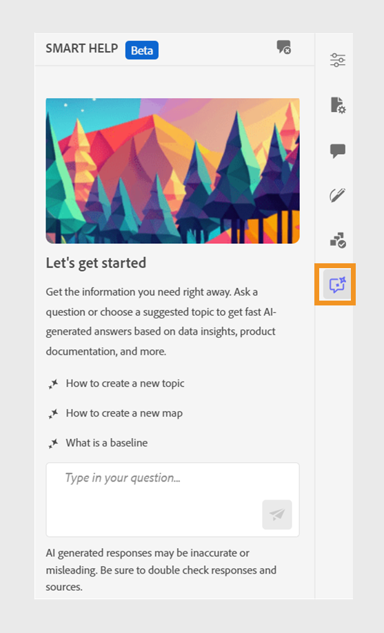

# Ayuda inteligente con tecnología de IA para buscar contenido

Experience Manager Guides proporciona Smart Help basada en GenAI, una característica de búsqueda conversacional que le ayuda a encontrar contenido relevante en la [documentación de Adobe Experience Manager Guides](https://experienceleague.adobe.com/en/docs/experience-manager-guides/using/overview).
Puede hacer sus preguntas y obtener respuestas de una manera informativa. La respuesta a la consulta se basa en el contenido de la documentación del producto. Esta búsqueda es completamente conversacional. Puede hacer preguntas y luego, en función de la respuesta, también puede hacer más preguntas. La respuesta también incluye vínculos a documentos de origen, a los que puede hacer referencia para obtener más información.

Por ejemplo, es posible que desee crear un tema en Experience Manager Guides para su documentación. Puede preguntar: *¿Cómo crear un tema?* Recibirá una respuesta y los vínculos de los artículos relacionados. A continuación, si desea aprender a generar la salida de PDF para el documento, puede hacer preguntas al respecto. Por ejemplo, *¿Cómo publicar un tema en un PDF?* o *¿Cómo generar la salida de PDF para un tema?*

Cuando abre el Editor Web, el panel **Ayuda inteligente** aparece a la derecha.

>[!NOTE]
>
> El administrador debe configurar la característica **Ayuda inteligente**. Para obtener más información, consulte la sección [Configuración de la ayuda inteligente con tecnología de IA para buscar contenido](/help/product-guide/cs-install-guide/conf-smart-help.md) en la Guía de instalación y configuración de Cloud Services.

{width="300"}

*Ver el panel de **Ayuda inteligente**.*

Realice los siguientes pasos para utilizar la búsqueda conversacional para encontrar el contenido apropiado y resolver sus consultas:

1. Seleccione **Ayuda inteligente**  para abrir el panel.

   >[!NOTE]
   >
   > En los [perfiles globales o de nivel de carpeta](/help/product-guide/cs-install-guide/conf-folder-level.md#conf-ai-guides-assistant), el administrador debe definir las preguntas predeterminadas que aparecen en el panel.

1. Escriba la pregunta para buscar el contenido relacionado en la documentación de Experience Manager Guides. Puede seleccionar la pregunta predeterminada en el panel o escribir su pregunta en el cuadro de texto.

1. Seleccione **Enviar**  o presione **Entrar** para ver la respuesta a sus preguntas.

   Según la pregunta, puede ver el contenido, las imágenes aplicables y los vínculos a los artículos.

   {width="300"}

   *Seleccione la pregunta de ejemplo y vea el contenido y las imágenes como respuesta.*

1. Seleccione los vínculos a los artículos del final y vea información detallada sobre su pregunta.

1. Seleccione **Borrar conversación**  para eliminar el historial de conversaciones del panel. A continuación, puede iniciar una nueva conversación y encontrar contenido relevante.

Esta función inteligente le ayuda a encontrar soluciones rápidamente y le permite centrarse en su documentación y completar sus tareas de forma eficaz.
