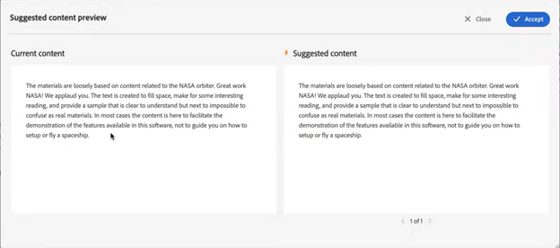

# Sugerencias inteligentes con tecnología de IA para crear contenido

Experience Manager Guides proporciona la característica **Sugerencias inteligentes** que le ayuda a crear contenido coherente y preciso.

Mientras crea contenido, la característica **Sugerencias inteligentes** puede buscar mediante IA y mostrar el contenido existente que sea semánticamente similar a su contenido. A continuación, puede elegir el contenido que mejor coincida con el que desee incluir en el tema actual como referencia.

Esto le ayuda a reutilizar contenido existente del repositorio de documentación y a crear contenido coherente. Por ejemplo, está creando un documento que contiene información sobre **Adobe Firefly**, incluido un párrafo sobre **Adobe**. En ese caso, puede ver y agregar rápidamente la referencia de contenido desde otro tema, como **Adobe Photoshop**, que incluye el mismo párrafo.

Cuando abre un tema en el Editor Web, el panel **Sugerencias inteligentes** aparece a la derecha.

>[!NOTE]
>
> El administrador debe configurar la función **Sugerencias inteligentes**. Para obtener más información, consulte la sección [Configuración de las sugerencias inteligentes con tecnología de IA para la creación](/help/product-guide/cs-install-guide/conf-smart-suggestions.md) en la Guía de instalación y configuración para Cloud Service.

{width="300" align="left"}

*Ver el panel **Sugerencias inteligentes**.*

Realice los siguientes pasos para ver las sugerencias inteligentes para agregar referencias de contenido adecuadas al tema:

1. Seleccione **Sugerencias inteligentes**  para abrir el panel.

   >[!NOTE]
   >
   > En los [perfiles globales o de nivel de carpeta](/help/product-guide/cs-install-guide/conf-folder-level.md#conf-ai-smart-suggestions), el administrador debe definir los archivos o carpetas que se van a indizar para las sugerencias inteligentes, el número mínimo de caracteres que se deben especificar para ver las sugerencias y el número máximo de sugerencias que se pueden ver en la lista.

1. Escriba el contenido en el tema para ver las sugerencias relacionadas. Asegúrese de que la longitud de caracteres del contenido supera lo que el administrador ha establecido en el perfil de carpeta para que aparezcan las sugerencias de contenido.

1. Seleccione **Sugerencias para la etiqueta actual**  para ver las sugerencias de creación para la etiqueta actual donde coloque el puntero del mouse (ratón).  Las sugerencias para ver y agregar referencias de contenido desde los archivos indexados se muestran en función del contenido de la etiqueta actual.

   Método abreviado de teclado: **Windows** (*Ctrl* + *K*), **macOS** (*Comando* + *K*)
1. Seleccione **Sugerencias para el documento completo**  para ver las sugerencias en función del contenido presente en el documento completo.  El icono de sugerencias inteligentes se muestra junto al contenido donde se encuentra una coincidencia adecuada.

   Método abreviado de teclado: **Windows** ( *Ctrl* + *Mayús* + *K* ), **macOS** (*Comando* + *Mayús* + *K*)

   >[!NOTE]
   >
   > Solo puede ver las sugerencias de la ventanilla actual (el contenido visible en la pantalla). Para ver sugerencias de cualquier otro contenido del documento, desplácese hacia arriba o hacia abajo para mostrarlo en la ventanilla y, a continuación, seleccione el icono 

1. Seleccione el icono **Sugerencias inteligentes**  cerca de las etiquetas agregadas al documento para ver las sugerencias inteligentes.
1. Puede ver las sugerencias inteligentes en el cuadro de sugerencias **Reutilización de contenido**.  Experience Manager Guides proporciona sugerencias para hacer coincidir exactamente el contenido y el contenido con el mismo significado. Por ejemplo, puede buscar el tema que contenga el número de versión exacto, como &quot;versión 2023.03.12&quot;. También puede buscar &quot;Adobe tiene su sede en San José, California&quot; y encontrar contenido similar como &quot;San José tiene los cuartos de muchas compañías de software como Adobe&quot;.
1. Seleccione **Información de contenido**  para ver los detalles.
   {width="300" align="left"}

   *Ver la información detallada sobre la referencia de contenido.*

   1. El título del tema que contiene la referencia de contenido se muestra como un hipervínculo.
   1. Ruta del archivo que contiene la referencia de contenido.
   1. El tipo de referencia donde se hace referencia al contenido.
   1. Los nombres de los ficheros DITA a los que se hace referencia en el tema se muestran como hipervínculos.
1. Seleccione **Vista previa de contenido sugerido**  para comparar el contenido actual con el contenido sugerido. Esto le ayuda a comparar las diferencias y determinar si desea agregar la referencia de contenido para el contenido sugerido y hacerlo coherente o conservar el contenido actual.

   {width="800" align="left"}

   *Vista previa de la comparación entre el contenido actual y el contenido sugerido.*

1. Haga clic en **Aceptar** para agregar la referencia de contenido sugerida en el cuadro de diálogo **Vista previa de contenido sugerido**.
1. También puede seleccionar **Aceptar** o **Rechazar** en el cuadro de sugerencias **Reutilizar contenido** para obtener las recomendaciones adecuadas.

Esta función inteligente es práctica y minimiza el esfuerzo de búsqueda manual de contenido, lo que le permite concentrarse más en la generación de nuevo contenido. También facilita una mejor colaboración en equipo y ayuda a mantener la coherencia en el contenido creado por varios autores.

>[!NOTE]
>
>Las sugerencias inteligentes no conservan los datos más allá de la sesión actual. Para obtener respuestas, las sugerencias inteligentes se basan únicamente en el índice creado en el contenido que reside en la base de datos interna. No se utilizan herramientas de IA externas, lo que garantiza que los datos permanezcan en el sistema.
