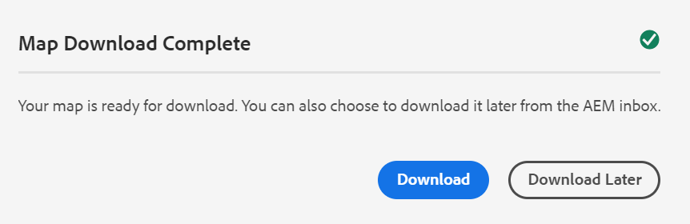

# Descargar archivos {#id216MC0H0BE8}

Puede descargar recursos, incluidos archivos DITA y no DITA. Existen varias formas de descargar recursos, algunos son nativos de AEM y otros son compatibles con AEM Guides. Para obtener información de descarga de recursos nativos de AEM, consulte [Descargar recursos de Adobe Experience Manager](https://experienceleague.adobe.com/docs/experience-manager-cloud-service/assets/manage/download-assets-from-aem.html?lang=es) en la documentación de AEM. En la siguiente sección se explica el mecanismo de descarga de archivos mediante la consola de mapas DITA en AEM Guides.

## Exportación de un fichero de mapa DITA

Una vez que tenga el fichero de mapa DITA en el repositorio de AEM, podrá descargar el fichero de mapa junto con sus dependientes. Esto le proporciona la flexibilidad para compartir el archivo de asignación completo para la edición, validación, revisión o simplemente la creación de una copia de seguridad sin conexión.

Realice los siguientes pasos para descargar un archivo de asignación DITA junto con sus archivos dependientes:

1. En la interfaz de usuario de Assets, vaya al mapa DITA que desee descargar.

1. Haga clic en el mapa DITA para abrirlo en la consola de mapas DITA.

1. Seleccione la ficha **Temas** para ver una lista de los temas disponibles en el mapa DITA.

1. En la barra de herramientas principal, haga clic en **Descargar mapa**.

   Aparecerá el cuadro de diálogo Descargar mapa.

   {width="300" align="left"}

1. Haga clic en **Descargar**. En el cuadro de diálogo Descargar mapa, puede elegir las siguientes opciones:

   - **Usar Línea Base**: Seleccione esta opción para obtener una lista de Líneas Base creadas para el mapa DITA. Si desea descargar el archivo de asignación y su contenido en función de una Línea base específica, seleccione la Línea base en la lista desplegable. Para obtener más información acerca de cómo trabajar con líneas de base, vea [Trabajar con línea de base](generate-output-use-baseline-for-publishing.md#).
   - **Acoplar jerarquía de archivos**: seleccione esta opción para guardar todos los temas a los que se hace referencia y los archivos multimedia en una sola carpeta.

   >[!NOTE]
   >
   > También puede descargar el archivo de asignación sin seleccionar ninguna opción. En ese caso, se descarga la última versión persistente de los temas a los que se hace referencia y los archivos multimedia.

1. Después de hacer clic en el botón **Descargar**, la solicitud de descarga del mapa se pone en cola. Recibirá la siguiente notificación una vez que el mapa esté listo para descargarse.

   {width="550" align="left"}

   - Haga clic en **Descargar** para descargar el archivo de asignación en formato .zip.

   - Haga clic en **Descargar más tarde** para descargar el archivo de asignación más adelante. Se puede acceder al vínculo de descarga desde la bandeja de entrada de notificaciones de AEM. Haga clic en la notificación de asignación generada en la bandeja de entrada para descargar la asignación en formato .zip.

   >[!NOTE]
   >
   > De forma predeterminada, las asignaciones descargadas permanecen durante cinco días en la Bandeja de entrada de notificaciones de AEM.

{width="300" align="left"}

Una vez descargado el mapa, puede seleccionarlo y utilizar el icono Abrir de la parte superior para abrir el informe seleccionado.

**Tema principal:**&#x200B;[ Administrar contenido](authoring.md)
