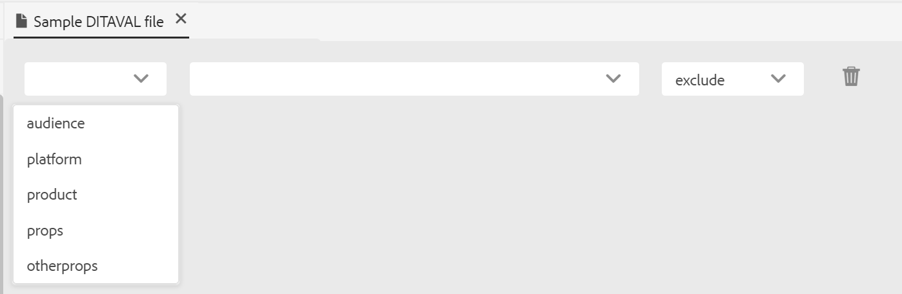

# editor DITAVAL {#ditaval-editor}

Los archivos DITAVAL se utilizan para generar una salida condicional. En un solo tema, puede añadir condiciones utilizando atributos de elemento para condicionar el contenido. A continuación, se crea un archivo DITAVAL en el que se especifican las condiciones que deben recopilarse para generar contenido y qué condición debe excluirse de la salida final.

AEM Guides permite crear y editar fácilmente archivos DITAVAL con el editor DITAVAL. El editor DITAVAL recupera los atributos \(o etiquetas\) definidos en su sistema y puede utilizarlos para crear o editar archivos DITAVAL. Para obtener más información sobre cómo crear y administrar etiquetas en AEM, consulte la sección [Administración de etiquetas](https://experienceleague.adobe.com/docs/experience-manager-cloud-service/sites/authoring/features/tags.html?lang=es) en la documentación de AEM.

## Crear archivo DITAVAL

Siga estos pasos para crear un archivo DITAVAL:

1. En la interfaz de usuario de Assets, vaya a la ubicación en la que desea crear el archivo DITAVAL.

1. Haga clic en **Crear** \> **Tema DITA**.

1. En la página Modelo, seleccione Plantilla de archivo DITAVAL y haga clic en **Siguiente**.

1. En la página Propiedades, especifique **Title** y **Name** para el archivo DITAVAL.

   >[!NOTE]
   >
   > El nombre se sugiere automáticamente en función del Título del archivo. Si desea especificar manualmente el nombre del archivo, asegúrese de que el nombre no contenga espacios, apóstrofos ni llaves, y termine con .ditaval.

1. Haga clic en **Crear**. Aparecerá el mensaje Tema creado.

   Puede elegir abrir el archivo DITAVAL para editarlo en el editor DITAVAL o guardar el archivo del tema en el repositorio de AEM.

## Editar archivo DITAVAL

Siga estos pasos para editar un archivo DITAVAL:

1. En la interfaz de usuario de Assets, vaya al archivo DITAVAL que desee editar.

1. Para obtener un bloqueo exclusivo del archivo, selecciónelo y haga clic en **Desproteger**.

1. Seleccione el archivo y haga clic en **Editar** para abrirlo en el editor DITAVAL de AEM Guides.

   El editor DITAVAL permite realizar las siguientes tareas:

   A: Alternar panel izquierdo
Cambie a la vista del panel izquierdo. Si ha abierto el fichero DITAVAL a través de un mapa DITA, el mapa y el repositorio se mostrarán en este panel. Para obtener más información acerca de cómo abrir un archivo mediante DITA map, vea [Editar temas mediante DITA map](map-editor-advanced-map-editor.md#id17ACJ0F0FHS).

   B: Guardar
Guarda los cambios realizados en el archivo. Todos los cambios se guardan en la versión actual del archivo.

   C: Agregar propiedad
Añada una sola propiedad al archivo DITAVAL.

   

   En la primera lista desplegable se enumeran los atributos DITA permitidos que se pueden utilizar en el fichero DITAVAL. Se admiten cinco atributos: `audience`, `platform`, `product`, `props` y `otherprops`.

   La segunda lista desplegable muestra los valores configurados para el atributo seleccionado. A continuación, la siguiente lista desplegable muestra las acciones que se pueden configurar en el atributo seleccionado. Los valores permitidos en la lista desplegable de acciones son: `include`, `exclude`, `passthrough` y `flag`. Para obtener más información sobre estos valores, consulte la definición del elemento [prop](http://docs.oasis-open.org/dita/dita/v1.3/errata01/os/complete/part3-all-inclusive/langRef/ditaval/ditaval-prop.html#ditaval-prop) en la documentación DITA de OASIS

   D: Agregar todas las propiedades
Si desea añadir todas las propiedades o atributos condicionales definidos en el sistema con un solo clic, utilice la función Añadir todas las propiedades.

   >[!NOTE]
   >
   > Si ya existen todas las propiedades condicionales definidas en el fichero DITAVAL, no se pueden añadir más propiedades. Aparece un mensaje de error en este escenario.

   

1. Cuando haya terminado de editar su archivo DITAVAL, haga clic en **Guardar**.

   >[!NOTE]
   >
   > Si cierra el archivo sin guardarlo, se perderán los cambios. Si no desea confirmar los cambios en el repositorio de AEM, haga clic en **Cerrar** y, a continuación, haga clic en **Cerrar sin guardar** en el cuadro de diálogo **Cambios no guardados**.

## Vistas del editor DITAVAL

El editor DITAVAL de AEM Guides admite la visualización de archivos DITAVAL en dos modos o vistas diferentes:

**Autor**:   Esto es una vista típica de Lo que se ve es lo que se obtiene \(WYSISYG\) del editor DITAVAL. Puede agregar o quitar propiedades mediante la interfaz de usuario simple, que presenta las propiedades, sus valores y las acciones en la lista desplegable. En la vista Autor, tiene las opciones para insertar una propiedad individual e insertar todas las propiedades con un solo clic.

También puede encontrar la versión del archivo DITAVAL en la que está trabajando pasando el puntero sobre el nombre del archivo.

**Source**:   La vista Source muestra el XML subyacente que conforma el archivo DITAVAL. Además de realizar ediciones de texto normales en esta vista, un autor también puede agregar o editar propiedades mediante el Catálogo inteligente.

Para invocar el catálogo inteligente, coloque el cursor al final de cualquier definición de propiedad y escriba &quot;&lt;&quot;. El editor mostrará una lista de todos los elementos XML válidos que puede insertar en esa ubicación.

