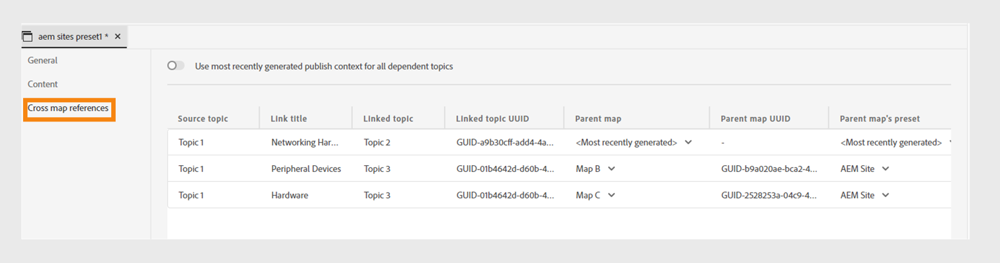

# Ajustes preestablecidos de AEM Sites en el editor web

Puede crear ajustes preestablecidos de AEM Sites desde el editor web y configurarlos para generar la salida de AEM Sites. El resultado de AEM Sites se basa en la asignación de componentes compuestos junto con `guides-components`, lo que facilita la creación y administración eficientes del contenido.

Experience Manager Guides proporciona plantillas predefinidas para crear AEM Sites. Estos ajustes preestablecidos le ayudan a garantizar la coherencia en el diseño y la estructura del contenido.
- [Crear páginas principales](/help/product-guide/cs-install-guide/download-install-aem-sites-templates-cs.md#create-a-home-page-using-the-template) basadas en estas plantillas predefinidas.
- Puede [editar plantillas de temas](/help/product-guide/cs-install-guide/download-install-aem-sites-templates-cs.md#package-installation) y aplicar estilos según sus necesidades.
- También puede [personalizar plantillas de AEM Sites existentes](/help/product-guide/cs-install-guide/download-install-aem-sites-templates-cs.md#customize-existing-aem-sites-templates).

## Crear ajustes preestablecidos de AEM Sites

Siga estos pasos para crear los ajustes preestablecidos de AEM Sites desde el Editor web:

1. En el panel Repositorio, abra el fichero de mapa DITA en la vista Mapa.
1. En la ficha **Output**, seleccione el icono + para crear un ajuste preestablecido de salida.
1. Seleccione **AEM Sites** de la lista desplegable **Type** en el cuadro de diálogo **Nuevo ajuste preestablecido de salida**.
1. Anule la selección de la opción **Usar asignación de componentes heredados** del cuadro de diálogo **Nuevo ajuste preestablecido de salida**.

>[!NOTE]
>
>Antes de configurar los ajustes preestablecidos de AEM Sites para Experience Manager Guides, el administrador debe crear una estructura de AEM Sites con las plantillas.
>- **Software On-Premise**: Obtenga más información acerca de cómo [descargar e instalar plantillas de AEM Sites](/help/product-guide/install-guide/download-install-aem-sites-templates.md) para software On-Premise.
>- **Cloud Service**: Más información sobre cómo [descargar e instalar plantillas de AEM Sites](/help/product-guide/cs-install-guide/download-install-aem-sites-templates-cs.md) para Cloud Service.

### Añadir ajustes preestablecidos al perfil de carpeta actual

Como administrador, Experience Manager Guides le permite crear y administrar ajustes preestablecidos de salida para los Perfiles global y de carpeta. Seleccione la opción **Agregar al perfil de carpeta actual** en el cuadro de diálogo **Nuevo ajuste preestablecido de salida** para crear un ajuste preestablecido de salida para el perfil de carpeta actual. El icono  indica un ajuste preestablecido de nivel de perfil de carpeta.  Obtenga más información acerca de [Administrar ajustes preestablecidos de salida de perfil global y de carpeta](./web-editor-manage-output-presets.md).

### Ajustes preestablecidos de AEM Sites basados en asignación de componentes heredados

También puede crear los ajustes preestablecidos de AEM Sites mediante la asignación de componentes heredados. Para crear los ajustes preestablecidos de AEM Sites basados en la asignación de componentes heredados, seleccione la opción **Usar asignación de componentes heredados** en el cuadro de diálogo **Nuevo ajuste preestablecido de salida**.

Algunas opciones pueden diferir para los ajustes preestablecidos que utilizan la asignación de componentes heredados.

## Configuración de los ajustes preestablecidos de AEM Sites

Las configuraciones están organizadas bajo las pestañas **General**, **Contenido**, **Lista de temas** y **Referencias de mapas cruzados**.

**General**

La ficha **General** contiene las siguientes configuraciones relacionadas con la generación de resultados:

- Usar ruta del sitio
- Ruta del sitio
- Sitio
- Ruta de publicación
- Plantilla de página de tema
- Generar nombres de página basados en
   - Nombre de archivo del tema
   - Título del tema
- Limpieza de páginas generadas anteriormente
   - Eliminar páginas generadas anteriormente para temas eliminados del mapa
   - Elimine todas las páginas creadas por otras fuentes en esta ruta:
- Flujo de trabajo de generación posterior

**Contenido**

La ficha **Contenido** contiene las siguientes configuraciones:

- Usar línea base
- Filtro de condición
- Argumentos adicionales de la línea de comandos de DITA-OT
- Metadatos
   - Propiedades de archivo (Assets)
   - Usar propiedades de mapa como alternativa

Para obtener más información, consulte [Configuración de AEM Sites](#aem_sites_config).

**Lista de temas**

La **Lista de temas** muestra la lista de temas presentes en la copia de trabajo actual del mapa DITA. De forma predeterminada, se incluyen todos los temas. Puede seleccionar temas específicos y generar la salida de AEM Sites solo para ellos. Por ejemplo, se han actualizado algunos temas para que sólo se puedan publicar esos temas en lugar de publicar todo el mapa DITA.

La pestaña **Lista de temas** está presente en los ajustes preestablecidos de AEM que no se crean según la asignación heredada.

**Referencias entre mapas**
Esta lista contiene temas que contienen referencias entre mapas con `scope ="peer"`. Puede especificar el contexto de publicación para una lista de referencias de mapas cruzados con `scope="peer"` a temas disponibles en otras asignaciones DITA. Esta pestaña aparece si utiliza la versión de Experience Manager Guides (UUID).

Obtenga más información sobre cómo [publicar temas vinculados](#publish-linked-topics).

## Configuración de AEM Sites {#aem_sites_config}

Las siguientes opciones están disponibles para la salida de AEM Sites:

| Opciones de AEM Sites | Descripción |
| --- | --- |
| Usar ruta del sitio | Utilice esta opción para publicar el contenido en un sitio de Experience Manager. Seleccione esta opción si conoce la ruta exacta del sitio en el que desea publicar el resultado. Además, mencione la ruta completa en el campo Ruta del sitio. |
| Ruta del sitio | Esta opción aparece si selecciona la opción **Usar ruta del sitio**. Explore la ruta exacta del sitio de Experience Manager en el que desea publicar el resultado. |
| Sitio | Nombre de la Experience Manager Sites en la que desea publicar el contenido. Las opciones del menú desplegable se rellenan en función de la lista de sitios disponibles en AEM Sites.  Seleccione **Actualizar**  para obtener una lista nueva de opciones y reflejar los datos actualizados. |
| Ruta de publicación | La ruta dentro del repositorio de AEM donde se almacena el resultado. La ruta de publicación se rellena con todas las rutas que contienen páginas creadas a partir de la plantilla de la página de inicio. La salida AEM Sites del mapa DITA se genera en esta ruta.  Por ejemplo, si especifica el sitio como `AEMG-Docs` y la ruta de publicación como `aemg-docs-en/docs/product-abc.`, la salida de AEM Sites se generará en el nodo `aemg-docs-en/docs/product-abc/` en `crx/de`. |
| Plantilla de página de tema | Los componentes estructurales que puede utilizar para organizar el contenido de forma coherente en varios documentos. Estas plantillas están predefinidas en la plantilla del sitio de Adobe Experience Manager. Las opciones se rellenan con todas las plantillas de página de temas disponibles para el sitio seleccionado. Seleccione la plantilla que desee aplicar a todos los temas de salida. |
| Generar nombres de página basados en | **Nombre de archivo del tema**: Utiliza el nombre de archivo del tema DITA para crear la dirección URL del sitio.   **Título del tema**: Utiliza el título del tema DITA para crear los nombres de los sitios Experience Manager. |
| Limpieza de páginas generadas anteriormente | - **Eliminar las páginas generadas anteriormente para el tema eliminado del mapa**: si la estructura del mapa DTIA cambia, puede utilizar esta opción para quitar las páginas generadas anteriormente para los temas eliminados. Esta función solo está disponible para la publicación de mapas completa.  Supongamos que ha publicado un mapa DITA, que contiene los temas a.dita, b.dita y c.dita. Antes de volver a publicar el mapa, ha eliminado el tema b.dita del mapa. Ahora, si ha seleccionado esta opción, todo el contenido relacionado con b.dita se elimina de la salida de AEM Sites y solo se publican a.dita y c.dita.  **Nota**: la información sobre las páginas eliminadas también se captura en los registros de generación de salida. Para obtener más información acerca del acceso a los archivos de registro, [vea y compruebe el archivo de registro](generate-output-basic-troubleshooting.md#id1821I0Y0G0A__id1822G0P0CHS).   **Precaución**: al eliminar los temas, las páginas dejarán de estar disponibles en el sitio publicado. Por lo tanto, antes de eliminar los temas, aparece una advertencia. Debe confirmar que desea eliminarlos.  - **Eliminar todas las páginas creadas por otras fuentes en esta ruta**: Si selecciona esta opción, se eliminarán todas las páginas publicadas en esta ruta desde otros mapas, temas individuales o cualquier otro origen. Las páginas tampoco estarán disponibles desde el sitio publicado. Por lo tanto, antes de eliminar los temas, aparece una advertencia. Debe confirmar que desea eliminarlos. |
| Flujo de trabajo de generación posterior | Al elegir esta opción, se muestra una nueva lista desplegable Flujo de trabajo de generación posterior que contiene todos los flujos de trabajo configurados en AEM. Debe seleccionar un flujo de trabajo que desee ejecutar después de completar el flujo de trabajo de generación de resultados. |
| Usar línea base | Si ha creado una Línea base para el mapa DITA seleccionado, seleccione esta opción para especificar la versión que desea publicar.  **Importante**: cuando se genera un resultado incremental para el sitio de AEM, el resultado se crea utilizando la versión actual de los archivos y no la línea de base adjunta.  Ver [Trabajar con línea de base](generate-output-use-baseline-for-publishing.md#id1825FI0J0PF) para obtener más detalles. |
| Filtrado condicional | Seleccione una de las siguientes opciones:  **None**: Seleccione esta opción si no desea aplicar ninguna condición en la salida publicada. **Usando DITAVAL**: seleccione los archivos DITAVal para generar contenido condicionado. Puede seleccionar varios archivos DITAVal mediante el cuadro de diálogo de exploración o escribiendo la ruta del archivo. Utilice el icono en forma de cruz situado cerca del nombre del archivo para eliminarlo. Los archivos DITAVal se evalúan en el orden especificado, por lo que las condiciones especificadas en el primer archivo tienen prioridad sobre las condiciones coincidentes especificadas en archivos posteriores. Puede mantener el orden de los archivos añadiendo o eliminando archivos. Si el archivo DITAVal se mueve a otra ubicación o se elimina, no se elimina automáticamente del panel de asignaciones. Debe actualizar la ubicación en caso de que los archivos se muevan o eliminen. Puede pasar el ratón sobre el nombre del archivo para ver la ruta en el repositorio de AEM donde está almacenado el archivo. Solo puede seleccionar archivos DITAVal y se muestra un error si selecciona cualquier otro tipo de archivo. **Ajuste preestablecido de condición**: seleccione un ajuste preestablecido de condición en la lista desplegable para aplicar una condición al publicar la salida. Esta opción está visible si se ha añadido una condición para el fichero de mapa DITA. La configuración condicional está disponible en la ficha Ajustes preestablecidos de condición de la consola de mapas DITA. Para obtener más información acerca de los ajustes preestablecidos de condición, vea [Usar ajustes preestablecidos de condición](generate-output-use-condition-presets.md#id1825FL004PN). |
| Argumentos adicionales de la línea de comandos de DITA-OT | Especifique los argumentos adicionales que desea que DITA-OT procese durante la generación de resultados. Para obtener más información acerca de los argumentos de línea de comandos admitidos en DITA-OT, vea [documentación de DITA-OT](https://www.dita-ot.org/). |
| Metadatos    Propiedades de archivo (Assets) | Seleccione las propiedades que desee procesar como metadatos. Estas propiedades se definen desde la página Propiedades del fichero de mapa DITA o de mapa de libros. Las propiedades que seleccione en la lista desplegable aparecerán en el campo **Propiedades del archivo**. Seleccione el icono en forma de cruz situado junto a la propiedad para eliminarla.   **Nota**: las propiedades de metadatos distinguen entre mayúsculas y minúsculas.  *Si ha seleccionado una Línea base, los valores de las propiedades se basan en la versión de la Línea base seleccionada. * Si no ha seleccionado una Línea de base, los valores de las propiedades se basan en la versión más reciente.  También puede pasar los metadatos a la salida mediante la publicación DITA-OT. Para obtener más información, [Pase los metadatos a la salida mediante DITA-OT](pass-metadata-dita-ot.md#id21BJ00QD0XA).  **Nota**: si no ha definido `cq:tags` en la opción Propiedades, los valores de `cq:tags` se seleccionarán de la copia de trabajo actual aunque haya seleccionado una Línea de base para la publicación. |
| Metadatos    Usar propiedades de mapa como alternativa | Si se selecciona, las propiedades definidas para el fichero de mapa también se copian en los temas en los que no se definen dichas propiedades. Tenga en cuenta los siguientes puntos al utilizar esta opción:  *Solo las propiedades String, Date o Long (únicas y de varios valores) se pueden pasar a las páginas del sitio de AEM. * Los valores de metadatos de una propiedad de tipo cadena no admiten ningún carácter especial (como `@, #, " "`). * Esta opción debe usarse junto con la opción `Properties`. |
| Conservar archivos temporales | Seleccione esta opción para conservar los ficheros temporales generados por DITA-OT. Si se producen errores al generar la salida mediante DITA-OT, seleccione esta opción para conservar los ficheros temporales. Puede utilizar esos archivos para solucionar errores de generación de resultados.    Después de generar la salida, seleccione el icono **Descargar archivos temporales**  para descargar la carpeta ZIP que contiene los archivos temporales.    **Nota**: Si las propiedades de archivo se agregan durante la generación, los archivos temporales de salida también incluyen un archivo *metadata.xml* que contiene esas propiedades. |

### Genere la salida de AEM Sites con las plantillas

Experience Manager Guides le permite utilizar las plantillas predeterminadas o agregar sus propias plantillas de AEM Sites.

Antes de configurar los ajustes preestablecidos de AEM Sites, asegúrese de crear una estructura de AEM Sites con las plantillas.\
Para obtener más información, vea [Descargar e instalar plantillas de AEM Sites](/help/product-guide/install-guide/download-install-aem-sites-templates.md).

Siga estos pasos para crear y configurar un ajuste preestablecido de AEM Sites:
1. Abra la ficha **Ajustes preestablecidos de salida** del mapa DITA que desee publicar.
1. Seleccione el ajuste preestablecido de salida **AEM Sites**.
1. (Opcional) Desmarque la opción **Usar asignación de componentes heredados** para crear un ajuste preestablecido de AEM Sites no heredado
1. Haga clic en **Agregar**. Se crea el ajuste preestablecido de AEM Sites.
1. Puede configurar la plantilla de sitios predeterminada de dos formas:
   1. Seleccione **Sitio** y, a continuación, elija la ruta de publicación y las plantillas de página del tema entre las opciones rellenadas:
      1. Seleccione el sitio.
      1. Seleccione **Sitio**. Por ejemplo, `AEMG Docs`.
      1. Las opciones **Publish path** y **Topic page template** se establecen automáticamente en el menú desplegable. También puede elegir las opciones. Por ejemplo, `AEMG-Docs-Site/en/docs/product1` y `Topic page` se establecen respectivamente.
   1. Seleccione la ruta completa del sitio:
      1. Seleccione la opción **Usar ruta del sitio**.
      1. Seleccione la ruta completa del sitio. Por ejemplo, `/content/AEMG-Docs-Site/en/docs/product1`.
      1. La &quot;Plantilla de página de tema&quot; se establece automáticamente como `Topic Page`.

1. Guarde los cambios realizados en el ajuste preestablecido.
1. Seleccione la opción **Generate**.
1. Genere AEM Sites para el mapa correspondiente. Por ejemplo, `/content/AEMG-Docs-Site/en/docs/product`.

   >[!NOTE]
   >
   > Si publica contenido en un sitio de AEM por primera vez, se recomienda publicar las páginas en el nivel de sitio. Esto garantiza que la salida se muestre correctamente en la instancia **Publish** sin interrupciones en el CSS.

### Publicar temas vinculados

Experience Manager Guides simplifica la publicación de documentos complejos al permitirle crear referencias de temas utilizando `peer @scope`. A continuación, puede definir el contexto de publicación de estas referencias desde los ajustes preestablecidos de AEM Sites y, finalmente, generar la salida de los temas vinculados.
Para obtener más información, vea [Generar resultados de temas de vinculación de otros mapas](../user-guide/generate-output-aem-site.md#generate-output-linking-topics-from-other-maps).

Siga estos pasos para especificar el contexto de publicación de los archivos de vínculos cruzados:
1. Abra la ficha **Ajustes preestablecidos de salida** del mapa DITA que desee publicar.
1. Seleccione el ajuste preestablecido de salida **AEM Sites**.

   Puede ver las fichas **General**, **Contenido**, **Lista de temas** y **Referencias de mapas cruzados**. **Referencias de mapas cruzados** ficha aparece si utiliza la versión de Experience Manager Guides (UUID).

   No podrá ver la vinculación entre mapas cruzados en los casos siguientes:
   - Para los ajustes preestablecidos creados antes de la versión 4.6. La pestaña Referencias cruzadas está desactivada y aparece la información del objeto, Consulte Asignación del tablero de mandos.
   - Para ajustes preestablecidos creados a partir del tablero de mapas. Consulte Asignación de información sobre herramientas del tablero.
   - Para ajustes preestablecidos de OOTB, consulte Cómo aparece la información del panel de mapas.
   - Para los ajustes preestablecidos globales, cree una copia local de este ajuste preestablecido global para establecer referencias entre mapas.
Si desea utilizar ajustes preestablecidos de AEM Sites del editor web, cree un nuevo ajuste preestablecido o duplique el existente.

1. Abra la ficha **Referencias de mapas cruzados**.

   Se le mostrará una lista de temas y sus referencias. Puede especificar el contexto de publicación para una lista de referencias de mapas cruzados a temas disponibles en otras asignaciones DITA con `scope="peer"`.

   Para usar el panel de referencia de mapas cruzados del Editor Web, `<xrefs>` debe tener identificadores únicos. Los identificadores únicos de `<xrefs>` se generarán automáticamente al editar o guardar el contenido anterior si el identificador no está presente.

   >[!NOTE]
   >
   >La ficha **Referencias de mapas cruzados** muestra los temas que están vinculados usando solamente `scope="peer"`. Para los vínculos con `scope="local"`, no es necesario especificar el contexto de publicación.

   Todos los temas vinculados tienen su último ajuste preestablecido de salida y mapa seleccionado de forma predeterminada. El contexto de publicación de todos los temas vinculados está establecido en la asignación `<Most recently generated>` de forma predeterminada.

   

1. Si desea utilizar el resultado publicado más recientemente de cada archivo dependiente en el mapa, seleccione **Usar contexto de publicación generado más recientemente** para todos los temas dependientes.
Debe publicar el mapa seleccionado como mapa principal antes de publicar el mapa que contiene los temas vinculados. Si el mapa con temas vinculados no se publica, los vínculos aparecen como texto normal en lugar de como hipervínculos en la salida de AEM Sites.
Debe seleccionar el mismo tipo de ajuste preestablecido de AEM Sites para el tema vinculado. Por ejemplo, si el ajuste preestablecido actual de AEM Sites utiliza la asignación de componentes heredados, seleccione un ajuste preestablecido de AEM Sites similar en el tema vinculado.
1. En la lista desplegable Mapa principal, seleccione el archivo de asignación con cuya salida desee vincular la salida del mapa actual.
Al seleccionar un archivo de asignación, se muestra el UUID del mapa en la columna UUID del mapa principal. Los ajustes preestablecidos de salida asociados con el mapa elegido se enumeran en la lista Ajustes preestablecidos del mapa principal. Por ejemplo, el Tema 1 del Mapa A contiene una referencia al Tema 2. El tema 2 puede estar presente en mapas únicos o múltiples. Puede seleccionar el mapa principal y un ajuste preestablecido específico o la salida publicada más recientemente para cada vínculo.

1. Si se hace referencia al mismo tema más de una vez en un archivo, puede agregar un contexto de publicación diferente para cada instancia. Esto proporciona una mayor flexibilidad y control sobre su contenido. Por ejemplo, el tema 3 está presente tanto en el mapa B como en el mapa C. El tema 1 contiene dos referencias al tema 3. Puede elegir Mapa B como mapa principal para el primer vínculo y Mapa C como mapa principal para el segundo vínculo.

1. En la lista desplegable Ajuste preestablecido del mapa principal, seleccione el ajuste preestablecido de salida con el que desea vincular la salida del mapa actual.
   >[!NOTE]
   >
   > Los diferentes ajustes preestablecidos de AEM Sites del mapa actual aparecen en la lista desplegable. Si no selecciona ningún ajuste preestablecido, aparece un icono de advertencia y la generación de resultados falla.
1. Seleccione la asignación requerida y su ajuste preestablecido de salida para todos los temas de origen y seleccione **Generar**.

**Tema principal:** [Explicación de los ajustes preestablecidos de salida](generate-output-understand-presets.md)
