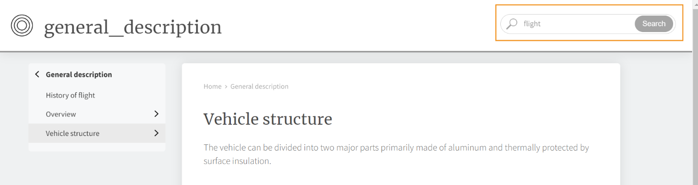

# AEM Sitio web de {#id205BE3008SW}

AEM Las siguientes opciones están disponibles para la salida del sitio de:

AEM Puede crear el ajuste preestablecido del sitio de dos maneras:

AEM **En el Editor Web:** En el panel Repositorio, abra el archivo de mapa DITA en la vista Mapa y, a continuación, en la ficha Salida, seleccione el icono + para crear un ajuste preestablecido de salida y, a continuación, seleccione Sitio de la lista desplegable Tipo en el cuadro de diálogo Agregar ajuste preestablecido. En el editor web, las configuraciones se han organizado en las pestañas General y Avanzadas:

**General**

La ficha **General** contiene las siguientes configuraciones:

- Nombre del sitio
- Ruta de salida
- Páginas de salida existentes
- Eliminar páginas de sitio huérfanas
- Aplicar condiciones con \(Si las condiciones están definidas para un mapa\)
- Utilizar Línea base \(Si se crea una línea base para un mapa\)
- Flujo de trabajo de generación posterior

**Avanzado**

La pestaña Advanced contiene las siguientes configuraciones:

- Descargar archivos temporales
- Generar un PDF independiente para cada tema
- Usar las propiedades de mapa como predeterminadas

AEM Para obtener más información, consulte [Configuración del sitio de](#id231KIM004X1).

**Del tablero de mapas**

AEM Para abrir los ajustes preestablecidos de salida para el sitio de, haga clic en un archivo de mapa DITA en la interfaz de usuario de Assets AEM, a continuación, haga clic en Ajustes preestablecidos de salida y, por último, haga clic en la opción Salida del sitio de. En el panel de mapas, haga clic en **Editar** en la parte superior para actualizar las distintas configuraciones y, por último, haga clic en **Guardar**.

>[!TIP]
>
> AEM AEM Consulte la sección *Publicación de sitios* en la guía de prácticas recomendadas para conocer las prácticas recomendadas sobre la creación de resultados de sitios de la lista de direcciones de correo electrónico.

## AEM Configuración del sitio de {#id_aem_site_config}

AEM Las siguientes opciones están disponibles para la salida del sitio de:

| AEM Opciones del sitio de | Descripción |
| --- | --- |
| Tipo de salida | El tipo de salida que desea generar. AEM AEM Para generar una salida del sitio de respuesta, seleccione la opción Sitio de la. |
| Nombre de configuración | AEM Asigne un nombre descriptivo a la configuración del sitio de la que está creando. Por ejemplo, puede especificar *salida de clientes internos* o *salida de usuarios finales*. |
| Nombre del sitio | AEM Un nombre de sitio donde la salida se almacena en el repositorio de la.AEM   Se crea un nodo en el repositorio de la con el nombre especificado aquí. Si no se especifica el Nombre del sitio (Site Name), se creará el nodo de sitio con el nombre de fichero de mapa DITA.  El nombre de sitio que especifique aquí también se utiliza como título en la ficha del explorador.  También puede utilizar variables al establecer el Nombre del sitio. Para obtener más información acerca del uso de variables, vea [Usar variables para establecer las opciones Ruta de destino, Nombre de sitio o Nombre de archivo](generate-output-use-variables.md#id18BUG70K05Z). |
| Diseño | Seleccione la plantilla de diseño que desee utilizar para generar el resultado.  Para obtener más información acerca de cómo usar plantillas de diseño personalizadas para generar resultados, póngase en contacto con el administrador de publicaciones. |
| Ruta de destino | AEM Ruta de acceso del repositorio de la en la que se almacena el resultado. Al generar la salida final, se combinan el Nombre del sitio y la Ruta de destino. Por ejemplo, si especifica el Nombre del sitio como `user-guide` y la Ruta de destino como `/content/output/aem-guides`, el resultado final se generará en el nodo `/content/output/aem-guides/user-guide`.  También puede utilizar variables al establecer la ruta de destino. Para obtener más información acerca del uso de variables, vea [Usar variables para establecer las opciones Ruta de destino, Nombre de sitio o Nombre de archivo](generate-output-use-variables.md#id18BUG70K05Z). |
| Aplicar condiciones usando | Seleccione una de las siguientes opciones:  **Ninguna aplicada**: seleccione esta opción si no desea aplicar ninguna condición en la salida publicada. **archivo DITAVal**: seleccione los archivos DITAVal para generar contenido condicionado. Puede seleccionar varios archivos DITAVal mediante el cuadro de diálogo de exploración o escribiendo la ruta del archivo. Utilice el icono en forma de cruz situado cerca del nombre del archivo para eliminarlo. Los archivos DITAVal se evalúan en el orden especificado, por lo que las condiciones especificadas en el primer archivo tienen prioridad sobre las condiciones coincidentes especificadas en archivos posteriores. Puede mantener el orden de los archivos añadiendo o eliminando archivos. Si el archivo DITAVal se mueve a otra ubicación o se elimina, no se elimina automáticamente del panel de asignaciones. Debe actualizar la ubicación en caso de que los archivos se muevan o eliminen. AEM Puede pasar el ratón sobre el nombre del archivo para ver la ruta en el repositorio de donde se almacena el archivo. Solo puede seleccionar archivos DITAVal y se muestra un error si selecciona cualquier otro tipo de archivo. **Ajuste preestablecido de condición**: seleccione un ajuste preestablecido de condición en la lista desplegable para aplicar una condición al publicar la salida. Esta opción está visible si se ha añadido una condición para el fichero de mapa DITA. La configuración condicional está disponible en la ficha Ajustes preestablecidos de condición de la consola de mapas DITA. Para obtener más información sobre los ajustes preestablecidos de condición, consulte [Usar ajustes preestablecidos de condición](generate-output-use-condition-presets.md#id1825FL004PN). |
| Páginas de salida existentes | Seleccione la opción **Sobrescribir contenido** para sobrescribir contenido en las páginas existentes. Esta opción solo sobrescribe el contenido presente en los nodos de contenido y encabezado de la página. Esta opción habilita la publicación combinada de contenido. Al seleccionar esta opción, se proporciona una opción para seleccionar la eliminación de páginas huérfanas de la salida publicada. AEM Esta es también la opción *default* para crear la salida del sitio de la.  Seleccione la opción **Eliminar y crear** para forzar la eliminación de las páginas existentes durante la publicación. Esta opción elimina el nodo de página junto con su contenido y todas las páginas secundarias debajo de él. Utilice esta opción si ha cambiado la plantilla de diseño del ajuste preestablecido de salida o si desea que se eliminen las páginas adicionales ya presentes en el destino. |
| Eliminar páginas de sitio huérfanas | Si se selecciona **Sobrescribir contenido** en la configuración de **Páginas de salida existentes**, se presenta esta opción. AEM Si selecciona esta opción, se eliminarán todas las páginas huérfanas del sitio de publicación de la lista de páginas de la lista de páginas de la lista de páginas que se han publicado en el sitio de la lista de páginas de publicación. Para que esta función se ejecute correctamente, debe publicar todo el mapa DITA y no utilizar la publicación incremental.  Supongamos que ha publicado un mapa DITA, que contiene los temas a.dita, b.dita y c.dita. Antes de volver a publicar el mapa, ha eliminado el tema b.dita del mapa. AEM Ahora, si ha seleccionado esta opción, todo el contenido relacionado con b.dita se elimina de la salida del sitio de la y solo se publican a.dita y c.dita.  Esta característica no quita ningún mapa secundario publicado. Por ejemplo, si el mapa principal contiene un mapa secundario y se elimina todo el mapa secundario, el contenido del mapa secundario no se elimina de la salida publicada. Sin embargo, si quita cualquier tema de un mapa secundario y vuelve a publicar, el contenido del tema eliminado se elimina de la salida del sitio.  Además, si hay contenido referenciado y ese contenido se quita antes de volver a publicar, los datos del contenido referenciado no se quitan.  **Nota**: la información sobre las páginas huérfanas eliminadas también se captura en los registros de generación de salida. Para obtener más información acerca del acceso a los archivos de registro, vea [Ver y comprobar el archivo de registro](generate-output-basic-troubleshooting.md#id1821I0Y0G0A__id1822G0P0CHS). |
| Descargar archivos temporales | Seleccione esta opción para descargar los archivos temporales generados por DITA-OT. La ubicación donde DITA-OT almacena los archivos temporales se encuentra en el registro de generación de salida. Si se producen errores al generar la salida mediante DITA-OT, seleccione esta opción para conservar los ficheros temporales. Puede utilizar esos archivos para solucionar errores de generación de resultados.    Después de generar la salida, seleccione el icono **Descargar archivos temporales**  para descargar la carpeta ZIP que contiene los archivos temporales.    **Nota**: Si selecciona algunas propiedades de archivo y luego descarga los archivos temporales, también obtendrá el archivo *metadata.xml* en la carpeta ZIP. |
| Generar un PDF independiente para cada tema | Si se selecciona, también se crea un PDF para cada tema del mapa DITA. Al elegir esta opción, se muestra una nueva opción Dividir ruta del PDF.  En el campo Dividir ruta de PDF, especifique la ruta para almacenar los PDF generados para cada tema.  **Nota**: AEM Guides usa el complemento DITA-OT llamado pdfx para generar un PDF para cada tema. Este complemento se incluye con el paquete DITA-OT que se suministra listo para usar. Puede personalizar este complemento para que genere un PDF según sus necesidades. Si utiliza un complemento DITA-OT personalizado, asegúrese de integrar el complemento pdfx para tener la capacidad de generación de PDF en el nivel de tema. |
| Ejecutar flujo de trabajo posterior a generación | AEM Al elegir esta opción, se muestra una nueva lista desplegable Flujo de trabajo de generación de publicaciones que contiene todos los flujos de trabajo configurados en el flujo de trabajo de creación de flujos de trabajo de creación de flujos de trabajo de la. Debe seleccionar un flujo de trabajo que desee ejecutar después de completar el flujo de trabajo de generación de resultados. |
| Usar línea base | Si ha creado una Línea base para el mapa DITA seleccionado, seleccione esta opción para especificar la versión que desea publicar.AEM   **Importante**: Cuando se genera un resultado incremental para el sitio de la, el resultado se crea utilizando la versión actual de los archivos y no la línea de base adjunta.  Vea [Trabajar con línea de base](generate-output-use-baseline-for-publishing.md#id1825FI0J0PF) para obtener más detalles. |
| Propiedades de archivo | Seleccione las propiedades que desee procesar como metadatos. Estas propiedades se definen desde la página Propiedades del fichero de mapa DITA o de mapa de libros. Las propiedades que seleccione en la lista desplegable aparecerán en el campo **Propiedades del archivo**. Seleccione el icono en forma de cruz situado junto a la propiedad para eliminarla.   **Nota**: las propiedades de metadatos distinguen entre mayúsculas y minúsculas.  *Si ha seleccionado una Línea base, los valores de las propiedades se basan en la versión de la Línea base seleccionada. * Si no ha seleccionado una Línea de base, los valores de las propiedades se basan en la versión más reciente.  También puede pasar los metadatos a la salida mediante la publicación DITA-OT. Para obtener más información, consulte [Pasar los metadatos a la salida mediante DITA-OT](pass-metadata-dita-ot.md#id21BJ00QD0XA).  **Nota**: si no ha definido `cq:tags` en la opción Propiedades, los valores de `cq:tags` se seleccionarán de la copia de trabajo actual aunque haya seleccionado una Línea de base para la publicación. |
| Utilice Las Propiedades Del Mapa Si Falta En El Tema | Si se selecciona, las propiedades definidas para el fichero de mapa también se copian en los temas en los que no se definen dichas propiedades. AEM Tenga en cuenta los siguientes puntos al utilizar esta opción:  *Solo las propiedades String, Date o Long (únicas y de varios valores) se pueden pasar a las páginas del sitio de la. * Los valores de metadatos de una propiedad de tipo cadena no admiten ningún carácter especial (como `@, #, " "`). * Esta opción debe usarse junto con la opción `Properties`. |

## AEM Nota adicional sobre el sitio de la

### Generar resultados basados en artículos desde el editor web

AEM Se puede generar la salida del sitio de para uno o más temas, o todo el mapa DITA desde el Editor Web. AEM Es necesario crear ajustes preestablecidos de salida para el mapa DITA y, a continuación, se puede generar fácilmente la salida del sitio del sitio de la para el mapa. AEM Si ha actualizado algunos temas en el mapa, también puede generar el resultado del sitio de la página de la página de la página de la página de la página de la página de la página de la página de la página de destino solo para esos temas desde el Editor Web. Para obtener más información, consulte [Publicación basada en artículos desde el editor web](web-editor-article-publishing.md#id218CK0U019I).

### Generar temas de vinculación de salida desde otros mapas

Es muy común tener un gran conjunto de documentación distribuida en varias carpetas y mapas DITA. Publicar contenido vinculado desde varios lugares se vuelve extremadamente complejo. De manera predeterminada, todos los vínculos `<xref>` se crean con `local` `@scope`. La publicación de estos temas no implica ningún desafío, ya que utiliza un vínculo directo al tema. Si el tema se encuentra fuera del mapa DITA actual, el vínculo no muestra el contenido enlazado.

Otra forma de vincular contenido es crear un vínculo con `peer` `@scope`. Para dicho contenido, el vínculo se resuelve en tiempo de ejecución seleccionando el título del archivo y el contexto configurado para el tema vinculado desde el contexto de publicación del mapa DITA. La siguiente captura de pantalla muestra el panel Propiedades de un vínculo que tiene `peer` `@scope`:

{width="800" align="left"}

Para simplificar la publicación de mapas complejos y temas que vinculan a otros temas en otros mapas, AEM Guides permite establecer el contexto de publicación para cada ajuste preestablecido de salida.

El contexto de publicación permite especificar qué tema se debe utilizar desde qué mapa para publicar una salida específica. Entendámoslo con la ayuda de un ejemplo. Digamos que tenemos cuatro carpetas: muestra a, muestra b, muestra c, y muestra d. Cada carpeta contiene un mapa DITA: el mapa DITA A, el mapa DITA B, el mapa DITA C y el mapa DITA D. La vinculación entre mapas se producirá cuando un tema del mapa DITA A se vincule a un tema del mapa DITA B, C o D. En la siguiente captura de pantalla, un tema de concepto de ejemplo contiene vínculos \(o referencias\) a archivos que forman parte de otros mapas DITA.

{width="350" align="left"}

AEM Ahora, al configurar la configuración de publicación del sitio de la aplicación para el archivo de asignación que contiene este tema, puede seleccionar qué contexto de publicación para el contenido vinculado se utiliza durante la publicación. Un contexto de publicación es una combinación de un mapa DITA y su ajuste preestablecido de salida. El ajuste preestablecido de salida, a su vez, contiene una versión específica del contenido y ajustes preestablecidos condicionales. Toda esta combinación del mapa DITA, el ajuste preestablecido de salida, la versión \(archivos\) y las condiciones definen el contexto de publicación para un mapa enlazado.

Siga estos pasos para especificar el contexto de publicación de los archivos de vínculos cruzados:

1. Abra la ficha **Ajustes preestablecidos de salida** del mapa DITA que desee publicar.

1. AEM Seleccione el ajuste preestablecido de salida **Site**.

   AEM Obtendrá las pestañas Configuración de ajustes preestablecidos de y Contexto de Publish.

   {width="800" align="left"}

1. Abra la ficha **Contexto de Publish**.

   Se le mostrará una lista de temas dependientes. Estos son los temas vinculados a partir de algún tema del mapa actual, pero están disponibles en otros mapas DITA.

   >[!NOTE]
   >
   > La pestaña Contexto de Publish muestra los temas que están vinculados usando solamente `peer` `@scope`. Para los vínculos con `local` `@scope`, no es necesario especificar el contexto de publicación.

   De forma predeterminada, todos los temas vinculados tienen seleccionados su último ajuste preestablecido de salida y su asignación.

   {width="800" align="left"}

1. Para cambiar la selección predeterminada del mapa y ajuste preestablecido DITA, haga clic en **Editar** \(en la barra de herramientas principal\).

1. Si desea utilizar el resultado publicado más recientemente de cada archivo dependiente en el mapa, seleccione **Usar contexto de publicación generado más recientemente para todos los temas dependientes**.

1. En la lista desplegable **Mapa principal**, seleccione el archivo de mapa con cuya salida desee vincular la salida del mapa actual.

   Al seleccionar un archivo de asignación, el UUID del mapa se muestra en la columna UUID del mapa principal. Los ajustes preestablecidos de salida asociados con el mapa seleccionado se enumeran en la lista Ajustes preestablecidos del mapa principal.

1. En la lista desplegable **Ajuste preestablecido del mapa principal**, seleccione el ajuste preestablecido de salida con el que desea vincular la salida del mapa actual.

1. Seleccione la asignación requerida y su ajuste preestablecido de salida para todos los temas dependientes y haga clic en **Listo**.

   El contexto de los temas dependientes ya está definido. Puede generar la salida para el mapa actual. Para obtener más información acerca de cómo generar resultados, vea [Generar resultados para un mapa DITA desde la consola de mapas](generate-output-for-a-dita-map.md#).

### Publicación combinada

AEM Guides AEM admite la publicación de contenido DITA en el sitio de la existente. AEM Por ejemplo, si tiene un sitio existente, puede usar la salida del sitio de la página de la página de la página de la página de la página de la página de la página de la página de la página de la página de la página de la página de la página de la página de la página de la página de la página de la página de. En este proceso, el proceso de publicación no modifica el contenido no DITA existente. Para obtener más información acerca de cómo configurar el sitio para que publique únicamente contenido DITA, póngase en contacto con el administrador de publicación.

### Publicación `conref`

Si usa `conref` en el contenido, este se publica como contenido normal o incrustado junto con el contenido del tema de origen \(o referencia\). El contenido de `conref` se procesa junto con el contenido principal y no se crea ninguna página de sitio independiente para el mismo. Cuando busca el contenido al que se hace referencia en `conref`, solo se muestra en los resultados de la búsqueda el tema principal o la página que contiene el contenido de `conref`.

>[!NOTE]
>
>Si ha generado páginas independientes para el contenido de `conref` mediante AEM Guides versión 3.5 o anterior, se recomienda limpiar o eliminar esas páginas mediante la opción [Eliminar páginas de sitios huérfanos](#delete-orphan-page-aem-site).

### Buscar una cadena dentro del contenido

AEM Puede buscar una cadena en la salida del sitio de la. De forma predeterminada, solo puede buscar la cadena en los títulos. AEM Para buscar la cadena en el contenido o en el cuerpo de la salida del sitio de, póngase en contacto con el administrador del sistema para habilitar la propiedad flattening.enabled.

AEM {width="650" align="left"}

AEM Para obtener más información, consulte la sección *Configuración del acoplamiento de la estructura de nodos del sitio del sitio de la página* en la sección Instalación y configuración de la guía de Adobe Experience Manager Guides.

**Tema principal:**[ Explicación de los ajustes preestablecidos de salida](generate-output-understand-presets.md)
