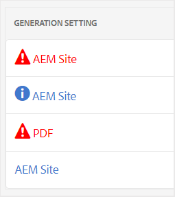

# Solución de problemas básica {#id1821I0Y0G0A}

Al trabajar con AEM Guides, puede encontrar errores al publicar o abrir el documento. Estos errores pueden estar en el mapa DITA, en el tema o en el propio proceso de AEM Guides. En esta sección se proporciona información sobre cómo tener acceso a la información del archivo de registro de generación de resultados y analizarla. Además, si el tema DITA es demasiado grande, es posible que vea el error de compilación de JSP. Esta sección también proporciona información sobre cómo resolver el error de compilación de JSP.

## Ver y comprobar el archivo de registro {#id1822G0P0CHS}

Realice los siguientes pasos para ver y comprobar el archivo de registro de generación de resultados:

1. Una vez que haya iniciado el proceso de generación de resultados, haga clic en **Resultados** en la consola de mapas DITA.

   La columna **General** de **Salidas generadas** muestra los iconos para dar una pista visual sobre el éxito o el fracaso de la generación de resultados.

   {width="300" align="left"}

   En la captura de pantalla anterior, el primer y el tercer iconos muestran la generación de resultados fallida. El segundo icono muestra una generación de salida correcta pero con mensajes. El último es una generación de salida correcta sin ningún mensaje.

1. Haga clic en el vínculo de la columna **Generado a las** una vez finalizado el trabajo.

   El archivo de registro se abre en una nueva pestaña.

   {width="800" align="left"}

1. Aplique los siguientes filtros para resaltar el texto en el archivo de registro:
   - Grave: resalta los errores graves del archivo de registro con color rosa.
   - Error: resalta los errores del archivo de registro con color naranja.
   - Advertencia: resalta las advertencias del archivo de registro con color morado.
   - Información: resalta los mensajes de información del archivo de registro con color azul.
   - Excepción: Resalta las excepciones del archivo de registro con color amarillo.
1. Utilice los botones de navegación arriba y abajo para saltar al texto resaltado en el archivo de registro.

   También puede desplazarse por el archivo de registro y comprobar los mensajes.

## Copie y compruebe el archivo de registro en un editor de texto

Realice los siguientes pasos para copiar y comprobar el archivo de registro de generación de resultados en un editor de texto:

1. Una vez que haya iniciado el proceso de generación de resultados, haga clic en **Resultados** en la consola de mapas DITA.

1. Haga clic en el vínculo de la columna **Generado a las** una vez finalizado el trabajo.

   El archivo de registro se abre en una nueva pestaña.

1. Haga clic en el botón **Copiar registro**. El archivo de registro se copia en el portapapeles.
1. Abra un editor de texto y pegue el archivo de registro en el editor.

1. Desplácese por el archivo de registro y compruebe si hay mensajes.

   La siguiente información le ayudará a determinar si hay un error en el archivo DITA o en el proceso de AEM Guides:

   - *Error relacionado con el archivo de mapa DITA*: En caso de que se encuentre un error en el archivo de mapa DITA o en cualquier otro archivo contenido en el mapa DITA, el archivo de registro contendrá una cadena, &quot;ERROR DE COMPILACIÓN&quot;. Puede comprobar la información proporcionada en el archivo de registro para localizar el archivo erróneo y solucionar el problema.

   En el siguiente fragmento de archivo de registro de ejemplo, puede ver el mensaje `BUILD FAILED` junto con el motivo del error.

   {width="650" align="left"}

   - *Error relacionado con AEM Guides*: El otro tipo de error que puede identificar en el archivo de registro está relacionado con el propio proceso de AEM Guides. En este caso, el fichero de mapa DITA se analiza correctamente, pero el proceso de generación de salida falla debido a algún error interno de AEM Guides. Para este tipo de errores, debe buscar ayuda del equipo de asistencia técnica.

   En el siguiente fragmento de archivo de registro de ejemplo, puede ver el mensaje `BUILD SUCCESSFUL`, seguido de otro error técnico.

   {width="650" align="left"}

## Resolver error de compilación de JSP

Si el tema DITA es demasiado grande, es posible que vea el error de compilación de JSP \(`org.apache.sling.api.request.TooManyCallsException`\) en el explorador. Este error puede aparecer al abrir un tema para editarlo, revisarlo o publicarlo.

Siga estos pasos para resolver este problema:

1. En Navegación global, seleccione Herramientas y elija Operaciones \> Consola web.

   Aparecerá la página Configuración de la consola web de Adobe Experience Manager.

1. Busque y haga clic en el componente *Servlet principal de Apache Sling*.

   Se muestran las opciones configurables para el servlet principal de Apache Sling.

1. Aumente el valor del parámetro *Número de llamadas por solicitud* según sus necesidades.

**Tema principal:**[ Generación de resultados](generate-output.md)
