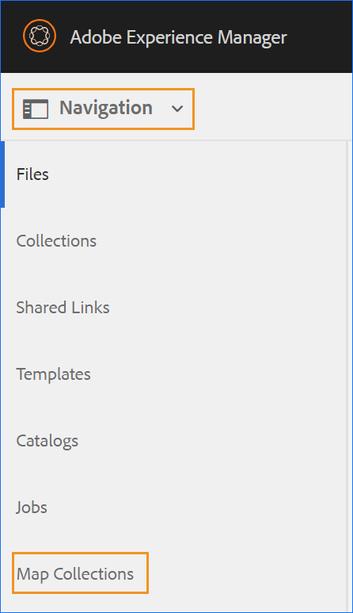
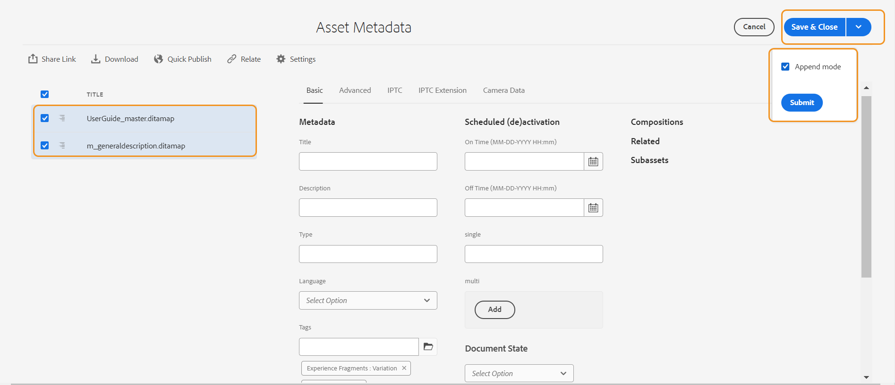

# Usar la colección de mapas para generar resultados {#id1723F20G0HS}

En cualquier organización, un producto puede tener varios tipos de documentación. Como especialista en publicación, le gustaría controlar qué salida desea generar para qué documento. Además, debe haber una forma de publicar varios documentos por lotes con un solo clic.

AEM Guides permite organizar el contenido para publicarlo mediante un panel denominado Recopilación de mapas. Una colección de mapas permite ensamblar todos los tipos de documentos en una sola unidad. Puede elegir qué tipo de salida desea generar para cada documento de la colección de mapas. Además, también puede generar resultados y ver el progreso de generación de resultados desde el panel de publicación.

La colección de mapas le ofrece la opción de ver si hay algún cambio en algún mapa respecto al último resultado publicado. Puede ver los detalles en la pestaña Mapas y ajustes preestablecidos de su colección de mapas y, a continuación, volver a publicar la salida si es necesario. Para obtener más información, vea Agregar un mapa a una colección de mapas.

## Creación de una colección de mapas y adición de mapas DITA

Para crear una colección de mapas y añadir mapas DITA a la colección, realice los siguientes pasos:

1. En la interfaz de usuario de Assets, haga clic en **Asignar colecciones**.

   Si el vínculo Colecciones de mapas no está disponible, seleccione la opción **Navegación** en el carril izquierdo y, a continuación, haga clic en **Colecciones de mapas**.

   {width="350" align="left"}

1. Escriba un Título para la colección de mapas.
1. Haga clic en **Crear**.

   Se muestra un mensaje de éxito al crear la colección de mapas.

1. Haga clic en **Cerrar** en el mensaje de éxito.

   El fichero de mapa recién creado se muestra en la página Colecciones de mapas.

1. Haga clic en el cuadro gris del mosaico de la colección que desea editar.
1. Haga clic en **Editar** y, a continuación, haga clic en **Agregar asignaciones**.
1. Busque y añada las asignaciones DITA que desee añadir a la colección de asignaciones.

   De forma predeterminada, todos los ajustes preestablecidos y configuraciones regionales asociados con el mapa se añaden automáticamente.

1. Seleccione la salida deseada activando o desactivando el botón deslizante.
1. Haga clic en **Listo**.

   Los ficheros de mapa DITA se añaden a la colección de mapas.

   {width="800" align="left"}

Las siguientes opciones de filtrado y detalles de asignación se muestran en la página de recopilación:

- **Filtro:** El carril más reciente muestra los siguientes filtros:
   - **Modificado**: Puede seleccionar Sí o No. Si selecciona Sí, sólo se mostrarán los mapas DITA modificados en la tabla Mapas y ajustes preestablecidos.
   - **Ajuste preestablecido**: seleccione un ajuste preestablecido para el que desee filtrar los archivos de asignación. AEM AEM Por ejemplo, si elige el ajuste preestablecido *Sitio*, solo se mostrarán los mapas que tengan configurado el ajuste preestablecido de salida *Sitio* en ellos.
   - **Idioma**: puede seleccionar cualquiera de los códigos de idioma disponibles y mostrar solo el idioma seleccionado en la tabla Mapas y ajustes preestablecidos.
- Tabla **Mapas y ajustes preestablecidos**: la tabla Mapas y ajustes preestablecidos presenta información en las siguientes columnas:
   - **Mapa**: muestra el título del archivo de mapa DITA.
   - **Nombre de archivo**: muestra el nombre de archivo del mapa DITA.
   - **Idioma**: muestra el idioma del mapa DITA.
   - **Ajuste preestablecido**: muestra el tipo de ajuste preestablecido de salida configurado en el archivo de asignación.
   - **Línea de base**: Muestra la línea de base que utiliza el ajuste preestablecido de salida.  Si no se utiliza ninguna línea de base, se muestra un guión &quot;-&quot;
   - **Modificado**: indica si el mapa DITA se ha actualizado después de la última publicación. En función de esta información, puede decidir si desea volver a publicar la salida para este mapa DITA o no.
   - **Última generación**: muestra la fecha y la hora del último resultado generado.

## Configure y genere la salida mediante una colección de mapas

Para configurar y generar la salida mediante una colección de mapas, realice los siguientes pasos:

1. AEM Abra la colección de mapas. Puede ver los distintos ajustes preestablecidos de salida, como el sitio de la, el PDF (incluido el PDF nativo), el HTML 5, el EPUB y los ajustes preestablecidos personalizados. También puede ver los ajustes preestablecidos de perfil global y de carpeta creados por el administrador.

   El icono  indica un ajuste preestablecido de nivel de perfil de carpeta.
1. \(Opcional\) Realice cualquiera de las siguientes acciones según sus necesidades:
   - Aplique filtros desde el carril izquierdo para filtrar los mapas modificados, los ajustes preestablecidos de salida o el idioma.
   - Si es necesario, haz clic en **Editar** y cambia la salida deseada activando o desactivando el botón deslizante.

     >[!NOTE]
     >  
     > De forma predeterminada, cualquier ajuste preestablecido nuevo está desactivado.

1. Los ajustes preestablecidos para un mapa DITA se pueden activar de las siguientes maneras:

   - Habilite cualquier ajuste preestablecido individual.
   - Active **Todos los ajustes preestablecidos** para un mapa DITA a fin de seleccionar todos los ajustes preestablecidos de una sola vez. Esta opción está desactivada de forma predeterminada.
   - Habilite **Ajustes preestablecidos de perfil de carpeta** para un mapa DITA a fin de seleccionar todos los ajustes preestablecidos de perfil de carpeta para él. Esta opción está desactivada de forma predeterminada.
     {width="800" align="left"}

1. Realice una de las siguientes acciones:

   - Para generar el resultado de las asignaciones seleccionadas, seleccione los archivos de asignación y haga clic en **Generar seleccionados**.
   - Para generar la salida de todos los mapas DITA con los ajustes preestablecidos configurados, haga clic en **Generar todo**.

   >[!IMPORTANT]
   >
   > Si un proceso de generación de salida para un ajuste preestablecido o un mapa DITA está en cola o en curso, no se puede iniciar otra tarea de generación de salida para el mismo ajuste preestablecido o mapa.

## Configurar las propiedades de los metadatos

En la colección de mapas, puede configurar las propiedades de metadatos de forma masiva para los mapas DITA. Seleccione **Configurar metadatos** para abrir la página **Metadatos de recursos**. En la página **Metadatos del recurso**, todas las asignaciones presentes en la colección se muestran a la izquierda.

{width="800" align="left"}

Siga estos pasos para configurar las propiedades de los metadatos:

1. Puede elegir las asignaciones para las que desea actualizar los metadatos. De forma predeterminada, se seleccionan todas las asignaciones DITA presentes.

1. Una vez seleccionadas las asignaciones DITA, se pueden ver propiedades como metadatos, programación (desactivación), referencias, estado del documento, etc.

1. Actualice las propiedades de los metadatos.

1. Haga clic en **Guardar y cerrar** en la parte superior para guardar las actualizaciones.
1. (Opcional) Al actualizar las etiquetas, también puede seleccionar Anexar en el menú desplegable **Guardar y cerrar** para anexar las nuevas etiquetas a la lista existente.
1. Haga clic en **Enviar** en el menú desplegable **Guardar y cerrar**.
Las propiedades de metadatos se actualizan para las asignaciones DITA que seleccione de forma masiva en la colección de asignaciones.

>[!NOTE]
> 
>Para el menú desplegable **Estado del documento**, puede seleccionar solo aquellos estados de documento que se permiten en común para todas las asignaciones DITA seleccionadas. Para obtener más información, vea [**Estado del documento**](./web-editor-document-states.md).

Las propiedades de metadatos están sincronizadas con las propiedades del archivo. Una vez que los actualice, podrá verlos en el panel **Propiedades del archivo** del Editor web.

## Eliminar una colección Map o un mapa DITA de la colección Map

- Para eliminar una colección de mapas, seleccione una colección en la página Colección de mapas y haga clic en **Eliminar**.
- Para eliminar un mapa DITA de una colección de mapas, abra la colección de mapas en el modo Edición, seleccione el archivo de mapa DITA y haga clic en **Quitar de la colección**.

De esta forma, también se eliminarán los ajustes preestablecidos o configuraciones regionales asociados al mapa DITA de la recopilación de mapas.

## Cancelar una tarea de generación de resultados de una colección de mapas

De forma similar a la forma de cancelar una tarea de generación de resultados desde la [consola de mapas DITA](generate-output-for-a-dita-map.md#id2061H100T5Z) o el [panel de control de Publish](generate-output-publish-dashboard.md#), puede cancelar una tarea de generación de resultados desde una colección de mapas. Acceda a la pestaña Resultados de una colección de mapas, vaya a la tarea de publicación que desee cancelar y haga clic en el icono **Cancelar este trabajo** para cancelar la tarea de publicación.

{width="800" align="left"}

**Tema principal:**[ Generación de resultados](generate-output.md)
