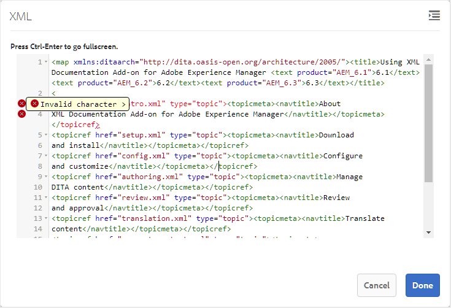

# Trabajo con el Editor de mapas básico {#id1942CM005Y4}

AEM El Editor de mapas básico proporciona una función sencilla de arrastrar y soltar para agregar temas desde el repositorio de la aplicación de la aplicación de la aplicación de mapas de DITA o de la aplicación de mapas de libros de la aplicación de la aplicación de la aplicación de mapas de datos. Puede agregar temas anidados, tablas de relación \(reltable\), atributos e información de metadatos, y también validar la corrección de la asignación.

>[!NOTE]
>
> Si el administrador ha activado la opción Advanced Map Editor, no tendrá acceso al Editor de Mapas Básico. De forma predeterminada, todos los archivos de mapa se abren en el Editor de mapas avanzado.

Las secciones siguientes describen las distintas funciones disponibles en el Editor de mapas básico.

## Adición de temas a un archivo de asignación {#id193CBL0505Z}

Una vez creado un fichero de mapa, se deben añadir temas al fichero de mapa. Con el Editor de mapas básico, puede agregar temas, tablas de relaciones u otros archivos de asignación.

Siga estos pasos para crear el archivo de asignación:

1. En la interfaz de usuario de Assets, vaya al archivo de asignación que desee editar.

1. Para obtener un bloqueo exclusivo en el archivo de asignación, selecciónelo y haga clic en **Desproteger**.

   >[!NOTE]
   >
   > Una vez que tenga un bloqueo exclusivo en un archivo de mapa, los demás usuarios no podrán editar el mapa. Sin embargo, podrían trabajar en los temas dentro del archivo de mapa.

1. Con el archivo de asignación seleccionado, haga clic en **Editar**.

   El archivo de mapa se abre para editarlo en el Editor de mapas. Con el editor de mapas, se crea un mapa utilizando los temas disponibles actualmente que se muestran en el carril Referencias.

   {width="800" align="left"}

1. Con el carril **Referencias**, vaya a la carpeta que contiene los temas o subasignaciones que desee agregar.

   >[!NOTE]
   >
   > Se pueden añadir temas o subasignaciones desde cualquier carpeta del carril Referencias.

1. Para agregar el primer tema al mapa, arrastre y suelte el tema en el Editor de mapas básico.

   >[!NOTE]
   >
   > Después de agregar el primer vínculo, el vínculo Agregar nueva referencia estará disponible cuando pase el ratón sobre un tema existente en el mapa.

1. Para agregar temas subsiguientes o un submapa, arrastre y suelte el tema o submapa en la ubicación requerida del mapa.

   Si se añade un submapa al mapa DITA, este se mostrará como un vínculo en el mapa DITA. Para ver todos los temas del submapa, haga clic en el vínculo del submapa. El contenido del submapa se muestra en una nueva pestaña.

   >[!NOTE]
   >
   > Si suelta un tema nuevo sobre uno existente en el mapa, recibirá un mensaje sobre cómo reemplazar el tema. Haga clic en Sí si desea reemplazar el tema, haga clic en No si no desea reemplazar el tema. Puede utilizar CTRL+Z y CTRL+Y para deshacer o rehacer cualquier cambio en el mapa.

1. Haga clic en **Guardar**.

## Funciones disponibles en la barra de herramientas del Editor de mapas básico

La barra de herramientas principal del editor de mapas básico permite realizar las siguientes tareas:

{width="800" align="left"}

**A: Buscar**

Puede buscar e incluir los temas necesarios desde DAM. Al hacer clic en este icono, se muestra el cuadro de diálogo Buscar:

{width="800" align="left"}

Introduzca las palabras clave que quiera buscar; estas palabras clave coinciden en los valores de nombre de archivo, contenido e incluso atributo del tema. Una vez que los resultados de la búsqueda estén disponibles, seleccione los temas deseados y haga clic en el botón Comprobar para añadir los archivos seleccionados al final de la estructura del mapa. Puede filtrar los resultados de búsqueda especificando los parámetros Fecha de modificación.

**B: grupo**

Haga clic en la casilla de verificación situada a la izquierda de los temas y haga clic en Agrupar en la barra de herramientas para agrupar los temas seleccionados. Para obtener más información sobre la agrupación de temas, consulte la documentación de [topicgroup](https://docs.oasis-open.org/dita/v1.0/langspec/topicgroup.html) en Especificación del lenguaje DITA OASIS.

**C: Eliminar**

Haga clic en la casilla de verificación situada a la izquierda de un tema y haga clic en Eliminar en la barra de herramientas para quitar los temas seleccionados del mapa.

**D: Mostrar Números/Ocultar Números**

Mostrar la numeración \(u ocultar\) de los temas del mapa.

**E: Validar**

Compruebe si la asignación es válida o tiene errores.

**F: modo predeterminado/modo XML**

En **Modo predeterminado**, al hacer clic en un vínculo de tema, se muestra la vista previa del tema en una nueva pestaña. Al hacer clic en el icono **Modo predeterminado**, se cambia su modo a **Modo XML**. En **Modo XML**, al hacer clic en cualquier lugar de una fila de tema, se muestra el XML subyacente de referencias de tema dentro del tema. En la vista XML de origen, hay una opción **Sangría automática** que reorganiza el código XML en un formato presentable y fácilmente legible. Si está editando un mapa manualmente, la vista de origen también realiza comprobaciones de validación. Si el XML contiene errores, lo mismo se resaltará en el **Modo XML** y no se le permitirá guardar el archivo de asignación DITA. Si desea ver el XML de todo el mapa, haga clic en cualquier lugar fuera del límite del tema.

**Nota:** En el modo predeterminado puede usar los métodos abreviados de teclado para deshacer \(`Ctrl+z`\) o rehacer \(`Ctrl+y`\) la última acción.

{width="650" align="left"}

**G: Asignar propiedades**

Muestre el cuadro de diálogo Propiedades del mapa, donde puede establecer los atributos y la información de metadatos del mapa. Para agregar un atributo, haga clic en el botón **Agregar** en la esquina inferior izquierda del cuadro de diálogo para obtener la lista desplegable **Atributo**. En la lista, seleccione el atributo que desee añadir. Si el atributo seleccionado tiene valores predefinidos especificados en la DTD, dichos valores se presentarán en una nueva lista desplegable. Puede seleccionar el valor deseado en la lista desplegable. Si no hay ningún valor predefinido, se le mostrará un cuadro de texto para introducir un valor para el atributo seleccionado.

{width="300" align="left"}

## Funciones disponibles a nivel de tema en el Editor básico de mapas

Cuando pasa el puntero del ratón sobre un tema o un archivo de submapa en el Editor de mapas básico, puede realizar las siguientes tareas:

{width="650" align="left"}

**A: Mover a la izquierda o Mover a la derecha**

Haga clic en los iconos de flecha izquierda o derecha para mover el tema a izquierda o derecha. Al mover un tema de esta manera, se convierte en un \(anidamiento\) secundario o secundario \(eliminar anidamiento\) con respecto al tema anterior.

**B: propiedades**

Haga clic en el icono Propiedades para abrir el cuadro de diálogo Propiedades de Topicref. Con este cuadro de diálogo, puede establecer los atributos del tema y la información de metadatos. Para obtener más información acerca de los atributos y metadatos del tema estándar, consulte la documentación de [topicref](https://docs.oasis-open.org/dita/v1.2/os/spec/langref/topicref.html) en Especificación del lenguaje DITA OASIS.

{width="350" align="left"}

**C: Agregar Nueva Referencia**

Haga clic en el icono Añadir nueva referencia para añadir una nueva referencia como secundaria del tema actual.

**D: Agregar Nueva Definición De Clave**

Haga clic en el icono Clave para añadir una nueva definición de clave. Cualquier clave anulada o una clave que ya se haya definido en el mapa aparece en rojo. Si hace clic en el icono Propiedades en una definición de clave, aparece el cuadro de diálogo Propiedades de Keydef.

## Trabajo con tablas de relación en el Editor de mapas básico {#id1944B0I0COB}

Los editores de mapas de AEM Guides incluyen una potente función que permite crear y editar tablas de relaciones en el mapa DITA.

Siga estos pasos para trabajar con tablas de relación en el Editor de mapas básico:

1. En la interfaz de usuario de Assets, desplácese hasta el mapa DITA en el que desee crear la tabla de relaciones.

1. Haga clic en el mapa DITA para abrirlo en la consola de mapas DITA.

1. Seleccione la ficha **Temas** para ver una lista de los temas disponibles en el mapa DITA.

   >[!TIP]
   >
   > La pestaña Temas ofrece la opción de descargar el archivo de asignación con sus dependientes. Para obtener más información, consulte [Exportar un archivo de mapa DITA](authoring-download-assets.md#id218UBA00IXA).

1. En la barra de herramientas principal, haga clic en **Editar**.

   El archivo de mapa se abre en el Editor de mapas básico.

1. Seleccione **Reltable** en la barra de herramientas.

   {width="650" align="left"}

1. Arrastre y suelte los temas de la lista de temas en el editor Reltable.

   >[!NOTE]
   >
   > Puede agregar temas desde cualquier carpeta en el carril Referencias.

   {width="550" align="left"}

1. Para agregar un encabezado a la tabla de relaciones, haga clic en **Agregar nuevo encabezado**.

1. Para agregar una columna a la tabla de relaciones, haga clic en **Agregar una columna**.

   {width="550" align="left"}

1. Haga clic en **Guardar**.

También puede realizar las siguientes acciones desde el editor de tablas de relaciones:

**Eliminar filas o columnas**

Si desea eliminar una columna de la tabla, seleccione la casilla de verificación en el encabezado de la columna y haga clic en Eliminar. Si desea quitar una fila de la tabla, seleccione la casilla de verificación en la primera columna de la fila correspondiente y haga clic en Eliminar.

**Eliminar un tema**

Si desea eliminar un tema de la tabla, haga clic en el icono en forma de cruz situado junto al tema.

**Eliminar la tabla de relaciones**

Si desea eliminar la tabla de relaciones, haga clic en cualquier lugar fuera de la tabla de relaciones y haga clic en Eliminar.

**Tema principal:**[ Trabajar con el editor de mapas](map-editor.md)
