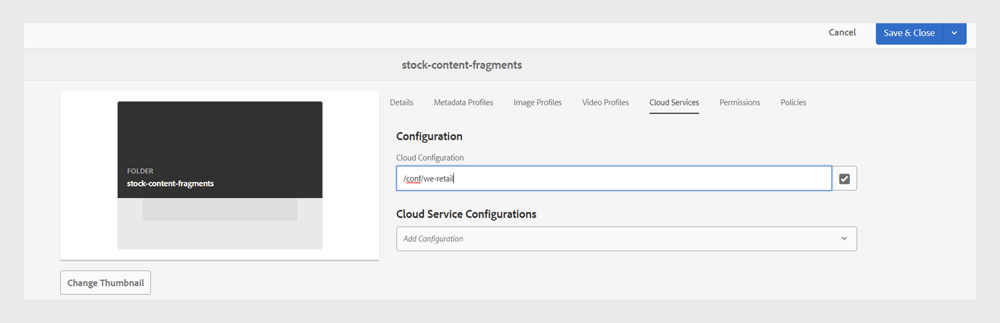
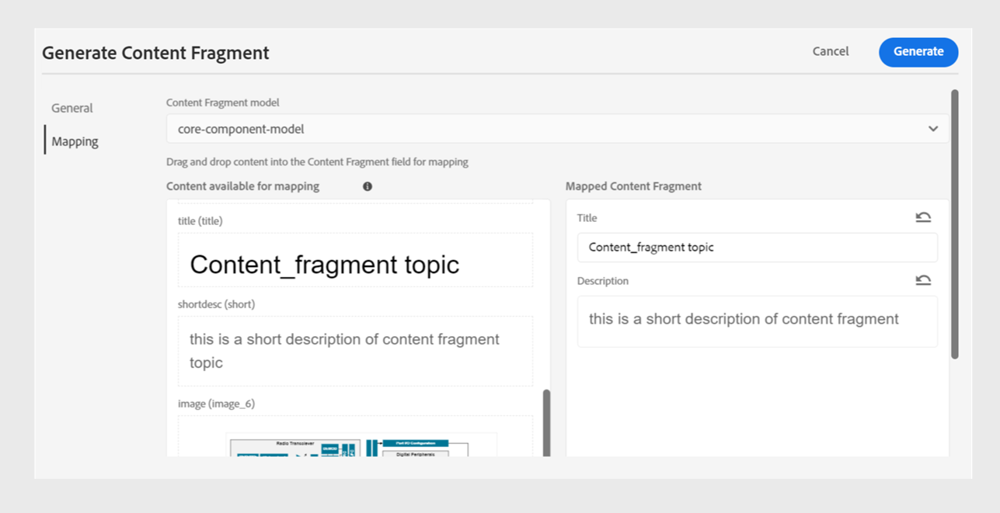

# Publicar fragmentos de contenido

Los fragmentos de contenido son fragmentos de contenido discretos en Adobe Experience Manager. Son contenidos estructurados basados en un modelo de contenido. Los fragmentos de contenido son contenido puro sin información de diseño. Se pueden crear y administrar de forma independiente de los canales compatibles con Adobe Experience Manager. Los fragmentos de contenido son modulares, donde el contenido se desglosa en componentes más pequeños.

Experience Manager Guides permite publicar un tema o sus elementos en un fragmento de contenido.

>[!NOTE]
>
>Solo puede elegir los elementos de un tema que tengan un atributo id definido.

Para crear un fragmento de contenido, realice los siguientes pasos:

1. Crear un [modelo de fragmento de contenido](https://experienceleague.adobe.com/docs/experience-manager-65/assets/content-fragments/content-fragments-models.html?lang=es) en Adobe Experience Manager Assets.
1. Cree una carpeta en la que desee guardar los fragmentos de contenido que cree en función del modelo de fragmento de contenido. Por ejemplo, &quot;stock-content-fragments&quot;.
1. Edite las propiedades de la carpeta (por ejemplo, &quot;stock-content-fragments&quot;) y agregue la ruta de la carpeta, que contiene el modelo de fragmento de contenido en la configuración de la nube.
Por ejemplo, agregue `/conf/we-retail` en la configuración de nube. Esta configuración conecta todos los modelos de fragmento de contenido con la carpeta.\
   {width="650" align="left"}
   *Agregue la configuración de nube en las propiedades de la carpeta para conectarla con los modelos de fragmento.*

1. Para generar un fragmento de contenido, seleccione **Nueva salida**  de la sección **Salidas** en las **Propiedades de archivo** de un tema.
1. Seleccione **Fragmento de contenido**.\
    {width="300" align="left"}

   *Agregar un nuevo fragmento de contenido desde las propiedades de archivo de un tema*.

1. En el cuadro de diálogo **Generar fragmento de contenido**, rellene los siguientes detalles en las pestañas **General** y **Asignación**.

   Ficha **General**
   
   *Agregue el filtro de ruta de acceso, nombre, título y condición para publicar un tema o sus elementos como fragmento de contenido.*

   * **Ruta**: busque y seleccione la ruta de la carpeta donde desea publicar el fragmento de contenido. Si selecciona un fragmento de contenido existente, se sobrescribe el contenido de los campos asignados.
   * **Título**: escriba el título del fragmento de contenido. De forma predeterminada, el título se rellena con el título del tema. Puede editarlo. Este título se utiliza para generar el nombre del fragmento de contenido.
   * **Nombre**: escriba el nombre del fragmento de contenido. De forma predeterminada, el nombre se rellena con el título del tema y los espacios se sustituyen por &quot;_&quot;. Por ejemplo, *sample_content_fragment*. Puede editarlo.  Este nombre se utiliza para generar la dirección URL del fragmento de contenido.

   * Puede seleccionar diferentes condiciones para crear variantes de fragmentos de contenido. Seleccione una de las siguientes opciones:
     >[!NOTE]
     > 
     > Las condiciones solo se activan si los atributos de condición se definen en el tema.

      * **Ninguno**: seleccione esta opción si no desea aplicar ninguna condición en la salida publicada.
      * **Usando DITAVAL**: seleccione el archivo DITAVAL para incluir o excluir contenido específico en la salida generada. Puede seleccionar el fichero DITAVAL mediante el cuadro de diálogo de exploración o escribiendo la ruta del fichero.
      * **Utilizar atributos**: puede definir atributos de condición en los temas DITA. A continuación, seleccione el atributo de condición para publicar el contenido relevante.

   **Ficha Mapping**

   

   *Seleccione el modelo de fragmento de contenido y agregue los detalles de asignación para publicar un tema o sus elementos como fragmento de contenido.*

   * **Modelo**: Seleccione el modelo de fragmento de contenido que desee usar para crear el fragmento de contenido. Los modelos se seleccionan de la carpeta que ha configurado en el servidor de Experience Manager Guides.
   * **Asignación**: puede ver los elementos de tema a los que se les ha aplicado un atributo id. Arrastre los elementos del tema a los campos presentes en el modelo de fragmento de contenido.
El lado derecho se rellena con el contenido publicado del fragmento de contenido en caso de que exista uno. Si es necesario, se pueden sobrescribir con el contenido del tema. También puede seleccionar **Deshacer** para revertir los cambios de asignación.

     >[!NOTE]
     >
     > Si utiliza la versión 4.4 o versiones anteriores, seleccione una asignación en la lista desplegable. Selecciona las asignaciones del archivo *contentFragmentMapping.json*.  El administrador puede agregar las asignaciones en el archivo *contentFragmentMapping.json*. Obtenga más información acerca de cómo [crear una asignación entre un tema y un fragmento de contenido](/help/product-guide/cs-install-guide/conf-content-fragment-mapping-cs.md) en la Guía de instalación y configuración.

1. Haga clic en **Generar** para publicar el fragmento de contenido.

1. Puede ver los fragmentos de contenido de un tema en la sección **Salidas** de **Propiedades del archivo**.

   {width="300" align="left"}

   *Vea los fragmentos de contenido presentes en un tema y vuelva a publicarlos.*

Una vez publicados los fragmentos de contenido, también puede utilizarlos en cualquier sitio de Adobe Experience Manager.

## Menú Opciones para un fragmento de contenido

También puede realizar las siguientes acciones para un fragmento de contenido desde el menú **Opciones**:

* **Generar**: vuelva a publicar el fragmento de contenido para actualizarlo con el contenido más reciente del tema DITA. Al regenerar la salida, puede cambiar la ruta, el nombre, el título, el modelo y la asignación del fragmento de contenido. También se pueden seleccionar condiciones diferentes al regenerar la salida.

* **Duplicado**: Duplique un fragmento de contenido. Puede cambiar la ruta, el nombre, el título, el modelo y la asignación. También puede seleccionar diferentes condiciones al duplicar un fragmento de contenido para crear una variante de fragmento de contenido.

* **Quitar**: quita un fragmento de contenido de la lista de resultados. Aparecerá un mensaje de confirmación. Una vez confirmado, el fragmento de contenido se eliminará de la lista **Salidas**.

  >[!NOTE]
  >
  > Esta acción no elimina contenido del fragmento de contenido.

* **Ver**: vea el editor de fragmentos de contenido. También puede realizar cambios y guardarlos.

## Migración de contenido no UUID a UUID mejorada

El nuevo script de migración de contenido UUID se ha optimizado significativamente, lo que hace que la migración de contenido de no UUID a UUID sea 30 veces más rápida que el script anterior. Incluye funciones como la reanudación desde puntos de comprobación, perspectivas en directo, tiempo estimado de finalización e informes detallados, lo que garantiza un proceso de migración armonioso. En particular, el proceso de migración conserva los metadatos de los recursos sin ningún cambio. El script se ha probado y verificado en un gran conjunto de datos de 3 millones de recursos, lo que confirma su eficacia y fiabilidad para las migraciones a gran escala.

Más información sobre [Migración de contenido que no sea UUID a UUID](/help/product-guide/install-guide/migrate-non-uuid-uuid.md).
