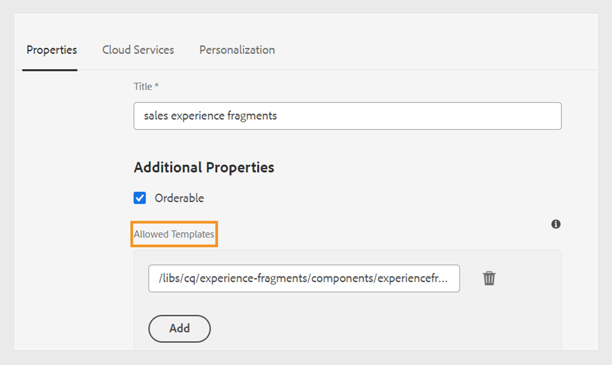

# Fragmentos de experiencia de Publish

Los fragmentos de experiencias son fragmentos de contenido modular en Adobe Experience Manager. Estos bloques de contenido se basan en plantillas y encapsulan el contenido y su diseño. Estos fragmentos de contenido reutilizables permiten a los creadores de contenido ensamblar y ofrecer experiencias coherentes y escalables en varios canales compatibles con Experience Manager. Esta función le ayuda a crear fácilmente experiencias de marketing coherentes de forma eficaz, como boletines informativos, titulares promocionales y testimonios de clientes.

Experience Manager Guides permite publicar un tema o sus elementos en un Fragmento de experiencia. Puede crear una asignación basada en JSON entre un tema y sus elementos en un Fragmento de experiencia. A continuación, utilice la asignación para publicar un tema o sus elementos en un Fragmento de experiencia. A continuación, puede utilizar fragmentos de experiencias en cualquier sitio de Experience Manager o extraer los detalles mediante las API admitidas por los fragmentos de experiencias.

Para generar un fragmento de experiencia, realice los siguientes pasos:

1. Cree una carpeta en los Fragmentos de experiencias. Utilice esta carpeta para guardar los fragmentos de experiencias que cree en función de las plantillas de fragmento de experiencias. Por ejemplo, *sales-experience-fragments*.
1. Seleccione la carpeta y luego seleccione el icono **Propiedades** de la parte superior.
1. Edite las propiedades de la carpeta (por ejemplo, *sales-experience-fragments*).

   * **Título**: vea o edite el título de la carpeta.

   * **Plantillas permitidas**: Contiene la lista de plantillas que se pueden agregar como páginas secundarias del fragmento de experiencia. Para agregar la plantilla permitida, especifique la expresión regular para recuperar las plantillas necesarias en el campo **Plantillas permitidas**.
Por ejemplo:
     `/libs/cq/experience-fragments/components/experiencefragment/template`

     Si no define una plantilla permitida para una carpeta, las plantillas se seleccionan de la carpeta principal o de la carpeta de plantillas de forma predeterminada.
   * **Solicitable**: permite cambiar el orden de los recursos dentro de una carpeta.
     {width="650" align="left"}
     *Agregue la configuración de nube en las propiedades de la carpeta para conectarla con las plantillas de fragmento.*
1. Para generar un fragmento de experiencia, seleccione **Nueva salida**  de la sección **Salidas** en las **Propiedades de archivo** de un tema.
1. Seleccione **Fragmento de experiencia**.\
   {width="300" align="left"}

   *Agregar un nuevo fragmento de experiencia desde las propiedades de archivo de un tema*.

   >[!NOTE]
   >
   > También puede publicar un fragmento de experiencia desde la **vista de repositorio**. Seleccione el tema que desea publicar como fragmento de experiencia. A continuación, en el menú **Opciones**, seleccione **Publish As** > **Fragmento de experiencia**.

1. En el cuadro de diálogo **Generar fragmento de experiencia**, rellene los siguientes detalles:
   {width="500" align="left"}

   *Añada la ruta, la plantilla y los detalles de asignación para publicar un tema o sus elementos como fragmento de experiencia. Puede sobrescribir un fragmento de experiencia existente.*

   * **Ruta**: busque y seleccione la ruta de la carpeta donde desea publicar el fragmento de experiencia. También puede seleccionar un fragmento de experiencia existente y volver a publicarlo.
   * **Título**: escriba el título del fragmento de experiencia. De forma predeterminada, el título se rellena con el título del tema. Puede editarlo. Este título se utiliza para generar el nombre del fragmento de experiencia.
   * **Nombre**: escriba el nombre del fragmento de experiencia. De forma predeterminada, el nombre se rellena con el título del tema y los espacios se sustituyen por &quot;_&quot;. Por ejemplo, *sample_experience_fragment*. Puede editarlo. Este nombre se utiliza para generar la dirección URL del fragmento de experiencia.
   * **Plantilla**: Seleccione la plantilla del fragmento de experiencia que desee usar para crear el fragmento de experiencia. Las plantillas se seleccionan de la carpeta que ha configurado en las propiedades.
   * **Asignación**: selecciona la asignación del archivo *experienceFragmentMapping.json* y la muestra.

     El administrador puede agregar las asignaciones en el archivo *experienceFragmentMapping.json*.  Obtenga más información acerca de cómo [crear una asignación entre un tema y un Fragmento de experiencia](/help/product-guide/cs-install-guide/conf-experience-fragment-mapping-cs.md) en la Guía de instalación y configuración.

   * También puede seleccionar diferentes condiciones para publicar el contenido.  Seleccione una de las siguientes opciones:

      * **Ninguno**: seleccione esta opción si no desea aplicar ninguna condición en la salida publicada.
      * **Utilizando DITAVAL**: seleccione el archivo DITAVAL para generar contenido personalizado. Puede seleccionar el fichero DITAVAL mediante el cuadro de diálogo de exploración o escribiendo la ruta del fichero.
      * **Utilizar atributos**: puede definir atributos de condición en los temas DITA. A continuación, seleccione el atributo de condición para publicar el contenido relevante.

     >[!NOTE]
     > 
     >Las condiciones solo se activan si los atributos de condición se definen en el tema.

   * Seleccione la casilla de verificación **Sobrescribir contenido existente** si el fragmento de experiencia ya existe y desea sobrescribirlo. Experience Manager Guides muestra un error si no selecciona la casilla de verificación y el fragmento de experiencia ya existe.
1. Haga clic en **Generar** para publicar el fragmento de experiencia.
1. Puede ver los fragmentos de experiencias de un tema en la sección **Salidas** de **Propiedades del archivo**. Los fragmentos de experiencias aparecen según la fecha y la hora de su publicación, con la última como la primera.

   {width=300 align=&quot;left&quot;}

   *Vea los fragmentos de experiencias presentes en un tema y vuelva a publicarlos.*

Una vez publicados los fragmentos de experiencias, también puede utilizarlos en cualquier sitio de Adobe Experience Manager.

## Menú Opciones para un fragmento de experiencia

También puede realizar las siguientes acciones para un fragmento de experiencia desde el menú **Opciones**:

* **Generar**: vuelva a publicar el fragmento de experiencia para actualizarlo con el contenido más reciente del tema DITA. Al regenerar la salida, no se puede cambiar la ruta, el nombre, el título y la plantilla del fragmento de experiencia. Sin embargo, se pueden seleccionar condiciones diferentes al regenerar la salida.

* **Duplicado**: Duplique un fragmento de experiencia. Puede cambiar la ruta, el nombre, el título y la plantilla. También puede seleccionar condiciones diferentes al duplicar un fragmento de experiencia.

* **Quitar**: quita un fragmento de experiencia de la lista de resultados. Aparecerá un mensaje de confirmación. Una vez confirmado, el fragmento de experiencia se eliminará de la lista **Salidas**. Sin embargo, el fragmento de experiencia no se elimina de la carpeta.

* **Ver**: vea el editor de fragmentos de experiencias. También puede realizar cambios y guardarlos.
