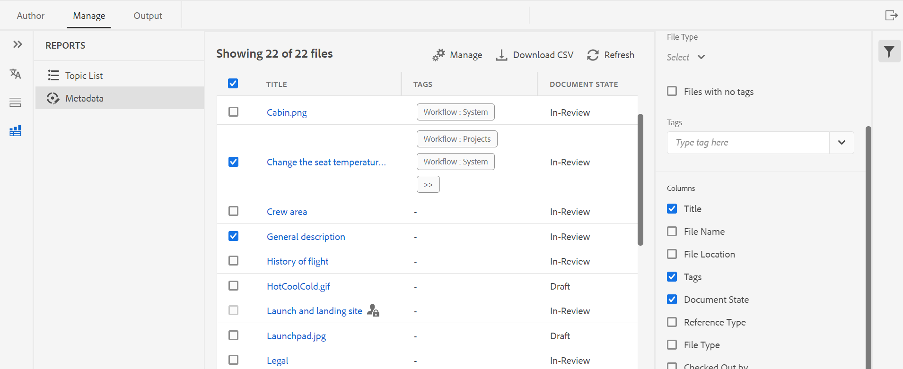

# Informe de mapa DITA del editor web {#id231HF0Z0NXA}

AEM Guides incluye una función en el editor web que permite comprobar la integridad general de las referencias y generar informes para ellas.

Puede ver la lista de temas, administrar los metadatos de todas las referencias y ver la lista multimedia del mapa actual desde la ficha **Informes** del Editor Web.

## Genere un CSV desde la vista Lista de temas

La vista **Lista de temas** proporciona información detallada sobre los temas, como el tipo de referencia, el estado del documento y el autor.

Puede crear un informe de los temas realizando los siguientes pasos:

1. En el panel **Repositorio**, abra el archivo de mapa DITA en la Vista de mapa.
1. Haga clic en la ficha **Administrar**.
1. Haga doble clic en **Lista de temas** a la izquierda. Se mostrará la lista de temas presentes en el mapa DITA.

   {width="800" align="left"}

1. Desde el panel **Filtros**, puede filtrar los temas en función del **Tipo de referencia** \(directo o indirecto\), **Estado del documento** \(el estado actual de los temas. Por ejemplo, si los temas están en estado Editar, En revisión o Revisado, se mostrarán\) o el **Autor** del tema.

1. También puede utilizar las siguientes opciones de filtrado de temas para elegir mostrar las siguientes columnas en la lista:

   - **Tema** El título del tema se especifica en el mapa DITA. Puede hacer clic en el tema para editarlo.
   - **Nombre de archivo** Nombre del archivo.
   - **UUID**: el identificador único universal \(UUID\) del archivo.
   - **Ubicación de archivo** Ruta de acceso completa del tema.
   - **Tipo de referencia** El tipo de referencia: directa o indirecta.
   - **Estado del documento**: el estado actual del tema.
   - **Autor**: el usuario que trabajó por última vez en el tema.
   - **Mapa principal** Lista de todas las asignaciones en las que se hace referencia directamente al tema.

   >[!NOTE]
   >
   > Haga clic en **Actualizar** para obtener una lista nueva de temas y ver cualquier cambio en el archivo de asignación o si se actualiza alguna referencia en el archivo de tema.

1. Haga clic en **Descargar CSV** para descargar la instantánea actual de los temas del mapa DITA. El archivo CSV contiene las columnas seleccionadas y los temas filtrados en la vista **Lista de temas**. A continuación, puede abrir este archivo CSV de lista de temas en cualquier editor CSV.

**Administrar metadatos de forma masiva desde el informe Metadatos**

AEM Guides permite etiquetar contenido DITA desde el editor web. Puede aplicar etiquetas a un tema individual o utilizar la función de etiquetado masivo para aplicar varias etiquetas a varios temas, a un mapa DITA o a un submapa. También puede cambiar el estado del documento de todos los temas seleccionados al siguiente estado común posible del documento.

## Ver metadatos

Para ver los metadatos de las referencias en el mapa DITA actual, realice los siguientes pasos:

1. En el panel Repositorio, abra el fichero de mapa DITA en la vista Mapa.
1. Haga clic en la ficha **Administrar**.
1. Haga doble clic en **Metadatos** a la izquierda. Se mostrará la lista de metadatos de todas las referencias del mapa DITA. Esto incluye también las referencias de medios.

   {width="800" align="left"}

1. Desde el panel **Filtros** puede filtrar los temas en función del **estado del documento** \(el estado actual de los temas. Por ejemplo, si los temas están en estado Editar, En revisión o Revisado, se mostrarán\), **Referencias** \(directas o indirectas\), **Tipo de archivo** \(Mapa, Tema e Imagen\) de la referencia.
1. También puede elegir ver solamente los **archivos sin etiquetas** o también elegir etiquetas específicas del filtro **Etiquetas** para ver los archivos asociados con ellos.
   1. También puede utilizar las siguientes opciones de filtrado de temas para elegir mostrar las siguientes columnas en la lista de metadatos:
      - **Título** \(seleccionado de forma predeterminada\) El título del archivo al que se hace referencia se especifica en el mapa DITA. Puede hacer clic en el archivo para editarlo.También puede hacer clic en un archivo de audio o vídeo y reproducirlo en el Editor Web. Puede cambiar el volumen o la vista del vídeo. En el menú contextual también tiene las opciones para descargar, cambiar la velocidad de reproducción o ver la imagen en la imagen.

        >[!NOTE]
        >
        > También aparece un icono de desprotección cerca del título de un archivo desprotegido. Puede pasar el ratón sobre el icono para ver el nombre del usuario.

      - **Nombre de archivo** El nombre del archivo.
      - **Ubicación del archivo** Ruta de acceso completa del archivo.
      - **Etiquetas** \(seleccionadas de forma predeterminada\) Etiquetas aplicadas al archivo.

        >[!NOTE]
        >
        > De forma predeterminada, puede ver dos etiquetas para un archivo. Para ver más etiquetas, haz clic en **Mostrar más**. Haga clic en **Mostrar menos** para contraer de nuevo la lista.

      - **Tipo de referencia** El tipo de referencia: directa o indirecta
      - **Estado del documento** \(seleccionado de forma predeterminada\) Estado actual del archivo de referencia.
      - **Tipo de archivo** \(seleccionado de forma predeterminada\) Tipo de archivo de origen. Las opciones disponibles son Mapa, Tema e Imagen.
      - **Extraído por** El usuario que ha desprotegido el archivo.
1. Haga clic en **Descargar CSV** para descargar la instantánea actual de las referencias en el mapa DITA. El CSV contiene las columnas seleccionadas y las referencias filtradas en la vista Lista de temas. A continuación, puede abrir este archivo CSV de metadatos en cualquier editor CSV.

**Actualización de metadatos**

1. Para actualizar los metadatos, seleccione los archivos que desea actualizar.

   >[!NOTE]
   >
   > No puede seleccionar ningún archivo desprotegido. También aparece un icono de desprotección cerca del título de un archivo desprotegido. Puede pasar el ratón sobre el icono para ver el nombre del usuario.

1. Seleccione **Administrar** de la parte superior.

   {width="350" align="left"}

1. Si desea añadir nuevas etiquetas, seleccione nuevas etiquetas en la lista desplegable para aplicarlas a todos los temas seleccionados. También puede eliminar cualquier etiqueta haciendo clic en el icono en forma de cruz situado cerca de la etiqueta.

   >[!NOTE]
   >
   > Se muestran las etiquetas comunes aplicadas en todos los temas seleccionados.

1. Seleccione un nuevo estado de documento si desea cambiar el estado del documento de todas las referencias seleccionadas. La lista desplegable muestra el estado posible común de todos los temas seleccionados. Por ejemplo, si el estado actual de los temas es En revisión, puede ver los estados Borrador, Aprobado o Revisado.
1. Haga clic en **Actualizar** para actualizar los metadatos. Se muestra un mensaje de confirmación para los metadatos, tanto si se actualizan correctamente como si tienen actualizaciones fallidas. También puede hacer clic en **Descargar informe** para descargar el CSV de metadatos desde el cuadro de diálogo de confirmación. Este CSV contiene los detalles del estado de actualización de las referencias seleccionadas.

## Generación de un informe multimedia

El informe **Multimedia** proporciona información detallada acerca de los archivos multimedia utilizados en el mapa, como el título, el tipo \(audio, vídeo e imágenes\), los archivos en los que se usa multimedia y el tipo de referencia de los archivos en los que se han utilizado. También puede ver el UUID y la ubicación del contenido multimedia dentro del repositorio. Puede crear un informe del contenido multimedia realizando los siguientes pasos:

1. En el panel **Repositorio**, abra el archivo de mapa DITA en la Vista de mapa.
1. Haga clic en la ficha **Administrar**.
1. Haga doble clic en **Multimedia** a la izquierda. Se mostrará la lista de elementos multimedia presentes en el mapa DITA.
1. Desde el panel **Filtros** puede ordenar la lista por contenido multimedia o por los nombres de los elementos utilizados en las referencias.

   - Cuando ordena por **Multimedia**, el&#x200B;**&#x200B;**&#x200B;nombre del multimedia se muestra en la primera columna y, a continuación, los nombres de todas las referencias en las que se han utilizado se muestran en otra columna de la misma fila. Por ejemplo, la siguiente captura de pantalla muestra el archivo multimedia WarmCoolForC.gif en la primera columna y las tres referencias en las que se utiliza se muestran en la tercera columna de la misma fila.

     {width="650" align="left"}

   - Si ordena por **Usado en** columna, verá la vista transpuesta en la que los nombres de las referencias en las que se ha utilizado multimedia se enumeran en la primera columna, mientras que los nombres multimedia se enumeran en otra columna en filas separadas. Por ejemplo, la siguiente captura de pantalla muestra los nombres de tres referencias \(Ajuste de la temperatura del asiento, Cambio de la visualización de la temperatura del asiento y Área de tripulación\) en la primera columna y el archivo multimedia WarmCoolForC.gif se muestra en la tercera columna en tres filas independientes.

     {width="650" align="left"}

1. Puede filtrar su contenido multimedia según el **tipo multimedia** y el **tipo de referencia**. La lista de archivos multimedia se muestra en función de su selección en la lista desplegable. Por ejemplo, se puede elegir mostrar sólo las referencias de audio en el mapa DITA y un fichero sólo muestra las referencias de audio utilizadas en él.

   >[!NOTE]
   >
   > Según el tipo de multimedia que uses en el mapa, la imagen, el vídeo y el audio aparecen en la lista desplegable **Tipo de multimedia**, y Directo o Indirecto en la lista desplegable **Tipo de referencia**.

1. También puede utilizar las siguientes opciones de filtrado para elegir mostrar las siguientes columnas en la lista:

   - **Multimedia** \(seleccionado de forma predeterminada\) El título del multimedia se especifica en el mapa DITA. Puede hacer clic en el contenido multimedia para editarlo.
   - **Ubicación multimedia** Ruta de acceso completa de la multimedia.
   - **UUID multimedia**: El identificador único universal \(UUID\) del archivo.
   - **Tipo multimedia** \(seleccionado de forma predeterminada\) Tipo de multimedia. Las opciones disponibles son Audio, Vídeo o Imagen.
   - **Utilizado en** \(seleccionado de forma predeterminada\) Las referencias en las que se ha utilizado el contenido multimedia. Puede hacer clic en la referencia para editarla.
   - **Tipo de referencia** \(seleccionado de forma predeterminada\) El tipo de referencia: directa o indirecta.

   >[!NOTE]
   >
   > Haga clic en **Actualizar** para obtener una lista nueva de contenido multimedia y ver los cambios realizados en el archivo de mapa o si se ha actualizado algún contenido multimedia del mapa DITA.

1. También puede hacer clic en un archivo de audio o vídeo y reproducirlo en el Editor Web. Puede cambiar el volumen o la vista del vídeo. En el menú contextual también tiene las opciones para descargar, cambiar la velocidad de reproducción o ver la imagen en la imagen.

   {width="800" align="left"}

1. Haga clic en **Descargar CSV** para descargar la instantánea actual del contenido multimedia en el mapa DITA. El archivo CSV contiene las columnas seleccionadas y la multimedia filtrada en la vista **Multimedia**. A continuación, puede abrir este archivo CSV multimedia en cualquier editor CSV.

## Ver y corregir los vínculos rotos{#report-broken-links}

Los **vínculos rotos** son un informe útil que proporciona los detalles de los vínculos rotos presentes en el mapa actual. Puede ver los vínculos rotos, que pueden ser para temas DITA, referencias de archivos multimedia, referencias de claves de contenido, etc. También tiene la capacidad de arreglarlos aquí mismo.
El informe proporciona información detallada, como el vínculo roto, el tipo de vínculo, los archivos en los que se utiliza la referencia y el tipo de archivos en los que se ha utilizado.
Para ver el informe de los vínculos rotos, siga estos pasos:
1. En el panel **Repositorio**, abra el archivo de mapa DITA en la Vista de mapa.
1. Haga clic en la ficha **Administrar**.
1. Haga doble clic en **Vínculos rotos** a la izquierda. Se mostrará la lista de vínculos rotos o referencias presentes en el mapa DITA.
1. Desde el panel **Filtros** puede ordenar la lista por vínculos o por los nombres de los elementos utilizados en las referencias.

   - Cuando ordena por **Vínculo interrumpido**, las rutas de los vínculos rotos se muestran en la primera columna y, a continuación, los nombres de todas las referencias en las que se han utilizado se muestran en otra columna en filas independientes. Si se utiliza el mismo vínculo roto en varios archivos, estos se muestran en una fila y se muestran como filas agrupadas o secundarias. Por ejemplo, la siguiente captura de pantalla muestra tres vínculos rotos en la primera columna y la referencia en la que se utilizan; `TestMap.ditamap` se muestra en la tercera columna en tres filas independientes.

   {width="800" align="left"}

   - Si ordena por **Usado en la columna**, verá la vista transpuesta en la que los nombres de las referencias en las que se han utilizado los vínculos rotos se enumeran en la primera columna, mientras que los vínculos rotos se enumeran en otra columna de la misma fila. Por ejemplo, la siguiente captura de pantalla muestra la referencia (en la que se utiliza el vínculo roto) `TestMap.ditamap` en la primera columna y los vínculos rotos se muestran en la tercera columna de la misma fila.

   {width="800" align="left"}
1. Puede filtrar los vínculos rotos en función de **Tipo de archivo** y **Tipo de vínculo**. La lista de vínculos rotos se muestra según lo que haya seleccionado en la lista desplegable. Por ejemplo, se puede elegir mostrar únicamente las referencias de contenido en el mapa DITA y un fichero sólo muestra las referencias de contenido utilizadas en él.

   Según el tipo de referencias utilizadas en el mapa, Referencia de archivo, Referencia de clave, Referencia de contenido, Referencia de clave de contenido, Referencia de imagen y Referencia de archivo multimedia se enumeran en la lista desplegable **Tipo de vínculo**, y **Tema DITA** o **Mapa DITA** se enumeran en la lista desplegable **Tipo de archivo**.
1. También puede utilizar las siguientes opciones de filtrado para elegir mostrar las siguientes columnas en la lista:

   - **Vínculo roto** (seleccionado de forma predeterminada) La ruta del vínculo roto se especifica en el mapa DITA.

   - **Tipo de vínculo** (seleccionado de forma predeterminada) El tipo de vínculos. Las opciones disponibles son Referencia de clave de contenido, Referencia de contenido, Tema DITA, Referencia de archivo, Referencia de imagen, Referencia de clave y Referencia de archivo multimedia.

   - **Utilizado en** (seleccionado de forma predeterminada) Las referencias en las que se ha utilizado el vínculo roto. Puede hacer clic en la referencia para verla en el modo Autor.

   - **Tipo de archivo** (seleccionado de forma predeterminada) El tipo de referencia: Mapa DITA o Tema DITA.
Haga clic en **Actualizar** para obtener una nueva lista de vínculos rotos y ver cualquier cambio en el archivo de asignación o si se actualiza algún vínculo roto en el mapa DITA.
1. Puede hacer clic en el icono **Corregir vínculo** () para corregir el vínculo roto.

   >[!NOTE]
   >
   > Pase el ratón sobre la ruta del vínculo roto en la columna Vínculo interrumpido para ver el icono Corregir vínculo ().

   Puede corregir un vínculo en ambas vistas, cuando lo haya pedido **Vínculos rotos** o **Utilizado en**.

   >[!NOTE]
   >
   > Cuando arregla un enlace roto mientras ha ordenado por Enlaces rotos, el enlace será corregido en todos los archivos donde se utiliza (que se agrupan en una sola fila).

1. Debe actualizar los detalles de referencia necesarios en el cuadro de diálogo **Actualizar vínculo**. Los detalles requeridos en el cuadro de diálogo **Actualizar vínculo** dependerían del tipo de referencia.\
   Una vez corregido un vínculo, no se muestra en la lista de vínculos rotos. En su lugar, puede verlo en la Lista de temas o en Metadatos.

1. Haga clic en **Descargar CSV** para descargar la instantánea actual de los vínculos rotos en el mapa DITA. El CSV contiene las columnas seleccionadas y los vínculos rotos filtrados en la vista Vínculos rotos. A continuación, puede abrir y ver este archivo CSV en cualquier editor CSV.

**Tema principal:**&#x200B;[ Informes](reports-intro.md)
