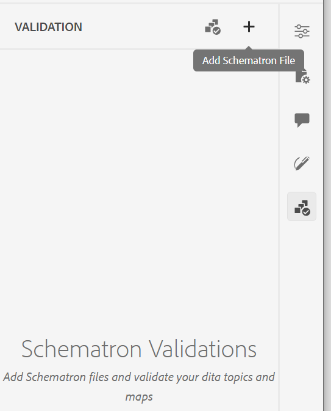

# Compatibilidad con archivos de Schematron

&quot;Schematron&quot; hace referencia a un lenguaje de validación basado en reglas que se utiliza para definir pruebas para un archivo XML. El editor web admite archivos Schematron. Puede importar los archivos de Schematron y también editarlos en el Editor Web. Con un fichero de Schematron se pueden definir determinadas reglas y, a continuación, validarlas para un tema DITA o un mapa.

>[!NOTE]
>
> El editor web admite ISO Schematron.


## Importación de archivos de Schematron

Siga estos pasos para importar los archivos de Schematron:

{width="300" align="left"}

1. Vaya a la carpeta requerida (donde desea cargar los archivos) en *Vista de repositorio*.
1. Haz clic en el icono **Opciones** para abrir el menú contextual y elige **Cargar Assets**.
1. En el diálogo **Cargar Assets**, puede cambiar la carpeta de destino en el campo **Seleccionar carpeta de recursos**.
1. Haga clic en **Elegir archivos** y busque los archivos de Schematron. Puede seleccionar uno o más archivos de Schematron y luego hacer clic en **Cargar**.

## Validación de un tema o asignación DITA con Schematron

Después de importar los archivos de Schematron, puede editarlos en el Editor Web. Puede utilizar los ficheros de Schematron para validar los temas o un mapa DITA. Por ejemplo, se pueden crear las reglas siguientes para un tema o mapa DITA:

* Se define un título para un mapa DITA.
* Se ha añadido una breve descripción de una longitud determinada.
* Debe haber al menos una referencia de tema en el mapa.

Cuando se abre un tema en el Editor Web, aparece un panel Validación de Schematron a la derecha. Realice los siguientes pasos para agregar y validar un tema o asignación con un archivo de Schematron:
{width="300" align="left"}

1. Haga clic en el icono de Schematron () para abrir el panel de Schematron.
1. Utilice Agregar archivo de Schematron para agregar archivos de Schematron.
1. Si el archivo Schematron no tiene errores, se añade y se enumera en el panel Validación. Se muestra un mensaje de error para el archivo Schematron que contiene errores.
   >[!NOTE]
   >
   >Puede utilizar el icono cruzado cerca del nombre del archivo de Schematron para eliminarlo.
1. Haga clic en Validar con Schematron para validar el tema.

   * Si el tema no infringe ninguna regla, se muestra el mensaje de validación correcta para el archivo.
   * Si el tema rompe una regla, por ejemplo, si no contiene un título y se valida para el Schematron anterior, muestra un error de validación.

1. Haga clic en el mensaje de error para resaltar el elemento que contiene el error en el tema o mapa abierto.

La compatibilidad con Schematron en el Editor Web le ayuda a validar los archivos con un conjunto de reglas y a mantener la coherencia y corrección en todos los temas.

## Usar instrucciones de aserción e informe para comprobar las reglas{#schematron-assert-report}

AEM Guides también admite las instrucciones de aserción e informe de Schematron. Estas instrucciones le ayudan a validar los temas DITA.

### Instrucción Assert

Una instrucción assert genera un mensaje cuando una instrucción de prueba se evalúa como false. Por ejemplo, si desea que el título aparezca en negrita, puede definir una instrucción assert para él.

```XML
<sch:rule context="title"> 
    <sch:assert test = "b"> Title should be bold </sch:assert>
  </sch:rule>
```

Cuando se validan los temas DITA con Schematron, aparece un mensaje para los temas en los que el título no aparece en negrita.

### Declaración de informe

Una instrucción de informe genera un mensaje cuando una instrucción de prueba se evalúa como verdadera. Por ejemplo, si desea que la descripción breve tenga menos de 150 caracteres o menos, puede definir una instrucción de informe para comprobar los temas en los que la descripción breve tenga más de 150 caracteres.
Al validar los temas DITA con Schematron, se obtiene un informe completo de las reglas en las que la sentencia de informe se evalúa como true. Por lo tanto, recibe un mensaje para los temas en los que la descripción breve tiene más de 150 caracteres.


```XML
<sch:rule context="shortdesc"> 
        <sch:let name="characters" value="string-length(.)"/> 
        <sch:report test="$characters &gt; 150">  
        The short description has <sch:value-of select="$characters"/> characters. It should contain more than 150 characters.      
        </sch:report>   
    </sch:rule> 
```

>[!NOTE]
>
> Utilice únicamente expresiones Xpath 2.0 al escribir las reglas de Schematron.

## Uso de expresiones Regex{#schematron-regex-espressions}

También puede utilizar expresiones Regex para definir una regla con la función matches() y luego realizar la validación mediante el archivo Schematron.

Por ejemplo, puede utilizarlo para mostrar un mensaje si el título contiene solo una palabra.

```XML
<assert test="not(matches(.,'^\w+$'))"> 
No one word titles.
</assert>  
```


## Definir patrones abstractos{#schematron-abstract-patterns}

AEM Guides también admite patrones abstractos en Schematron. Puede definir patrones abstractos genéricos y reutilizarlos.  Puede crear parámetros de marcador de posición que especifiquen el patrón real.


El uso de patrones abstractos puede simplificar el esquema de Schematron al reducir la duplicación de reglas y facilitar la administración y actualización de la lógica de validación. También puede facilitar la comprensión del esquema, ya que puede definir una lógica de validación compleja en un único patrón abstracto que se puede reutilizar en todo el esquema.


Por ejemplo, el siguiente código XML crea un patrón abstracto y, a continuación, el patrón real hace referencia a él mediante el identificador.

```XML
<sch:pattern abstract="true" id="LimitNoOfWords"> 

<sch:rule context="$parentElement"> 

<sch:let name="words" value="string-length(.)"/> 

<sch:assert test="$words &lt; $maxWords"> 

You have <sch:value-of select="$words"/> letters. This should be lesser than <sch:value-of select="$maxWords"/>. 

</sch:assert>  

<sch:assert test="$words &gt; $minWords"> 

You have <sch:value-of select="$words"/> letters. This should be greater than <sch:value-of select="$minWords"/>. 

</sch:assert>  

</sch:rule> 

</sch:pattern> 

<sch:pattern is-a="LimitNoOfWords" id="extend-LimitNoOfWords"> 

<sch:param name="parentElement" value="title"/> 

<param name="minWords" value="1"/> 

<param name="maxWords" value="8"/> 

</sch:pattern> 
```
