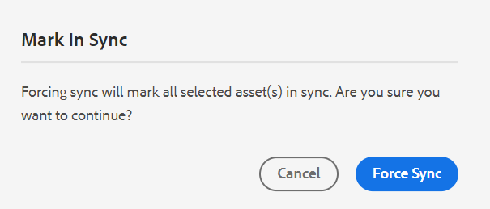

# Traducir documentos desde el editor web {#id21BKF0Z0YZF}

>[!TIP]
>
> Se recomienda utilizar esta función de traducción del Editor web si ha actualizado a la versión de AEM Guides as a Cloud Service de febrero de 2022 o posterior.

AEM Guides incluye una potente función en el editor web que le permite traducir el contenido a varios idiomas. Puede crear un nuevo proyecto de traducción y posteriormente agregar los trabajos de traducción al proyecto de traducción existente. También puede crear un proyecto de traducción multilingüe que incluya trabajos de traducción para todos los idiomas seleccionados.

>[!NOTE]
>
> El administrador puede configurar la pestaña Administrar \(utilizada para la traducción\) en el Editor web. Para obtener más información, consulte *Configuración de la característica de traducción en la sección Editor web* en Instalar y configurar Adobe Experience Manager Guides as a Cloud Service.

## Antes de empezar

Antes de realizar los pasos de este procedimiento, asegúrese de haber creado las carpetas raíz y destino del idioma necesarias

1. Cree una carpeta raíz para almacenar el contenido de origen. La carpeta raíz debe crearse con el nombre de idioma \(como inglés\) o el código de idioma \(en\).
1. Cree las carpetas de destino a las que desea traducir el contenido. Por ejemplo, si desea traducir el contenido al alemán o al francés, debe crear una carpeta denominada como -de \(para alemán\) o -fr \(para francés\).

>[!NOTE]
>
> La carpeta raíz y las carpetas de destino deben crearse en el mismo nivel.

## Crear un proyecto de traducción

1. En el panel **Repositorio**, abra el archivo de mapa DITA en la vista de mapa.
1. Haga clic en la ficha **Administrar**. El **panel de traducción** muestra los grupos de idiomas disponibles.

1. Como usuario, puede ver los grupos de idiomas configurados en el perfil de carpeta. Los grupos de idiomas muestran las carpetas de idioma junto con sus códigos de idioma. Por ejemplo, el grupo de idiomas denominado G1 contiene las carpetas de idioma italiano \(it\), alemán \(de\), francés \(fr\) e inglés \(en\).

   {width="300" align="left"}

   *Seleccione los grupos de idiomas o idiomas en los que desea traducir sus documentos.*

   >[!IMPORTANT]
   >
   > Solo puede seleccionar y traducir a los idiomas para los que ha creado la carpeta de destino paralela al idioma de origen. Tampoco se muestra una carpeta de idioma creada en cualquier otro nivel, como un nivel por debajo de la carpeta de idioma de origen. Asegúrese de crear todas las carpetas de idioma de destino en el mismo nivel que la carpeta de idioma de origen.

1. Puede seleccionar cualquier grupo de idiomas como destino para la traducción. Si **selecciona todos**, los archivos seleccionados se traducen a todos los idiomas disponibles dentro de los grupos de idiomas existentes.

   La opción de carpeta de idioma aparece atenuada y muestra un signo de advertencia:

   - Si falta la carpeta de destino de un idioma.
   - Si el idioma de destino es el mismo que el origen.

   >[!NOTE]
   >
   > Si crea la carpeta de destino para un idioma después de crear el grupo de idiomas, actualice el explorador para habilitar el idioma en los grupos de idiomas.

1. Si elige un idioma concreto, aparece como seleccionado en todos los grupos de idiomas que ha seleccionado. Por lo tanto, cuando se traduce a cualquier idioma, se traduce de una sola vez para todos los grupos de idiomas. Por ejemplo, si el alemán está presente en los grupos de idiomas G1 y G2, se selecciona para ambos.

1. En **Otros idiomas**, puede elegir cualquier idioma para el que haya creado la carpeta de destino, pero que no forme parte de ningún grupo de idiomas.

1. También puede seleccionar una de las siguientes opciones para traducir el proyecto:

   **Ninguno** Seleccione esta opción para traducir las versiones predeterminadas de los archivos. Esta opción está seleccionada de forma predeterminada.

   **Usar línea de base:** Puede seleccionar una línea de base para traducir el proyecto. Haga clic en Utilizar línea base y seleccione una línea base creada en el mapa. Todos los archivos que forman parte de la Línea base seleccionada se muestran en la página Traducción. Una vez traducido el contenido, puede exportar la línea de base traducida. Para obtener más información sobre cómo exportar la línea de base traducida, consulte [Exportar línea de base traducida](generate-output-use-baseline-for-publishing.md#id196SE600GHS).

   **Usar la última versión como el**: elige filtrar la versión de los temas según su fecha y hora de creación. Al seleccionar una fecha y hora, solo se muestra la última versión de los archivos creados en la fecha y la hora seleccionadas o antes.

1. Haga clic en **Aplicar**. Se muestra una lista con detalles de temas y recursos asociados.
1. Seleccione los temas que desee enviar para su traducción. También puede utilizar las opciones de filtrado de temas para las siguientes columnas:

   - **Título**: título del archivo de origen.  Pase el ratón sobre el título del archivo de origen para ver el título del archivo de destino o traducido.
   - **Nombre de archivo**: Nombre del archivo de origen
   - **Tipo de archivo**: tipo del archivo de origen. Las opciones disponibles son Mapa, Tema e Imagen.
   - **Tipo de referencia**: referencias directas o indirectas
   - **Versión**: número de versión del archivo de origen
   - **Etiqueta de versión**: Etiqueta para la versión seleccionada del archivo de origen
   - **Versión de destino**: Número de versión del archivo de destino
   - **Estado del documento**: estado del archivo de origen. Las opciones disponibles son Borrador, En revisión y Revisado.
   - **Idioma de destino**: El idioma al que desea traducir el archivo de origen
   - **Estado de traducción**: las opciones disponibles son: Fuera de sincronización, Falta copia, En curso y En sincronización.
   - **Etiqueta de destino**: Etiqueta para la versión seleccionada del archivo de destino
1. Haga clic en **Enviar para traducción** en la esquina superior derecha.

   {width="800" align="left"}

1. En el menú desplegable, seleccione **Crear un nuevo proyecto de traducción**.

   {width="350" align="left"}

   Además de un nuevo proyecto de traducción, también puede seleccionar entre las siguientes opciones:

   - Puede elegir **Crear una estructura** solo para el proyecto de traducción.
   - Puede elegir **Crear un nuevo proyecto de traducción XLIFF** para convertir el contenido XML al formato de archivo de intercambio de localización XML (XLIFF). XLIFF es un formato abierto basado en XML que se utiliza para estandarizar la transferencia de datos entre varias herramientas utilizadas en el proceso de traducción de contenido. AEM Guides es compatible con la versión 1.2 de XLIFF.
En un proyecto XLIFF, el contenido se exporta al formato XLIFF estándar del sector, que se puede proporcionar a los proveedores de traducción. El formato XLIFF permite la posible reutilización de segmentos que ya ha traducido durante la fase de traducción.\
     Una vez traducido el contenido XLIFF, se puede importar en AEM Guides, creando una versión traducida del proyecto DITA original.

     >[!NOTE]
     >
     > La exportación a XLIFF solo funciona con la configuración de traducción humana.

   - Puede seleccionar **Crear un nuevo proyecto de traducción multilingüe** que incluirá trabajos de traducción para todos los idiomas que haya seleccionado para la traducción. Por ejemplo, si ha seleccionado francés, alemán y español, se creará un proyecto que contiene trabajos de traducción para los tres idiomas.
   - Si ya tiene un proyecto de traducción, puede agregarle temas. Seleccione la opción Agregar a **Proyecto de traducción existente** de la lista Proyecto y elija un proyecto de la lista Proyecto de traducción existente. Puede ordenar estos proyectos por orden más reciente, ascendente o descendente.

- Si selecciona **Proyecto de traducción existente**, esta operación actualiza la entrada de recursos existente en el proyecto si el recurso ya se ha agregado y el estado del trabajo de traducción relacionado está en el estado *Borrador*.
   - Si el idioma de destino no está presente en el proyecto, se crea un nuevo proyecto para el proyecto de traducción en un solo idioma y se crea un nuevo trabajo para el proyecto de traducción en varios idiomas.
   - Si el trabajo ya está presente para el idioma de destino y el estado del trabajo no está en el estado *Borrador*, se creará un nuevo trabajo dentro del mismo proyecto para agregar los recursos que se traducirán.

  >[!NOTE]
  >
  > Si el proyecto existente es un proyecto de ámbito, tiene &#39;\(Ámbito\)&#39; anexado en su nombre.

- Si necesita crear el ámbito para traducir un proyecto, puede seleccionar **Crear un nuevo proyecto de traducción de ámbito**. Esto no enviará las copias para su traducción y se mantendrá el estado de traducción original de los archivos. No afecta a la copia de idioma de destino de los temas a los que se hace referencia y que se envían para su análisis.
1. En el campo **Título del proyecto**, introduzca un título.
1. Haga clic en **Crear** para crear un nuevo proyecto de traducción.

   Se crea un nuevo proyecto de traducción con la versión seleccionada de los temas. En este momento, se muestra un mensaje emergente que confirma que se ha creado el proyecto de traducción. Una vez que todas las copias de idioma de destino estén disponibles en el proyecto de traducción, recibirá una notificación en la bandeja de entrada. Una vez que las copias de idioma de destino estén disponibles en el proyecto de traducción, puede continuar e iniciar el trabajo de traducción. Para obtener más información, consulte [Iniciar el trabajo de traducción](translation-first-time.md#id225IK030OE8).

   >[!NOTE]
   >
   > Si rechaza la traducción de uno o más temas de un trabajo de traducción, el estado de traducción de **En curso** de todos los temas rechazados vuelve a su estado original. El estado de los temas referidos se comprueba y revierte según el estado de traducción más reciente. Además, los archivos de traducción creados en el proyecto de destino no se eliminan aunque la traducción se rechace para ellos.

## Añadir las reglas de traducción

AEM Guides permite a los administradores configurar las reglas de traducción. El formato SRX (Intercambio de reglas de segmentación) es un estándar para intercambiar reglas de segmentación entre distintos usuarios y entornos de traducción. Puede crear una carpeta y agregarle los archivos SRX personalizados.

Los archivos SRX deben tener el nombre `<language-code>.srx`. Por ejemplo, en-US o ar-AE.

>[!NOTE]
>El título no distingue entre mayúsculas y minúsculas, por lo que puede tener &quot;en-US&quot;, &quot;en-us&quot; o &quot;EN-us&quot;. Además, las guías de AEM pueden resolver &quot;-&quot; (guión) o &quot;_&quot; (guion bajo). Por lo tanto, puede tener &quot;en-US&quot; o &quot;en_US&quot;.

Además, puede colocar estos archivos dentro de cualquier carpeta bajo la raíz de recursos de AEM que sea `./content/dam`.

Una vez creada la carpeta que contiene los archivos SRX, puede añadir la ruta de la carpeta en la configuración de ubicación de Translation SRX dentro del perfil de carpeta.

Se recomienda que, para un mejor rendimiento, mantenga solo los archivos SRX en la carpeta configurada en el perfil de carpeta.

AEM Guides elige las reglas SRX según el idioma de origen del proyecto de traducción. Busca un archivo SRX personalizado para un idioma y, si no define un archivo SRX personalizado, selecciona las reglas según las reglas de traducción predeterminadas.

Para obtener más información sobre la configuración de perfiles globales y de nivel de carpeta, consulte la sección *Configuración de la creación de plantillas* en Instalar y configurar Adobe Experience Manager Guides as a Cloud Service.

## Pasar la etiqueta de versión a la versión de destino

AEM Guides permite pasar la etiqueta del archivo de origen al archivo de destino. Esto le ayudará a identificar fácilmente la versión de origen del archivo traducido.

Para agregar la etiqueta de versión de origen en la copia de destino, el administrador del sistema debe seleccionar la opción **Propagar etiquetas de versión de origen a la versión de destino** en la pestaña **Traducción** de **Configuración del editor**.

Por ejemplo, si tiene algunos archivos de origen a los que se les ha aplicado la etiqueta de versión `Release 1.0`, también puede pasar la etiqueta de origen \(`Release 1.0`\) al archivo traducido.

{width="650" align="left"}

>[!NOTE]
>
> La etiqueta de origen solo se adjunta a una versión de destino. Si mueve la etiqueta de origen a otra versión, se reflejará automáticamente en la etiqueta de destino más reciente.

## Ver la diferencia de versión de los archivos sin sincronizar 

AEM Guides proporciona la función para comprobar las diferencias entre la versión seleccionada y la última versión de origen traducida de los temas. Puede elegir traducir los archivos de **Fuera de sincronización** en función de los cambios realizados.

{width="650" align="left"}

Seleccione **Mostrar diferencia** icono \(\) de un tema para ver las diferencias entre la última versión traducida y la versión actual del archivo seleccionado.

>[!NOTE]
>
> El icono \(\) **Mostrar diferencia** solo aparece para los archivos DITA que tienen el estado de traducción **Fuera de sincronización**.

Aparecerá el cuadro de diálogo **Diferencia de versiones**. Muestra **Última versión traducida** y el número **Versión seleccionada** a la izquierda. La ventana de vista previa muestra las diferencias entre la última versión traducida y la versión seleccionada del tema.

{width="650" align="left"}

## Descartar recursos no sincronizados

Si realiza cambios en algunos de los recursos, estos pasarán a estar Desincronizados. Puede volver a traducir los recursos modificados o elegir descartar el estado Fuera de sincronización. Por ejemplo, si ha realizado algunos cambios muy menores que realmente no necesitan traducción, puede marcar su estado como Sincronizado.

Para descartar el estado Fuera de sincronización, realice los siguientes pasos:

1. Seleccione los recursos sin sincronizar cuyo estado desea cambiar.
1. Seleccione el botón **Marcar sincronización** \(\) de la parte superior. Aparecerá el cuadro de diálogo **Marcar sincronización**.

   {width="550" align="left"}

1. Haga clic en **Forzar sincronización**. Establece el estado en Sincronizado para los recursos sin sincronizar seleccionados.

>[!NOTE]
>
> El botón **Marcar como sincronizado** \(\) solo aparece para los recursos que tienen el estado de traducción No sincronizado.

## Ver proyectos de traducción en curso de un mapa o un tema

Algunas de las referencias del panel de traducción pueden estar en curso. Estas referencias tienen un vínculo **En curso** en la columna **Estado de traducción**. Al hacer clic en el vínculo, se abre el cuadro de diálogo **Proyectos en curso**. En el cuadro de diálogo, puede ver la lista de todos los proyectos de traducción en curso \(junto con el idioma de destino\) que contienen la referencia seleccionada.

>[!NOTE]
>
> Puede ver el vínculo En curso para los proyectos traducidos creados en AEM Guides as a Cloud Service en febrero de 2023 o posterior.

Haga clic en el nombre de la referencia en el cuadro de diálogo para abrirla en el modo de vista previa. También puede hacer clic en el proyecto de traducción para iniciar la traducción.

{width="550" align="left"}

## Eliminar o deshabilitar automáticamente un proyecto de traducción completado

>[!NOTE]
> 
>Esta función está disponible para los nuevos proyectos de traducción que cree con la versión Experience Manager Guides 2404 o posterior.  No afecta a ningún proyecto existente.

El administrador puede configurar la opción **Limpieza del proyecto de traducción una vez finalizado** en la pestaña **Traducción** de **Configuración del editor** para deshabilitar o eliminar los proyectos de traducción automáticamente.

Para realizar la administración de documentos, Experience Manager Guides permite eliminar los proyectos de traducción una vez completada la traducción.

También puede deshabilitar los proyectos de traducción si desea usarlos más adelante. Al eliminar un proyecto, se eliminan todos los archivos y carpetas presentes en el proyecto. Al deshabilitar un proyecto no se elimina, sino que se mantiene en el repositorio. Pero no puede actualizar ni editar un proyecto deshabilitado.  Eliminar o deshabilitar un proyecto no afectará el estado de traducción de ninguna referencia.

**Tema principal:**&#x200B;[&#x200B; Trabajar con el editor web](web-editor.md)
