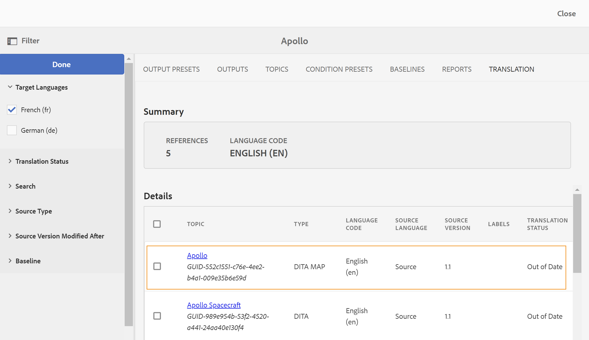

# Traducir temas modificados {#id16A5A0B6072}

Si realiza cambios en algunos de los temas, esos temas requerirán una nueva traducción. Puede realizar un seguimiento de los temas modificados desde el mapa DITA. En la carpeta de copia de idioma de origen, pulse en el fichero de mapa DITA y en la ficha Traducción. Puede ver el estado de cada tema tanto si requiere una nueva traducción como si no.

Realice los siguientes pasos para enviar un tema modificado para su retraducción:

1. Pulse en el fichero de mapa DITA de la carpeta de copia de idioma de origen.

1. Haga clic en la ficha **Traducción**.

1. En el panel **Filtro** de la izquierda, seleccione los **Idiomas de traducción** para los que desea comprobar el estado y haga clic en **Listo**.

   Puede ver el estado de traducción de cada tema. Los temas que tienen disponible otra revisión del tema distinta a la que se envió para su traducción, muestran el estado **Obsoleto**.

   >[!NOTE]
   >
   > El flujo de trabajo de traducción compara la última revisión guardada del archivo de tema en la carpeta del idioma de origen con la versión traducida.

   Si hace clic en la flecha para ver más detalles. puede ver la copia de idioma en particular que no está actualizada.

   {width="800" align="left"}

1. Haga clic en la casilla de verificación para seleccionar los temas que desea enviar para su retraducción.

   Cuando selecciona una fecha sin sincronizar, la opción **Crear/actualizar copias de idioma** aparece en el panel Referencias y el botón **Descartar estado sin sincronización** situado encima del icono **Filtrar**.

   Puede usar el botón **Descartar sincronización insuficiente** para anular el estado Obsoleto de los temas del mapa DITA. Por ejemplo, si ha realizado algunos cambios en la versión en inglés del tema que no necesitan traducción, puede utilizar este botón y cambiar el estado Obsoleto del tema seleccionado.

   >[!NOTE]
   >
   > Si hace clic en el botón **Descartar estado de desincronización**, se establece el estado del tema como Actualizado para los temas seleccionados sin fecha.

1. Haga clic en **Actualizar copias de idioma** y configure el trabajo de traducción.

1. Puede elegir crear un nuevo proyecto de traducción o agregar temas a un proyecto de traducción existente. Proporcione los detalles necesarios para configurar el proyecto de traducción.

1. Haga clic en **Iniciar**.

   Se muestra un mensaje de confirmación que indica que el tema se ha enviado para su traducción.

1. Vaya al proyecto de traducción en la consola Proyecto. Se crea una nueva tarjeta de trabajo de traducción en la carpeta. Haga clic en los puntos suspensivos para ver los recursos de la carpeta.

   {width="300" align="left"}

1. Para iniciar la traducción, haga clic en la flecha de la tarjeta del trabajo de traducción y seleccione **Start** en la lista. Un mensaje notifica que el trabajo se ha iniciado.

   También puede ver el estado del tema que se está traduciendo al hacer clic en los puntos suspensivos en la parte inferior de la tarjeta de trabajo de traducción.

   >[!NOTE]
   >
   > Si utiliza el servicio de traducción humana, debe exportar el contenido para su traducción. Una vez que tenga el contenido traducido, debe importarlo de nuevo en el proyecto de traducción.

1. Una vez finalizada la traducción, el estado cambia a **Listo para revisión**. Haga clic en los puntos suspensivos para ver los detalles del tema y realice una de las siguientes acciones en la barra de herramientas:

   - Haga clic en **Mostrar en Assets** para ver y comprobar la traducción.

   - Haga clic en **Aceptar traducción** si cree que los cambios se han traducido correctamente. Se muestra un mensaje de confirmación.

   - Haga clic en **Rechazar traducción** si cree que es necesario volver a realizar el trabajo. Se muestra un mensaje de rechazo.

   >[!NOTE]
   >
   > Es importante aceptar o rechazar el recurso traducido; de lo contrario, el archivo permanece en la ubicación temporal y no se copia en DAM.

1. Vuelva al archivo de mapa DITA en la carpeta de idioma de origen en la interfaz de usuario de Assets. Los temas retraducidos ahora están sincronizados.

**Tema principal:**&#x200B;[ Traducir contenido](translation.md)
