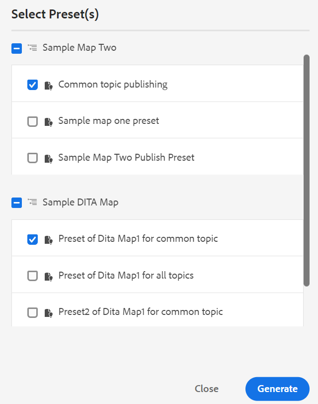

# Generar resultados desde el panel Repositorio o el panel Vista de mapa {#id218CL6010AE}

También puede utilizar los ajustes preestablecidos de salida creados para el mapa DITA para generar resultados desde el panel Repositorio o el panel Vista de mapa.

- Utilice la función **Generación rápida** del panel Repositorio o del panel Vista de mapa para generar resultados para el tema único seleccionado o para todo el mapa DITA.

  >[!NOTE]
  >
  > También puede acceder a la característica **Generación rápida** desde el panel Favoritos o el panel Buscar.

- Use la característica **Generar salida** en el panel Vista de mapa para generar la salida de los múltiples temas seleccionados.

## Publish es un tema utilizado en una o varias asignaciones DITA

Realice los siguientes pasos para generar resultados para uno o varios temas del mapa DITA:

1. En la ficha **Autor**, seleccione el tema del mapa DITA que desee publicar.

1. Seleccione **Generación rápida** en el menú Opciones del tema seleccionado.
   {width="650" align="left"}

1. Para publicar un tema utilizado en un único mapa DITA, seleccione los ajustes preestablecidos de salida del mapa que desee utilizar para publicar y haga clic en **Generar**.
   {width="350" align="left"}

1. Verá el estado del proceso de generación de resultados. Para ver el resultado, pase el puntero del mouse (ratón) sobre el tema y haga clic en Ver resultados.

1. Si tiene un tema común que se utiliza en varios temas, seleccione los distintos mapas DITA y también los ajustes preestablecidos de salida que desee utilizar para publicar y haga clic en **Generar.**

   {width="350" align="left"}

1. Verá el estado del proceso de generación de resultados.

   - **Temas**: Enumera los temas seleccionados para los que se genera la salida.
   - **Ajuste preestablecido**: muestra los ajustes preestablecidos de salida que contienen los temas seleccionados.
   - **Mapa**: enumera los mapas DITA que contienen el tema seleccionado.
   - **Estado**: muestra el estado de publicación de cada tema.
Para ver el resultado, pase el puntero del mouse (ratón) sobre el tema y haga clic en Ver resultados.
     {width="800" align="left"}

## Generar salida para un mapa DITA desde el editor web

Realice los siguientes pasos para generar la salida para todo el mapa DITA:

1. En la ficha **Autor**, seleccione el mapa DITA que desee publicar.

1. Seleccione **Generación rápida** en el menú Opciones del mapa DITA.

   {width="650" align="left"}

1. Seleccione los ajustes preestablecidos de salida del mapa DITA que desee utilizar para publicar y haga clic en **Generar.**

1. Verá el estado del proceso de generación de resultados. Para ver el resultado, pase el puntero del mouse (ratón) sobre el tema y haga clic en Ver resultados.

## Generar resultados para más de un tema

Realice los siguientes pasos para generar resultados para más de un tema en el mapa DITA desde el panel Vista de mapa:

1. En la ficha **Autor**, seleccione los temas que desee publicar.

1. Seleccione **Generar salida** en el menú Opciones de la parte inferior.

1. Seleccione el ajuste preestablecido de salida del mapa DITA que desee utilizar para publicar.

   >[!NOTE]
   >
   > Sólo verá los ajustes preestablecidos de salida del mapa DITA actual que contengan todos los temas seleccionados.

   {width="650" align="left"}

1. Verá el estado del proceso de generación de resultados. Para ver la salida, pase el puntero del ratón sobre el tema y haga clic en Ver salida.

**Tema principal:**[ Publicación basada en artículos desde el editor web](web-editor-article-publishing.md)
