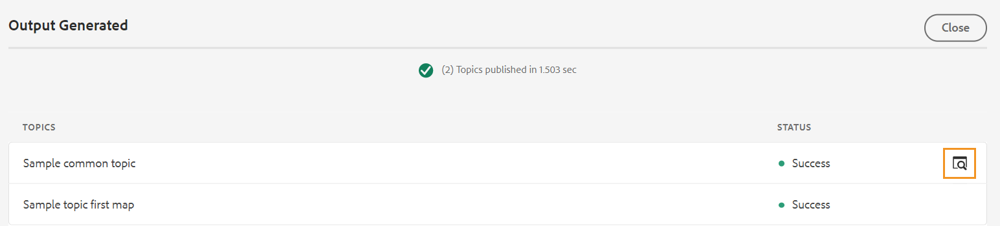

# Cree ajustes preestablecidos de salida desde el editor web {#id218CL400JW3}

Realice los siguientes pasos para crear ajustes preestablecidos de salida para el mapa DITA:

1. En la interfaz de usuario de Assets, vaya al archivo de asignación que desee editar.

1. Para obtener un bloqueo exclusivo en el archivo de asignación, selecciónelo y haga clic en **Desproteger**.

1. Seleccione la opción **Editar temas** en el menú de acción del archivo de asignación.

   El archivo de asignación se abre para editarlo en el Editor Web.

   >[!NOTE]
   >
   > Puede añadir o eliminar cualquier tema del mapa mediante el Editor de mapas avanzado. Para obtener más información, consulte [Trabajar con el editor de mapas avanzado](map-editor-advanced-map-editor.md#).

1. En la ficha **Output**, seleccione el icono + para crear un ajuste preestablecido de salida para el mapa DITA.

   {width="350" align="left"}

1. Escriba el nombre del ajuste preestablecido en el cuadro de diálogo Agregar ajuste preestablecido y haga clic en **Agregar**.

1. Introduzca los siguientes detalles de configuración.

   1. Seleccione las opciones necesarias en la ficha **General**. Puede elegir crear un ajuste preestablecido de salida con o sin condiciones. También puede utilizar un archivo DITVAL. AEM Guides también permite seleccionar una línea de base para publicar una versión específica del mapa DITA.
   1. Escriba los detalles del sitio de AEM en la ficha **AEM**. **Sitio** muestra la lista de AEM Sites disponible en su repositorio de AEM. **Categoría**, **Plantilla de sección** y **Plantilla de artículo** son los componentes estructurales usados para organizar el aspecto de tu resultado. Están predefinidas en la plantilla del sitio de AEM.

      >[!NOTE]
      >
      > Actualice cada lista desplegable para obtener la clasificación adicional en la siguiente lista desplegable.

   1. En la ficha **Artículos**, seleccione los temas para los que desea generar el resultado.
1. Seleccione el icono **Generar ajuste preestablecido** en la parte superior para generar el resultado.

   {width="800" align="left"}

1. Verá el estado del proceso de generación de resultados. La columna **Temas** enumera los temas para los que se genera la salida, mientras que la columna **Estado** muestra el estado de publicación de cada tema.

   Para ver el resultado, pase el puntero del mouse (ratón) sobre el tema y haga clic en Ver resultados.

   {width="800" align="left"}

>[!NOTE]
>
> También puede Editar, Cambiar nombre, Duplicar o Eliminar un ajuste preestablecido de salida existente desde el menú Opciones.

{width="550" align="left"}

**Tema principal:**&#x200B;[ Publicación basada en artículos desde el editor web](web-editor-article-publishing.md)
