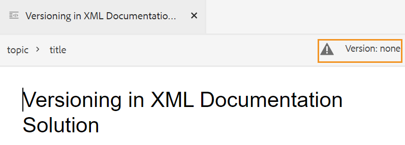

# Crear temas {#id2056AL00O5Z}

AEM Guides permite crear temas DITA de tipo: tema, tarea, concepto, referencia, glosario, DITAVAL, etc. Además de crear temas basados en las plantillas predeterminadas, también puede definir las plantillas personalizadas. Estas plantillas deben añadirse al perfil de carpeta para que se muestren en la selección de plantillas de modelo y en el editor web.

Tenga en cuenta que la configuración de Perfil global y de carpeta solo está disponible para los usuarios administrativos de nivel de carpeta. Para obtener más información sobre la configuración de perfiles globales y de nivel de carpeta, consulte *Configuración de plantillas de creación* en Instalar y configurar Adobe Experience Manager Guides para su configuración.

Siga estos pasos para crear un tema:

1. En la interfaz de usuario de Assets, vaya a la ubicación en la que desea crear el tema.

1. Para crear un tema nuevo, haga clic en **Crear** \> **Tema DITA**.

1. En la página Modelo, seleccione el tipo de documento DITA que desea crear y haga clic en **Siguiente**.

   {width="800"}

   De forma predeterminada, AEM Guides proporciona las plantillas de temas DITA más utilizadas. Puede configurar más plantillas de temas según sus requisitos organizativos. Consulte *Configuración de plantillas de creación* en Instalación y configuración de Adobe Experience Manager Guides para su configuración.

   >[!NOTE]
   >
   > En la vista de lista de la IU de Assets, el tipo de tema DITA se muestra en la columna Tipo como Tema, Tarea, Concepto, Referencia, Glossentry o DITAVAL. El mapa DITA se muestra como Mapa.

1. En la página Propiedades, especifique el documento **Título**.

1. \(Opcional\) Especifique el archivo **Nombre**.

   Si el administrador ha configurado un nombre de archivo automático basado en la configuración de UUID, no verá la opción para especificar el nombre del archivo. Se asigna automáticamente un nombre de archivo basado en UUID al archivo.

   Si la opción de nomenclatura de archivos está disponible, también se sugiere automáticamente el nombre en función del **Título** del documento. Si desea especificar manualmente el nombre del documento, asegúrese de que **Name** no contenga espacios, apóstrofos ni llaves y termine con .xml o .dita. De forma predeterminada, AEM Guides reemplaza todos los caracteres especiales por guiones. Consulte la sección Nombres de archivo en la Guía de prácticas recomendadas para conocer las prácticas recomendadas sobre la nomenclatura de archivos DITA.

1. Haga clic en **Crear**. Aparecerá el mensaje Tema creado.

   Puede elegir abrir el tema para editarlo en el Editor Web o guardar el archivo del tema en el repositorio de AEM.

   A cada tema nuevo que cree desde la interfaz de usuario de Assets **Create** \> **DITA Topic** o el Editor web se le asigna un ID de tema único. El valor de este ID es el propio nombre de archivo. Además, un nuevo documento se guarda como la última copia de trabajo del tema en DAM. Hasta que guarde una revisión de un tema recién creado, no verá ningún número de versión en el Historial de versiones. Si abre el tema para editarlo, la información de la versión se muestra en la esquina superior derecha de la pestaña del archivo de tema:

   {width="550"}

   La información de versión de un tema recién creado se muestra como *none*. Al guardar una nueva versión, se le asigna un número de versión como 1.0. Para obtener más información acerca de cómo guardar una nueva versión, vea [Guardar como nueva versión](web-editor-features.md#save-as-new-version-id209ME400GXA).

>[!NOTE]
>
> Si el administrador ha configurado el Editor Web para que desproteja los archivos antes de editarlos, no podrá editar un archivo hasta que lo desproteja. Del mismo modo, si está configurado, se le pedirá que proteja cualquier archivo desprotegido antes de cerrarlo.

>[!IMPORTANT]
>
> Una vez creado el tema DITA, siga guardando los cambios en la copia de trabajo y cree una nueva versión una vez que haya completado las actualizaciones del tema.

**Tema principal:**[ Crear y previsualizar temas](create-preview-topics.md)
