# Conozca las funciones del editor web {#id176NC500V5Z}

En esta sección se describen las distintas características disponibles en el Editor Web. Podemos dividir el Editor Web en las siguientes secciones o áreas:

- [Barra de herramientas principal](#id2051EA0G05Z)
- [Barra secundaria](#id2051EA0J0Y4)
- [Panel izquierdo](#id2051EA0M0HS)
- [Área de edición de contenido](#id2051EB000UI)
- [Panel derecho](#id2051EB003YK)

La siguiente subsección detalla las distintas secciones del editor web.

## Barra de herramientas principal {#id2051EA0G05Z}

La barra de herramientas principal se encuentra en la parte superior de la interfaz del Editor Web y proporciona funciones de nivel de archivo y varios modos de creación disponibles en el Editor Web. Las funciones disponibles en la barra de herramientas superior se explican de la siguiente manera:

**Guardar todo** - 

Guarda los cambios realizados en todos los temas abiertos. Si tiene varios temas abiertos en el editor web, al hacer clic en **Guardar todo** o usar las teclas de método abreviado **Crtl**+**S** se guardan todos los documentos en un solo clic. No es necesario guardar cada documento individualmente.

>[!NOTE]
>
> La operación Guardar no crea una nueva versión de los temas. Para crear una nueva versión, elija Guardar como nueva versión.

**Guardar como nueva versión** - 

Guarda los cambios realizados en el tema y también crea una nueva versión. Si está trabajando en un tema recién creado, la información de la versión se mostrará como **none**.

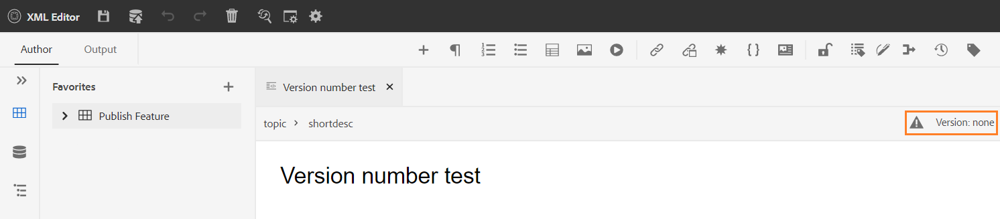{width="800" align="left"}

El número de versión cambia con cada nueva versión que se crea para el tema o el archivo de asignación.

Cuando elige guardar un tema o asignación mediante **Guardar como nueva versión**, aparece el siguiente cuadro de diálogo:

{width="300" align="left"}

Escriba comentarios y etiquetas de versión para identificar los cambios y haga clic en **Guardar** para crear una nueva versión del archivo.

Cuando elige *Guardar como nueva versión*, la primera versión del tema se crea en DAM, que también se convierte en la versión activa del tema. Posteriormente, si vuelve a una versión anterior del tema, esta se convierte en la versión activa actual del tema.

Si el administrador tiene etiquetas de versión preconfiguradas, verá esas etiquetas en una lista desplegable. Puede elegir una etiqueta de la lista de etiquetas disponibles y guardar el documento.

{width="300" align="left"}

Al guardar un tema, puede agregar un comentario que especifique los cambios realizados en el tema. Este comentario se muestra en el Historial de versiones del tema.

Si el tema está en revisión, los revisores recibirán una notificación que indica que hay disponible una versión más reciente del tema. Pueden acceder fácilmente a la última revisión del documento y seguir revisando la última versión del tema.

Cuando pasa el puntero sobre el título de un tema, se muestra la ruta de acceso del archivo y el número de versión.

{width="800" align="left"}

>[!NOTE]
>
> Una vez que haya disponible una versión del tema, también puede agregarle etiquetas. Estas etiquetas se pueden utilizar para crear una línea de base para publicar una versión específica del documento. Para obtener más información acerca del uso de etiquetas en los temas, vea [Usar etiquetas](web-editor-use-label.md#).

**Deshacer y rehacer** -  / 

Deshacer o rehacer la última acción.

**Eliminar elemento** - 

Elimina el elemento seleccionado actualmente o el elemento donde está colocado el cursor.

**Buscar y reemplazar** - 

La función Buscar y reemplazar está disponible en los modos de vista Autor y Source. La barra de texto Buscar y reemplazar aparece en la parte inferior del área de edición del tema. Puede usar las teclas de método abreviado **CTRL**+**F** para invocar la barra Buscar y reemplazar.

{width="800" align="left"}

Con el icono de configuración \(\), puede alternar las opciones de búsqueda **Ignorar mayúsculas y minúsculas** y **Sólo palabras completas**. Para realizar la búsqueda sin distinción entre mayúsculas y minúsculas, active \(o seleccione\) la opción **Ignorar mayúsculas y minúsculas**. De lo contrario, si desea realizar la búsqueda que distingue entre mayúsculas y minúsculas, desactive \(o deseleccione\) la opción **Ignorar mayúsculas y minúsculas**. También puede elegir buscar una palabra entera.

La búsqueda es instantánea, lo que significa que a medida que escribe la frase o palabra de búsqueda en el campo **Buscar**, el término se busca y selecciona inmediatamente en el tema. Del mismo modo, para reemplazar un texto en el tema, escribe el término de búsqueda y su reemplazo en los campos respectivos y haz clic en el botón **Reemplazar** o **Reemplazar todo**.

En la vista Source, Buscar y reemplazar es extremadamente útil para buscar un elemento o atributo específico. Por ejemplo, si desea reemplazar el valor del atributo `@product`, se puede realizar fácilmente desde la vista de Source. La vista Autor no permite buscar basándose en un atributo o elemento. Sin embargo, debe tener cuidado al usar la característica **Reemplazar todo**, ya que podría sobrescribir el código XML.

**Configuración del editor** - 

La configuración del editor solo está disponible para usuarios administrativos. Con las preferencias, un administrador puede configurar las siguientes opciones:

>[!NOTE]
>
> Si va a actualizar cualquier configuración predeterminada, debe volver a abrir los documentos para que los cambios entren en vigor.

- **General**: la configuración General permite configurar el diccionario para utilizarlo con el Editor Web. Esta ficha contiene tres secciones: **Revisión ortográfica**, **Condición** y **Creación**.

  {width="650" align="left"}

   - **Corrección ortográfica**: Hay dos opciones: **Corrección ortográfica de AEM** y **Corrección ortográfica del explorador**. De forma predeterminada, el editor utiliza la función de revisión ortográfica del explorador, donde la revisión ortográfica se realiza mediante el diccionario integrado del explorador. Puede cambiar al corrector ortográfico de AEM para utilizar el diccionario de AEM, que también se puede personalizar para agregar la lista de palabras personalizada. Para obtener más información sobre cómo personalizar el diccionario de AEM, consulte la sección *Personalizar el diccionario predeterminado de AEM* en Instalar y configurar Adobe Experience Manager Guides as a Cloud Service.


   - **Condición**

      - **Resaltar texto condicional en la vista de autor**: seleccione esta opción para resaltar el texto condicional en la vista de autor. El contenido condicional se resalta con el color definido para la condición.

      - **Validar con atributos de condición**: seleccione esta opción para permitir la validación de los valores definidos para los atributos. Esto evita que añada cualquier valor incorrecto.

      - **Mostrar la clave con el título en el panel Esquema del asunto**: seleccione esta opción para mostrar las claves junto con los títulos en el esquema del asunto. Si no selecciona esta opción, solo se muestran los títulos. Por ejemplo, aquí las teclas &quot;os&quot;, &quot;audience&quot; y &quot;other&quot; también se muestran junto con los títulos.

        {width="550" align="left"}

      - **Mostrar esquema de asunto en el panel Condiciones**: seleccione esta opción para ver un esquema de asunto en el panel Condiciones. Si anula la selección de esta opción, las condiciones definidas se muestran en el panel Condiciones.

   - **Creación**

      - **Habilitar Reemplazar todo**: seleccione esta opción para ver el icono Reemplazar todo en el panel Buscar y reemplazar.


   - **Citas**
Cambiar el estilo de las citas. Elija el estilo de cita de la lista desplegable que desee utilizar en su proyecto. Para obtener más información, consulte [Cambiar estilos de citas](./web-editor-apply-citations.md#change-citation-style).


**Paneles**: esta opción controla los paneles que se muestran en el panel izquierdo del editor. Puede alternar el conmutador para mostrar u ocultar el panel deseado.

{width="650" align="left"}

>[!NOTE]
>
> Si se ha configurado un panel personalizado, también aparecerá en la lista de paneles. Puede alternar el conmutador para mostrar u ocultar el panel personalizado. Para obtener más información sobre la configuración, consulte la sección *Configuración de un panel personalizado en el panel izquierdo* en Instalar y configurar Adobe Experience Manager Guides as a Cloud Service.

- **Lista de elementos**: como administrador, puede controlar la lista de elementos que un autor puede insertar mediante la ventana emergente [Insertar elemento](#id204SG30105Z) y también definir el nombre para mostrar del elemento. La configuración Lista de elementos permite especificar el nombre del elemento según las especificaciones DITA y una etiqueta que desee utilizar en lugar del nombre de elemento definido DITA:

  {width="650" align="left"}

En la captura de pantalla anterior, al elemento `b` se le ha dado una etiqueta de negrita, a `codeblock` se le ha dado una etiqueta de bloque de código junto con algunos otros elementos. Si selecciona la opción **Usar solo elementos superiores**, solo se mostrarán en la ventana emergente Insertar elemento los elementos válidos \(en el punto de inserción actual\) de esta lista.

En la siguiente captura de pantalla, solo se muestran 3 de los 4 elementos configurados de la captura de pantalla anterior en el contexto actual:

{width="300" align="left"}

- **Lista de atributos**: de forma similar a la Lista de elementos, puede controlar la lista de atributos y sus nombres para mostrar que se mostrarán en la lista de atributos de un elemento. En la siguiente captura de pantalla, solo se han configurado 3 atributos para que se muestren en la lista de atributos de un elemento:

  {width="650" align="left"}

  Con esta configuración, cuando intenta agregar un atributo a un elemento, solo ve la lista de atributos configurados en la lista.

  {width="300" align="left"}

- **Perfil de publicación**: contiene los perfiles de publicación que se pueden usar para publicar la salida de **Knowledge Base**. Puede crear un nuevo perfil para una base de conocimiento de Target. Por ejemplo, Salesforce o ServiceNow.

   - **Crear un perfil de publicación de Salesforce**

     **Requisitos previos**

      - Cree una aplicación conectada de para Salesforce. Para obtener más información, consulte [Habilitar la configuración de OAuth para la integración de API](https://help.salesforce.com/s/articleView?id=sf.connected_app_create_api_integration.htm&amp;type=5).

      - Al configurar la aplicación conectada, asegúrese de lo siguiente:

         - Especifique la llamada de retorno.

           `URL: http://<server name>:<port>/bin/dxml/thirdparty/callback/salesforce`

         - Seleccione los siguientes ámbitos de OAuth:
            - Acceso completo (completo)
            - Seleccione Administrar datos de usuario mediante API

  Una vez configurada la aplicación, Salesforce proporciona **clave del consumidor** y **secreto del consumidor**.

  Se pueden utilizar para crear el perfil de publicación de Salesforce.


   - Para crear un perfil de publicación de Salesforce, seleccione la base de conocimiento **Salesforce** en la lista desplegable **Tipo de servidor**. Introduzca un Nombre de perfil. En la **dirección URL del sitio**, escriba el sitio del consumidor que usaría para publicar la salida y, a continuación, agregue la **clave del consumidor** y el **secreto del consumidor** proporcionados por el sitio del consumidor de Salesforce. A continuación, **Valide** y **guarde** el perfil recién creado.

     {width="550" align="left"}

     >[!NOTE]
     >
     >Para configurar un proxy para Salesforce en Experience Manager Guides, utilice Configuración proxy de componentes HTTP de Apache en AEM. Obtenga información sobre cómo [configurar el proxy para AEM Link Checker](https://helpx.adobe.com/experience-manager/kb/How-to-configure-proxy-for-the-AEM-Link-Checker-AEM.html).


   - **Crear un perfil de publicación ServiceNow**

     **Requisitos previos**

     Configure el servidor de ServiceNow para cargar los recursos.
      - Conéctese al servidor **ServiceNow**.
      - Vaya a **Propiedades del sistema** > **Seguridad**.
      - Desmarque la siguiente opción:

        **Esta propiedad debe estar configurada para activar la comprobación de tipo MIME para cargas (todas las versiones de Eureka y superiores). Activa (true) o desactiva (false) la validación de tipo MIME para los archivos adjuntos. Las extensiones de archivo configuradas mediante glide.attachment.extensions se comprobarán en busca del tipo MIME durante la carga.**

      - Haga clic en **Guardar**.

     Una vez configurada la aplicación, cree el perfil de publicación **ServiceNow**.
   - Para crear un perfil de publicación, seleccione ServiceNow Knowledge Base en la lista desplegable **Tipo de servidor**. Escriba un perfil **Name**. En la **URL de ServiceNow**, introduzca el sitio de consumidores que utilizaría para publicar la salida y, a continuación, agregue el **Nombre de usuario** y la **Contraseña** proporcionados por el sitio de consumidores de ServiceNow. A continuación, **Valide** y **guarde** el perfil recién creado.

     {width="550" align="left"}

  Una vez validado, puede seleccionar el perfil de publicación en los ajustes preestablecidos de salida de un mapa DITA y utilizarlo para generar la salida en el servidor **Salesforce** o **ServiceNow** que haya elegido.

  Obtenga más información sobre el ajuste preestablecido de salida [Knowledge Base](../user-guide/generate-output-knowledge-base.md).


- **Validación**: esta pestaña contiene opciones para configurar las validaciones de Schematron en el editor web. Puede activar las siguientes funciones:

   - **Ejecute la comprobación de validación antes de guardar el archivo**: Seleccione esta opción para ejecutar las validaciones de Schematron utilizando los archivos de Schematron seleccionados antes de cualquier operación de guardado. Puede añadir un archivo de Schematron haciendo clic en el icono +. Se muestran los archivos de Schematron seleccionados.

     >[!NOTE]
     >Los archivos de Schematron seleccionados persistirán para el perfil de carpeta seleccionado.

     {width="550" align="left"}
Esto evita que los usuarios guarden cualquier archivo que rompa una regla definida en los archivos de Schematron seleccionados. Si no se selecciona esta opción, el archivo no se validará antes de guardar los cambios.

   - **Permitir que todos los usuarios agreguen archivos de Schematron en el panel de validación**: seleccione esta opción para permitir que los usuarios agreguen cualquier archivo de Schematron en el panel Validación del Editor Web. Esto permite a los usuarios agregar archivos de Schematron y, a continuación, validar los temas con el archivo de Schematron. Si no se selecciona, el botón **Agregar archivo de Schematron** no está disponible para los usuarios en el **panel Validación** del Editor Web.


- **Atributos de visualización**: al igual que la Lista de atributos, puede controlar la lista de atributos que se mostrarán en la lista de atributos de un elemento. De manera predeterminada, se han configurado cuatro **Atributos de visualización**: audiencia, plataforma, producto y props para que se muestren en la lista de atributos de un elemento. También puede agregar un atributo de visualización mediante el icono **Agregar** de la parte superior. También puede eliminar cualquiera de los atributos de visualización mediante el icono **Delete**.

  Los atributos definidos para un elemento se muestran en las vistas Diseño y Esquema.

  {width="550" align="left"}

- **Traducción**: esta pestaña contiene las opciones para crear grupos de idiomas, propagar las etiquetas de origen a la versión de destino y limpiar el proyecto de traducción.
  {width="550" align="left"}

   - **Grupos de idiomas**: como administrador, puede crear un grupo de idiomas y utilizarlos como un conjunto para traducir el contenido.\
     Siga estos pasos para crear un nuevo grupo de idiomas:
      1. Seleccione el icono Agregar .
      1. Introduzca el nombre del grupo de idiomas. Cada idioma debe tener un nombre único. Puede ver un error si el campo de nombre está vacío o si el nombre no es único.
      1. Seleccione los idiomas en la lista desplegable. Puede seleccionar varios idiomas.

     Escriba los primeros caracteres del idioma o el código de idioma para filtrar los idiomas deseados. Por ejemplo, escriba &#39;en&#39; para filtrar todos los idiomas que contienen &#39;en&#39; al principio de su nombre o código.
      1. Seleccione **Listo** para agregar los idiomas seleccionados al grupo. Se muestran los idiomas. Cuando se agregan tres o más idiomas, se muestra **Mostrar más**. Puede seleccionar **Mostrar más** para ver todos los idiomas presentes en el grupo.

         >[!TIP]
         >
         > Cambie **Mostrar más** por **Mostrar menos** y ver solo algunos idiomas.

      1. Pase el ratón sobre los idiomas de un grupo para editar  o eliminar  los grupos de idiomas.
      1. Guarde la **configuración del editor**.

         >[!NOTE]
         >
         >Como usuario, puede ver los grupos de idiomas configurados en el perfil de carpeta.

   - **Propagar etiquetas de versión de origen a la versión de destino**: seleccione esta opción para pasar la etiqueta de la versión del archivo de origen al archivo traducido. Esta opción está desactivada de forma predeterminada.
   - **Limpieza del proyecto de traducción una vez finalizado**: seleccione esta opción para configurar los proyectos de traducción que se deshabilitarán o eliminarán automáticamente después de la traducción. De manera predeterminada, **Ninguno** está seleccionado, por lo que el proyecto existe después de la traducción.

     Puede desactivar los proyectos de traducción si desea utilizarlos más adelante. Al eliminar un proyecto, se eliminan permanentemente todos los archivos y carpetas presentes en el proyecto.


- **Metadatos**: puede controlar los metadatos de versión del tema y sus valores para que se muestren en el cuadro de diálogo **Historial de versiones**.  En la ruta de metadatos, especifique la ubicación de los nodos desde los que desea seleccionar los metadatos. También puede definir un nombre personalizado para los metadatos como etiqueta. Las propiedades predeterminadas son Título, Estado del documento y Etiquetas.

  Los metadatos se pueden seleccionar desde cualquier propiedad bajo el nodo `/jcr:content` del recurso, de modo que puede agregar la ruta de la propiedad como ruta de metadatos.


  Se muestra un error si la ruta de metadatos está en blanco. Si deja la etiqueta en blanco, se selecciona el último elemento como etiqueta.


  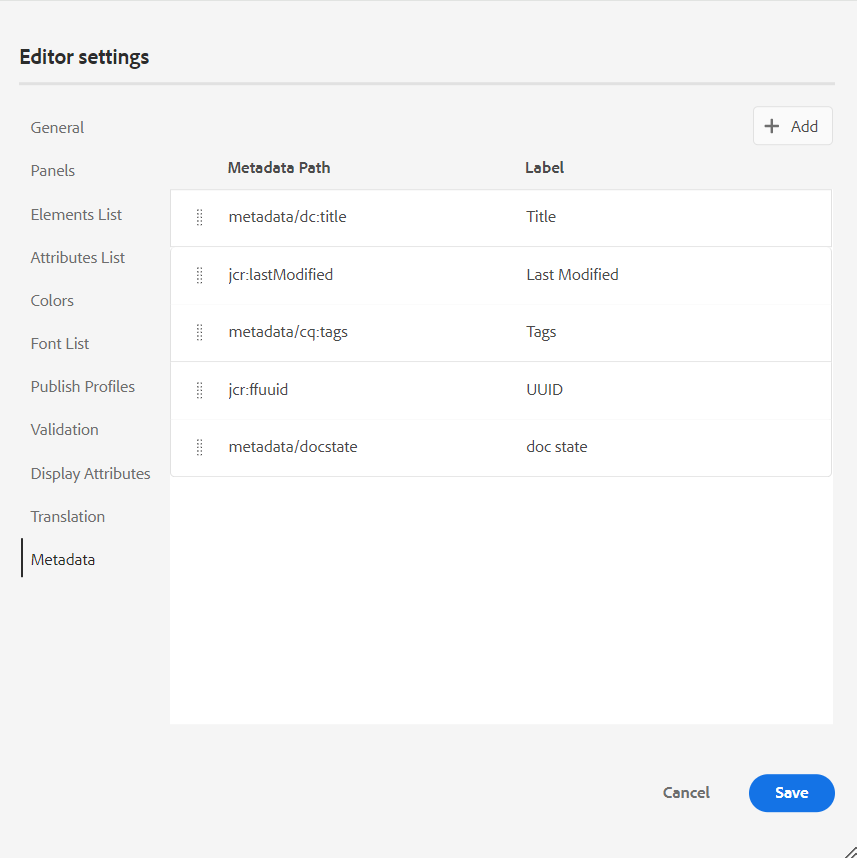{width="550" align="left"}

  *Configurar los metadatos del cuadro de diálogo **Historial de versiones**.*


  También puede definir el orden en que se muestran estas etiquetas de metadatos. Para cambiar el orden predeterminado de estas etiquetas, seleccione las barras de puntos para arrastrar y soltar las etiquetas en la ubicación deseada.
Las etiquetas de metadatos aparecen en la misma secuencia en el **Historial de versiones** del editor web.


**Preferencias de usuario** - 

Las preferencias de usuario están disponibles para todos los autores. Con las preferencias, un autor puede configurar las siguientes opciones:


- **General**: la ficha General permite configurar las siguientes opciones:

  {width="550" align="left"}

   - **Perfiles de carpeta**: el perfil de carpeta controla varias configuraciones relacionadas con atributos condicionales, plantillas de creación, ajustes preestablecidos de salida y configuraciones del Editor web. El perfil global se muestra de forma predeterminada. Además, si el administrador ha configurado perfiles de carpeta en el sistema, esos perfiles de carpeta también se muestran en la Lista de perfiles de carpeta.

     Las configuraciones del Editor Web que un administrador puede definir en el perfil de carpeta incluyen: personalización de la interfaz de usuario, incluidos los iconos de la barra de herramientas, el diseño del Editor Web, los fragmentos de código y el mapa raíz. Para obtener más información, consulte *Configuración de perfiles globales o de nivel de carpeta* en Instalar y configurar Adobe Experience Manager Guides as a Cloud Service.

     >[!NOTE]
     >
     > El nombre del perfil de carpeta actual se muestra como una etiqueta para el icono de preferencias de usuario en la barra de herramientas principal.

   - **Ruta básica**: de forma predeterminada, al acceder al repositorio de AEM desde el Editor web, se muestran los recursos desde la ubicación /content/dam. Es muy probable que la carpeta de trabajo esté compuesta por unas pocas carpetas dentro de la carpeta /content/dam/. Se necesitarían unos clics para llegar a la carpeta de trabajo cada vez. Puede establecer la Ruta base en la carpeta de trabajo y, a continuación, la Vista del repositorio le mostrará el contenido desde esa ubicación por adelantado. Esto reduce el tiempo para tener acceso a la carpeta de trabajo. Además, al insertar cualquier referencia o archivo multimedia en el tema, la ubicación de exploración de archivos comienza con la carpeta establecida en la Ruta base.

   - **Seleccionar mapa raíz**: seleccione un archivo de mapa DITA para resolver referencias clave o entradas del glosario. El mapa raíz seleccionado tiene la prioridad más alta para resolver las referencias clave. Para obtener más información, consulte [Resolver referencias clave](map-editor-other-features.md#id176GD01H05Z).

     >[!NOTE]
     >    
     > Si no desea usar ningún mapa raíz, asegúrese de que el campo **Seleccionar mapa raíz** esté vacío.

- **Aspecto**: seleccione los temas para la aplicación Editor Web y la vista de origen del área de edición de contenido.

  {width="550" align="left"}

   - **Ver archivos por**: seleccione la forma predeterminada de ver los archivos en el Editor Web. Puede ver la lista de archivos por títulos o nombres de archivo en los diversos paneles de la vista **Autor**.

     >[!NOTE]
     >
     > De forma predeterminada, los archivos se muestran por título en el Editor Web.

   - **Tema de aplicación**: puede elegir entre los temas **Claro** u **Oscuro** para la aplicación. En el caso del tema **Claro**, las barras de herramientas y los paneles utilizan un fondo de color gris claro. En el caso del tema **Oscuro**, las barras de herramientas y los paneles utilizan un fondo de color negro. Seleccione **Usar tema del dispositivo** para permitir que Experience Manager Guides seleccione los temas claro y oscuro en función del tema del dispositivo.  En todas las temáticas, el área de edición de contenido se muestra en fondo de color blanco en la vista **Autor**.

   - **Tema de la vista Source**: - Puedes elegir entre los temas **Claro** u **Oscuro** para el área de edición de contenido en la vista de origen. En el caso del tema **Claro**, el área de edición de contenido usa un fondo de color gris claro para la vista de origen, mientras que en el caso del tema **Oscuro**, usa un fondo de color negro. Seleccione **Usar tema del dispositivo** para permitir que Experience Manager Guides seleccione los temas claro y oscuro en función del tema del dispositivo.

   - **Buscar siempre archivos en el repositorio**: seleccione esta opción para mostrar la ubicación de un archivo en el repositorio mientras lo edita en el Editor Web.

   - **Mostrar indicador de espacio de no separación en el modo Autor**: seleccione esta opción para mostrar un indicador de los espacios de no separación al editarlo en el Editor Web. Está activada de forma predeterminada.

**Modos de autor, Source y vista previa**

Para obtener más información sobre los distintos modos de creación y visualización de documentos, consulte [Vistas del editor web](web-editor-views.md#).

## Barra secundaria {#id2051EA0J0Y4}

La barra de herramientas secundaria aparece al abrir un tema para editarlo en el Editor Web. Las funciones disponibles en la barra de herramientas secundaria se explican de la siguiente manera:

**Insertar elemento** - 

Inserta un elemento válido en la ubicación válida actual o siguiente. También puede usar el método abreviado de teclado ***Alt***+***Enter*** para abrir la ventana emergente Insertar elemento. Por ejemplo, si está editando un párrafo, en la ventana emergente **Insertar elemento** aparecerá una lista de elementos que se pueden insertar en el párrafo. Seleccione el elemento que desea insertar. Puede usar el teclado para desplazarse por la lista de elementos y presionar ***Intro*** para insertar el elemento requerido.

Puede ver dos tipos de elementos válidos:

- **Elementos válidos en la ubicación actual**: La lista muestra los elementos que puede insertar en la propia ubicación del cursor actual.

- **Elementos válidos fuera de la ubicación actual**: La lista muestra los elementos que puede insertar después de cualquiera de los elementos primarios del elemento actual dentro de la jerarquía de elementos.


Por ejemplo, si se encuentra dentro del elemento `<b>` en línea, puede insertar elementos como `<u>`, `<xref>`, `<i>` en la ubicación actual. Por el contrario, puede insertar elementos como `<table>` y `<topic>` fuera de la ubicación actual.

También puede escribir un carácter o cadena en el cuadro de búsqueda y buscar los elementos que comienzan con él.


{width="300" align="left"}

*Escriba &#39;t&#39; para buscar todos los elementos válidos que comiencen por &#39;t&#39;.*

Si está trabajando dentro de un elemento de bloque como `note`, utilice el icono Insertar elemento para insertar un nuevo elemento después del elemento `note`. En la siguiente captura de pantalla, se ha insertado un elemento de nota dentro del elemento p \(párrafo\):

{width="800" align="left"}

Si pulsa Intro en el elemento de nota, se creará un nuevo párrafo dentro del propio elemento de nota. Para insertar un nuevo elemento fuera de la nota, haga clic en el elemento p \(resaltado en la captura de pantalla\) en la ruta de exploración de elementos y haga clic en el icono Insertar elemento o presione ***Alt***+***Entrar*** para abrir la ventana emergente Insertar elemento. A continuación, seleccione el elemento deseado y pulse Intro para insertar el elemento seleccionado después del elemento de nota.

También puede añadir un elemento entre dos elementos cuando aparezca un cursor de bloque parpadeante.

{width="300" align="left"}

Por ejemplo, si está trabajando en un tema DITA y el cursor de bloque parpadea entre la descripción breve y el cuerpo, puede agregar el elemento `prolog` y, a continuación, agregar copyright, autor y otros detalles.

Otra forma de introducir un nuevo elemento es mediante el menú contextual. Haga clic con el botón derecho en cualquier lugar del documento para invocar el menú contextual. En este menú, elija **Insertar elemento** para mostrar el cuadro de diálogo **Insertar elemento** y elija el elemento que desea insertar.

{width="300" align="left"}

**Insertar párrafo** - 

Insertar elemento de párrafo en la ubicación válida actual o siguiente.

**Insertar o quitar lista numerada** - 

Crea una lista numerada en la ubicación válida actual o siguiente. Si está en una lista numerada y hace clic en este icono, el elemento se convierte en un párrafo normal.

**Insertar o quitar lista con viñetas** - 

Crea una lista con viñetas en la ubicación válida actual o siguiente. Si está en una lista con viñetas y hace clic en este icono, el elemento se convierte en un párrafo normal.

>[!NOTE]
>
>También puede seleccionar la opción **Split List** del menú contextual de un elemento de lista para dividir la lista actual y comenzar una nueva lista en el mismo nivel.

**Insertar tabla** - 

Inserta una tabla en la ubicación válida actual o siguiente. Haga clic en el icono Insertar tabla para abrir el cuadro de diálogo Insertar tabla:

{width="550" align="left"}

Puede especificar el número de filas y columnas necesarias en la tabla. Si desea mantener la primera fila como encabezado de tabla, seleccione la opción Definir primera fila como encabezado. Para añadir un título a la tabla, introdúzcalo en el campo Título.

Una vez insertada una tabla, puede modificarla mediante el menú contextual.

{width="550" align="left"}

Mediante el menú contextual de la tabla, puede:

- Insertar celdas, filas o columnas

- Combinar celdas en las direcciones derecha y abajo

- Dividir celdas horizontal o verticalmente

- Eliminar celdas, filas o columnas

- Crear un fragmento a partir de la tabla

- Generación de ID


También puede definir atributos en varias celdas, filas completas o columnas de una tabla. Por ejemplo, para alinear la celda de la tabla, arrastre y seleccione la celda requerida. En el panel Propiedades de contenido (a la derecha), la propiedad **Type** cambia a **Multiple Entry**.

1. En la sección **Atributos**, haga clic en **+Agregar**.
1. Seleccione el atributo `@valign` de la lista desplegable **Atributo**.
1. En la lista desplegable de valores, seleccione la alineación de texto que desee aplicar en las celdas de la tabla seleccionada.
1. Haga clic en **Agregar.**

{width="800" align="left"}

**Insertar imagen** - 

Inserta una imagen en la ubicación válida actual o siguiente. Haga clic en el icono Insertar imagen para abrir el cuadro de diálogo Insertar imagen y, a continuación, busque y seleccione la imagen que desee insertar.

>[!NOTE]
>
> También puede agregar una imagen arrastrándola y soltándola desde el sistema local en el artículo. En este caso, el archivo de imagen se agrega mediante el flujo de trabajo **Cargar Assets**.  Para obtener más información, consulte el flujo de trabajo **Cargar Assets** en la sección [Panel izquierdo](web-editor-features.md#id2051EA0M0HS).


{width="650" align="left"}

Puede agregar imagen/título de figura y texto alternativo para la imagen en el cuadro de diálogo Insertar imagen.

Puede buscar el archivo de imagen necesario introduciendo el nombre del archivo en la barra Type to Search de la parte superior y también filtrar los resultados de búsqueda por Path \(to search in\), Collections, File Type y Tags. Una vez encontrado el archivo de imagen necesario, seleccione el archivo y haga clic en Seleccionar para insertar la imagen en el documento. Puede insertar varios formatos de archivos de imagen, como `.png`, `.svg`, `.gif`, `.jpg`, `.eps`, `.ai`, `.psd`, etc.

Una vez insertada una imagen, puede cambiar la altura, la anchura, la ubicación y los atributos en el panel Propiedades del contenido. Haga clic en un archivo de imagen y, a continuación, realice cambios en el panel Propiedades de contenido en el carril derecho.

{width="800" align="left"}

El campo Source muestra el UUID del archivo de imagen insertado. Puede encontrar la ruta completa del archivo de imagen insertado pasando el puntero del ratón sobre el campo Source. La ruta se muestra en la información del objeto.

Puede cambiar el tamaño de una imagen proporcionando el valor Altura o Anchura para el archivo de imagen. La proporción de aspecto de la imagen se mantiene automáticamente. Si lo desea, también puede optar por no mantener la relación de aspecto del archivo de imagen haciendo clic en el icono de candado \(de Mantener relación de aspecto\) y proporcionando los valores de Altura y Anchura.

También puede especificar la configuración Ubicación para la imagen como En línea o Salto. Si decide utilizar la opción Colocación de rotura, puede elegir dónde alinear la imagen (izquierda, centro o derecha).

También puede agregar otras propiedades para un archivo de imagen seleccionando las propiedades requeridas en el campo **Atributos**.

>[!NOTE]
>
>También puede definir las áreas \(mapa de imagen\) en las que puede hacer clic en la imagen. Para obtener más información, consulte la descripción de la característica **Insertar/Editar mapa de imagen** en la sección [Panel izquierdo](web-editor-features.md#id2051EA0M0HS).

**Menú contextual para archivos de imágenes o multimedia**

También puede realizar algunas operaciones comunes para imágenes y archivos multimedia mediante el menú contextual. Haga clic con el botón derecho en cualquier lugar de la imagen para invocar el menú contextual.

El menú contextual proporciona opciones para cortar, copiar o pegar la imagen o el medio. Puede insertar un elemento antes o después del elemento seleccionado. También tiene la opción de cambiar el nombre o de anular el ajuste de un elemento. Puede localizar la imagen o el medio seleccionado en el repositorio o ver la vista previa del archivo en la interfaz de usuario de Assets.

Las otras opciones del menú contextual permiten copiar la ruta, editar un mapa de imagen, crear un fragmento o generar ID para el elemento seleccionado.

**Insertar multimedia** - 

Inserta diferentes tipos de archivos multimedia. Haga clic en el icono Insertar multimedia y elija el tipo de archivo que desea insertar. Los formatos multimedia admitidos son:

- Archivo de audio
- Archivo de vídeo
- YouTube
- Vimeo

Al seleccionar la opción Archivo de audio o vídeo, se muestra la vista del repositorio para buscar y seleccionar el archivo deseado. Si elige YouTube o Vimeo, aparece el cuadro de diálogo Insertar multimedia. Pegue el vínculo del archivo de vídeo en el campo Web Link y haga clic en Insert para añadir el vídeo en la ubicación válida actual o siguiente del documento.

>[!NOTE]
>
> Al agregar un vínculo de vídeo de YouTube, debe reemplazar la cadena `watch?v=` por `embed` en la dirección URL. Por ejemplo, para agregar un vínculo de vídeo de YouTube: `https://www.youtube.com/**watch?v**=WlIKQOrmZcs`, debe agregarlo como: `https://www.youtube.com/**embed/**WlIKQOrmZcs`. Este cambio garantiza que el vídeo se incruste en el sitio de AEM y en la salida de PDF.

También puede agregar el archivo de audio o vídeo desde el cuadro de diálogo Insertar multimedia. Seleccione la opción Archivo de audio/vídeo y haga clic en el icono Examinar para iniciar la vista del repositorio. Seleccione el archivo de audio o vídeo del repositorio y haga clic en Seleccionar para añadir el vínculo del archivo en el campo Archivo de audio o vídeo. Si elige un archivo de vídeo, también se mostrará una vista previa del archivo en el área de Vista previa. Puede reproducir el archivo de vídeo para ver su previsualización.

{width="650" align="left"}

**Insertar referencia cruzada** - 

Insertar referencias de tipo: referencia de contenido, referencia de clave de contenido, referencia de clave, referencia de archivo, vínculo web o vínculo de correo electrónico.

Haga clic en el icono **Seleccionar archivo** \(para referencia de contenido y referencia de archivo\) o en el icono **Seleccionar mapa** \(para referencia de clave de contenido y referencia de clave\) y seleccione el archivo o contenido deseado al que desee vincular.

{width="650" align="left"}

En el documento se agrega un vínculo de la referencia seleccionada. El menú contextual del vínculo le ofrece las siguientes opciones:

- **Insertar elemento**: muestra una lista de elementos válidos que puede insertar en un contexto determinado.
- **Copiar UUID**: copia el UUID de la referencia insertada.
- **Copiar ruta**: copia la ruta de acceso completa de la referencia insertada.
- **Crear fragmento**: crea un fragmento reutilizable a partir de la referencia insertada.
- **Generar ID**: genera un ID único para la referencia insertada.

También puede buscar utilizando el UUID del archivo al que desee hacer referencia. En los vínculos Contenido y Referencia clave, introduzca el UUID del archivo al que desea vincular y el archivo se buscará y mostrará automáticamente en la sección Vista previa. Cuando especifique el UUID del archivo, no es necesario mencionar explícitamente la extensión de archivo para los archivos .xml. La extensión .xml se anexa automáticamente al UUID.

{width="650" align="left"}

Si el administrador ha habilitado la opción UUIDs en *XMLEditorConfig*, verá el UUID del contenido referenciado en la propiedad **Link**.

{width="800" align="left"}

>[!NOTE]
>
> Si la opción **Habilitar UUIDs** no está habilitada, se muestra la ruta relativa del contenido al que se hace referencia.

>[!IMPORTANT]
>
> Aunque la ruta relativa del contenido al que se hace referencia se muestra en la propiedad **Link**, internamente el vínculo se crea mediante el UUID del contenido al que se hace referencia.

>[!TIP]
>
> Consulte la sección Referencias en la guía de prácticas recomendadas para conocer las prácticas recomendadas sobre las referencias al contenido.

**Filtrar búsqueda**

Puede buscar texto en los archivos presentes en la ruta seleccionada del repositorio de AEM. Por ejemplo, &quot;general&quot; se busca en la siguiente captura de pantalla. También puede limitar la búsqueda mediante filtros mejorados. Puede buscar todos los ficheros DITA, como los temas DITA y los mapas DITA, presentes en la ruta seleccionada.

Puede buscar archivos que no sean DITA, como los archivos de imagen, multimedia y documentos de la ruta seleccionada. También se pueden buscar valores específicos en los atributos de elementos DITA. También puede buscar archivos que el usuario especificado haya desprotegido.

{width="650" align="left"}

>[!NOTE]
>
> El administrador del sistema también puede configurar los filtros de texto y mostrar u ocultar otros filtros. Para obtener más información, consulte Configuración de filtros de texto en la sección Instalación y configuración de Adobe Experience Manager Guides as a Cloud Service.

Se muestra la lista de archivos filtrados que contienen el texto buscado. Por ejemplo, en la captura de pantalla anterior se enumeran los archivos que contienen el texto &quot;general&quot;. También puede obtener una vista previa del contenido del archivo.

**Insertar contenido reutilizable** - 

Reutilice el contenido de cualquier otro documento del proyecto. Puede insertar contenido vinculándolo directamente al contenido de un archivo o usando una referencia de clave; consulte [Resolver referencias de clave](map-editor-other-features.md#id176GD01H05Z). Al hacer clic en el icono Insertar contenido reutilizable, aparece el cuadro de diálogo Reutilizar contenido:

{width="650" align="left"}

En el cuadro de diálogo Reutilizar contenido (Reuse Content), seleccione Fichero DITA (DITA file for file references) o el fichero de mapa DITA que contiene las referencias clave. Una vez seleccionado, el tema o las referencias clave se muestran en el cuadro de diálogo. Puede seleccionar el ID o la clave del tema que desea insertar y hacer clic en Listo para insertar el contenido dentro del tema.

Para insertar una referencia de contenido, también puede introducir el UUID del archivo y el contenido reutilizable de ese archivo se muestra en la sección Vista previa.

En función de la configuración para insertar vínculos, puede ver el UUID del contenido insertado o la ruta relativa en el panel Propiedades o en la vista de código de Source. El vínculo siempre se crea con el UUID del contenido al que se hace referencia. Consulte Configuración de vínculos basados en UUID en Instalación y configuración de Adobe Experience Manager Guides as a Cloud Service.

>[!NOTE]
>
> Para agregar contenido antes o después del contenido referido, usa las teclas de flecha *Alt*+*Izquierda* o Alt+*Derecha* para mover el cursor a la ubicación deseada.

También puede incrustar el contenido referido dentro del tema haciendo clic con el botón secundario en el contenido referido y eligiendo **Reemplazar referencia por contenido** del menú contextual.

**Insertar caracteres especiales** - 

Inserta caracteres especiales en el tema. Haga clic en el icono Insertar carácter especial para abrir el cuadro de diálogo Insertar carácter especial.

>[!NOTE]
>
> AEM Guides proporciona cuadros de diálogo móviles y de tamaño variable. Se puede cambiar el tamaño de los cuadros de diálogo que tienen dos líneas cruzadas en la esquina inferior derecha. A continuación, se muestran las líneas cruzadas del cuadro de diálogo Carácter especial.

{width="550" align="left"}

En el cuadro de diálogo Insertar carácter especial, puede buscar un carácter especial utilizando su nombre. Todos los caracteres especiales se almacenan en varias categorías. Utilice la lista desplegable Seleccionar categoría y seleccione una categoría. Se muestran los caracteres especiales disponibles en la categoría seleccionada. Puede navegar por la lista de caracteres especiales con las teclas de dirección o hacer clic en el carácter que desee insertar. El nombre y el código hexadecimal del carácter especial seleccionado se muestran debajo de la lista. Haga clic en Insertar para insertar el carácter seleccionado en el documento.

**Insertar palabra clave** - 

Palabra clave Insert definida en el mapa DITA. Haga clic en el icono Insertar palabra clave para abrir el cuadro de diálogo Referencia de clave.

{width="550" align="left"}

Las palabras clave se muestran en orden alfabético y también puede buscar palabra clave\(s\) escribiendo una cadena de búsqueda en el cuadro Buscar. El resultado de la búsqueda devolverá las palabras clave que contienen la cadena en ID o Value. Las palabras clave definidas en el mapa DITA se muestran en este cuadro de diálogo. Elija la palabra clave que desee insertar y haga clic en **Insertar**.

También puede cambiar los atributos de la palabra clave insertada haciendo clic con el botón derecho en la palabra clave y seleccionando la opción Atributos. Se abre el cuadro de diálogo Atributos para palabra clave:

{width="550" align="left"}

Puede cambiar los atributos de la palabra clave o agregar un nuevo atributo a la palabra clave.

**Insertar fragmento** - 

Insertar un fragmento en la ubicación válida actual o siguiente. Para que esta función funcione, debe tener fragmentos definidos en el sistema. Para obtener más información sobre cómo agregar un fragmento, consulte la descripción de la característica **Fragmento** en la sección [Panel izquierdo](web-editor-features.md#id2051EA0M0HS).

Al hacer clic en el icono Insertar fragmento de código, se muestra el catálogo Insertar fragmento de código. El catálogo distingue entre contextos, lo que indica que sólo mostrará los fragmentos si están permitidos en la ubicación actual.

En el siguiente ejemplo se muestran dos fragmentos preconfigurados: Advertencia y Error que se pueden insertar en la ubicación actual del documento.

{width="300" align="left"}

Al elegir un fragmento de la lista, éste se inserta en la ubicación válida actual o siguiente del documento. La siguiente captura de pantalla muestra el fragmento de error insertado en el documento:

{width="400" align="left"}

**Insertar/Editar mapa de imagen** - 

Inserta un mapa de imagen en la imagen seleccionada. Una imagen con áreas en las que se puede hacer clic y que vinculan temas o páginas web se denomina mapa de imagen.

Seleccione una imagen en el tema actual y haga clic en el icono Insertar/Editar mapa de imagen para abrir el cuadro de diálogo Insertar mapa de imagen.

{width="650" align="left"}

Elija la forma preferida Rectángulo , Círculo  o Polígono  para definir un área sobre una imagen que desee utilizar como vínculo. Después de definir un área, aparece el cuadro de diálogo Referencia en el que debe especificar el vínculo al contenido interno o externo:

{width="650" align="left"}

Si las áreas se superponen, puede hacer que la forma avance o retroceda haciendo clic en el icono correspondiente de la barra de herramientas. También puede quitar un área seleccionándola y haciendo clic en el icono Eliminar. Al hacer doble clic en un área, se abre el cuadro de diálogo Referencia, en el que puede cambiar el vínculo de destino. Una vez que haya marcado las áreas requeridas en la imagen, guarde los cambios haciendo clic en Listo.

**Desproteger/Proteger** - / 

Desprotege o protege el archivo actual. La desprotección de un archivo proporciona al usuario acceso de escritura exclusivo al archivo. Cuando el archivo está protegido, los cambios se guardan en la versión actual del archivo.

Si está en la vista Mapa y expande el mapa principal, puede retirar todos los archivos del mapa con un solo clic. Simplemente expanda el archivo de asignación principal y seleccione el archivo principal, lo que resulta en la selección de todos los archivos dentro del mapa. A continuación, puede seleccionar **Desproteger**  para bloquear todos los archivos del mapa.

>[!NOTE]
>
> Cuando protege un archivo que tiene cambios no guardados, se le pide que guarde los cambios. Si no guarda los cambios, solo se protege el archivo.

La información sobre herramientas para Proteger/Desproteger está determinada por la propiedad title del archivo `ui_config.json`.

Para obtener más información, vea [Configurar el título de los iconos Proteger y Desproteger](/help/product-guide/install-guide/conf-checkin-checkout-title.md) en la Guía de instalación y configuración On-Premise.


**Alternar vista de etiquetas** - 

Las etiquetas son indicaciones visuales que indican los límites de un elemento. Un límite de elemento marca el principio y el final de un elemento. A continuación, puede utilizar estos límites como una pista visual para colocar el punto de inserción o seleccionar el texto dentro de un límite. Si desea insertar otro elemento antes o después de un elemento del documento, puede colocar el punto de inserción antes o después del límite de apertura o cierre del elemento.

La siguiente captura de pantalla muestra un documento con la Vista de etiquetas activada:

{width="650" align="left"}

Las siguientes operaciones se pueden realizar en un documento con la Vista de etiquetas activada:

- **Seleccionar un elemento**: haga clic en la etiqueta de apertura o cierre de un elemento para seleccionar su contenido.

- **Expandir o contraer etiquetas**: haga clic en el signo + o - de una etiqueta para expandirla o contraerla.

- **Usar el menú contextual**: El menú contextual proporciona opciones para cortar, copiar o pegar el elemento seleccionado. También puede insertar un elemento antes o después del elemento seleccionado. Las demás opciones le permiten Generar ID o abrir el panel Propiedades del elemento seleccionado.

- **Arrastrar y soltar elementos**: seleccione la etiqueta de un elemento y arrástrela y suéltela fácilmente en el documento. Si la ubicación de colocación es una ubicación válida donde el elemento está permitido, el elemento se coloca en la ubicación de colocación.


>[!NOTE]
>
> Si un usuario habilita la Vista de etiquetas desde el Editor web, permanecerá habilitada incluso en todas las sesiones. Esto significa que no tiene que volver a habilitar la Vista de etiquetas para acceder a ella más adelante.El valor predeterminado de Vista de etiquetas para una sesión de nuevo usuario está determinado por la propiedad tagsView del archivo ui\_config.json. Para obtener más información, consulte la sección *Configuración del valor predeterminado para la vista de etiquetas* en Instalar y configurar Adobe Experience Manager Guides as a Cloud Service.

**Habilitar/Deshabilitar el seguimiento de cambios** 

Puede realizar un seguimiento de todas las actualizaciones realizadas en un documento activando el modo Control de cambios. Después de habilitar el seguimiento de cambios, todas las inserciones y eliminaciones se capturan en el documento. Todo el contenido eliminado se resalta con Tachado y todas las inserciones se resaltan en texto de color verde. Además, también se obtienen las barras de cambios en el borde de la página del tema. De nuevo, se muestra una barra roja para el contenido eliminado y una barra verde para el contenido añadido. Si hay adición y eliminación en la misma línea, se muestran las barras verde y roja.

La siguiente captura de pantalla resalta el contenido eliminado e insertado junto con las barras de cambio:

{width="650" align="left"}

Un caso de uso típico del seguimiento de cambios en un documento puede ser para realizar una revisión por pares. Puede habilitar el seguimiento de cambios y compartir el documento para su revisión; a continuación, el revisor realizará los cambios con el control de cambios activado. Cuando reciba el documento, deberá disponer de un mecanismo para ver las actualizaciones sugeridas junto con una forma cómoda de aceptar o rechazar los cambios.

AEM Guides proporciona la función Cambios realizados que contiene información sobre las actualizaciones realizadas en el documento. La función Cambios rastreados proporciona información sobre qué actualizaciones se realizaron, quién las hizo y a qué hora. Con la función Cambios realizados, también puede aceptar o rechazar fácilmente las actualizaciones sugeridas en el documento.

Para acceder a la función, haga clic en el icono Cambios rastreados en el panel derecho.

{width="300" align="left"}

Al hacer clic en un cambio, se selecciona el contenido modificado en el documento. Puede aceptar un cambio seleccionando el icono Aceptar cambio o rechazarlo seleccionando el botón Rechazar cambio.

Si desea aceptar o rechazar todos los cambios con un solo clic, seleccione **Aceptar todo** o **Rechazar todo**.

>[!NOTE]
>
> El modo Vista previa permite ver el documento con o sin las marcas del contenido modificado. Para obtener más información, consulte el modo [Vista previa](web-editor-views.md#preview-mode-id19AAGL00163).

**Combinar** - 

Cuando se trabaja en un entorno de varios autores, resulta difícil realizar el seguimiento de los cambios realizados por los demás autores en un tema o mapa. La función Combinar le proporciona más control no sólo sobre la visualización de los cambios, sino también sobre los cambios que se conservan en la última versión del documento.

**Combinar archivos de tema**

Para combinar los cambios de un tema, realice los siguientes pasos:

1. Abra un tema en el Editor web.

1. Haga clic en **Combinar**.

   Aparecerá el cuadro de diálogo Combinar.

   {width="550" align="left"}

1. *\(Opcional\)* También puede examinar y seleccionar un nuevo archivo de otra ubicación del repositorio.

1. Seleccione la versión del archivo con la que desea comparar la versión actual del archivo.

1. En Opciones, elija:

   - **Control de cambios de la versión seleccionada**: esta opción muestra todas las actualizaciones de contenido en forma de seguimiento de cambios. A continuación, puede elegir aceptar o rechazar los cambios del documento de uno en uno o todos en una sola vez.

   - **Revertir a la versión seleccionada**: esta opción revierte la versión actual del documento a la versión seleccionada. Esta opción no le proporciona ningún control sobre qué contenido se acepta o rechaza.

1. Haga clic en **Listo**.

1. Si seleccionó la opción **Rastrear cambios desde la versión seleccionada**, todos los cambios de la versión seleccionada se mostrarán en la función Cambios rastreados del panel derecho.

   Puede optar por aceptar o rechazar todos los comentarios del panel Cambios realizados o aceptar o rechazar comentarios individuales.


**Combinar archivos de asignación**

Para combinar los cambios en un archivo de asignación, realice los siguientes pasos:

1. Abra un mapa en el Editor web.

1. Haga clic en **Combinar**.

   Aparecerá el cuadro de diálogo Combinar.

   {width="550" align="left"}

1. *\(Opcional\)* También puede examinar y seleccionar un nuevo archivo de otra ubicación del repositorio.

1. Seleccione la versión del archivo con la que desea comparar la versión actual del archivo.

1. En Opciones, elija:

   - **Control de cambios de la versión seleccionada**: esta opción muestra todas las actualizaciones de contenido en forma de seguimiento de cambios. A continuación, puede elegir aceptar o rechazar los cambios del documento de uno en uno o todos en una sola vez.

   - **Revertir a la versión seleccionada**: esta opción revierte la versión actual del documento a la versión seleccionada. Esta opción no le proporciona ningún control sobre qué contenido se acepta o rechaza.

1. Haga clic en **Listo**.

   1. Si seleccionó la opción **Rastrear cambios desde la versión seleccionada**, todos los cambios de la versión seleccionada se mostrarán en el panel Cambios rastreados \(a la derecha\).

      Puede elegir entre aceptar o rechazar todos los cambios del panel Cambios realizados o aceptar o rechazar cambios individuales en el archivo de asignación.


**Historial de versiones** - 


La característica **Historial de versiones** del Editor Web permite comprobar las versiones disponibles de los archivos DITA, compararlas y revertirlas a cualquier versión desde el propio editor.

En el historial de versiones, puede comparar el contenido y los metadatos de la versión actual (que también puede ser una copia de trabajo) con cualquier versión anterior del mismo archivo. También puede ver las etiquetas y los comentarios de las versiones comparadas.

Para acceder al historial de versiones y volver a una versión específica del tema, realice los siguientes pasos:

1. Abra un tema en el Editor web.

1. Haga clic en **Historial de versiones**.

   Aparece el cuadro de diálogo **Historial de versiones**.

   {width="550" align="left"}
   *Obtener una vista previa de los cambios en las distintas versiones de un tema.*

1. Elija una versión del tema con la que quiera comparar o revertir en la lista desplegable **Comparar con**.

   >[!NOTE]
   >
   > Si una versión tiene etiquetas aplicadas, también se muestran \(entre corchetes\) junto con el número de versión.


1. Habilite la opción **Ver etiquetas y comentarios** para ver las etiquetas y los comentarios aplicados a las versiones actuales y comparadas.

1. También puede ver la siguiente información en el cuadro de diálogo **Historial de versiones**:

   Pestaña **Vista previa**: el contenido recién agregado está en fuente verde y el contenido eliminado está en fuente roja.

   Pestaña **Metadatos**: los metadatos agregados recientemente están en fuente verde y los metadatos eliminados están en fuente roja.
   {width="550" align="left"}
   *Comparar los metadatos de distintas versiones en el historial de versiones.*

   >[!NOTE]
   >
   > El administrador del sistema puede cambiar los metadatos que se muestran desde la pestaña Metadatos en Configuración del editor.

   También puede ver los detalles de usuario y hora de la versión actual y la comparada.


1. Una vez que elija una versión en la lista desplegable, estará disponible la opción **Revertir a la versión seleccionada**. La ventana de vista previa muestra las diferencias entre la versión actual y la seleccionada del tema.


1. Haga clic en **Revertir a la versión seleccionada** para revertir la copia de trabajo con la versión seleccionada del tema.

   Aparecerá el cuadro de diálogo Revertir versión.

   {width="550" align="left"}

1. \(*Opcional*\) Proporcione un motivo para revertir a una versión anterior. También puede crear una nueva versión de la copia de trabajo activa del tema.

1. Haga clic en **Confirmar.**

   La copia de trabajo del archivo se revierte a la versión seleccionada. Si decide crear una nueva versión de la copia de trabajo activa, también se creará una nueva versión del fichero con todos los cambios de trabajo.


Al volver a una versión anterior, se muestra una señal visual que indica que la versión en la que está trabajando no es la más reciente.

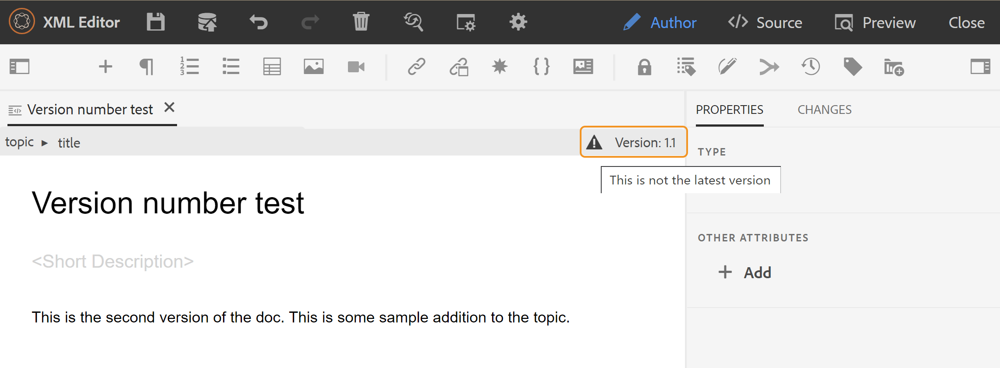{width="800" align="left"}

**Administración de etiquetas de versión** - 

Las etiquetas ayudan a identificar la fase en la que un tema en particular se encuentra en el DLC \(Ciclo de vida de desarrollo de documentos\). Por ejemplo, cuando esté trabajando en un tema, puede establecer la etiqueta como &quot;Aprobado&quot;. Una vez que se publica un tema y se pone a disposición de los clientes, se le puede asignar la etiqueta &quot;Publicado&quot;.

AEM Guides permite especificar etiquetas en formato de texto de forma libre o utilizar un conjunto de etiquetas predefinidas. La etiqueta personalizada permitiría a cualquier autor del sistema especificar una etiqueta según su elección. Esto proporciona flexibilidad; sin embargo, introduce etiquetas incoherentes en el sistema. Para resolver este problema, los administradores pueden configurar un conjunto de etiquetas predefinidas. Para obtener más información acerca de cómo configurar etiquetas predefinidas, vea *Configurar y personalizar el Editor Web XML* en Instalar y configurar Adobe Experience Manager Guides as a Cloud Service.

Estas etiquetas se muestran a los autores en forma de lista desplegable siempre que necesiten especificar una etiqueta. Esto garantiza que solo se utilicen etiquetas predefinidas y coherentes en el sistema.

Existen diferentes métodos para aplicar etiquetas a los temas: el panel [Historial de versiones](web-editor-use-label.md) en la interfaz de usuario de Assets, la interfaz de usuario de [Líneas bases](/help/product-guide/user-guide/generate-output-use-baseline-for-publishing.md) y el editor web. La función Etiqueta de versión del Editor web permite a los autores asignar etiquetas de forma rápida y sencilla a sus temas.

Para agregar etiquetas al tema desde el Editor Web, realice los siguientes pasos:

1. Abra un tema en el Editor web.

1. Haga clic en **Etiqueta de versión**.

   Aparecerá el cuadro de diálogo Administración de etiquetas de versión.

   {width="650" align="left"}

   El cuadro de diálogo Administración de etiquetas de versión se divide en dos partes: el panel izquierdo tiene una lista de versiones disponibles para el tema junto con la lista desplegable de etiquetas \(o un cuadro de texto para introducir una etiqueta\) y el panel derecho con una vista previa del tema.

1. Seleccione la versión a la que desee aplicar las etiquetas.

   Cuando elige una versión diferente del tema en la lista de versiones, el panel de vista previa muestra los cambios entre la versión actual y la seleccionada del tema

   >[!NOTE]
   >
   > Si ya se ha aplicado una etiqueta a una versión, esta se muestra junto al número de versión en la lista desplegable y debajo de la lista Seleccionar versión. Para quitar una etiqueta existente, haga clic en el icono \(**x**\) que hay junto a la etiqueta.

1. Si el administrador ha definido una lista de etiquetas, se le mostrará una lista desplegable de las etiquetas desde la que puede elegir las etiquetas que desea aplicar. Puede seleccionar varias etiquetas en la lista desplegable.

   De lo contrario, se muestra un cuadro de texto, en el que puede introducir las etiquetas que desee agregar al tema.

   >[!NOTE]
   >
   > No se puede aplicar la misma etiqueta en varias versiones de un tema. Si intenta asociar una etiqueta existente, se le proporcionará una opción para eliminarla de la versión existente y aplicarla en la versión seleccionada del tema.

1. Haga clic en **Agregar etiqueta**.

1. En el mensaje de confirmación Aplicar etiqueta, seleccione la opción **Mover etiqueta** para mover las etiquetas de una versión existente a la versión seleccionada. Si no selecciona esta opción y hay etiquetas asignadas a una versión diferente del tema, no se mueven a la versión del tema seleccionado. Estas etiquetas se omiten en el proceso de aplicación de etiquetas.


**Crear tarea de revisión** - 

Puede crear una tarea de revisión del tema o archivo de asignación actual directamente desde el Editor Web. Abra el archivo para el que desea crear la tarea de revisión y haga clic en Crear tarea de revisión para iniciar el proceso de creación de la revisión.

>[!NOTE]
>
> También puede crear una tarea de revisión desde el panel Revisar \(a la derecha\).

Siga las instrucciones indicadas en [Revisar temas o mapas](review.md#) para obtener más detalles.

## Panel izquierdo {#id2051EA0M0HS}

El panel izquierdo es un panel persistente. Puede expandirlo o contraerlo si hace clic en el icono Expandir barra lateral \(\). En la vista expandida, muestra los nombres de los iconos que aparecen como información sobre herramientas en la vista contraída.

>[!NOTE]
>
> Se puede cambiar el tamaño del panel izquierdo. Para cambiar el tamaño del panel, coloque el cursor sobre el límite del panel, el cursor cambia a una flecha de doble punta, haga clic y arrastre para cambiar el tamaño del ancho del panel.

El panel izquierdo le permite acceder a las siguientes funciones:

**Favoritos** - 

Si trabaja en un conjunto de archivos o carpetas, puede agregarlos a su lista de favoritos para acceder a ellos rápidamente. La lista Favoritos muestra la lista de documentos que ha agregado y otra lista de documentos favoritos de otros usuarios a la que se puede acceder públicamente.

De forma predeterminada, puede ver los archivos por títulos. Al pasar el ratón por encima de un archivo, puede ver el título y la ruta del archivo como información sobre herramientas.

>[!NOTE]
>
> Como administrador, también puede elegir ver la lista de archivos por nombres de archivo en el Editor Web. Seleccione la opción **Nombre de archivo** de la sección **Ver archivos por** en **Preferencias de usuario** .

Para crear una colección o lista de favoritos, haga clic en el icono + situado junto al panel Favoritos para que aparezca el registro de diario Nueva colección:

{width="300" align="left"}

Escriba un título y una descripción para la colección favorita que desee crear. Si selecciona **Público**, este favorito también se mostrará a otros usuarios.

Para agregar un archivo a su colección favorita, utilice cualquiera de los siguientes métodos:

- Vaya al archivo o carpeta necesarios en la vista de repositorio, haga clic en el icono *Opciones* para abrir el menú contextual y elija **Agregar a Favoritos**. En el cuadro de diálogo Agregar a Favoritos, puede elegir agregar el archivo o la carpeta a un favorito existente o crear uno nuevo.

  {width="300" align="left"}

- Haga clic con el botón derecho en la pestaña de un archivo en el editor para abrir el menú contextual. Elija **Agregar a** > **Favoritos** para agregar el archivo a su lista de favoritos.

  {width="400" align="left"}

>[!NOTE]
>
> - Para quitar un elemento de la lista de favoritos, seleccione el icono Opciones situado junto al elemento en una colección Favoritos y elija **Quitar de Favoritos**.
> - Para obtener una vista previa del archivo sin abrirlo, seleccione un archivo y, a continuación, seleccione **Vista previa** en el menú Opciones.


**Menú de opciones para la colección Favoritos**\
También puede realizar muchas acciones utilizando el menú Opciones disponible para una colección Favoritos:

{width="400" align="left"}

- **Cambiar nombre**: cambie el nombre de la colección seleccionada.
- **Eliminar**: elimine la colección seleccionada.
- **Actualizar**: obtenga una lista nueva de archivos y carpetas del repositorio.
- **Ver en la interfaz de usuario de Assets**: muestra el contenido del archivo o carpeta en la interfaz de usuario de Assets.

>[!NOTE]
>
> También puede actualizar la lista con el icono Actualizar de la parte superior.


**Vista de repositorio** - 

Al hacer clic en el icono Vista de repositorio, se obtiene una lista de archivos y carpetas disponibles en DAM. De forma predeterminada, puede ver los archivos por títulos. Al pasar el ratón por encima de un archivo, puede ver el título y el nombre del archivo como información sobre herramientas.

>[!NOTE]
>
> Como administrador, también puede elegir ver la lista de archivos por nombres de archivo en el Editor Web. Seleccione la opción **Nombre de archivo** de la sección **Ver archivos por** en **Preferencias de usuario** .


Se cargan 75 archivos a la vez. Cada vez que hace clic en **Cargar más**... se cargan 75 archivos y el botón deja de mostrarse cuando se han enumerado todos los archivos. Esta carga por lotes es eficiente y puede acceder a los archivos más rápido en comparación con cargar todos los archivos existentes en una carpeta.

Puede navegar fácilmente al archivo requerido dentro de DAM y abrirlo en el Editor web. Si tiene el acceso necesario para editar el archivo, puede hacerlo.

También puede hacer clic en un archivo de audio o vídeo y reproducirlo en el Editor Web. Puede cambiar el volumen o
la vista del vídeo. En el menú contextual también tiene las opciones para descargar, cambiar la reproducción
velocidad o vea la imagen en la imagen.


Seleccione un mapa y presione Intro o haga doble clic para abrirlo en la **vista Mapa**. Para obtener más información, consulte la descripción de la característica **Vista de mapa** en la sección [Panel izquierdo](web-editor-features.md#id2051EA0M0HS). Seleccione un tema y presione Intro o haga doble clic para abrirlo en el [área de edición de contenido](#id2051EB000UI). La posibilidad de desplazarse por un archivo y abrirlo directamente desde el Editor Web ahorra tiempo y aumenta la productividad.

**Filtrar búsqueda**

El Editor Web proporciona filtros mejorados para buscar texto. Puede buscar y filtrar un texto en los archivos presentes en la ruta seleccionada del repositorio de Adobe Experience Manager. Busca en el título, el nombre de archivo y el contenido de los archivos.


{width="300" align="left"}

*Aplicar filtros para buscar los archivos que contienen el texto`general purpose.`*

Seleccione el icono **Filtrar búsqueda** \(\) para abrir la ventana emergente Filtrar por.

>[!NOTE]
>
> Cuando busca texto o filtra archivos, aparece un punto azul en el icono **Filtrar búsqueda** \(\) para indicar que estamos en el panel de búsqueda y que se han aplicado algunos filtros.


Tiene las siguientes opciones para filtrar los archivos y limitar la búsqueda en el repositorio de Adobe Experience Manager:

- **Archivos DITA**: Puede buscar todos los **temas DITA** y **mapas DITA** presentes en la ruta seleccionada. Están seleccionadas de forma predeterminada.
- **Archivos no DITA**: Puede buscar **Archivos Ditaval**, **Archivos de imagen**, **Multimedia**, **Documentos** y **Json** en la ruta seleccionada.

 {width="300" align="left"}

*Utilice los filtros rápidos para buscar archivos DITA y no DITA.*

**Filtrado avanzado**

Seleccione el icono **Filtro avanzado** para ver el cuadro de diálogo **Filtro avanzado**.

Puede ver las siguientes opciones en las fichas **General** y **Avanzado**.

 {width="800" align="left"}


**General**

- **Los resultados de la búsqueda serán los siguientes**: Busque texto en los archivos presentes en la ruta seleccionada del repositorio de Adobe Experience Manager. El texto se busca en el título, el nombre de archivo y el contenido de los archivos.

Esto está sincronizado con el cuadro de búsqueda de la ventana del repositorio. Por ejemplo, si escribe `general purpose` en el cuadro de búsqueda del panel del repositorio, también aparecerá en el cuadro de diálogo **Filtro avanzado** y viceversa.

- **Buscar en**: seleccione la ruta en la que desea buscar los archivos presentes en el repositorio de Adobe Experience Manager.

- **Desprotegido por**: puede buscar los archivos que el usuario especificado desprotege.
- **Última modificación**: puede buscar los archivos que se modificaron por última vez después de una fecha seleccionada pero antes de una fecha seleccionada.
- **Modificado antes de**: puede buscar los archivos que se modificaron por última vez antes de una fecha seleccionada.
- **Periodo de tiempo**: también puede buscar archivos que se hayan modificado por última vez en las últimas dos horas, la semana pasada, el mes pasado o el año pasado.
- **Etiquetas**: puede buscar archivos a los que se les hayan aplicado etiquetas específicas. Puede escribir la etiqueta o seleccionarla en la lista desplegable.

**Avanzado**

- **Elementos DITA**: también puede buscar valores específicos en los atributos de los elementos DITA especificados.
   - Seleccione **Agregar elemento**  para agregar los elementos, atributos y valores.
   - Aplique los filtros seleccionados.

- Seleccione **Borrar todo** para borrar todos los filtros aplicados.


- Seleccione el icono **Cerrar filtro**  para cerrar el filtro y volver a la vista de árbol del repositorio.

  >[!NOTE]
  >
  >El administrador del sistema también puede configurar los filtros de texto y mostrar u ocultar otros filtros. Para obtener más información, consulte la sección *Configuración de filtros de texto* en Instalar y configurar Adobe Experience Manager Guides as a Cloud Service.
  >
  >Se muestra la lista de archivos filtrados que contienen el texto buscado. Por ejemplo, los archivos que contienen el texto `general purpose` se muestran en la captura de pantalla anterior. Puede seleccionar varios archivos de la lista filtrada para arrastrarlos y soltarlos en un mapa abierto para editarlos.


**Menú de opciones**

Además de abrir archivos desde el panel izquierdo, también puede realizar muchas acciones mediante el menú Opciones disponible en la vista Repositorio. Verá diferentes opciones, dependiendo de si elige una carpeta, un archivo de tema o un archivo multimedia.

**Opciones para una carpeta**

Puede realizar las siguientes acciones mediante el menú Opciones disponible para una *carpeta* en la vista Repositorio:

{width="550" align="left"}


- **Crear**: crea un nuevo tema DITA, un mapa DITA o una carpeta. Para obtener más información, consulte el procedimiento **Crear temas a partir de la vista del repositorio** en la sección [Panel izquierdo](web-editor-features.md#id2051EA0M0HS).


- **Cargar Assets**: cargue un archivo de su sistema local a la carpeta seleccionada en el repositorio de Adobe Experience Manager. También puede arrastrar y soltar archivos del sistema local en el tema de trabajo actual. Esto resulta muy útil si desea insertar imágenes del sistema local en el tema.

  {width="550" align="left"}

  Puede seleccionar una carpeta en la que desee cargar el archivo y también se mostrará una vista previa de la imagen. Si desea cambiar el nombre del archivo, puede hacerlo en el cuadro de texto del nombre del archivo. Haga clic en Cargar para completar el proceso de carga del archivo. Si ha arrastrado y soltado un archivo de imagen sobre un tema, el archivo de imagen se agrega en el artículo y también se carga.

  Si el administrador ha habilitado la opción UUID en *XMLEditorConfig*, verá el UUID de la imagen cargada en la propiedad **Source**.

  {width="800" align="left"}

- **Buscar archivos en la carpeta**: cambia el enfoque a la búsqueda del repositorio, en la que puede introducir el término de búsqueda. La búsqueda se realiza en la carpeta seleccionada del repositorio. También se puede aplicar un filtro para devolver ficheros DITA, ficheros de imagen o ambos.

  {width="400" align="left"}

  También puede buscar utilizando el UUID de un archivo. En ese caso, los resultados de la búsqueda muestran el título del archivo DITA/XML y, si el archivo es un archivo de imagen, se muestra el UUID del archivo. En el siguiente ejemplo de búsqueda, se busca el UUID de un archivo de imagen y los resultados de la búsqueda muestran el UUID del archivo de imagen original y el título del tema del archivo donde se hace referencia a esa imagen.

  {width="300" align="left"}

- **Contraer todo**: contraiga todas las carpetas abiertas en el repositorio y muestre solo las carpetas de nivel raíz.

  >[!NOTE]
  >
  > Utilice el icono **\>** junto a una carpeta para expandirla.

- **Agregar a Favoritos**: Agrega la carpeta seleccionada a Favoritos. Puede elegir agregarla a una colección de favoritos existente o nueva.

- **Actualizar**: obtenga una lista nueva de archivos y carpetas del repositorio.
- **Ver en la interfaz de usuario de Assets**: muestra el contenido de la carpeta en la interfaz de usuario de Assets.

**Opciones para un archivo**

Verá distintas opciones en el menú Opciones en función de si selecciona un fichero de medios o un fichero DITA. Algunas opciones comunes disponibles para los archivos multimedia y DITA son las siguientes:

- Duplicar
- Cierre de compra/Registro de entrada
- Vista previa
- Mover a
- Cambiar nombre
- Eliminar
- Copiar
- Contraer todo
- Añadir a Favoritos
- Propiedades
- Ver en la IU de Assets

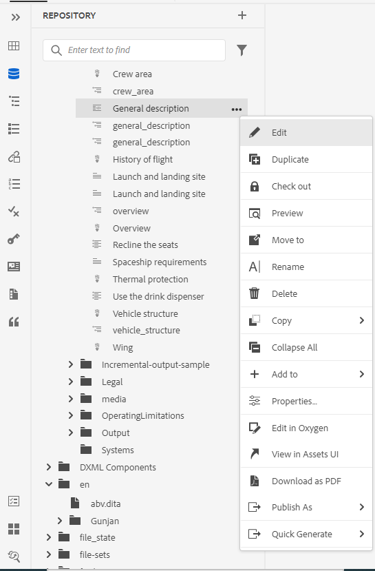{width="550" align="left"}

Las distintas opciones del menú Opciones se explican a continuación:

- **Editar**: abra el archivo para editarlo. Si se trata de un archivo .ditamap/.bookmap, se abrirá en el [Editor de mapas avanzado](map-editor-advanced-map-editor.md#) para su edición.

- **Duplicate**: utilice esta opción para crear un duplicado o una copia del archivo seleccionado. También tiene la opción de cambiar el nombre del archivo duplicado en la solicitud de recursos duplicados. De forma predeterminada, el archivo se crea con un sufijo \(como nombre de archivo\_1.extensión\). El título del archivo sigue siendo el mismo que el del archivo de origen y el nuevo archivo comienza con la versión 1.0. Todas las referencias, etiquetas y metadatos se copian, mientras que las líneas de base no se copian en el archivo duplicado.
- **Desproteger**: bloquee el archivo seleccionado para editarlo. Para un archivo bloqueado, esta opción cambia a **Proteger**.

  >[!NOTE]
  >
  > - Si un archivo está bloqueado o desprotegido por un usuario, al pasar el puntero del mouse (ratón) sobre el icono de bloqueo, se muestra el usuario \(nombre\) que ha bloqueado el archivo.
  > - Cuando protege un archivo que tiene cambios no guardados, se le pide que guarde los cambios. Si no guarda los cambios, solo se protege el archivo.

- **Vista previa**: obtenga una vista previa rápida del archivo (.dita, .xml, audio, vídeo o imagen) sin abrirlo. Puede cambiar el tamaño del panel de vista previa. Si el contenido contiene `<xref>` o `<conref>`, puede seleccionarlo para abrirlo en una nueva pestaña. El título del archivo aparece en la ventana. Si no hay ningún título, aparece el nombre de archivo. Para cerrar el panel **Vista previa**, puede seleccionar el icono de cerrar o hacer clic en cualquier lugar fuera del panel.

  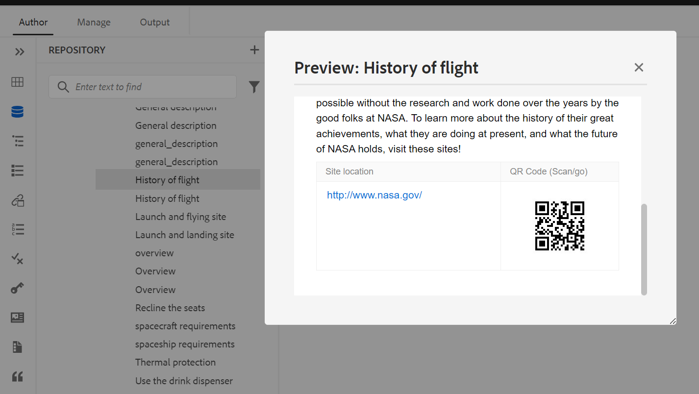{width="800" align="left"}

- **Cambiar nombre**: utilice esta opción para cambiar el nombre del archivo seleccionado. Escriba el nombre del nuevo archivo en el cuadro de diálogo **Cambiar nombre del recurso**.
   - Puede cambiar el nombre de un archivo de cualquier tipo.
   - No se puede cambiar la extensión de un archivo.
   - Dos archivos no pueden tener el mismo nombre. Por lo tanto, no puede cambiar el nombre de un archivo por uno que ya exista. Se muestra un error.

- **Mover a**: utilice esta opción para mover el archivo seleccionado a otra carpeta.
   - Puede escribir el nombre de la carpeta de destino o elegir **Seleccionar ruta** para seleccionar la carpeta de destino.
   - Puede mover un archivo de cualquier tipo a cualquier destino dentro de la carpeta Contenido.
   - Dos archivos no pueden tener el mismo nombre. Por lo tanto, no puede mover un archivo a una carpeta en la que ya existe un archivo con el mismo nombre.

  Si intenta mover un archivo a una carpeta en la que existe un archivo con el mismo nombre pero con un título diferente, se muestra el cuadro de diálogo Cambiar nombre y mover archivo y debe cambiar el nombre del archivo antes de moverlo. El archivo movido en la carpeta de destino tiene el nuevo nombre de archivo.

  {width="550" align="left"}

  >[!NOTE]
  >
  > También puede arrastrar y soltar un archivo en otra carpeta de destino.

  **Escenarios de exclusión**

  AEM Guides no permite cambiar el nombre de un archivo ni moverlo en los siguientes casos:

   - No puede mover ni cambiar el nombre de un archivo si forma parte de un flujo de trabajo de revisión o traducción.

   - Si algún otro usuario desprotege el archivo, no puede cambiarle el nombre ni moverlo, no verá la opción Cambiar nombre o Mover a para el archivo.

  >[!NOTE]
  >
  > Si el administrador le ha concedido los permisos sobre una carpeta, solo entonces se mostrarán las opciones **Rename** o **Move to**.

  <details>
    <summary> Cloud Services </summary>

  Al cambiar el nombre o mover cualquier archivo, no se rompen las referencias existentes desde o hacia el archivo, ya que cada archivo tiene un UUID único.
  </details>


- **Eliminar**: utilice esta opción para eliminar el archivo seleccionado. Se muestra un mensaje de confirmación antes de eliminar el archivo.

   - Se muestra un mensaje de confirmación antes de eliminar el archivo.
   - Si no se hace referencia al archivo desde ningún otro archivo, se elimina y se muestra un mensaje de éxito.
   - Si el archivo está desprotegido, no podrá eliminarlo y aparecerá un mensaje de error.

     >[!NOTE]
     >
     > Si el administrador ha impedido la eliminación de los archivos desprotegidos, sólo se mostrará el mensaje de error. Para obtener más información, consulte la sección *Impedir la eliminación de archivos desprotegidos* en Instalar y configurar Adobe Experience Manager Guides as a Cloud Service.

   - Si el archivo se agrega a una colección de favoritos, se muestra el cuadro de diálogo **Forzar eliminación** y puede eliminarlo a la fuerza.
   - Si se hace referencia al archivo desde cualquier otro archivo, se mostrará el cuadro de diálogo **Forzar eliminación** con el mensaje de confirmación y podrá eliminar el archivo a la fuerza:

     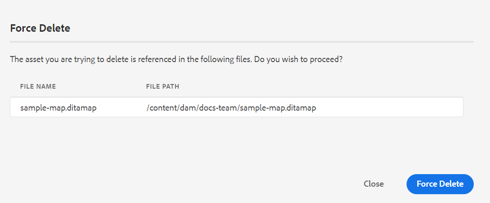{width="550" align="left"}

     >[!NOTE]
     >
     > Si el administrador ha concedido permiso para eliminar archivos, se habilitará **Forzar eliminación**. De lo contrario, **Forzar eliminación** se deshabilitará y aparecerá un mensaje que indica que no tiene permiso para eliminar los archivos a los que se hace referencia. Para obtener más información, consulte la sección *Impedir la eliminación de archivos a los que se hace referencia* en Instalar y configurar Adobe Experience Manager Guides as a Cloud Service.

   - Si elimina un tema al que se hace referencia y ha abierto el archivo que contiene referencias para su edición, se mostrará el vínculo roto para el archivo al que se hace referencia.

  >[!NOTE]
  >
  > También puede eliminar el archivo seleccionado de forma similar utilizando la tecla Supr del teclado.

- **Copiar**: puede elegir entre las siguientes opciones:

   - **Copiar UUID**: copie el UUID del archivo seleccionado en el portapapeles.

   - **Copiar ruta**: copie la ruta completa del archivo seleccionado al Portapapeles.

- **Contraer todo**: Contraer todos los archivos del repositorio. Solo se muestran las carpetas de nivel superior del repositorio.
- **Agregar a**: puede elegir entre las siguientes opciones:
   - **Favoritos**: agrega el archivo seleccionado a favoritos. Puede elegir agregarla a una colección de favoritos existente o nueva.

   - **Contenido reutilizable**: agrega el archivo seleccionado a la lista Contenido reutilizable del panel izquierdo.

- **Propiedades**: utilice esta opción para abrir la página de propiedades del archivo seleccionado. También se puede acceder a esta página de propiedades desde la interfaz de usuario de Assets seleccionando un archivo y haciendo clic en el icono Propiedades de la barra de herramientas.

- **Abrir tablero de mapas**: Si el archivo seleccionado es un mapa DITA, esta opción abre el tablero de mapas.

- **Editar en oxígeno**: seleccione esta opción para editar el archivo seleccionado en el complemento Conector de oxígeno. El archivo se abrirá para editarlo.

  >[!NOTE]
  >
  >Póngase en contacto con el equipo de éxito del cliente para habilitar esta función en el entorno. Esta opción no está habilitada como parte de la compatibilidad predeterminada. Para obtener más información, consulte la sección [Configurar la opción para editar en Oxígeno](/help/product-guide/cs-install-guide/conf-edit-in-oxygen.md) en la Guía de instalación y configuración.


- **Vista en la interfaz de usuario de Assets**: utilícela para mostrar una vista previa de un archivo .dita/.xml en la interfaz de usuario de Assets. En el caso de un archivo .ditamap/.bookmap, todos los archivos de tema dentro del mapa se muestran en una sola vista página a página unificada.

- **Descargar como PDF**: Use la opción para generar la salida de PDF y descargarla.

- **Publicar como**: use la opción para publicar un tema o los elementos de un tema en un fragmento de contenido.

- **Generación rápida**: genere el resultado del archivo seleccionado. La salida solo se puede generar para archivos que formen parte de un ajuste preestablecido de salida. Para obtener más información, consulte [Publicación basada en artículos desde el editor web](web-editor-article-publishing.md#id218CK0U019I).


**Crear temas desde la vista de repositorio**

Puede elegir crear un nuevo tema, asignación o carpeta desde el icono + situado junto al panel Repositorio o desde el menú contextual de una carpeta en la vista Repositorio.

***Crear un tema***

Cuando elige *crear un nuevo tema* desde el menú, aparece el siguiente cuadro de diálogo:

{width="300" align="left"}

En el cuadro de diálogo **Crear nuevo tema**, proporcione los siguientes detalles:

- Una plantilla en la que se basará el tema. Por ejemplo, para una configuración predeterminada, puede elegir entre las plantillas en blanco, Concepto, DITAVAL, Referencia, Tarea, Tema y Solución de problemas.

  Si la carpeta tiene un perfil de carpeta configurado, solo verá las plantillas de tema configuradas en el perfil de carpeta.

- Ruta de acceso donde desea guardar el archivo de tema. De forma predeterminada, la ruta de la carpeta seleccionada actualmente en el repositorio se muestra en el campo Ruta.
- Título del tema.

- *\(Opcional\)* El nombre de archivo del tema. El nombre del archivo se sugiere automáticamente en función del tema Título.

  Si el administrador ha habilitado nombres de archivo automáticos basados en la configuración UUID, no verá el campo Nombre como se muestra en la siguiente captura de pantalla:

  {width="300" align="left"}


Al hacer clic en **Crear**, el tema se crea en la ruta especificada. Además, el tema se abre en el Editor Web para editarlo.

***Crear un mapa DITA***

Cuando elige *crear un nuevo mapa DITA*, aparece el siguiente cuadro de diálogo:

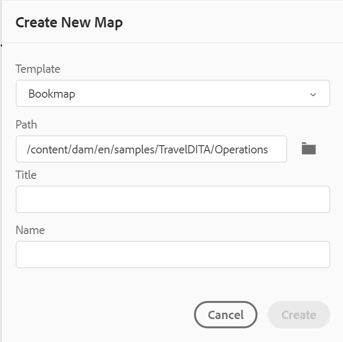{width="300" align="left"}

En el cuadro de diálogo **Crear nuevo mapa**, proporcione los siguientes detalles:

- Una plantilla en la que se basará el mapa. Por ejemplo, para una configuración predeterminada, puede elegir entre las plantillas de mapa de libro o de mapa DITA.

- Ruta de acceso donde desea guardar el archivo de asignación. De forma predeterminada, la ruta de la carpeta seleccionada actualmente en el repositorio se muestra en el campo Ruta.
- Un **Título** para el mapa.

- *\(Opcional\)* El nombre de archivo para el mapa. El nombre del archivo se sugiere automáticamente en función del Título del mapa.

  Si el administrador ha habilitado nombres de archivo automáticos basados en la configuración de UUID, no verá el campo Nombre.


Al hacer clic en **Crear**, el mapa se crea y se agrega dentro de la carpeta especificada en el campo Ruta. Además, el mapa se abre en la vista Mapa. Puede abrir el archivo de asignación en el Editor de mapas y agregarle un tema. Para obtener más información sobre cómo agregar temas a un archivo de asignación, vea [Crear un mapa](map-editor-create-map.md#).

***Crear una carpeta***

Cuando eliges *crear una nueva carpeta*, aparece el cuadro de diálogo **Crear nueva carpeta**:

{width="300" align="left"}

Escriba un **Título** para la carpeta, que se convertirá automáticamente en el nombre de la carpeta. La ruta es donde desea guardar el archivo de asignación. De forma predeterminada, la ruta de la carpeta seleccionada actualmente en el repositorio se muestra en el campo Ruta. Al hacer clic en **Crear**, la carpeta se crea y se agrega dentro de la carpeta desde la que se ejecutó la opción Crear carpeta.

**Vista de mapa** - 

Al hacer clic en el icono Vista de mapa, se obtiene una lista de temas dentro del archivo de mapa. Si no ha abierto ningún fichero de mapa, la vista de mapa aparecerá en blanco. Al hacer doble clic en cualquier fichero de mapa, se abre el fichero de mapa en esta vista. Puede hacer doble clic en cualquier archivo del mapa para abrirlo en el Editor Web.

De forma predeterminada, puede ver los archivos por títulos. Al pasar el ratón por encima de un archivo, puede ver el título y la ruta del archivo como información sobre herramientas.

>[!NOTE]
>
>Como administrador, también puede elegir ver el nombre de archivo del mapa principal que está abierto actualmente en la vista de mapa. Seleccione la opción **Nombre de archivo** de la sección **Ver archivos por** en **Preferencias de usuario** .


Cuando se abre un mapa en la vista de mapa, el título del mapa actual se muestra en el centro de la barra de herramientas principal. Si el título es demasiado largo, se muestran puntos suspensivos y también puede pasar el ratón por encima del título para ver el título completo en la información del objeto.

Al definir atributos clave para el tema o las referencias de mapa, puede ver el título, el icono correspondiente y la clave en el panel izquierdo. La clave se muestra como `keys=<key-name>`.

{width="300" align="left"}

Si tiene derechos de edición sobre los archivos de mapa, también podrá editar los archivos. Para obtener más información acerca de cómo abrir y editar un tema a través del mapa DITA, vea [Editar temas a través del mapa DITA](map-editor-advanced-map-editor.md#id17ACJ0F0FHS).


Puede realizar las siguientes acciones mediante el menú Opciones del archivo de asignación:

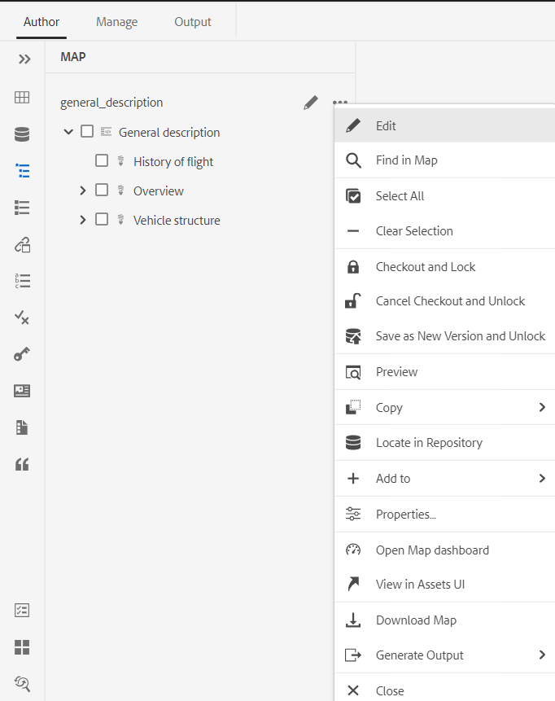{width="550" align="left"}

- **Editar**: abre el archivo de asignación para editarlo en el Editor de mapas avanzado.

- **Seleccionar todo**: seleccione todos los archivos del mapa.

- **Borrar selección**: Anule la selección de los archivos seleccionados en el mapa.

- **Desproteger y bloquear**: desprotege y bloquea los archivos seleccionados en el mapa.

- **Cancelar retirada y desbloquear**: desbloquea el archivo de asignación y lo pone a disposición para su edición. No revierte los cambios a la versión anterior.

- **Guardar como nueva versión y desbloquear**: crea una versión más reciente y libera el bloqueo de los archivos seleccionados en el mapa.

- **Vista previa**: abre una vista previa del archivo de mapa. En esta vista, todos los archivos de tema del mapa se muestran en una sola vista página a página unificada.

- **Copiar**: puede elegir entre las siguientes opciones:
   - **Copiar UUID**: copie el UUID del archivo de asignación al portapapeles.
   - **Copiar ruta**: copie la ruta completa del archivo de asignación al Portapapeles.

- **Buscar en el repositorio**: Muestra la ubicación del archivo de asignación en el repositorio \(o DAM\).

- **Agregar a**: puede elegir entre las siguientes opciones:
   - **Favoritos**: agrega el archivo de asignación a favoritos. Puede elegir agregarla a una colección de favoritos existente o nueva.

   - **Contenido reutilizable**: agrega el archivo de asignación a la lista Contenido reutilizable del panel izquierdo.

- **Propiedades**: utilice esta opción para abrir la página de propiedades del archivo de asignación. También se puede acceder a esta página de propiedades desde la interfaz de usuario de Assets seleccionando un archivo y haciendo clic en el icono Propiedades de la barra de herramientas.

- **Abrir tablero de mapas**: abra el tablero de mapas.

- **Ver en la interfaz de usuario de Assets**: úselo para mostrar una vista previa del archivo de mapa en la interfaz de usuario de Assets. En esta vista, todos los archivos de tema del mapa se muestran en una sola vista página a página unificada.
- **Descargar mapa**: Seleccione esta opción para abrir el cuadro de diálogo **Descargar mapa**.

En el cuadro de diálogo **Descargar mapa**, puede elegir las siguientes opciones:

- **Usar Línea Base**: Seleccione esta opción para obtener una lista de Líneas Base creadas para el mapa DITA. Si desea descargar el archivo de asignación y su contenido en función de una Línea base específica, seleccione la Línea base en la lista desplegable. Para obtener más información acerca de cómo trabajar con las líneas de base, vea [Trabajar con Línea de base](./generate-output-use-baseline-for-publishing.md).
- **Acoplar jerarquía de archivos**: seleccione esta opción para guardar todos los temas a los que se hace referencia y los archivos multimedia en una sola carpeta.

  También puede descargar el archivo de asignación sin seleccionar ninguna opción. En ese caso, se descargan las últimas versiones persistentes de los temas a los que se hace referencia y los archivos multimedia.

  Después de hacer clic en el botón **Descargar**, la solicitud del paquete de exportación de asignaciones se colocará en la cola. El cuadro de diálogo **Éxito** se muestra si el paquete se ha creado correctamente.  Puede hacer clic en el botón **Descargar** del cuadro de diálogo **Éxito**.

  Recibirá la notificación de mapa listo para descarga si el mapa está listo para descargarse. En caso de que la descarga falle, recibirá la notificación de que la descarga del mapa ha fallado.

  Puede acceder al vínculo de descarga desde la bandeja de entrada de notificaciones de AEM. Seleccione la notificación de asignación generada en la bandeja de entrada para descargar la asignación en formato .zip.

  >[!NOTE]
  >
  >  De forma predeterminada, las asignaciones descargadas permanecen durante cinco días en la Bandeja de entrada de notificaciones de AEM.

- **Generar salida**: genere la salida para el archivo de asignación seleccionado. La salida solo se puede generar para archivos que formen parte de un ajuste preestablecido de salida. Para obtener más información, consulte [Publicación basada en artículos desde el editor web](web-editor-article-publishing.md#id218CK0U019I).
- **Cerrar**: Cierra el archivo de asignación.


En la siguiente captura de pantalla se muestra el menú Opciones de un fichero en la vista Mapa DITA:

{width="550" align="left"}

Puede realizar las siguientes acciones mediante el menú Opciones:

- **Editar**: abra el archivo para editarlo. Si se trata de un archivo .ditamap/.bookmap, se abrirá en el [Editor de mapas avanzado](map-editor-advanced-map-editor.md#) para su edición.

- **Desproteger**: desprotege el archivo seleccionado. Para un archivo desprotegido, esta opción cambia a **Proteger**.


  >[!NOTE]
  >
  > - Si un archivo está bloqueado o desprotegido por un usuario, al pasar el puntero del mouse (ratón) sobre el icono de bloqueo, se muestra el usuario \(nombre\) que ha bloqueado el archivo.
  > - Cuando protege un archivo, le pide que guarde los cambios. Si no guarda los cambios, solo se protege el archivo.

- **Vista previa**: obtenga una vista previa rápida del archivo (.dita, .xml, audio, vídeo o imagen) sin abrirlo. Puede cambiar el tamaño del panel de vista previa. Si el contenido contiene `<xref>` o `<conref>`, puede seleccionarlo para abrirlo en una nueva pestaña.  El título del archivo aparece en la ventana. Si no hay ningún título, aparece el nombre de archivo. Para cerrar el panel **Vista previa**, puede seleccionar el icono de cerrar o hacer clic en cualquier lugar fuera del panel.
- **Copiar**: puede elegir entre las siguientes opciones:
   - **Copiar UUID**: copie el UUID del archivo seleccionado en el portapapeles.
   - **Copiar ruta**: copie la ruta completa del archivo seleccionado al Portapapeles.


- **Buscar en el repositorio**: Muestra la ubicación del archivo seleccionado en el repositorio \(o DAM\).
- **Expandir todo**: expanda todos los temas de los archivos de asignación.

- **Contraer todo**: Contraer todos los temas que forman parte del archivo de asignación actual.

- **Agregar a**: puede elegir entre las siguientes opciones:
   - **Favoritos**: agrega el archivo seleccionado a favoritos. Puede elegir agregarla a una colección de favoritos existente o nueva.

   - **Contenido reutilizable**: agrega el archivo seleccionado a la lista Contenido reutilizable del panel izquierdo.

- **Propiedades**: utilice esta opción para abrir la página de propiedades del archivo seleccionado. También se puede acceder a esta página de propiedades desde la interfaz de usuario de Assets seleccionando un archivo y haciendo clic en el icono Propiedades de la barra de herramientas.

- **Vista en la interfaz de usuario de Assets**: utilícela para mostrar una vista previa de un archivo .dita/.xml en la interfaz de usuario de Assets. En el caso de un archivo .ditamap/.bookmap, todos los archivos de tema dentro del mapa se muestran en una sola vista página a página unificada.

- **Generación rápida**: genere el resultado del archivo seleccionado. La salida solo se puede generar para archivos que formen parte de un ajuste preestablecido de salida. Para obtener más información, consulte [Publicación basada en artículos desde el editor web](web-editor-article-publishing.md#id218CK0U019I).

>[!NOTE]
>
> También puede abrir y editar las propiedades de los temas seleccionados en un mapa DITA desde el menú **Más opciones** en la parte inferior de la vista Mapa.

**Vista de esquema** - 

Al hacer clic en el icono Vista de esquema, se obtiene la vista jerárquica de los elementos utilizados en el documento.

{width="300" align="left"}

La vista Esquema ofrece las siguientes funciones:

- Vista de árbol de todos los elementos utilizados en el documento.

- Si un elemento tiene un ID, un atributo y un texto, puede verlos junto con el elemento.

- Acceda a la vista Esquema en las vistas Autor y Source.

- Utilice la lista desplegable de filtros para mostrar todos los elementos o solo las referencias rotas:

- Al hacer clic en un elemento en la vista Esquema, se selecciona el contenido del elemento en la vista Autor o Source. La vista Esquema permanece sincronizada con la vista Autor y Source. Si realiza cambios en cualquier vista, puede verlos en la vista Esquema. Por ejemplo, si agrega un párrafo o actualiza un elemento en la vista Autor, aparecerá en la vista Esquema.

  {width="650" align="left"}

- Arrastre y suelte los elementos. Puede reemplazar fácilmente un elemento soltando otro elemento sobre él. Si arrastra y suelta un elemento sobre otro elemento y ve un cuadro cuadrado alrededor del elemento, indica que el elemento se reemplazará. Reemplaza el elemento en el que se coloca el elemento.

  {width="300" align="left"}

  Si arrastra y suelta un elemento, un rectángulo discontinuo indica que el elemento se puede colocar en la ubicación actual. Si la operación de arrastrar y soltar no es válida, se muestra un mensaje de error para indicar que la operación no está permitida.

  {width="300" align="left"}

- El menú **Opciones** de la *Vista de esquema* le permite realizar operaciones genéricas como Cortar, Copiar, Eliminar, Generar ID, Insertar elemento antes o después del elemento actual, Cambiar el nombre o reemplazar un elemento, Envolver un elemento, Desenvolver un elemento y crear un fragmento a partir del elemento seleccionado.

>[!NOTE]
>
>Para obtener más información sobre Generate ID, Insert element before or after the current element y Unwrap an element, consulte [Otras características en el editor web](web-editor-other-features.md#).

**Opciones de vista para el panel Vista de esquema**

En el menú desplegable Opciones de vista, puede elegir ver lo siguiente, si el elemento los tiene:

- **Mostrar ID**: Muestra el ID del elemento.
- **Mostrar atributo**: Muestra el atributo junto con su valor.
- **Mostrar texto**: Muestra el texto. Si el texto tiene más de 20 caracteres, se muestra un punto suspensivo.

Si un elemento de bloque tiene su propio texto, se muestra junto con ese elemento de bloque. Si no tiene su propio texto, el texto del primer elemento secundario se muestra junto con ese elemento de bloque.

{width="550" align="left"}

Si el administrador ha creado un perfil para atributos, obtendrá esos atributos junto con sus valores configurados. También puede asignar atributos de visualización configurados por el administrador en la ficha **Atributos de visualización** en la configuración del editor. Los atributos definidos para un elemento se muestran en las vistas Diseño y Esquema.


Para obtener más información, consulte *Atributos de visualización* en la descripción de la característica *Configuración del editor* en la sección [Panel izquierdo](web-editor-features.md#id2051EA0M0HS).

**Característica de búsqueda**
Con la función de búsqueda, puede buscar un elemento por su nombre, ID, texto o valor de atributo.

La búsqueda distingue entre mayúsculas y minúsculas y coincide exactamente con la cadena. Los resultados de la búsqueda se ordenan según la posición del elemento en el documento.

Puede buscar una cadena en el elemento si se muestra en el panel Vista de esquema. Por ejemplo, si la cadena &quot;Adobe&quot; está presente en el texto del elemento y se muestra en el panel Vista de esquema (como seleccionó **Mostrar texto** en la lista desplegable Opciones de vista), se filtrará el elemento que lo contiene. Sin embargo, si el texto no se muestra en el panel Vista de esquema (ya que no ha seleccionado **Mostrar texto** en la lista desplegable Opciones de vista), el elemento que lo contiene no se filtra. Del mismo modo, encontrará la cadena en el ID o atributos si los ha seleccionado.


**Contenido reutilizable** - 

Una de las características principales de DITA es la capacidad de reutilizar contenido. El panel Contenido reutilizable puede almacenar los archivos DITA desde donde normalmente se inserta contenido reutilizable. Una vez añadidos, los ficheros DITA permanecen en el panel Contenido reutilizable entre sesiones. Esto significa que no es necesario volver a añadir los ficheros DITA para acceder a ellos más adelante.

Puede simplemente arrastrar y soltar contenido reutilizable del panel en el tema actual y se insertará de forma fácil y rápida. También puede obtener una vista previa del contenido antes de insertarlo en el documento.

De forma predeterminada, puede ver los archivos por títulos. Al pasar el ratón por encima de un archivo, puede ver el título y la ruta del archivo como información sobre herramientas.

>[!NOTE]
>
> Como administrador, también puede elegir ver la lista de archivos por nombres de archivo en el Editor Web. Seleccione la opción **Nombre de archivo** de la sección **Ver archivos por** en **Preferencias de usuario** .

Para añadir un fichero DITA al panel Contenido reutilizable, utilice cualquiera de los métodos siguientes:

- Haga clic en el icono + junto a Contenido reutilizable para abrir el cuadro de diálogo Examinar archivo. Seleccione el archivo que desea agregar y haga clic en **Agregar** para completar el proceso.

  {width="650" align="left"}

- En la vista Repositorio, haga clic en el icono Opciones del archivo deseado y elija **Agregar a contenido reutilizable** en el menú contextual.

- Haga clic con el botón derecho en la ficha de un archivo en el editor para abrir el menú contextual y elija **Agregar a contenido reutilizable**.


Una vez agregado el archivo, puede ver todos los elementos de contenido reutilizables del archivo en el panel Contenido reutilizable. El contenido reutilizable se muestra con sus ID y nombres de elementos.

Cuando se añade un archivo a la lista Contenido reutilizable, se muestra el título del archivo en lugar del UUID del archivo. Para comprobar el UUID del archivo, pase el ratón sobre el título del archivo y el UUID del archivo se mostrará en la información del objeto.

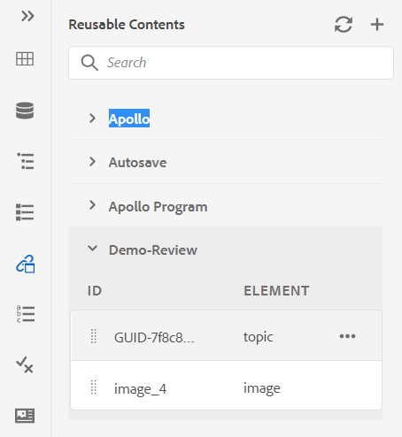{width="300" align="left"}

>[!NOTE]
>
> Puede agregar varios archivos a la lista de contenido reutilizable. A continuación, puede insertar el contenido deseado desde el panel Contenido reutilizable en el documento.

**Actualizar**: vuelve a comprobar todo el contenido reutilizable y muestra una lista nueva de contenido reutilizable.

Para insertar contenido desde el panel Contenido reutilizable, utilice cualquiera de los siguientes métodos:

- Pase el puntero del ratón sobre el elemento que desee insertar, haga clic en el icono Opciones y elija **Insertar contenido reutilizable**.

  {width="400" align="left"}

  >[!NOTE]
  >
  > Seleccione un archivo y, a continuación, seleccione **Vista previa** en el menú **Opciones** para obtener una vista previa del archivo sin abrirlo. También puede obtener una vista previa de las referencias presentes en un tema. La ID de referencia aparece en la ventana.
  >
  > La opción **Preview** también está disponible en el menú **Options** de un elemento, lo que le proporciona una vista previa rápida del elemento antes de insertarlo.

- Arrastre y suelte el elemento de contenido reutilizable del panel en la ubicación deseada del documento.


**Glosario** - 

AEM Guides le permite crear y utilizar fácilmente documentos del tipo glosario. Puede crear archivos de temas del glosario y luego incluirlos en un mapa del glosario común. Una vez agregado este mapa como mapa raíz, las entradas del glosario se muestran en el panel Glosario.

{width="650" align="left"}

Para insertar un término del glosario, simplemente arrastre y suelte la entrada desde el panel a la ubicación deseada en el tema. El menú Opciones de un término de glosario le permite obtener una **vista previa** rápida del término de entrada, **Copiar ruta** del archivo del término de entrada o localizar el archivo del término de entrada en el repositorio.

Realice los siguientes pasos para buscar términos de texto y reemplazarlos por abreviaciones de glosario:

1. Abra el tema o mapa DITA en el que desee buscar y convertir el texto o los términos.
1. Seleccione el panel del glosario para ver los términos del glosario presentes en el mapa raíz. Puede arrastrar y soltar estos términos para agregarlos al tema abierto.
1. Seleccione la herramienta **punto interactivo** \( \) en el panel Glosario para buscar y convertir términos de texto específicos en abreviaturas de glosario vinculadas. Además, viceversa, puede utilizarla para buscar abreviaturas de glosarios y convertirlas en términos de texto.

{width="300" align="left"}

Puede configurar las siguientes opciones de la herramienta Punto interactivo:

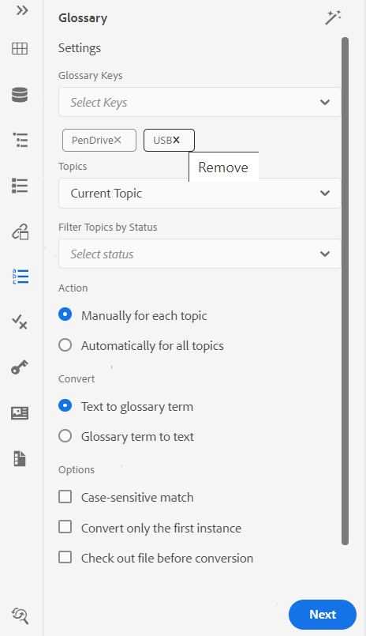{width="300" align="left"}

- **Claves de glosario**: seleccione las claves de glosario del mapa DITA que desee utilizar para la búsqueda en el tema seleccionado. Las claves seleccionadas se muestran a continuación. Para quitar una clave seleccionada, haga clic en el icono **Quitar**.

- **Temas**: elige el **Tema actual** abierto en el Editor Web, todos los **Temas abiertos** en el mapa actual o el **Mapa actual** que se está editando en el Editor de Mapas para buscar los términos.
- **Filtrar temas por estado**: puede optar por limitar la búsqueda a los temas que tengan el estado de documento seleccionado. Los temas pueden estar en estado Borrador, Editar, En revisión, Aprobado, Revisado, Listo o en cualquiera de los estados configurados por la organización.
- **Acción**: puede elegir buscar las claves del glosario **Manualmente para cada tema** o **Automáticamente para todos los temas**. Si elige **Manualmente para cada tema**, se le pedirá que confirme antes de convertir cada término en cada tema. Si elige **Automáticamente para todos los temas**, convertirá automáticamente todos los términos de todos los temas.
- **Convertir**: puede convertir un **texto buscado en un término de glosario** o **término de glosario en texto.**
- **Opciones**: puede seleccionar entre las siguientes opciones:
   - **Coincidencia que distingue entre mayúsculas y minúsculas**: busca un término para encontrar la coincidencia que tiene la misma coincidencia. Por ejemplo, &quot;USB&quot; no coincidirá con &quot;usb&quot;.
   - **Convertir solo la primera instancia**: si hay varias instancias del término buscado en un tema, solo se convierte la primera instancia.
   - **Desproteger archivo antes de la conversión**: el archivo buscado se desprotege antes de convertir los términos.
   - **Crear una nueva versión después de la conversión**: se crea una nueva versión del tema una vez completada la conversión de términos.
- El botón **Siguiente** aparece si selecciona la opción **Manualmente para cada tema**. Haga clic en **Siguiente** para convertir los términos de cada tema según la configuración seleccionada. Solicita la conversión de términos en cada tema y se mueve al siguiente archivo. Puede elegir convertir un término u omitirlo y pasar al siguiente.

  {width="300" align="left"}

- El botón **Convertir** aparece si selecciona la opción **Automáticamente para todos los temas**. Seleccione **Convertir** para convertir todos los términos encontrados en el documento a abreviaturas de glosario vinculadas.

Se muestra una lista de **temas actualizados** con los términos convertidos y **temas con error**. Pase el ratón sobre el icono \( \) cerca de Temas con error para ver los detalles del error.

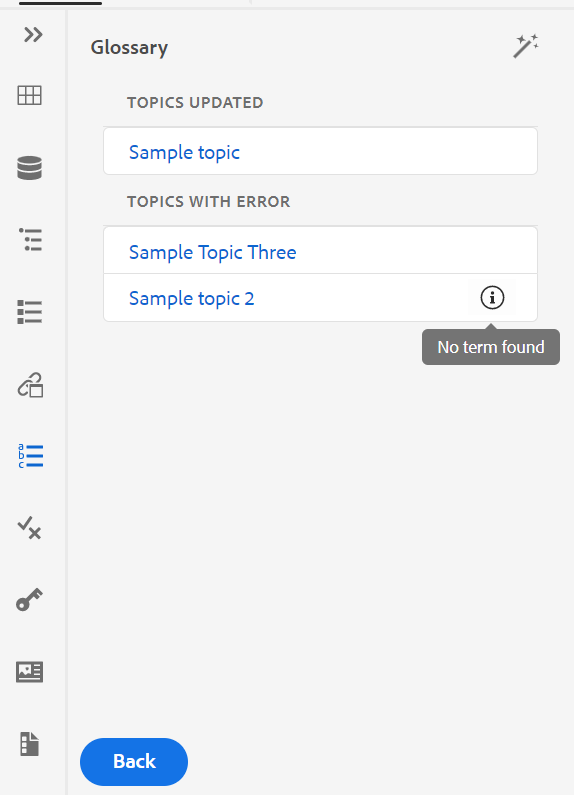{width="300" align="left"}

>[!NOTE]
>
> Actualice el tema para ver los términos convertidos.

**Condiciones** - 

El panel Condiciones muestra los atributos condicionales definidos por el administrador en el perfil global o de nivel de carpeta. Puede añadir condiciones al contenido simplemente arrastrando y soltando la condición deseada. El contenido condicional se resalta con el color definido para la condición para facilitar la identificación.

También puede aplicar varias condiciones a un elemento arrastrando y soltando varias condiciones en un elemento. Cuando se aplican varias condiciones a un elemento, el panel Propiedades muestra las condiciones aplicadas separadas con una coma.

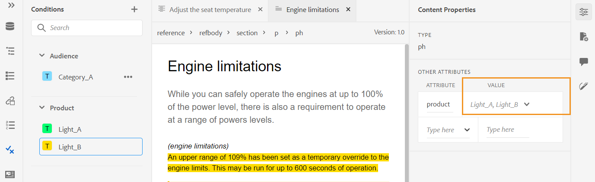{width="800" align="left"}

Sin embargo, en la vista Código, las condiciones se separan mediante un delimitador de espacio. Cuando agregue o edite una condición en la vista Código, asegúrese de que varias condiciones están separadas mediante un espacio.

>[!IMPORTANT]
>
> La siguiente captura de pantalla es de un usuario con privilegios administrativos. Como usuario con privilegios administrativos, puede agregar, editar y eliminar condiciones. De lo contrario, como autor normal, solo tendrá la opción de aplicar condiciones.

{width="800" align="left"}

Para añadir o definir una condición, haga clic en el icono + situado junto al panel Condiciones para que aparezca el cuadro de diálogo Definir condición:

{width="400" align="left"}

En la lista Atributo, seleccione el atributo condicional que desea definir, introduzca un valor para la condición y, a continuación, especifique la etiqueta que se muestra en el panel Condiciones. Defina un grupo para la condición. Puede agregar varias condiciones a un grupo. También puede definir un color para la condición. Este color se establece como color de fondo del contenido al que se aplica la condición.

Puede agrupar las condiciones y estructurarlas en carpetas anidadas. Los grupos ayudan a crear condiciones en varios niveles y a organizarlas mejor para usarlas en el contenido.

Por ejemplo, puede crear grupos de condiciones de productos como *Acrobat* y *AEM Guides*. Puede seleccionar los atributos condicionales para ambos grupos. En cada grupo, puede tener valores específicos como *Usuario*, *Administrador*, *Revisor* y *Autor*.

>[!NOTE]
>
> Escriba para crear un nuevo grupo o seleccione un grupo existente para un atributo en particular.

Puede usar `/` y definir subgrupos definir subgrupos como `AEM Guides/Cloud Service`.


{width="300" align="left"}


Para editar una condición, elija **Editar** en el menú Opciones. Aparecerá el cuadro de diálogo Editar condición:

{width="400" align="left"}

Especifique los detalles del mismo modo que se configuraron al definir una nueva condición.

**Esquema del asunto** - 

Los mapas de esquema de sujeto son una forma especializada de mapas DITA que se utilizan para definir sujetos taxonómicos y valores controlados. Según sus necesidades, puede crear un mapa de esquema de temas y hacer referencia a él dentro del archivo de mapa raíz. AEM Guides le permite definir la jerarquía de nivel anidada de las definiciones de temas en el esquema de temas.

Puede crear y utilizar fácilmente el esquema de asunto en un mapa del esquema de asunto. Una vez agregado este mapa como mapa raíz, el esquema del asunto se muestra en el panel Esquema del asunto. El panel Esquema de asunto muestra el esquema de asunto disponible de forma anidada o jerárquica.

AEM Guides también admite mapas de esquema de asunto de nivel anidado y puede tener varios esquemas de asunto definidos en el mapa de esquema de asunto raíz.

El siguiente ejemplo muestra cómo utilizar el esquema de asunto en AEM Guides.

1. Cree un archivo de esquema de temas en una herramienta de su elección. El siguiente código XML crea un esquema de asunto que enlaza los valores del atributo `platform`.

   ```XML
   <?xml version="1.0" encoding="UTF-8"?>
   <!DOCTYPE subjectScheme PUBLIC "-//OASIS//DTD DITA Subject Scheme Map//EN" "subjectScheme.dtd">
   <subjectScheme id="GUID-4f942f63-9a20-4355-999f-eab7c6273270">
       <title>rw</title>
       <!-- Define new OS values that are merged with those in the unixOS scheme -->
       <subjectdef keys="os">
           <subjectdef keys="linux">    </subjectdef>
           <subjectdef keys="mswin">    </subjectdef>
           <subjectdef keys="zos">    </subjectdef>
       </subjectdef>
       <!-- Define application values -->
       <subjectdef keys="app" navtitle="Applications">
           <subjectdef keys="apacheserv">    </subjectdef>
           <subjectdef keys="mysql">    </subjectdef>
       </subjectdef>
       <!-- Define an enumeration of the platform attribute, equal to       each value in the OS subject. This makes the following values       valid for the platform attribute: linux, mswin, zos -->
       <enumerationdef>
           <attributedef name="platform">    </attributedef>
           <subjectdef keyref="os">    </subjectdef>
       </enumerationdef>
       <!-- Define an enumeration of the otherprops attribute, equal to       each value in the application subjects.       This makes the following values valid for the otherprops attribute:       apacheserv, mysql -->
       <enumerationdef>
           <attributedef name="otherprops">    </attributedef>
           <subjectdef keyref="app">    </subjectdef>
       </enumerationdef>
   </subjectScheme>
   ```

   {width="300" align="left"}

1. Guarde el archivo con la extensión a.ditamap y cárguelo en cualquier carpeta de DAM.

   >[!NOTE]
   >
   > Se puede añadir una referencia al fichero de esquema de asunto en el mapa DITA padre.

   {width="550" align="left"}

1. Establezca el mapa principal como el mapa raíz en **Preferencias de usuario**. Una vez agregado este mapa como mapa raíz, el esquema del asunto se muestra en el panel Esquema del asunto.

   {width="400" align="left"}

1. En el Editor Web, abra el archivo donde desee utilizar las definiciones de esquema de temas.
1. Aplique el esquema de asunto al contenido simplemente arrastrando y soltando el esquema de asunto deseado en el contenido. A continuación, el contenido se resalta con el color definido.

   {width="650" align="left"}

**Administrar definiciones jerárquicas de definiciones de temas y enumeraciones**

Además de gestionar las enumeraciones y las definiciones de temas presentes en el mismo mapa, AEM Guides también proporciona la función de definir enumeraciones y definiciones de temas en dos mapas independientes. Puede definir una o más definiciones de asunto en un mapa y las definiciones de enumeración en otro mapa y, a continuación, añadir la referencia de mapa. Por ejemplo, el siguiente código XML crea definiciones de asunto y definiciones de enumeración en dos asignaciones independientes.

Las definiciones del asunto se definen en `subject_scheme_map_1.ditamap`


```XML
  <?xml version="1.0" encoding="UTF-8"?> 
    <!DOCTYPE subjectScheme PUBLIC "-//OASIS//DTD DITA Subject Scheme Map//EN" "../dtd/libs/fmdita/dita_resources/DITA-1.3/dtd/subjectScheme/dtd/subjectScheme.dtd"> 
    <subjectScheme id="subject-scheme.ditamap_f0bfda58-377b-446f-bf49-e31bc87792b3"> 

    <title>subject_scheme_map_1</title> 
    
    <subjectdef keys="os" navtitle="Operating system">
        <subjectdef keys="linux" navtitle="Linux">
        <subjectdef keys="redhat" navtitle="RedHat Linux">
        </subjectdef>
        <subjectdef keys="suse" navtitle="SuSE Linux">
        </subjectdef>
        </subjectdef>
        <subjectdef keys="windows" navtitle="Windows">
        </subjectdef>
        <subjectdef keys="zos" navtitle="z/OS">
        </subjectdef>
        </subjectdef>
        <subjectdef keys="deliveryTargetValues">
        <subjectdef keys="print">
        </subjectdef>
        <subjectdef keys="online">
        </subjectdef>
    </subjectdef>
    <subjectdef keys="mobile" navtitle="Mobile">
        <subjectdef keys="android" navtitle="Android">
        </subjectdef>
        <subjectdef keys="ios" navtitle="iOS">
    </subjectdef>
    </subjectdef>
    <subjectdef keys="cloud" navtitle="Cloud">
        <subjectdef keys="aws" navtitle="Amazon Web Services">
        </subjectdef>
        <subjectdef keys="azure" navtitle="Microsoft Azure">
        </subjectdef>
        <subjectdef keys="gcp" navtitle="Google Cloud Platform">
        </subjectdef>
    </subjectdef>
    </subjectScheme>
```

La definición de la enumeración está presente en    subject_scheme_map_2.ditamap.

```XML
    ?xml version="1.0" encoding="UTF-8"?> 
        <!DOCTYPE subjectScheme PUBLIC "-//OASIS//DTD DITA Subject Scheme Map//EN" "../dtd/libs/fmdita/dita_resources/DITA-1.3/dtd/subjectScheme/dtd/subjectScheme.dtd"> 
        <subjectScheme id="subject-scheme.ditamap_17c433d9-0558-44d4-826e-3a3373a4c5ae"> 
        <title>subject_scheme_map_2</title> 
        <mapref format="ditamap" href="subject_scheme_map_1.ditamap" type="subjectScheme"> 
        </mapref> 
        <enumerationdef>
        <attributedef name="platform">
        </attributedef>
        <subjectdef keyref="mobile">
        </subjectdef>
        <subjectdef keyref="cloud">
        </subjectdef>
        </enumerationdef>
        </subjectScheme>
```

Aquí las definiciones de asunto se definen en `subject_scheme_map_1.ditamap` mientras que la definición de enumeración está presente en `subject_scheme_map_2.ditamap`. La referencia a `subject_scheme_map_1.ditamap` también se agregó en `subject_scheme_map_2.ditamap`.

>[!NOTE]
>
> Como se hace referencia entre sí a `subject_scheme_map_1.ditamap` y `subject_scheme_map_2.ditamap`, los esquemas de asunto se están resolviendo.

Las referencias de enumeración de temas se resuelven en el siguiente orden de prioridad:

1. Mismo mapa
1. Mapa de referencia


Las referencias no se resuelven si la enumeración no se encuentra en el mismo mapa y en el mapa al que se hace referencia.


**Restringir los valores a un elemento específico**

También puede restringir las condiciones a algunos elementos dentro de un tema. Utilice la etiqueta `<elementdef>` para definir el elemento y la etiqueta `<attributedef>` para definir la condición que se puede aplicar al elemento.  Si no agrega la etiqueta `<elementdef>`, puede aplicar las condiciones a todos los elementos.
Por ejemplo, utilice la siguiente enumeración para restringir el atributo `@platform` al elemento `<shortdesc>`.  Las demás condiciones son visibles para todos los elementos.

```XML
<enumerationdef>
    <elementdef name="shortdesc">
    </elementdef>
    <attributedef name="platform">
    </attributedef>
    <subjectdef keyref="deliveryTargetValues">
    </subjectdef>
    <subjectdef keyref="os">
    </subjectdef>
  </enumerationdef>
```

</details>


Lista desplegable de **Atributos**

También puede cambiar el valor del esquema del asunto mediante la lista desplegable **Atributos** del panel **Propiedades de contenido** en la vista **Autor**.
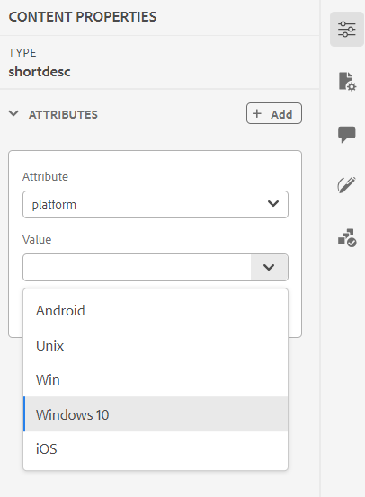{width="200" align="left"}
Siga estos pasos para cambiar el valor:

1. Seleccione un atributo del menú desplegable **Atributo**.
1. Seleccione **Editar** .
1. Seleccione el valor requerido de la lista desplegable **Valor**.
1. Haga clic en **Actualizar**.


También puede aplicar valores para un atributo seleccionando varios valores en la lista desplegable.

**Vista de Source**

También puede cambiar los valores de la lista desplegable del atributo en la vista de Source. La vista de Source también evita que añada valores incorrectos.

{width="550" align="left"}

**Ver y aplicar el esquema de asunto desde el panel Condiciones**

También puede ver y aplicar el esquema de asunto desde el panel Condiciones.

Para ver el esquema de asunto en el panel Condiciones, el administrador del sistema debe seleccionar la opción **Mostrar esquema de asunto en el panel Condiciones** en la pestaña Condición de Configuración del editor. Para obtener más información, consulte [Ficha Condición](#id21BMNE0602V).

El panel Condiciones muestra la estructura vertical plana de las definiciones de asunto dentro del esquema de asunto.

{width="300" align="left"}

Puede añadir condiciones al contenido arrastrando y soltando la condición deseada en el contenido. El contenido condicional se resalta con el color definido para la condición.

**Fragmentos** - 

Los fragmentos de código son pequeños fragmentos de contenido que se pueden reutilizar en varios temas del proyecto de documentación. El panel Fragmentos muestra una colección de fragmentos de contenido que ha creado. Para insertar un fragmento, arrastre y suelte el fragmento desde el panel a la ubicación deseada en el tema. El panel Fragmentos de código permite agregar, editar, eliminar, obtener una vista previa e insertar un fragmento de código.

>[!IMPORTANT]
>
> La siguiente captura de pantalla es de un usuario con privilegios administrativos. Como usuario con privilegios administrativos, puede agregar, editar y eliminar fragmentos de código. De lo contrario, como autor normal, solo obtendrá las opciones para obtener una vista previa e insertar un fragmento de código.

{width="400" align="left"}

Para agregar un fragmento de código, utilice cualquiera de los métodos siguientes:

- Haga clic en el icono + junto a Fragmentos de código para abrir el cuadro de diálogo Nuevo fragmento de código.

  {width="550" align="left"}

  En el cuadro de diálogo Nuevo fragmento de código, proporcione un título que aparezca en el panel Fragmentos de código, una descripción y un código XML del contenido del fragmento de código que desee crear. Haga clic en **Crear** para guardar y crear el fragmento.

- En el área de edición de contenido, haga clic con el botón secundario en la ruta de exploración del elemento que desee usar como fragmento y elija **Crear fragmento** en el menú contextual. Aparecerá el cuadro de diálogo Nuevo fragmento con el código XML del elemento seleccionado rellenado en el campo **Contenido**. Escriba **Title** y **Description** para el fragmento y haga clic en **Crear** para guardar el fragmento.

- En el área de edición de contenido, haga clic con el botón secundario en cualquier lugar del contenido que desee usar como fragmento y elija **Crear fragmento** en el menú contextual. Aparecerá el cuadro de diálogo Nuevo fragmento con el código XML del elemento seleccionado rellenado en el campo **Contenido**. Escriba **Title** y **Description** para el fragmento y haga clic en **Crear** para guardar el fragmento.

  La siguiente captura de pantalla resalta la ruta de exploración y el área de contenido desde donde puede invocar el menú contextual.

  {width="350" align="left"}


Para insertar un fragmento de código, utilice cualquiera de los métodos siguientes:

- Seleccione un fragmento de código del panel Fragmentos de código y arrástrelo y suéltelo en la ubicación deseada del tema.

- Sitúe el punto de inserción donde desee insertar el fragmento de código; en el menú Opciones del fragmento de código requerido, elija Insertar fragmento de código.


>[!NOTE]
>
> En el menú contextual de una entrada de fragmento de código, también puede elegir Editar, Eliminar, Obtener una vista previa o Insertar un fragmento de código.

**Plantillas** - 

El panel Plantillas solo está disponible para administradores. Con este panel, los administradores y usuarios pueden crear y administrar fácilmente plantillas que luego los autores pueden utilizar. De manera predeterminada, las plantillas se clasifican en las plantillas de tipo *Map* y *Topic*.

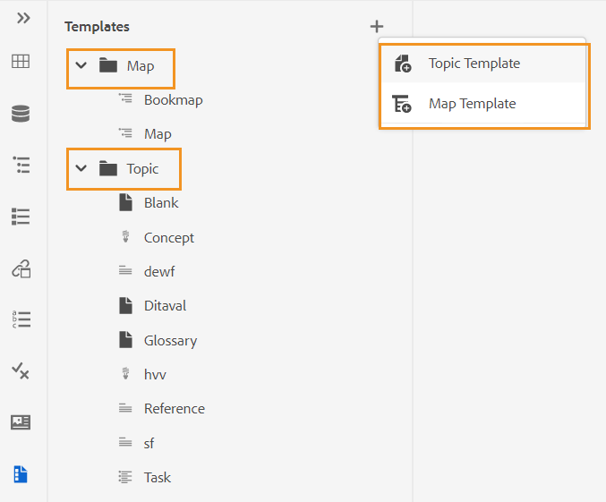{width="550" align="left"}

De forma predeterminada, puede ver los archivos por títulos. Al pasar el ratón por encima de una plantilla, puede ver el título y el nombre del archivo como información sobre herramientas.

>[!NOTE]
>
> Como administrador, también puede elegir ver la lista de archivos en el Editor Web. Seleccione la opción **Nombre de archivo** de la sección **Ver archivos por** en **Preferencias de usuario** .

Para crear una plantilla, haga clic en el icono + situado junto a Plantillas y seleccione la plantilla que desee crear. Si selecciona **Plantilla de tema**, aparecerá el cuadro de diálogo Crear nueva plantilla de tema:

{width="400" align="left"}

Elija el tipo de plantilla que desea crear en la lista desplegable **Plantilla**. Proporcione el **Título** que aparece en el panel Plantillas. El **Nombre** de la plantilla se sugiere automáticamente basándose en el título; sin embargo, puede proporcionar un nombre de archivo diferente.

>[!NOTE]
>
> Si el administrador ha habilitado nombres de archivo automáticos basados en la configuración de UUID, no verá el campo Nombre.

Una vez creada la plantilla, debe añadirla a su perfil global o de nivel de carpeta. Una vez añadida la plantilla, los autores empezarán a ver la nueva plantilla en el proceso de creación de temas/mapas.

Usando el menú Opciones de una plantilla existente, puedes elegir **editarla** o **duplicarla**. En caso de duplicación, la estructura y el tipo \(de documento\) de la plantilla se conservarán y podrá volver a utilizarlos para crear otra plantilla a partir de ella.

**Revisión** - 

AEM Guides proporciona la función para mostrar todas las tareas de revisión de los proyectos. Puede ver todos los proyectos de revisión y las tareas de revisión activas dentro de los proyectos de revisión de los que forma parte desde el panel **Revisar**.  A continuación, puede abrir las tareas de revisión para ver los comentarios de los distintos revisores.

El panel de revisión muestra las tareas de revisión. De forma predeterminada, puede ver los archivos por títulos. Al pasar el ratón por encima de un archivo, puede ver el título y la ruta del archivo como información sobre herramientas.

>[!NOTE]
>
> Como administrador, también puede elegir ver la lista de archivos por nombres de archivo en el Editor Web. Seleccione la opción **Nombre de archivo** de la sección **Ver archivos por** en **Preferencias de usuario** .

Como autor, puede dirigir los comentarios de un tema mediante el Editor Web.


Para ver los comentarios de revisión de las tareas de revisión activas que están presentes en los proyectos, realice los siguientes pasos:

1. Seleccionar revisión    en el panel izquierdo. Se abre el panel **Revisar**.  Se muestran todos los proyectos de revisión y las tareas de revisión activas dentro de los proyectos de revisión de los que forma parte.

   {width="300" align="left"}
1. Seleccione un proyecto de revisión y, a continuación, seleccione una tarea de revisión de la lista para abrirla.
1. También puede filtrar sus proyectos de las siguientes maneras:

   - Escriba el término de búsqueda o el texto que desee encontrar en el título del proyecto. A continuación, pulse Intro para realizar la búsqueda. Por ejemplo, puede buscar todos los proyectos con el término &quot;espacio&quot; en el título.

   - Seleccione  para abrir el cuadro de diálogo **Filtro**. Puede seleccionar todos los proyectos o solo los específicos. Los proyectos seleccionados se enumeran en el panel **Revisar**.

     {width="300" align="left"}

     La opción **Tareas iniciadas por mí** está habilitada de manera predeterminada. Le permite ver únicamente las tareas que ha iniciado. El estado de alternancia de esta opción se mantiene incluso después de actualizar la página.

1. De forma predeterminada, en el proyecto de revisión verá una lista plana de temas que tienen comentarios asociados. Aplique los filtros necesarios del carril izquierdo para filtrar los temas en función de los comentarios de revisión presentes en ellos:

   - **Ver todos los temas**: enumera todos los temas presentes en los proyectos.
   - **Ver temas con comentarios**: enumera solamente los temas que contienen comentarios de revisión.
1. También puede introducir el término de búsqueda o el texto que desee encontrar en el título del tema o en la ruta de archivo. Se enumeran los temas que contienen el término en el título o la ruta de acceso del archivo.
1. Haga doble clic en cualquier tema para abrirlo en la vista Autor. Puede ver los comentarios en el panel **Comentarios**.
   {width="800" align="left"}


   >[!NOTE]
   > 
   > El panel **Revisar** y el panel **Comentarios** están sincronizados en todo momento. En el panel Comentarios, los comentarios se cargan en función de la tarea de revisión cargada en el panel Revisar.
   >
   > Para obtener más información sobre cómo dirigir los comentarios, vea [Comentarios de revisión de direcciones](review-address-review-comments.md#).

**Buscar y reemplazar** - 

El icono Buscar y reemplazar se encuentra en la parte inferior del panel izquierdo. El panel Buscar y reemplazar permite buscar y reemplazar texto en los archivos de un mapa o una carpeta dentro del repositorio. Puede buscar y reemplazar en todos los temas de un mapa, así como los temas presentes en los submapas dentro del mapa.

{width="800" align="left"}

De forma predeterminada, puede ver los archivos por títulos. Al pasar el ratón por encima de un archivo, puede ver el título y la ruta del archivo como información sobre herramientas.

>[!NOTE]
>
> Como administrador, también puede elegir ver la lista de nombres de archivo en el Editor Web. Seleccione la opción **Nombre de archivo** de la sección **Ver archivos por** en **Preferencias de usuario** .

Para realizar la búsqueda y el reemplazo globales, realice los siguientes pasos:

1. Abra el panel **Buscar y reemplazar** global.
1. Haga clic en el menú desplegable **Buscar en** y seleccione una de las siguientes opciones para realizar la búsqueda.

   - **Mapa actual**: Para buscar en el mapa abierto actualmente

     >[!NOTE]
     >
     > Esta opción aparece si ya ha abierto un mapa para editarlo.

   - **Ruta**: para buscar en la ruta seleccionada
   - **Seleccionar mapa**: para buscar en el mapa seleccionado

1. Puede hacer clic en el menú desplegable **Opciones** y elegir entre las siguientes opciones:

   - **Desproteger archivo antes de reemplazar**: seleccione esta opción si desea desproteger un archivo automáticamente antes de reemplazar el término de búsqueda. Esta configuración es más relevante en el caso de que el administrador haya habilitado la configuración para desproteger un archivo antes de editarlo. Con la configuración del servidor habilitada, debe seleccionar esta opción. Evitará que el cuadro de diálogo de desprotección de archivos le pida que desproteja todos los archivos antes de realizar cualquier cambio. Si no selecciona esta opción, aparecerá un mensaje antes de abrir un archivo para editarlo.
   - **Sólo palabras completas**: seleccione esta opción si desea buscar toda la cadena de búsqueda. Por ejemplo, si introduce &quot;over&quot; en la cadena de búsqueda, el resultado de la búsqueda devolverá todos los archivos que contengan palabras como &quot;over&quot; e &quot;overview&quot;. Si desea restringir la búsqueda para que devuelva el término exacto introducido, seleccione esta opción.
   - **Crear nueva versión después de reemplazar**: seleccione esta opción si desea crear una nueva versión del tema en el que decida reemplazar el texto. También puede proporcionar comentarios sobre la versión que se agregarán con cada archivo actualizado.

     Si no selecciona esta opción, los cambios se guardan en la versión actual del tema y no se crea ninguna nueva versión.

   - **Incluir referencia indirecta**: seleccione esta opción si desea buscar la cadena en las referencias indirectas también dentro del mapa DITA. De forma predeterminada, esta opción está desactivada, por lo que la búsqueda solo se realiza en las referencias directas.

1. Escriba el término o texto de búsqueda que desee buscar.
1. Escriba el texto con el que desea reemplazar el término de búsqueda.
1. Pulse Intro o seleccione el icono **Buscar** \( \) para realizar la búsqueda.
1. Seleccione un archivo de la lista de resultados de la búsqueda. El archivo se abre en el área de edición de contenido con el término buscado resaltado en el contenido.
1. Abra el panel **Buscar y reemplazar** global.
1. Haga clic en el menú desplegable **Buscar en** y seleccione una de las siguientes opciones para realizar la búsqueda.

   - **Mapa actual**: Para buscar en el mapa abierto actualmente

     >[!NOTE]
     >
     > Esta opción aparece si ya ha abierto un mapa para editarlo.

   - **Ruta**: para buscar en la ruta seleccionada
   - **Seleccionar mapa**: para buscar en el mapa seleccionado

1. Puede hacer clic en el menú desplegable **Opciones** y elegir entre las siguientes opciones:

   - **Desproteger archivo antes de reemplazar**: seleccione esta opción si desea desproteger un archivo automáticamente antes de reemplazar el término de búsqueda. Esta configuración es más relevante en el caso de que el administrador haya habilitado la configuración para desproteger un archivo antes de editarlo. Con la configuración del servidor habilitada, debe seleccionar esta opción. Evitará que el cuadro de diálogo de desprotección de archivos le pida que desproteja todos los archivos antes de realizar cualquier cambio. Si no selecciona esta opción, aparecerá un mensaje antes de abrir un archivo para editarlo.

   - **Sólo palabras completas**: seleccione esta opción si desea buscar toda la cadena de búsqueda. Por ejemplo, si introduce &quot;over&quot; en la cadena de búsqueda, el resultado de la búsqueda devolverá todos los archivos que contengan palabras como &quot;over&quot; e &quot;overview&quot;. Si desea restringir la búsqueda para que devuelva el término exacto introducido, seleccione esta opción.

   - **Crear nueva versión después de reemplazar**: seleccione esta opción si desea crear una nueva versión del tema en el que decida reemplazar el texto. También puede proporcionar comentarios sobre la versión que se agregarán con cada archivo actualizado.

     Si no selecciona esta opción, los cambios se guardan en la versión actual del tema y no se crea ninguna nueva versión.

   - **Incluir referencia indirecta**: seleccione esta opción si desea buscar la cadena en las referencias indirectas también dentro del mapa DITA. De forma predeterminada, esta opción está desactivada, por lo que la búsqueda solo se realiza en las referencias directas.

1. Escriba el término o texto de búsqueda que desee buscar.

1. Escriba el texto con el que desea reemplazar el término de búsqueda.

1. Pulse Intro o seleccione el icono **Buscar** \( \) para realizar la búsqueda.
1. Seleccione un archivo de la lista de resultados de la búsqueda. El archivo se abre en el área de edición de contenido con el término buscado resaltado en el contenido.
1. Haga clic en **Reemplazar coincidencia única** \( \) para reemplazar el término de búsqueda resaltado actualmente en el tema o haga clic en Siguiente coincidencia  o  coincidencia anterior para pasar a la siguiente o anterior ocurrencia del texto.
1. Haga clic en **Reemplazar todo en el archivo** \( \)para reemplazar todas las apariciones del término buscado en un solo archivo con el término reemplazado en un solo clic. Se mostrará una notificación después de reemplazar todas las ocurrencias en el archivo seleccionado.

   >[!NOTE]
   >
   > Pase el ratón sobre un archivo de la lista de resultados de búsqueda para ver el icono Reemplazar todo en archivo a la derecha. También puede obtener el icono Ignorar archivo para eliminar el archivo del resultado de búsqueda. Los archivos que ignora se eliminan de la lista y el término buscado no se reemplaza en ellos.

1. Haga clic en **Reemplazar todo** \( \) en la parte superior derecha de la lista para reemplazar todas las ocurrencias del término buscado en todos los archivos con el término de reemplazo con un solo clic.

   >[!NOTE]
   >
   > Para habilitar el icono **Reemplazar todo**, el administrador del sistema debe seleccionar la opción **Habilitar Reemplazar todo** en la ficha **General** de **Configuración del editor**.


Solo se puede realizar una operación de reemplazo total a la vez en todo el sistema y hasta que se realice la operación verá el estado &quot;Reemplazar todo en curso&quot;. También puede cancelar la operación de reemplazar todo intermedia o ver el informe de registro. Si anula la operación, recibirá una notificación al respecto en la Bandeja de entrada. Se le mostrará una notificación de éxito después de reemplazar todas las ocurrencias en el archivo seleccionado.

{width="400" align="left"}

También puede usar la opción **Buscar en el mapa** del menú **Opciones** de un mapa para buscar y reemplazar texto en un mapa. Esta opción aparece para un mapa abierto en el panel del repositorio o en la vista del mapa.

{width="550" align="left"}

## Área de edición de contenido {#id2051EB000UI}

El área de edición de contenido es donde se muestra el contenido del tema o mapa. Puede realizar todas las ediciones de contenido en esta área. Proporciona una vista WYSIWYG del contenido que está editando. Puede tener varios temas abiertos al mismo tiempo, que se muestran en sus respectivas pestañas.

De forma predeterminada, puede ver los títulos de los archivos en las pestañas. Al pasar el ratón por encima de un archivo, puede ver el título y la ruta del archivo como información sobre herramientas.

>[!NOTE]
>
> Como administrador, también puede elegir ver la lista de archivos por nombres de archivo en las pestañas. Seleccione la opción **Nombre de archivo** de la sección **Ver archivos por** en **Preferencias de usuario** .

Debajo de la pestaña del archivo, tiene la ruta de exploración del elemento en la ubicación actual del cursor. En la esquina superior derecha del área de edición de contenido, se muestra el número de versión del tema actual.

{width="650" align="left"}

## Panel derecho {#id2051EB003YK}

El panel derecho es un panel persistente que contiene información sobre el documento seleccionado actualmente.

>[!NOTE]
>
> Se puede cambiar el tamaño del panel derecho. Para cambiar el tamaño del panel, coloque el cursor sobre el límite del panel, el cursor cambia a una flecha de doble punta, haga clic y arrastre para cambiar el tamaño del ancho del panel.

El panel derecho le permite acceder a las siguientes funciones:

**Propiedades de contenido** - 

Puede acceder a la función **Propiedades de contenido** seleccionando el icono **Propiedades de contenido** en el panel derecho. El panel **Propiedades de contenido** contiene información sobre el tipo de elemento seleccionado actualmente en el documento y sus atributos.

**Tipo**: puede ver y seleccionar las etiquetas de la jerarquía completa para la etiqueta actual en el menú desplegable.

**Atributos**: El panel desplegable **Atributos** está disponible en las vistas Diseño, Autor y Source. Puede añadir, editar o eliminar fácilmente los atributos.

1. Haga clic en **+ Agregar**.

   {width="300" align="left"}

1. En el panel desplegable **Atributo**, seleccione el atributo en la lista desplegable y especifique el valor de un atributo.  Luego haga clic en **Agregar**.

   {width="300" align="left"}

1. Para editar el atributo, pasa el ratón sobre él y selecciona **Editar** .
   {width="300" align="left"}

1. Para eliminar el atributo, pasa el ratón sobre él y selecciona **Eliminar** .


>[!NOTE]
>
> Incluso si el tema contiene contenido referenciado, puede agregar atributos mediante el panel de propiedades.

Si el administrador ha creado un perfil para atributos, obtendrá esos atributos junto con sus valores configurados. Con el panel de propiedades de contenido, puede elegir esos atributos y asignarlos al contenido relevante del tema. De este modo, también puede crear contenido condicional, que luego puede utilizar para crear resultados condicionales. Para obtener más información acerca de cómo generar resultados mediante ajustes preestablecidos condicionales, vea [Usar ajustes preestablecidos de condición](generate-output-use-condition-presets.md#).


**Propiedades de archivo** - 

Vea las propiedades del archivo seleccionado haciendo clic en el icono Propiedades del archivo  en el panel derecho. La función Propiedades del archivo está disponible en los cuatro modos o vistas siguientes: Diseño, Autor, Source y Vista previa.

Las Propiedades del archivo tienen las dos secciones siguientes:

**General**

La sección General le permite acceder a las siguientes funciones:

{width="300" align="left"}

- **Nombre**: muestra el nombre de archivo del tema seleccionado. El nombre de archivo está enlazado mediante un hipervínculo a la página de propiedades del archivo seleccionado.
- **ID**: muestra el ID del tema seleccionado.
- **Etiquetas**: estas son las etiquetas de metadatos del tema. Se establecen en el campo de etiquetas de la página de propiedades. Puede escribirlos o seleccionarlos en la lista desplegable.  Las etiquetas aparecen debajo de la lista desplegable. Para eliminar una etiqueta, seleccione el icono en forma de cruz situado junto a la etiqueta.
- **Editar más propiedades**: puede editar más propiedades desde la página de propiedades del archivo.
- **Idioma**: muestra el idioma del tema. Se establece desde el campo language en la página de propiedades.
- **Creado el**: muestra la fecha y la hora en que se creó el tema.
- **Desprotegido por**: muestra el usuario que desprotegió el tema.
- **Estado del documento**: puede seleccionar y actualizar el estado del documento del tema abierto actualmente. Para obtener más información, vea [Estado del documento ](web-editor-document-states.md#)*.*

**Nota:** Puede copiar en el portapapeles los valores de atributo de los distintos campos de las propiedades del archivo.

**Referencias**

La sección Referencias le permite acceder a las siguientes funciones:

{width="300" align="left"}

- **Usado en**: las referencias de Usado en enumeran los documentos a los que se hace referencia o se usa el archivo actual.
- **Vínculos de salida:** Los vínculos de salida enumeran los documentos a los que se hace referencia en el documento actual.

De forma predeterminada, puede ver los archivos por títulos. Al pasar el ratón por encima de un archivo, puede ver el título y la ruta del archivo como información sobre herramientas.

>[!NOTE]
>
> Como administrador, también puede elegir ver la lista de archivos por nombres de archivo en el Editor Web. Seleccione la opción **Nombre de archivo** de la sección **Ver archivos por** en **Preferencias de usuario** .

**Nota:** todas las referencias utilizadas en y de salida están hipervinculadas a los documentos. Puede abrir y editar fácilmente los documentos vinculados.

Además de abrir archivos, también puede realizar muchas acciones utilizando el menú **Opciones** de la sección Referencias. Algunas de las acciones que puede realizar son Editar, Vista previa, Copiar UUID, Copiar ruta, Agregar a favoritos, Propiedades y Abrir panel de mapas.

**Revisión** - 

Al hacer clic en el icono Revisar, se abre el panel de revisión, donde puede crear una tarea de revisión para el documento abierto actualmente.

{width="300" align="left"}

Si ha creado varios proyectos de revisión, puede seleccionar uno de la lista desplegable y acceder a los comentarios de revisión.

Con el panel de revisión, puede ver y publicar respuestas a los comentarios proporcionados sobre el tema. Puede aceptar o rechazar los comentarios uno por uno.

Para obtener más información, vea [Comentarios de revisión de direcciones](review-address-review-comments.md#).

**Cambios seguidos** - 

Con la función Cambios rastreados del panel derecho, puede ver la información de todas las actualizaciones realizadas en un documento. También puede buscar actualizaciones específicas realizadas en el documento.

>[!NOTE]
>
> La función Cambios rastreados muestra todas las actualizaciones de las que se ha realizado un seguimiento mediante la función Habilitar/Deshabilitar el seguimiento de cambios de la barra de herramientas principal. Para obtener más información, consulte [Habilitar/deshabilitar el seguimiento de cambios](#id205DF0203Y4).

**Tema principal:**&#x200B;[ Trabajar con el editor web](web-editor.md)
