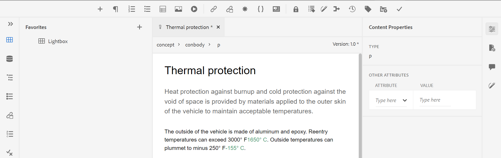

# Iniciar el editor web {#id2056B0140HS}

Puede iniciar el Editor Web desde las ubicaciones siguientes:

- [Página de navegación de AEM](#id2056BG00RZJ)
- [IU de AEM Assets](#id2056BG0307U)
- [Consola de mapa DITA](#id2056BG090BF)

En las secciones siguientes se describen los detalles de cómo puede tener acceso al Editor Web y cómo puede iniciarlo desde varias ubicaciones.

## Página de navegación de AEM {#id2056BG00RZJ}

Al iniciar sesión en AEM, se le muestra la página Navegación:

{width="800"}

Al hacer clic en el vínculo **Guías**, accederá directamente al Editor web.

{width="800"}

Cuando haya iniciado el Editor Web sin seleccionar ningún archivo, aparecerá una pantalla en blanco. Puede abrir un archivo para editarlo desde el repositorio de AEM o desde su colección de Favoritos.

- Haga clic en el icono **Guías** ( ) para volver a la página Navegación de AEM.

- El botón **Cerrar** le lleva a un destino de acuerdo con su configuración:

  

  
 Cloud Services 

  Si utiliza Cloud Services, haga clic en el botón **Cerrar** para volver a la página Navegación de AEM.
  

  

  
 Software On-Premise

  Si utiliza el software On-premise de AEM Guides (4.2.1 y versiones posteriores), haga clic en el botón **Cerrar** de la derecha para volver a la ruta de acceso del archivo actual en la interfaz de usuario de Assets.

  

## IU de AEM Assets {#id2056BG0307U}

Otra ubicación desde la que puede iniciar el Editor web es desde la interfaz de usuario de AEM Assets. Puede seleccionar uno o varios temas y abrirlos directamente en el Editor web. Para abrir un tema en el Editor Web, siga estos pasos:

1. En la interfaz de usuario de Assets, vaya al tema que desee editar.

   >[!NOTE]
   >
   > También puede ver el UUID del tema.

   .

   {width="800"}

   >[!IMPORTANT]
   >
   > Asegúrese de tener los permisos de lectura y escritura en la carpeta que contiene el tema que desea editar.

1. Para obtener un bloqueo exclusivo sobre el tema, selecciónelo y haga clic en **Desproteger**.

   >[!IMPORTANT]
   >
   > Si el administrador ha configurado la opción **Deshabilitar edición sin desprotección**, debe desproteger el archivo antes de editarlo. Si no desprotege el archivo, no podrá ver la opción de edición.

1. Cierre el modo de selección de recursos y haga clic en el tema que desee editar.

   Se muestra la vista previa del tema.

   Puede abrir el editor web desde la vista de lista, la vista de tarjeta y el modo de vista previa.

   >[!IMPORTANT]
   >
   > Si desea abrir varios temas para editarlos, seleccione los temas que desee en la interfaz de usuario de recursos y haga clic en Editar. Asegúrese de que el explorador no tenga habilitado el bloqueador de ventanas emergentes; de lo contrario, solo se abrirá el primer tema de la lista seleccionada para editarlo.

   {width="800"}

   Si no desea obtener una vista previa de un tema y desea abrirlo directamente en el Editor Web, haga clic en el icono Editar del menú de acción rápida desde la vista de tarjeta:

   {width="800"}

1. Haga clic en **Editar** para abrir el tema en el editor web.

   {width="800"}

## Consola de mapa DITA {#id2056BG090BF}

Para abrir el Editor Web desde la consola de mapas DITA, siga estos pasos:

1. En la interfaz de usuario de Assets, desplácese hasta el fichero de mapa DITA que contiene el tema que desea editar y haga clic en él.

   Se muestra la consola de mapas DITA.

1. Haga clic en **Temas**.

   Se muestra una lista de temas en el fichero de asignación. El UUID de los temas se muestra debajo del título del tema.

1. Seleccione el archivo de tema que desee editar.

1. Haga clic en **Editar tema**.

   {width="800"}

1. El tema se abre en el Editor Web.

   >[!IMPORTANT]
   >
   > Si el administrador ha configurado la opción **Deshabilitar edición sin desprotección**, debe desproteger el archivo antes de editarlo. Si no desprotege el archivo, el documento se abrirá en el editor en modo de solo lectura.

**Tema principal:**&#x200B;[&#x200B; Trabajar con el editor web](web-editor.md)
