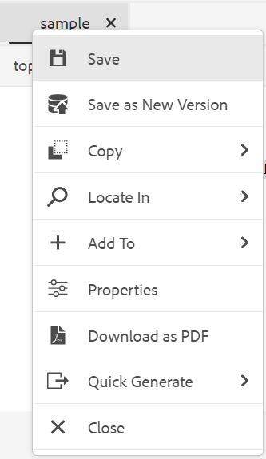

# Otras funciones del editor web {#id2056B0B0YPF}

Hay otras funciones útiles en el editor web que puede utilizar:

**El menú contextual funciona en la ficha de un archivo**

Cuando se abre un archivo en el Editor Web, se pueden realizar varias acciones desde el menú contextual. Puede ver distintas opciones dependiendo de si abre un archivo multimedia, un solo archivo DITA o varios archivos.

**Archivo multimedia**

Se obtienen las siguientes funciones en el menú contextual de la pestaña de un archivo multimedia abierto:

{width="300" align="left"}

**Archivo DITA único**

Se obtienen las siguientes funciones en el menú contextual de la pestaña de un archivo abierto:

:   {width="300" align="left"}

**Varios archivos**

Cuando tenga varios archivos abiertos, obtendrá más opciones en el menú contextual:

{width="550" align="left"}

Las distintas opciones del menú contextual se explican a continuación:

***Guardar***: puedes elegir entre las siguientes opciones:

- **Guardar**: para guardar un archivo sin crear una nueva versión, selecciona **Guardar**. Siempre que se crea un tema nuevo, se crea en DAM una copia de trabajo del tema sin versiones. Al guardar el documento, se actualiza la copia de trabajo del documento en DAM. Guardar esta versión no crea una nueva versión de un tema. Si el tema está en revisión, al guardarlo no se concede a los revisores acceso al contenido del tema modificado.

- **Guardar todos**: si hay varios documentos abiertos en el Editor Web, también tiene la opción de **Guardar todos** los documentos abiertos.

***Guardar como nueva versión***

Para crear una nueva versión del archivo, seleccione **Guardar como nueva versión**. Para obtener más información sobre **Guardar** y **Guardar como nueva versión**, consulte [Conocer las características del Editor web](web-editor-features.md#).

***Copiar***: puede elegir entre las siguientes opciones:

- **Copiar UUID**: para copiar el UUID del archivo activo en el portapapeles, seleccione **Copiar \> Copiar UUID**.
- **Copiar ruta**: para copiar la ruta completa del archivo activo en el Portapapeles, seleccione **Copiar \> Copiar ruta**.

***Localizar en***: puede elegir entre las siguientes opciones:

- **Mapa**: Si ha abierto un mapa DITA grande y desea encontrar la ubicación exacta de un archivo en el mapa, seleccione **Buscar en \> Mapa**. Al seleccionar la opción Localizar en mapa, el archivo \(desde donde se invoca la opción\) se encuentra y se resalta en la jerarquía del mapa. Para poder utilizar esta función, debe abrir el archivo de asignación en el Editor Web. Si la vista de mapa está oculta, al invocar esta función se mostrará la vista de mapa y el archivo se resaltará en la jerarquía de mapas.

- **Repositorio**: similar a Localizar en Map, el **Localizar en \> Repositorio** muestra la ubicación del archivo en el repositorio \(o DAM\). La Vista de repositorio se abre y el archivo seleccionado se resalta en el repositorio. Si el archivo se encuentra dentro de una carpeta, esa carpeta se expande para mostrar la ubicación del archivo seleccionado en el repositorio.

***Agregar a***: puede elegir entre las siguientes opciones:

- **Favoritos**: Para agregar el archivo seleccionado a la colección de favoritos, seleccione **Agregar a \> Favoritos**. Para obtener más información, consulte la descripción de la característica **Favoritos** en la sección [Panel izquierdo](web-editor-features.md#id2051EA0M0HS).

- **Contenido reutilizable**: para copiar el archivo seleccionado en la lista de contenido reutilizable, seleccione **Agregar a \> Contenido reutilizable**. Para obtener más información, consulte la descripción de la característica **Contenido reutilizable** en la sección [Panel izquierdo](web-editor-features.md#id2051EA0M0HS).

***Propiedades***

Para ver la página de propiedades de AEM del archivo seleccionado, seleccione **Propiedades**.

***Split***: puede elegir entre las siguientes opciones:

**Arriba, Abajo, Izquierda o Derecha**

De forma predeterminada, el editor web permite ver un tema a la vez. Podría haber casos en los que le gustaría ver dos o más temas al mismo tiempo. Dividir la pantalla del editor permite ver varios temas al mismo tiempo. Por ejemplo, si tiene dos temas: A y B abiertos en el editor. Al hacer clic con el botón derecho en el tema B y elegir **Dividir \> arriba**, la ventana del editor se divide en dos partes. El tema B se muestra en la mitad superior y el tema A en la mitad inferior. Del mismo modo, también puede dividir la pantalla horizontalmente seleccionando **Dividir \> Izquierda** o **Dividir \> Derecha**. La siguiente captura de pantalla del editor web muestra los temas divididos horizontal y verticalmente. En cada división, puede tener una vista diferente. Por ejemplo, en la siguiente captura de pantalla, la pantalla 1 está en modo de vista Source, la pantalla 2 tiene dos documentos abiertos en modo Autor y la pantalla 3 está en modo de vista previa. Puede mover los documentos de una pantalla a otra arrastrando la ficha de archivo y soltándola en la pantalla en la que desee colocarla. Del mismo modo, también puede reordenar las pestañas de archivo arrastrándolas y moviéndolas según sus preferencias.

{width="800" align="left"}

***Generación rápida***

Generar la salida para el archivo seleccionado. La salida solo se puede generar para archivos que formen parte de un ajuste preestablecido de salida. Para obtener más información, consulte [Publicación basada en artículos desde el editor web](web-editor-article-publishing.md#id218CK0U019I).

***Cerrar***: puede elegir entre las siguientes opciones:

**Cerrar**, **Cerrar otros** o **Cerrar todo**

Si desea cerrar el archivo desde el que invocó el menú contextual, seleccione **Cerrar \> Cerrar**. Use **Cerrar \> Cerrar otros** para cerrar todos los demás archivos abiertos excepto el archivo activo. Para cerrar todos los archivos abiertos, seleccione la opción **Cerrar \> Cerrar todo** en el menú contextual o también puede cerrar el Editor Web. Si hay archivos sin guardar en la sesión, se le pedirá que los guarde.

**Cerrar archivo y guardar escenarios**

Cuando intenta cerrar un archivo abierto en el Editor Web con el botón **Cerrar** de la ficha del archivo o con la opción **Cerrar** del menú Opciones, AEM Guides le pide que guarde las ediciones y desbloquee un archivo bloqueado.

Las solicitudes se basan en las siguientes configuraciones seleccionadas por el administrador:

- **Pedir protección al cerrar:** Cuando cierre el editor, tendrá la opción de proteger el archivo \(que ha desprotegido\).
- **Solicitar nueva versión al cerrar**: se le da la opción de guardar el archivo \(que ha editado\) como una nueva versión al cerrar el editor.

La experiencia de guardado de archivos dependerá de los tres escenarios siguientes, en los que tenga:

- No se han realizado cambios en el contenido.
- Editó el contenido y guardó los cambios.
- Se editó el contenido, pero no se guardaron los cambios.

Puede ver las siguientes opciones en función de si el archivo está bloqueado/desbloqueado y tiene cambios guardados o no guardados:

- **Desbloquear y cerrar**: se libera el bloqueo del archivo y éste se cierra.

  {width="400" align="left"}

- **Guardar como nueva versión**: esto guardará los cambios realizados en el contenido y creará una nueva versión del archivo. También puede agregar etiquetas y comentarios para la versión recién guardada. Para obtener más información acerca de cómo guardar una nueva versión, vea [Guardar como nueva versión](web-editor-features.md#save-as-new-version-id209ME400GXA).

- **Desbloquear el archivo**: si decide desbloquear un archivo, liberará el bloqueo del archivo y los cambios se guardarán en la versión actual del archivo.

  >[!NOTE]
  >
  > Si anula la selección de la opción para desbloquear el archivo, también obtiene una opción para cerrar el archivo sin guardar los cambios.

  Por ejemplo, uno de los indicadores se muestra en la siguiente captura de pantalla:

  {width="400" align="left"}

**Señales visuales para referencias rotas**

- Si el tema contiene referencias cruzadas rotas o referencias de contenido, se muestran en texto rojo.

**Copiar y pegar de forma inteligente**

- Puede copiar y pegar fácilmente contenido dentro de los temas y entre ellos. La estructura del elemento de origen se mantiene en el destino. Además, si el contenido copiado contiene referencias de contenido, incluso esas se copian.

**Recordar la última ubicación examinada**

- El Editor Web proporciona un cuadro de diálogo de exploración de archivos inteligente. El editor recuerda la última ubicación utilizada al insertar una referencia o contenido. La primera vez que invoque el cuadro de diálogo de exploración de archivos \(a través de Insertar referencia o Insertar contenido reutilizado\), se le redirigirá a la ubicación donde se guarde el documento actual. En la misma sesión, si intenta insertar otra referencia, el cuadro de diálogo de exploración de archivos se desplaza automáticamente a la ubicación desde la que insertó la última referencia.

>[!NOTE]
>
> En el caso de un archivo de imagen, audio o vídeo, el cuadro de diálogo de exploración de archivos toma como valor predeterminado la ubicación del archivo y no la última utilizada.

**Compatibilidad con la publicación basada en artículos**

- Desde el Editor Web, se puede generar la salida para uno o varios temas o para todo el mapa DITA. Es necesario crear ajustes preestablecidos de salida para el mapa DITA y, a continuación, generar fácilmente la salida para uno o más temas. Si ha actualizado algunos temas en el mapa, también puede generar el resultado solo para esos temas desde el Editor Web. Para obtener más información, consulte [Publicación basada en artículos desde el editor web](web-editor-article-publishing.md#id218CK0U019I).

**Compatibilidad con documentos de Markdown**

- El editor web permite utilizar documentos de Markdown \(.md\) junto con documentos DITA. Se puede crear y previsualizar fácilmente un documento Markdown en el Editor Web, así como añadirlo en el fichero de mapa a través del editor de mapas DITA. Para obtener más información, consulte [Documentos de Markdown del autor desde el editor web](web-editor-markdown-topic.md#).

**Tema de términos del glosario de soporte para DITA**

- El editor web admite términos del glosario DITA que se pueden insertar agregando `term` o `abbreviated-form` elementos.

**Insertar ecuaciones de MathML**

- Experience Manager Guides le ofrece compatibilidad para insertar ecuaciones de MathML mediante la integración con la aplicación [MathType Web](https://docs.wiris.com/en/mathtype/mathtype_web/intro). Para insertar una ecuación de MathML, seleccione el icono **Insertar elemento** y escriba mathml. Cuando selecciona un elemento matemático de la lista, aparece el cuadro de diálogo **Insertar MathML**:

{width="550" align="left"}

Con las herramientas de ecuaciones de MathML, cree la ecuación y haga clic en **Insertar** para agregarla al documento. La ecuación se inserta con un fondo gris claro, como se muestra a continuación:

{width="400" align="left"}

En cualquier momento puedes actualizar una ecuación haciendo clic con el botón derecho en una ecuación existente y seleccionando **Editar MathML** en el menú contextual.

- **Validación de ecuaciones en el editor de MathML**

  Experience Manager Guides valida las ecuaciones de MathML cuando se guarda un tema que las contiene.
Cuando se inserta una ecuación con el editor de MathML, Experience Manager Guides resalta la ecuación en rojo si hay algún problema de sintaxis. Puede corregirla antes de insertarla. Si no hace ningún cambio pero selecciona **Insertar**, se muestra una advertencia.

  {width="400" align="left"}

  Si inserta la ecuación de MathML que contiene un error de sintaxis, se produce un error de validación al intentar guardar el tema.

**Insertar notas al pie**

- Insertar nota al pie en el contenido usando el elemento `fn`. En el modo Autor, el valor de la nota al pie se muestra alineado con el contenido. Sin embargo, cuando cambia al modo Vista previa o publica el documento, la nota al pie aparece al final del tema.

**Cambiar el nombre o reemplazar un elemento**

- El editor web muestra la ruta de exploración del elemento en la parte superior del tema. Si desea intercambiar o reemplazar un elemento por otro, puede hacerlo desde el menú contextual de la ruta de exploración. Por ejemplo, puede intercambiar el elemento `p` por `note` o cualquier otro elemento válido en el contexto.

{width="400" align="left"}

En la ruta de exploración, haga clic con el botón secundario en el nombre de un elemento que desee reemplazar y, a continuación, seleccione Cambiar nombre de elemento en el menú contextual. El cuadro de diálogo Cambiar nombre de elemento muestra todos los elementos válidos permitidos en la ubicación actual. En el cuadro de diálogo Cambiar nombre de elemento, seleccione el elemento que desee utilizar. El elemento original se reemplaza por el nuevo.

Además del menú contextual de la ruta de exploración, también se puede acceder al cuadro de diálogo Cambiar nombre de elemento desde otras ubicaciones:

- Haga clic en el nombre del elemento en la ruta de exploración para seleccionar el contenido del elemento y haga clic con el botón derecho en el contenido seleccionado para que aparezca el menú contextual.

- Habilite la vista Etiquetas, haga clic en la etiqueta de apertura de cualquier elemento y, a continuación, haga clic con el botón derecho en el contenido seleccionado para que aparezca el menú contextual.

- Puede acceder al cuadro de diálogo Cambiar nombre de elemento invocando el menú Opciones de un elemento del panel Esquema.

**Agrupar un elemento**

- El ajuste de un elemento permite agregar una etiqueta de elemento al texto seleccionado. El texto se puede ajustar a cualquier elemento secundario según los estándares DITA. Por ejemplo, si tiene texto bajo un elemento `note`, puede ajustar el texto a un elemento `p`.

  La opción **Justificar elemento** está disponible en el menú contextual de la ruta de exploración del tema. Para envolver un elemento, haga clic con el botón derecho en el elemento y abra el menú contextual. Seleccione el elemento del cuadro de diálogo **Justificar elemento**. El texto aparece en el nuevo elemento.

  También puede seleccionar el texto o el elemento del contenido y, a continuación, seleccionar la opción **Justificar elemento** en el menú contextual.

**Desenvolver un elemento**

- Al desajustar un elemento, puede quitar la etiqueta del elemento del texto seleccionado y combinarlo con su elemento principal. Por ejemplo, si tiene un elemento `p` dentro de un elemento `note`, puede desenvolver el elemento `p` para combinar el texto directamente dentro del elemento `note`. La opción **Desenvolver elemento** está disponible en el menú contextual de la ruta de exploración del tema. Para desenvolver un elemento, haga clic con el botón derecho en el elemento para abrir el menú contextual y, finalmente, seleccione **Desenvolver elemento** para quitar el elemento y combinar el texto del elemento con su elemento principal.

**Administración de espacios en blanco para elementos DITA**

- En XML, los espacios en blanco incluyen espacios, tabulaciones, retornos de carro y líneas en blanco. Experience Manager Guides convierte varios espacios en blanco consecuentes en un espacio. Esto le ayuda a conservar la vista de WYSIWYG del editor web.

  >[!NOTE]
  >
  >En algunos elementos en los que es necesario conservar los espacios en blanco según las reglas DITA, se conservan los múltiples espacios en blanco consiguientes. Por ejemplo, `<pre>` y `<codeblock>` elementos.

**Conservando saltos de línea y sangría**

- Los elementos DITA que contienen saltos de línea y espacios son compatibles y se representan según su definición en los modos Autor, Source o Vista previa, y también en la salida publicada final. La siguiente captura de pantalla muestra el contenido dentro del elemento `msgblock` en el que se han conservado los saltos y espacios de línea \(sangría\):

{width="500" align="left"}

**Administrar espacios de no separación en el editor web**

- Puede insertar espacios de no separación en el documento mediante el icono **Insertar caracteres especiales**  o las teclas de método abreviado **Alt** + **Espacio**.  Estos espacios de no separación aparecen como un indicador mientras edita un tema en el Editor Web. Puede desactivar la visualización de los espacios de no separación con la opción **Mostrar indicador de espacio de no separación en el modo Autor** de la pestaña **Aspecto** de **Preferencias de usuario** .

- Si copia y pega contenido con un espacio de no separación de cualquier origen externo en la vista **Autor**, el espacio de no separación se convierte en un espacio.
Sin embargo, si copia y pega contenido con un espacio de no separación de la vista **Autor**, se conservará.

**Id. de elemento generado automáticamente**

- Se pueden generar automáticamente ID para los elementos del tema DITA. Estos ID son únicos dentro de un tema DITA. Por ejemplo, si genera ID para un elemento de párrafo, los ID serán p\_1, p2, p\_3, etc. Puede seleccionar varios elementos y generar ID para cada elemento seleccionado.

Haga lo siguiente para generar automáticamente el ID para uno o varios elementos:

1. Abra el tema en el editor web.
1. Seleccione el contenido al que desea asignar los ID.
1. Haga clic con el botón derecho y seleccione **Generar ID. en el menú contextual.**

   También puede hacer clic con el botón derecho en la ruta de exploración y seleccionar **Generar ID**.

**Tema principal:**&#x200B;[ Trabajar con el editor web](web-editor.md)
