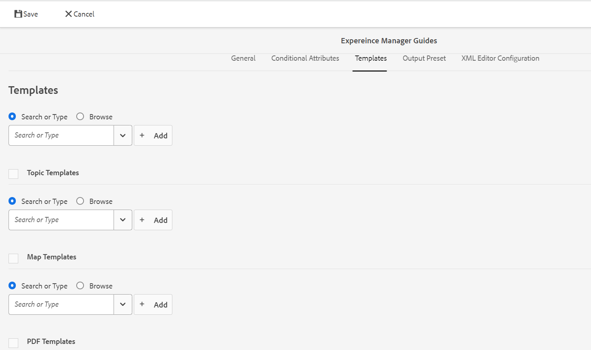

# Configuración de perfiles globales o de nivel de carpeta {#id181AH2003PF}

En una empresa, diferentes grupos o productos pueden utilizar diferentes plantillas de creación, plantillas de salida, perfiles de atributos condicionales \(o esquemas de asunto\) y configuraciones del Editor web. La configuración de estos solo a nivel empresarial \(o global\) puede dificultar la experiencia de los autores, ya que verán plantillas o perfiles que no son relevantes para ellos.

AEM Guides permite configurar la creación de plantillas \(topic o map\), plantillas de salida, atributos condicionales y configuraciones del editor web en el nivel \(global\) empresarial, así como en el nivel de carpeta. De este modo, puede separar las configuraciones para diferentes departamentos o productos de la empresa.

Además, puede delegar las configuraciones específicas de la carpeta a un departamento o a administradores de productos para descentralizar la administración.

Con el mosaico Perfiles de carpeta en la configuración de las Guías, puede establecer la configuración en las siguientes pestañas:

{width="800" align="left"}

- **General**: La ficha General sólo está disponible cuando está configurando la configuración de nivel de carpeta \(o proyecto/producto\). Puede configurar opciones, como las rutas de carpeta en las que se aplicará la configuración y los usuarios que tengan derechos administrativos para crear o actualizar configuraciones.

- **Atributos condicionales**: utilice esta ficha para configurar atributos condicionales a nivel global o de carpeta. Un atributo condicional es una combinación del nombre y valor del atributo, y también puede definir una etiqueta para él. Puede utilizar los atributos DITA estándar o sus propios atributos personalizados. Los atributos condicionales que defina a nivel global estarán disponibles para todos los usuarios de los proyectos. Si ha definido atributos condicionales de nivel de carpeta, estos se combinan con los atributos condicionales definidos globalmente.

- **Plantillas**: utilice esta ficha para configurar las plantillas que los autores utilizarán para crear o publicar contenido DITA. Las siguientes plantillas de temas están disponibles de forma predeterminada:

   - Glosario

   - Referencia

   - Tema

   - Concepto

   - Tarea

   - Resolución de problemas

   - En blanco

   - DITAVAL

  >[!NOTE]
  >
  > Puede utilizar cualquiera de las plantillas existentes como base para crear nuevas plantillas. La plantilla DITA en blanco no contiene estructura ni elementos como las demás plantillas. Puede utilizar cualquiera de las plantillas OOTB DITA como base, realizar modificaciones en ellas y guardarlas con un nombre diferente. Después de realizar los cambios necesarios, agregue la plantilla actualizada a la configuración de plantillas de creación global o de nivel de carpeta y, a continuación, estará disponible para la creación.

  Junto con las plantillas de temas, también puede definir las plantillas de mapas que estarán disponibles para los autores. Las siguientes plantillas de mapas están disponibles de forma predeterminada:

   - Mapa

   - Bookmap

- **Ajuste preestablecido de salida**: de forma similar a las plantillas, hay cinco ajustes preconfigurados de salida:

   - Sitio de AEM

   - PDF

   - HTML5

   - EPUB

   - Personalizado

  Los editores pueden utilizar estos ajustes preestablecidos de salida predeterminados para publicar contenido. Un administrador del perfil global o de nivel de carpeta puede configurar estos ajustes preestablecidos. Una vez configurados, los editores pueden acceder a los ajustes preestablecidos de publicación para las asignaciones DITA recién creadas. También puede aplicar ajustes preestablecidos de publicación a mapas DITA existentes. Consulte [Aplicar cambios de ajustes preestablecidos](#id18AGD0K0OHS) para obtener más información.

- **Configuraciones del editor XML**: utilice esta ficha para personalizar el aspecto y las diversas características del editor Web. Las siguientes opciones configurables están disponibles para el editor web:

   - Configuración de IU del Editor XML
   - Diseño de página del editor XML
   - Configuración del editor XML
   - Diseño de plantilla CSS
   - Fragmentos del editor XML
   - Etiquetas de versión de contenido XML
   - Rootmap \(solo en el nivel de carpeta\)

Puede configurar ambos: perfil global y perfil de nivel de carpeta. En un perfil de nivel de carpeta, puede definir las carpetas en las que se aplicará la configuración. Esta configuración incluye atributos condicionales, plantillas, ajustes preestablecidos de salida y configuración del Editor XML. A continuación, los ajustes preestablecidos condicionales, las plantillas y las configuraciones del Editor XML se ponen a disposición de los autores que trabajan en las carpetas configuradas. Del mismo modo, los editores tendrán acceso a los ajustes preestablecidos de salida configurados definidos dentro de las carpetas configuradas.

Un perfil de nivel de carpeta anula la configuración del perfil global. En otras palabras, si una carpeta tiene un perfil de nivel de carpeta, mostrará las plantillas, las plantillas de salida y la configuración del Editor XML configurada en su perfil de carpeta correspondiente. No mostrará la configuración configurada en el perfil global. Sin embargo, esto no se aplica a los atributos condicionales. En el caso de los atributos condicionales, estos se combinan a nivel global y de carpeta.

Las siguientes secciones le guían a través del proceso de configuración de perfiles globales y perfiles de nivel de carpeta.

## Configuración del perfil global

Siga estos pasos para configurar el perfil global:

1. Inicie sesión en Adobe Experience Manager como administrador.

1. Haga clic en el vínculo Adobe Experience Manager en la parte superior y elija **Herramientas**.

1. Seleccione **Guías** de la lista de herramientas y haga clic en **Perfiles de carpeta**.

   Por primera vez, la página Perfiles de carpeta se muestra únicamente con el mosaico Perfil global.

   {width="800" align="left"}

1. Haga clic en el mosaico **Perfil global**.

1. Para configurar **Atributos condicionales**, consulte [Configurar atributos condicionales para perfiles globales o de nivel de carpeta](#id1889D0I305Z).

1. Para configurar **Plantillas**, consulte [Configurar la creación de plantillas](#id1889D0IL0Y4).

1. Para configurar **ajustes preestablecidos de salida**, consulte [Configurar ajustes preestablecidos de salida](#id18AGD0IH0Y4).

1. Para configurar el Editor XML, vea [Configurar y personalizar el Editor XML](#id2065G300O5Z).

1. Después de realizar todas las actualizaciones necesarias, guarde y cierre el **Perfil global**.


## Creación y configuración de un perfil de nivel de carpeta

Siga estos pasos para configurar un perfil de nivel de carpeta:

1. Inicie sesión en Adobe Experience Manager como administrador.

1. Haga clic en el vínculo Adobe Experience Manager en la parte superior y elija **Herramientas**.

1. Seleccione **Guías** de la lista de herramientas y haga clic en el mosaico **Perfiles de carpeta**.

   Por primera vez, la página Perfiles de carpeta se muestra únicamente con el mosaico Perfil global predeterminado.

1. Haga clic en **Crear**.

   {width="300" align="left"}

1. Escriba los siguientes detalles en el diálogo **Crear perfil de carpeta**:
   - Nombre del perfil de carpeta.
   - Ruta de la carpeta donde se aplicará el perfil.

     >[!NOTE]
     >
     > No se pueden aplicar varios perfiles de carpeta a una carpeta. Asegúrese de que la carpeta que está seleccionando aquí no tenga aplicado ningún otro perfil. Si una carpeta principal-secundaria tiene sus propios perfiles específicos, la carpeta secundaria utiliza las configuraciones de su propio perfil. Las configuraciones de la carpeta principal no anulan las configuraciones de una carpeta secundaria.

1. Haga clic en **Crear**.

   Se crea un nuevo mosaico con el nombre del perfil de carpeta en la página Perfiles de carpeta

1. Haga clic en el mosaico del perfil de la carpeta para editarlo.

   Se muestra una pestaña General con el nombre del perfil de carpeta y la información de carpeta configurada.

1. Haga clic en **Editar** para agregar varias carpetas y usuarios que tendrán acceso administrativo para modificar el perfil de la carpeta.

   >[!NOTE]
   >
   > Los usuarios que agregue aquí tendrán los derechos administrativos para actualizar los atributos condicionales, la plantilla y los ajustes preestablecidos de salida configurados para este perfil de carpeta.

1. Para agregar una carpeta, haga clic en el icono Examinar en la Ruta de la carpeta, vaya a una carpeta y selecciónela. A continuación, haga clic en Agregar para agregar la carpeta a este perfil.

   >[!NOTE]
   >
   > Asegúrese de que la carpeta que elija aquí no tenga asociado ningún otro perfil de nivel de carpeta.

1. Para agregar un usuario, selecciónelo en la lista desplegable **Usuarios administradores** y haga clic en **Agregar**.

   >[!NOTE]
   >
   > Puede agregar varios usuarios al perfil de carpeta desde la lista desplegable. También puede quitar un usuario administrador existente de la lista haciendo clic en el icono Eliminar situado junto al ID de usuario.

1. Después de agregar todas las carpetas y usuarios necesarios al perfil de carpeta, haz clic en **Guardar**.


Ahora está listo para configurar los atributos condicionales, las plantillas, los ajustes preestablecidos de salida y el Editor XML.

>[!IMPORTANT]
>
> Al crear un perfil de carpeta, de forma predeterminada no contiene ninguna plantilla. Debe agregar las plantillas necesarias en el perfil de carpeta para que estén disponibles para los autores.

## Configurar atributos condicionales para perfiles globales o de nivel de carpeta {#id1889D0I305Z}

Realice los siguientes pasos para configurar atributos condicionales estándar compatibles con DITA a nivel global o de carpeta:

1. Inicie sesión en Adobe Experience Manager como administrador o como el usuario que tenga derechos administrativos en un perfil de nivel de carpeta.

1. Haga clic en el vínculo Adobe Experience Manager en la parte superior y elija **Herramientas**.

1. Seleccione **Guías** de la lista de herramientas y haga clic en el mosaico **Perfiles de carpeta**.

1. Haga clic en el mosaico de perfil que desee configurar.

   >[!NOTE]
   >
   > Puede elegir configurar atributos condicionales en el perfil global o en un perfil de nivel de carpeta.

1. En la página de perfil, haga clic en la ficha **Atributos condicionales**.

1. Haga clic en **Editar**.

1. Haga clic en **Agregar**.

1. Escriba **Name**, **Value** y **Label** para el atributo condicional.

   Puede guardar un perfil con solo el nombre del atributo. Sin embargo, un atributo solo se puede utilizar cuando tiene un valor especificado. Si se especifican tanto el valor - como la etiqueta para un atributo, el editor web muestra la etiqueta del atributo condicional. Además, la etiqueta se muestra al administrador de publicación en el momento de crear un ajuste preestablecido condicional.

   La siguiente captura de pantalla muestra la definición del atributo `platform` con posibles valores y etiquetas.

   

1. Si desea agregar más valores para el mismo atributo, haga clic en el icono **+** e introduzca el valor y la etiqueta adicionales.

1. Si desea agregar más atributos, haga clic en **Agregar**.

1. Haga clic en **Guardar**.


Si utiliza un atributo personalizado, debe ser un atributo DITA válido admitido por el DTD. Si desea utilizar cualquier atributo que no sea un atributo DITA estándar, realice los siguientes pasos adicionales:

1. Añada el atributo personalizado al fichero DTD. Por ejemplo, si el fichero DTD es commonElements.mod, deberá localizarlo en el directorio DTD. La ruta por defecto del fichero DTD del sistema es:

   /libs/fmdita/dita\_resources/DITA-1.3/dtd/base/dtd/commonElements.mod

   >[!IMPORTANT]
   >
   > El archivo DTD especializado debe formar parte de la implementación de código personalizado. Las DTD en /apps forman parte de la implementación del producto y, por lo tanto, se sobrescriben con la instalación de cualquier nueva versión. Se recomienda añadir DTD especializada en /var/xml/dita\_resources dentro de la carpeta del proyecto e incluir la ruta de DTD/catálogo en el perfil DITA. Para obtener más información, consulte [Integrar la especialización DITA](dita-ot-specialization.md#id211MB0E00XA).

1. Utilice el Administrador de paquetes para descargar el archivo /libs/fmdita/config/condAttrList.xml:

1. Cree una copia del archivo condAttrList.xml en la siguiente ubicación del repositorio Git de Cloud Manager:

   `/apps/fmdfmdita/config/condAttrList.xml`

1. Guarde el archivo.

1. Agregue atributos personalizados al perfil global o de nivel de carpeta.


## Configuración de plantillas {#id1889D0IL0Y4}

AEM Guides incluye 7 plantillas de temas predeterminadas, 2 plantillas de mapas DITA y 3 plantillas de PDF. Puede elegir que solo haya unas pocas plantillas disponibles para los autores y editores. Si utiliza una plantilla personalizada, la misma se puede configurar y poner a disposición para la creación y publicación. Utiliza la ficha **Plantillas** de la configuración de Perfiles de carpeta para agregar o quitar plantillas de tema, asignación o PDF de perfiles globales o de nivel de carpeta.

Incluso antes de configurar el tema, el mapa o las plantillas de PDF a nivel global o de carpeta, también puede definir una ubicación para almacenar las plantillas personalizadas. Para configurar una ubicación personalizada para almacenar las plantillas, consulte [Configurar la ruta de la carpeta de plantillas DITA personalizada](conf-template-tags-custom-dita-topic-template.md#id191LCF0095Z).

Realice los siguientes pasos para agregar las plantillas de tema, asignación o PDF a un perfil de carpeta:

1. Inicie sesión en Adobe Experience Manager como administrador o como el usuario que tenga derechos administrativos en un perfil de nivel de carpeta.

1. Haga clic en el vínculo Adobe Experience Manager en la parte superior y elija **Herramientas**.

1. Seleccione **Guías** de la lista de herramientas y haga clic en el mosaico **Perfiles de carpeta**.

1. Haga clic en el mosaico de perfil que desee configurar.

   >[!NOTE]
   >
   > Puede elegir configurar una plantilla en el perfil global o un perfil de nivel de carpeta.

1. En la página de perfil, haga clic en la ficha **Plantillas**.
1. Haga clic en **Editar**.

   Puede obtener las opciones para agregar plantillas de temas, mapas y PDF buscando desde la ubicación predeterminada o buscándolo.

   >[!NOTE]
   >
   > De forma predeterminada, todas las plantillas se almacenan en la carpeta /content/dam/dita-templates. La carpeta `dita-templates` contiene `topics`, `maps` y `PDF` subcarpetas para almacenar las plantillas de tema, asignación y PDF. Puede agregar las plantillas personalizadas \(.dita, .xml o .ditamapfiles\) en las carpetas de plantillas predeterminadas. Una vez que añada la plantilla a la carpeta predeterminada, podrá añadirlas en el perfil global o de carpeta. Para obtener más información acerca de cómo crear plantillas personalizadas mediante el Editor Web, vea [Crear una plantilla de creación personalizada](#id1917D0EG0HJ).

   {width="800" align="left"}

1. Añada las plantillas temáticas, de asignación y de PDF necesarias a su perfil.

   Para agregar una plantilla, realice una de las siguientes acciones:

   - Elija **Buscar o Escriba** y escriba o seleccione el nombre de una plantilla en la lista desplegable. La lista desplegable consta de todas las plantillas predeterminadas y cualquier plantilla nueva que haya creado.

     {width="800" align="left"}

   - Haga clic en **Examinar** y seleccione una plantilla de DAM.

1. Haga clic en **Agregar**.

   Las plantillas seleccionadas se añaden a la lista de plantillas.

   {width="800" align="left"}

   >[!NOTE]
   >
   > Puede cambiar el orden de las plantillas arrastrándolas y soltándolas en la posición deseada en la lista. La posición de las plantillas controla el orden en que se muestran en la página de modelo en el flujo de trabajo de creación de temas o mapas.

1. Para definir las reglas de traducción, examine la ubicación de SRX para encontrar la carpeta que contiene los archivos SRX. El formato SRX \(Intercambio de reglas de segmentación\) es un estándar para intercambiar reglas de segmentación entre distintos usuarios y entornos de traducción. Puede crear una carpeta y agregarle los archivos SRX personalizados.

   Una vez creada la carpeta que contiene los archivos SRX, puede agregar la ruta de la carpeta en la **ubicación SRX de traducción** configuración dentro del perfil de la carpeta.

   AEM Guides elige las reglas SRX según el idioma de origen del proyecto de traducción. Busca un archivo SRX personalizado para un idioma y, si no define un archivo SRX personalizado, selecciona las reglas según las reglas de traducción predeterminadas.

1. Haga clic en **Guardar**.


Si ha configurado las plantillas en un perfil de nivel de carpeta, las plantillas configuradas se asocian a la carpeta configurada. Todos los proyectos creados en la carpeta configurada solo tendrán acceso a las plantillas configuradas en el perfil de nivel de carpeta.

## Crear una plantilla de creación personalizada {#id1917D0EG0HJ}

AEM Guides es una forma sencilla de crear plantillas. Como administrador del sistema, puede utilizar el Editor Web para crear plantillas desde cero. A continuación, puede añadir la nueva plantilla al perfil global o asignarla a una carpeta específica mediante el perfil específico de la carpeta.

Siga estos pasos para crear una plantilla de creación personalizada:

1. Inicie sesión en Adobe Experience Manager como administrador.

1. En la interfaz de usuario de Assets, vaya a la carpeta configurada para almacenar los archivos de plantilla. De forma predeterminada, todas las plantillas de temas se almacenan en la carpeta /content/dam/dita-templates/topics.

   >[!NOTE]
   >
   > Para configurar una ubicación personalizada para almacenar plantillas de temas o asignaciones, consulte [Configurar la ruta de la carpeta de plantillas DITA personalizada](conf-template-tags-custom-dita-topic-template.md#id191LCF0095Z)

1. Haga clic en **Crear** \> **Plantilla DITA**.

1. En la página Modelo, seleccione el tipo de plantilla de tema DITA que desea crear.

   >[!NOTE]
   >
   > Puede utilizar la plantilla En blanco para empezar desde cero. La plantilla en blanco no contiene ninguna estructura ni ningún elemento.

1. Haga clic en **Siguiente**.

1. En la nueva página Propiedades de plantilla, escriba un **Título**, **Nombre** y **Descripción** para la plantilla.

   >[!NOTE]
   >
   > El nombre se sugiere automáticamente en función del Título de la plantilla. Si desea especificar manualmente el nombre, asegúrese de que el nombre no contenga espacios, apóstrofos ni llaves, y termine con .dita.

1. *\(Opcional\)* Haga clic en el botón **Agregar una miniatura** al explorador y seleccione una miniatura para asociarla a la plantilla.

1. Haga clic en **Crear**.

   Aparecerá el mensaje Tema creado.

   Puede elegir abrir la plantilla para editarla en el Editor Web o guardar el archivo de plantilla en la ubicación del almacén de plantillas. Una vez creada la plantilla, puede utilizar el Editor Web para personalizarla según sus necesidades de creación. Una vez preparada una plantilla, asegúrese de asociarla con un perfil global o de nivel de carpeta.


## Configurar ajustes preestablecidos de salida {#id18AGD0IH0Y4}

En una configuración empresarial típica, se pueden utilizar diferentes plantillas de salida para diferentes productos o guías del usuario. Además, podría haber algunos procesos comunes de generación de resultados que deberían utilizar todos los editores y un conjunto de procesos específicos de generación de resultados para un grupo específico de editores o proyectos.

AEM Guides permite al administrador crear ajustes preestablecidos de salida con configuraciones específicas que luego pueden utilizar todos los editores o un conjunto específico de ellos para generar resultados. Por ejemplo, el administrador puede crear un ajuste preestablecido de salida para generar una guía del usuario que sea común en todos los editores. Y, otro para crear los manuales de programación que son específicos para un conjunto de editores. Ambos ajustes preestablecidos se pueden configurar para utilizar diferentes plantillas de salida. En este ejemplo, el ajuste preestablecido de publicación común para generar la guía del usuario se puede configurar a nivel global. Además, el ajuste preestablecido de salida para generar el manual de usuario de programación se puede configurar a nivel de carpeta.

Una vez creados en el sistema los ajustes preestablecidos de salida por defecto, todos los mapas DITA creados posteriormente utilizarán los ajustes preestablecidos por defecto para generar salida. Sin embargo, todos los mapas DITA existentes seguirían utilizando los ajustes preestablecidos de salida configurados anteriormente con ellos. Si desea aplicar el nuevo ajuste preestablecido de salida en todas las asignaciones DITA existentes, deberá ejecutar el flujo de trabajo Aplicar cambios preestablecidos.

Además de los ajustes preestablecidos configurados en el nivel global o empresarial, un editor seguiría teniendo derechos para crear más ajustes preestablecidos de salida. Sin embargo, estos ajustes preestablecidos están vinculados al mapa DITA para el que se han creado. Para obtener más información sobre cómo crear ajustes preestablecidos de salida normales para un mapa DITA, consulte *Crear, editar, duplicar o quitar un ajuste preestablecido de salida* en la guía Usar Adobe Experience Manager Guides as a Cloud Service.

Realice los siguientes pasos para configurar los ajustes preestablecidos de salida globales o específicos de carpeta:

1. Inicie sesión en Adobe Experience Manager como administrador o como el usuario que tenga derechos administrativos en un perfil específico de la carpeta.

1. Haga clic en el vínculo Adobe Experience Manager en la parte superior y elija **Herramientas**.

1. Seleccione **Guías** de la lista de herramientas y haga clic en el mosaico **Perfiles de carpeta**.

1. Haga clic en el mosaico de perfil que desee configurar.

   >[!NOTE]
   >
   > Puede elegir configurar los ajustes preestablecidos de salida en el perfil global o en un perfil específico de carpeta.

1. En la página de perfil. haga clic en la ficha **Valores de salida**.

   Se muestra una lista de ajustes preestablecidos de salida predeterminados, que incluyen AEM Site, PDF, HTML5, EPUB y CUSTOM.

1. Realice una de las siguientes acciones para crear o editar un ajuste preestablecido de salida:

   - Haga clic en **Crear** para crear un nuevo ajuste preestablecido de salida desde cero.
   - Haga clic en Duplicar para crear una copia del ajuste preestablecido de salida seleccionado. Puede realizar cambios en el ajuste preestablecido duplicado y guardarlo.

   - Haga clic en **Editar** para abrir la configuración del ajuste preestablecido seleccionado y editarlo.

     Para obtener información acerca de la configuración de ajustes preestablecidos de salida, consulte *Explicación de los ajustes preestablecidos de salida* en la guía Uso de Adobe Experience Manager Guides as a Cloud Service.

1. Haga clic en **Guardar** para guardar la configuración del ajuste preestablecido.


Todos los mapas DITA creados o cargados posteriormente tendrán el ajuste preestablecido de salida nuevo o actualizado.

## Aplicar cambios preestablecidos {#id18AGD0K0OHS}

Un nuevo ajuste preestablecido de salida creado a nivel global estará disponible para todos los nuevos mapas DITA que cree a partir de ahora. Del mismo modo, si se crea un nuevo ajuste preestablecido de salida en el nivel de carpeta, ese ajuste preestablecido estará disponible para todas las asignaciones que se creen en la carpeta configurada. De forma predeterminada, un nuevo ajuste preestablecido de salida no está disponible para ningún mapa DITA existente.

Si ha actualizado un ajuste preestablecido de salida existente o desea que un nuevo ajuste preestablecido de salida esté disponible para las asignaciones DITA existentes, realice los siguientes pasos:

1. Inicie sesión en Adobe Experience Manager como administrador o como el usuario que tenga derechos administrativos en un perfil específico de la carpeta.

1. Haga clic en el vínculo Adobe Experience Manager en la parte superior y elija **Herramientas**.

1. Seleccione **Guías** de la lista de herramientas y haga clic en el mosaico **Perfiles de carpeta**.

1. Haga clic en el mosaico de perfil que desee configurar.

   >[!NOTE]
   >
   > Puede elegir configurar los ajustes preestablecidos de salida en el perfil global o en un perfil específico de carpeta.

1. En la página de perfil. haga clic en la ficha **Valores de salida**.

   Se muestra una lista de ajustes preestablecidos de salida predeterminados, que incluyen AEM Site, PDF, HTML5, EPUB y CUSTOM.

1. Seleccione el ajuste preestablecido de salida que desee aplicar a las asignaciones DITA existentes.

1. Haga clic en **Aplicar cambios de ajustes preestablecidos** en la barra de herramientas principal.

1. En el cuadro de diálogo Aplicar cambios preestablecidos, puede elegir entre lo siguiente:

   - **Seleccionar la opción Sobrescribir ajuste preestablecido existente**: si selecciona esta opción, cualquier actualización que haya realizado en los ajustes preestablecidos de salida existentes sobrescribirá la configuración en todas las asignaciones DITA existentes en las que se utilice ese ajuste preestablecido. Sin embargo, si lo hace, se perderá cualquier ajuste preestablecido condicional existente y la información de línea de base asociada al mapa.

   - **No se selecciona la opción Sobrescribir ajuste preestablecido existente**: si no selecciona esta opción, las actualizaciones que haya realizado en los ajustes preestablecidos de salida existentes no afectarán a los mapas DITA existentes. A las asignaciones DITA existentes solo se añaden los ajustes preestablecidos recién añadidos. Tenga en cuenta que el mapa DITA recién creado obtiene los ajustes preestablecidos de salida actualizados y los ajustes preestablecidos recién añadidos.

1. Haga clic en **Aceptar** para aplicar los cambios de los ajustes preestablecidos de salida seleccionados en todas las asignaciones DITA existentes.


## Configuración del asistente de IA para la creación y la ayuda inteligentes

Para Experience Manager Guides as a Cloud Service ().

El asistente de IA de Adobe Experience Manager Guides es una potente herramienta impulsada por IA que se ha diseñado para mejorar el contenido mediante la creación inteligente y las experiencias de reutilización de contenido. Agrupa dos características de IA sólidas — **Creación** y **Ayuda** — en la interfaz de Experience Manager Guides, lo que le permite crear documentos y acceder a la información de forma más rápida y eficaz.

Para obtener detalles de configuración, vea [Configuración del Asistente de IA](./conf-smart-suggestions.md).

**Configurar sugerencias inteligentes con tecnología de IA**

Puede configurar las sugerencias inteligentes con tecnología de IA y ayudar a los autores a reutilizar el contenido existente y crear fácilmente referencias de contenido correctas y coherentes. La pestaña **Configuración de IA** le permite controlar la configuración de **Sugerir contenido reutilizable** desde el panel Asistente de IA en el Editor web.

Realice los siguientes pasos para configurar la IA estándar en el perfil global o de nivel de carpeta:
1. Inicie sesión en Adobe Experience Manager como administrador o usuario con derechos administrativos en un perfil de nivel de carpeta.
1. Seleccione el vínculo **Adobe Experience Manager** de la parte superior y elija **Herramientas**.
1. Seleccione **Guías** de la lista de herramientas y seleccione el mosaico **Perfiles de carpeta**.
1. Seleccione el mosaico de perfil que desea configurar.

   >[!NOTE]
   >
   >Puede configurar sugerencias inteligentes basadas en IA para el perfil global o de nivel de carpeta.

1. En la página de perfil, seleccione la ficha **Configuración de IA**.

    {width="800" align="left"}

1. Seleccione **Editar**.
1. Como administrador, puede configurar las siguientes opciones:

   **Caracteres mínimos**: escriba el número mínimo de caracteres que los autores necesitan para obtener las sugerencias. Por ejemplo, si este número es 7, el autor debe agregar al menos 7 caracteres para ver una sugerencia inteligente.

   **Máximo de sugerencias**: escriba el número máximo de sugerencias que los autores pueden obtener durante la creación del contenido. Por ejemplo, si este número es 5, el autor puede ver cinco sugerencias inteligentes o menos.

   **Archivos y carpetas**: seleccione los archivos o carpetas desde los que se deben mostrar las sugerencias inteligentes. *Para mantener la coherencia del contenido, se recomienda que no haya dos entradas en la lista que tengan archivos comunes entre ellas*. Una vez seleccionados los archivos y carpetas, se muestran.

1. Haga clic en **Guardar**.

   >[!NOTE]
   >
   > Los detalles del último estado indexado se muestran en la parte superior después de guardar el archivo.

Obtenga más información sobre cómo ver y agregar [sugerencias inteligentes basadas en IA](../user-guide/authoring-ai-based-smart-suggestions.md) para agregar referencias de contenido durante la creación en el Editor web.

**Personalizar las preguntas predeterminadas para la ayuda inteligente**

Para Experience Manager Guides as a Cloud Service ().

Puede configurar la **Ayuda** inteligente con tecnología de IA para ayudar a los autores a hacer preguntas y encontrar fácilmente el contenido requerido de la [documentación de Experience Manager Guides](https://experienceleague.adobe.com/en/docs/experience-manager-guides/using/overview).

La ficha **Configuración del editor XML** le permite configurar las preguntas predeterminadas del panel **Ayuda**.

>[!NOTE]
>
>Puede configurar hasta 10 preguntas predeterminadas.

Siga estos pasos para configurar las preguntas predeterminadas:

1. Inicie sesión en Adobe Experience Manager como administrador o usuario con derechos administrativos en un perfil de nivel de carpeta.
1. Seleccione el vínculo **Adobe Experience Manager** de la parte superior y elija **Herramientas**.
1. Seleccione **Guías** de la lista de herramientas y seleccione el mosaico **Perfiles de carpeta**.
1. Seleccione el mosaico de perfil que desea configurar.

   >[!NOTE]
   >
   >Puede configurar las preguntas predeterminadas del **panel de Ayuda inteligente** en un perfil global o de nivel de carpeta.

1. Seleccione la ficha **Configuración del editor XML**.

1. Haga clic en el icono **Editar** de la parte superior.
1. En la sección **Configuración de la interfaz de usuario del editor XML**, seleccione el icono **Descargar** para descargar el archivo `ui_config.json` en su sistema local.
1. En el archivo `ui_config.json`, agregue las preguntas de ejemplo.

   **Ejemplo de preguntas de ejemplo**:

   ```json
   "assistantSampleQuestions": [
   "How to create a new topic",
   "How to create a new map",
   "What is a baseline" ]
   ```

1. Guarde el archivo y cárguelo.

   >[!NOTE]
   >
   > Las preguntas predeterminadas aparecen en el panel **Ayuda inteligente** después de guardar el archivo.


Obtenga más información sobre cómo usar la [Ayuda inteligente con tecnología de IA](../user-guide/ai-based-smart-help.md) para encontrar el contenido requerido en la documentación de Experience Manager Guides.


## Configurar y personalizar el Editor XML {#id2065G300O5Z}

De forma predeterminada, el Editor XML incluye muchas características que ayudan a los autores a crear documentos DITA. Si trabaja en un entorno restrictivo, puede elegir qué características se exponen a los autores. La pestaña Configuración del editor XML permite controlar fácilmente las funciones y también cambiar el aspecto del editor. Como administrador, puede personalizar los siguientes componentes del editor:

**Configuración de la interfaz de usuario del editor XML**

Esta configuración le permite crear extensiones JSON que reflejen las modificaciones realizadas en el archivo `ui_config.json`. Puede cargar de forma independiente estas extensiones en el nivel de perfil de carpeta, lo que ofrece una mayor flexibilidad y personalización. Por ejemplo, cuando se realizan cambios en la **configuración del editor XML**, como actualizar un botón, el sistema identifica automáticamente las diferencias. Al cargar estos cambios en la **configuración de la interfaz de usuario del editor XML** y convertirlos en extensiones JSON mediante el botón **Convertir configuración de la interfaz de usuario a JSON**, el sistema genera una extensión que incorpora la nueva funcionalidad.

Obtenga más información sobre [personalizar configuraciones de JSON y convertir configuraciones de IU para el nuevo Editor de AEM Guides](https://experienceleague.adobe.com/en/docs/experience-manager-guides-learn/videos/advanced-user-guide/conver-ui-config).

>[!NOTE]
>
> Al personalizar la aplicación mediante el marco de trabajo de extensión, se recomienda utilizar solo los componentes esenciales de React Spectrum admitidos, como Árbol, Tabla, Casilla de verificación, botón de radio y grupo de radio, etc., para evitar cualquier problema durante la implementación.

**Diseño de página del editor XML**

Esta característica le permite cargar archivos CSS para aplicar estilo a las nuevas extensiones cargadas en la **configuración de la interfaz de usuario del editor XML**. El CSS cargado se aplica de forma coherente en todas las aplicaciones relevantes, lo que garantiza un aspecto unificado y pulido para las personalizaciones de la interfaz de usuario.

**Configuración del editor XML**

Esta opción controla la barra de herramientas y los demás elementos de interfaz de usuario del Editor. Seleccione el icono **Descargar** para descargar el archivo `ui\_config.json` en su sistema local. A continuación, puede realizar cambios en el archivo y cargarlo. Dependiendo de dónde cargue el archivo en el perfil global o de nivel de carpeta, los cambios se aplicarán en consecuencia. Para obtener más información acerca de cómo personalizar el Editor XML mediante `ui\_config.json file`, vea [Personalizar barra de herramientas](conf-web-editor-customize-toolbar.md#).

>[!NOTE]
>
> Para la versión de AEM Guides 2502 y versiones más recientes, se recomienda utilizar la extensión JSON en lugar de `ui_config.json` para la personalización. Para obtener más información, consulte la sección **Configuración de la interfaz de usuario del editor XML** más arriba.

**Diseño de plantilla CSS**

Descargue el archivo disponible en esta sección para personalizar el aspecto del documento cuando se abra o se previsualice para editarlo en el Editor Web. El archivo CSS predeterminado disponible para la descarga es solo un archivo de prueba, que no debe utilizarse para la personalización. Puede crear un archivo CSS con personalizaciones para el editor web y cargarlo. Por ejemplo, puede crear un archivo .css con el siguiente código:

```
.title {    font-size: 9em;}
```

Guarde este archivo y cárguelo en la sección Diseño de plantilla CSS. La próxima vez que descargue el archivo, obtendrá el archivo CSS más reciente que se esté utilizando en el Editor Web.

**Fragmentos de editor XML**

Con el archivo de configuración de esta sección, puede crear algunos fragmentos predeterminados y compartirlos con los autores. A continuación se muestra la estructura predeterminada del archivo:

```
{
   "snippetID": {
      "name": "snippet Name",
      "description": "snippet Description",
      "value": "<i>this is snippet value</i>"
  }
}
```

Se requieren los siguientes detalles para crear un fragmento de código:

**snippetID**: un ID único para el fragmento. Puede tomar un valor alfanumérico.

**name**: un nombre descriptivo para identificar el fragmento. Este nombre aparece en el panel Fragmentos de código.

**descripción** - Agregue información descriptiva para el fragmento.

**value** - Proporcione el código XML del fragmento.

>[!NOTE]
>
> Para agregar más fragmentos, agregue una coma \(,\) al final de la definición del fragmento y repita la misma estructura para el siguiente fragmento.

**Etiquetas de versión de contenido XML**

De forma predeterminada, los autores pueden crear etiquetas de su elección y asociarlas a sus archivos de temas. Sin embargo, esto puede dar lugar a muchas variaciones de una misma etiqueta, por ejemplo, una podría tener las etiquetas &quot;Versión 1.0&quot;, &quot;Versión 1.0&quot;, &quot;Versión 1&quot; para identificar la misma fase de un tema. Para evitar este tipo de etiquetado incoherente en el sistema, puede crear una lista predefinida de etiquetas entre las que los autores podrían elegir. Tener un etiquetado coherente ayuda a mejorar la administración de los archivos del sistema.

Con la configuración de etiquetas de versión, puede cargar una lista de etiquetas válidas para su organización. Descargue el archivo label.json predeterminado y modifíquelo como se muestra a continuación:

```
{
"label1":"Draft",
"label2":"PM-Review",
"label3":"Engg-Review",
"label4":"QE-Review",
"label5":"Ready for Loc",
"label6":"Ready for Publish"
}
```

En el ejemplo anterior, &quot;label1&quot; es el identificador de la secuencia de etiquetas y se anexa mediante la etiqueta que se muestra a los autores siempre que se requiera una etiqueta. Guarde este archivo y cárguelo en la sección Etiquetas de versión de contenido XML.

>[!IMPORTANT]
>
> Para que las configuraciones en el nivel de carpeta surtan efecto, los usuarios deberán seleccionar el perfil en sus Preferencias de usuario en el Editor web.

**Mapa raíz**

Si los autores trabajan con un mapa raíz específico, puede buscar y seleccionar ese mapa raíz aquí. Tenga en cuenta que solo puede definir el mapa de raíz para un perfil de nivel de carpeta.
