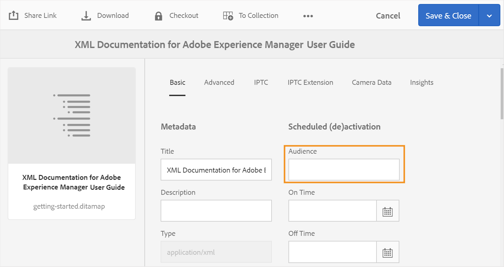

# Configuración de la generación de salida {#id181AI0B0E30}

AEM Guides incluye muchas opciones de configuración para que personalice el proceso de generación de resultados. Este tema cubre todas las configuraciones y personalizaciones que le ayudarán a configurar su proceso de generación de resultados.

## Configure la ficha Línea base en el tablero de mandos de asignación DITA {#id223MD0D0YRM}

Para ocultar la ficha Línea base en el tablero de mandos de asignación DITA, realice los siguientes pasos:

1. Siga las instrucciones indicadas en [Anulaciones de configuración](download-install-additional-config-override.md#) para crear el archivo de configuración.
1. En el archivo de configuración, proporcione los siguientes detalles \(property\) para configurar la pestaña de línea de base en el panel de asignaciones.

| PID | Clave de propiedad | Valor de propiedad |
|---|------------|--------------|
| `com.adobe.fmdita.config.ConfigManager` | `hide.tabs.baseline` | Boolean\(`true/false`\).**Valor predeterminado**: `true` |

>[!NOTE]
>
> Esta configuración está habilitada de forma predeterminada y la pestaña Línea base no está disponible en el panel de asignaciones.

## AEM Configuración de la publicación combinada en un sitio de existente {#id1691I0V0MGR}

AEM AEM Si dispone de un sitio de que contiene contenido DITA, puede configurar la salida del sitio de la aplicación para que publique contenido DITA en una ubicación predefinida dentro del sitio. AEM Por ejemplo, en la siguiente captura de pantalla de una página de sitio de la, el nodo `ditacontent` está reservado para almacenar contenido DITA:


AEM Los nodos restantes de la página se crean directamente desde el editor del sitio de la. La configuración de publicación para publicar contenido DITA en una ubicación predefinida garantiza que el proceso de publicación de AEM Guides no modifique ningún contenido que no sea DITA.

Es necesario realizar las siguientes configuraciones en el sitio existente para permitir la publicación de contenido DITA en un nodo predefinido:

- Configurar las propiedades de la plantilla del sitio

- Añadir nodos en el sitio para publicar contenido DITA


Realice los siguientes pasos para configurar las propiedades de plantilla del sitio existente:

1. Utilice el Administrador de paquetes para descargar el archivo /libs/fmdita/config/templates/default.

   >[!NOTE]
   >
   > No realice ninguna personalización en los archivos de configuración predeterminados disponibles en el nodo `libs`. Debe crear una superposición del nodo `libs` en el nodo `apps` y actualizar los archivos necesarios solo en el nodo `apps`.

1. Añada las siguientes propiedades:

   | Nombre de la propiedad | Tipo | Valor  |
   |-------------|----|-----|
   | `topicContentNode` | Cadena | Especifique el nombre del nodo donde desea publicar el contenido DITA. Por ejemplo, el nodo predeterminado donde AEM Guides publica contenido DITA es: <br> `jcr:content/contentnode` |
   | `topicHeadNode` | Cadena | Especifique el nombre del nodo donde desea almacenar la información de metadatos del contenido DITA. Por ejemplo, el nodo predeterminado donde AEM Guides almacena información de metadatos es: <br> `jcr:content/headnode` |


La próxima vez que publique contenido DITA con las configuraciones de plantilla del sitio, el contenido se publicará en los nodos especificados en las propiedades `topicContentNode` y `topicHeadNode`.

## AEM Personalizar salida del sitio {#id166TG0B30WR}

AEM Guides admite la creación de salidas en los siguientes formatos:

- AEM Sitio web de
- PDF
- HTML5
- EPUB
- Salida personalizada mediante DITA-OT

AEM Para la salida del sitio de la, puede asignar diferentes plantillas de diseño con diferentes tareas de salida. Estas plantillas de diseño pueden representar el contenido DITA en diferentes diseños. Por ejemplo, puede especificar distintas plantillas de diseño para audiencias internas y externas.

También puede utilizar complementos personalizados DITA Open Toolkit \(DITA-OT\) con AEM Guides. Puede cargar estos complementos DITA-OT personalizados para generar salidas de PDF de una forma específica.

>[!TIP]
>
> AEM AEM Consulte la sección *Publicación de sitios* en la guía de prácticas recomendadas para conocer las prácticas recomendadas sobre la creación de resultados de sitios de la lista de direcciones de correo electrónico.


### Personalizar la plantilla de diseño para generar resultados {#customize_xml-add-on}

AEM Guides AEM utiliza un conjunto de plantillas de diseño predefinidas para generar la salida del sitio de la. Puede personalizar las plantillas de diseño de AEM Guides para generar el resultado que se ajuste a la marca corporativa. Una plantilla de diseño es una colección de varios estilos \(CSS\), secuencias de comandos \(del lado del servidor y del lado del cliente\), recursos \(imágenes, logotipos y otros recursos\) y nodos JCR que unen todos estos recursos. Una plantilla de diseño puede ser tan sencilla como un único script del lado del servidor con solo un par de nodos JCR o una combinación compleja de estilos, recursos y nodos JCR. Las plantillas de diseño se utilizan en el subsistema de publicación de AEM Guides AEM mientras se genera la salida del sitio, y controlan la estructura, el aspecto y la presentación de la salida generada.

No hay restricciones en cuanto a la ubicación de los recursos de la plantilla de diseño en el servidor, pero suelen estar organizados lógicamente según su función. Por ejemplo, la plantilla predeterminada tiene todos sus archivos JavaScript y CSS almacenados en la carpeta `/etc/designs/fmdita/clientlibs/siteoutput/default`. Dondequiera que se encuentren estos archivos, se vinculan entre sí mediante una colección de nodos JCR. Juntos, estos nodos JCR y los archivos constituyen la plantilla de diseño completa.

La plantilla de diseño predeterminada enviada con AEM Guides le permite personalizar los componentes de página de aterrizaje, tema y búsqueda. Se puede realizar una copia del diseño por defecto y de las plantillas de referencia correspondientes, así como especificar diferentes componentes para generar la salida deseada.

AEM Realice los siguientes pasos para especificar su propia plantilla de diseño para utilizarla en la generación de resultados del sitio de la red de distribución de contenido ():

1. Utilice el Administrador de paquetes para descargar la plantilla de diseño predeterminada desde la siguiente ubicación:

   /libs/fmdita/config/templates

1. Cree una copia de los archivos descargados en la siguiente ubicación del repositorio de Git de Cloud Manager:

   /apps/fmdita/config/templates

1. También debe descargar y copiar las plantillas a las que se hace referencia desde el nodo de plantilla predeterminado. Las plantillas a las que se hace referencia se colocan en:

   /libs/fmdita/templates/default/cqtemplates

   Las propiedades de la plantilla de diseño de AEM Guides se describen en la tabla siguiente.

   | Propiedad | Descripción |
   |--------|-----------|
   | `landingPageTemplate`, `searchPageTemplate`, `topicPageTemplate`, `shadowPageTemplate` | Especifique el nodo `cq:Template` para estas páginas correspondientes \(aterrizaje, búsqueda y tema\). De manera predeterminada, el nodo `cq:Template` para estas páginas se encuentra en el nodo `/libs/fmdita/templates/default/cqtemplates`. Este nodo define la estructura y las propiedades de las páginas de aterrizaje, búsqueda y tema.<br>: `shadowPageTemplate` se usa para optimizar el contenido fragmentado. Debe establecer el valor de esta propiedad en: `fmdita/templates/default/cqtemplates/shadowpage` <br> **Nota:** Debe especificar un valor para `topicPageTemplate`. `landingPageTemplate` y `searchPageTemplate` son propiedades opcionales. Si no desea que se generen las páginas de búsqueda y de aterrizaje, no especifique estas propiedades. |
   | `title` | Un nombre descriptivo de la plantilla de diseño. |
   | `topicContentNode` | Ubicación del nodo que contendrá el contenido DITA en una página de tema. La ruta es relativa a la página del tema. |
   | `topicHeadNode` | Ubicación del nodo que contendrá los valores \(o metadatos\) del encabezado derivados del contenido DITA. La ruta es relativa a la página del tema. |
   | `tocNode` | Ubicación del nodo que contendrá la TDC. La ruta es relativa a la página de aterrizaje o a la ruta de destino. |
   | `basePathProp` | Nombre de propiedad para almacenar la ruta de acceso de la raíz del sitio publicado. |
   | `indexPathProp` | Nombre de propiedad para almacenar la ruta de la página de aterrizaje/índice del sitio publicado. |
   | `pdfPathProp` | Nombre de propiedad para almacenar la ruta del PDF del tema, si la generación del PDF del tema está habilitada. |
   | `pdfTypeProp` | Nombre de propiedad para almacenar el tipo de generación de PDF. Actualmente, esta propiedad siempre contiene &quot;Tema&quot;. |
   | `searchPathProp` | Nombre de propiedad para almacenar la ruta de la página de búsqueda, si la plantilla incluye una página de búsqueda. |
   | `siteTitleProp` | Nombre de propiedad para almacenar el título del sitio que se está publicando. Este título suele ser el mismo que el título del mapa que se está publicando. |
   | `sourcePathProp` | Nombre de propiedad para almacenar la ruta del tema DITA de origen de la página actual. |
   | `tocPathProp` | Nombre de propiedad para almacenar la ruta de la raíz del índice del sitio publicado. |


>[!NOTE]
>
> AEM Después de crear un nodo de plantilla de diseño personalizado, debe actualizar la opción Diseño en los ajustes preestablecidos de salida del sitio de la para utilizar el nodo de plantilla de diseño personalizado.

Para obtener más información, consulta [Creación de tu primer sitio web de Adobe Experience Manager AEM](https://experienceleague.adobe.com/docs/experience-manager-learn/getting-started-wknd-tutorial-develop/overview.html?lang=en) y [Aspectos básicos](https://experienceleague.adobe.com/docs/experience-manager-cloud-service/implementing/developing/full-stack/develop-wknd-tutorial.html?lang=en) del desarrollo de tu propio sitio web sobre la creación de sitios web en el sitio web de.

### AEM Utilizar el título del documento para generar la salida del sitio de

AEM Al generar la salida del sitio de, la forma en que se generan las direcciones URL desempeña un papel importante en la capacidad de detección del contenido. Si utiliza nombres de archivo basados en UUID, la generación de direcciones URL basadas en el UUID de sus archivos no sería fácil de buscar. AEM Como administrador o editor, tiene el control sobre cómo desea generar las direcciones URL para la salida del sitio de la. AEM Guides AEM le proporciona una configuración a través de la cual puede elegir generar las direcciones URL de salida del sitio mediante el título del archivo en lugar de utilizar nombres de archivo basados en UUID. De forma predeterminada, para sistemas de archivos basados en UUID, esta opción está activada. AEM Esto implica que, cuando se genera la salida del sitio de la aplicación para sistemas de archivos basados en UUID, los títulos del archivo se utilizan para generar las direcciones URL y no los UUID de los archivos.

>[!NOTE]
>
> AEM Además, puede configurar reglas para permitir solo un conjunto de caracteres en las direcciones URL de la salida de un sitio de. AEM Para obtener más información, consulte [Configurar las reglas de saneamiento de nombres de archivo para crear temas y publicar la salida del sitio de la](#id2164D0KD0XA).

Siga las instrucciones indicadas en [Anulaciones de configuración](download-install-additional-config-override.md#) para crear el archivo de configuración. AEM En el archivo de configuración, proporcione los siguientes detalles \(property\) para configurar la generación de direcciones URL en la salida del sitio de la:

| PID | Clave de propiedad | Valor de propiedad |
|---|------------|--------------|
| `com.adobe.fmdita.config.ConfigManager` | `aemsite.pagetitle` | Boolean \(true/false\). Si desea generar un resultado utilizando el título de página, establezca esta propiedad en true. De manera predeterminada, está establecido para utilizar el nombre de archivo.<br> **Valor predeterminado**: false |

### AEM Configure la dirección URL de la salida del sitio de para utilizar el título del documento

AEM Puede utilizar los títulos de los documentos en la dirección URL de la salida del sitio de la. AEM Si el nombre de archivo no existe o contiene todos los caracteres especiales, puede configurar el sistema para que reemplace los caracteres especiales con un separador en la dirección URL de la salida del sitio de la página de la página de la página de la página de la página de la página de la página de la página de la página de la página de salida. También puede configurarlo para que los reemplace por el nombre del primer tema secundario.


Para configurar los nombres de página, realice los siguientes pasos:

1. Siga las instrucciones indicadas en [Anulaciones de configuración](download-install-additional-config-override.md#) para crear el archivo de configuración.
1. En el archivo de configuración, proporcione los siguientes detalles (propiedad) para configurar los nombres de página de los temas.

| PID | Clave de propiedad | Valor de propiedad |
|---|------------|--------------|
| `com.adobe.fmdita.common.SanitizeNodeName` | `nodename.systemDefinedPageName` | Boolean (`true/false`). **Valor predeterminado**: `false` |

Por ejemplo, si el *@navtitle* de `<topichead>` tiene todos los caracteres especiales y usted establece la propiedad `aemsite.pagetitle` en true, de manera predeterminada, usa un separador. Si establece la propiedad `nodename.systemDefinedPageName` en true, se muestra el nombre del primer tema secundario.


### AEM Configure las reglas de saneamiento de nombres de archivo para crear temas y publicar resultados del sitio de la {#id2164D0KD0XA}

AEM Como administrador, puede definir una lista de caracteres especiales válidos permitidos en los nombres de archivo, que finalmente forman la dirección URL de la salida de un sitio de. En versiones anteriores, se permitía a los usuarios definir nombres de archivo que contenían caracteres especiales como `@`, `$`, `>`, etc. AEM Estos caracteres especiales daban como resultado una dirección URL codificada en la generación de páginas del sitio de la.

A partir de la versión 3.8, se han añadido configuraciones para definir una lista de caracteres especiales permitidos en los nombres de archivo. De manera predeterminada, la configuración de nombre de archivo válida contiene &quot;`a-z A-Z 0-9 - _`&quot;. Esto implica que, al crear un archivo, puede tener cualquier carácter especial en el título del archivo, pero internamente se reemplazará con un guión \(`-`\) en el nombre del archivo. Por ejemplo, puede tener el título del archivo como Introducción 1 o Introduction@1, el nombre de archivo correspondiente generado para ambos casos sería Introducción-1.

Cuando defina una lista de caracteres válidos, recuerde que estos caracteres &quot;`*/:[\]|#%{}?&<>"/+`&quot; y `a space` se reemplazarán siempre con un guión \(`-`\).

>[!NOTE]
>
> Si no configura la lista de caracteres especiales válidos, el proceso de creación de archivos podría dar algunos resultados inesperados.

Siga las instrucciones indicadas en [Anulaciones de configuración](download-install-additional-config-override.md#) para crear el archivo de configuración. AEM En el archivo de configuración, proporcione los siguientes detalles \(property\) para configurar los caracteres especiales válidos en los nombres de archivo y en la salida del sitio de la:

| PID | Clave de propiedad | Valor de propiedad |
|---|------------|--------------|
| `com.adobe.fmdita.common.SanitizeNodeNameImpl` | `aemsite.DisallowedFileNameChars` | Asegúrese de que la propiedad está establecida en ``'<>`@$``. Puede agregar más caracteres especiales a esta lista. |

También puede configurar otras propiedades, como el uso de minúsculas en los nombres de archivo, el separador para controlar los caracteres no válidos y el número máximo de caracteres permitidos en los nombres de archivo. Para configurar estas propiedades, agregue los siguientes pares de valor clave en el archivo de configuración:

| Clave de propiedad | Valor de propiedad |
|------------|--------------|
| `nodename.uselower` | Booleano \(true/false\).<br> **Valor predeterminado**: true |
| `nodename.separator` | Cualquier carácter. <br> **Valor predeterminado**: \_ *\(guion bajo\)* |
| `nodename.maxlength` | Valor entero.<br> **Valor predeterminado**: 50 |

### AEM Configuración del acoplamiento de la estructura de nodos del sitio de la

AEM Cuando se genera la salida del sitio de, se crea internamente un nodo para cada elemento de los temas. Para un mapa DITA con miles de temas, esta estructura de nodos puede llegar a ser demasiado profunda. Este tipo de estructura de nodos profundamente anidados puede tener problemas de rendimiento para sitios más grandes. AEM La siguiente instantánea muestra la estructura de nodos profundamente anidados para una salida de sitio de la:


En la instantánea anterior, observe que hay un nodo creado para cada elemento `p` y sus subelementos subsiguientes, y que se crea una estructura similar para todos los demás elementos utilizados en el tema.

AEM Guides AEM le permite configurar cómo se crea internamente la estructura de nodos de la salida del sitio de la manera que lo hace. Puede aplanar la estructura del nodo en elementos especificados, lo que significa que puede definir un elemento que se considerará como el elemento principal y todos los subelementos dentro de él se combinarán con el elemento principal. Por ejemplo, si decide acoplar el elemento `p`, cualquier elemento que aparezca dentro del elemento `p` se combinará con el elemento principal `p`. No se crearía una nota independiente para ningún subelemento dentro del elemento `p`. La siguiente instantánea muestra la estructura de nodos acoplada en el elemento `p`:


AEM Para acoplar la estructura de nodos del sitio de la, realice los siguientes pasos:

1. Identifique los elementos en los que desea acoplar la estructura del nodo:

1. Superposición del nodo `libs` en el nodo `apps` y abra el archivo elementmapping.xml.

1. Agregue la propiedad `<flatten>true</flatten>` en la definición del elemento en el que desea acoplar la estructura del nodo. Por ejemplo, si desea acoplar la estructura del nodo en el elemento `p`, agregue el atributo flatten en la definición del elemento `p` como se muestra a continuación:

   ```XML
   <ditaelement>
         <name>p</name>
         <class>- topic/p</class>
         <componentpath>fmdita/components/dita/wrapper</componentpath>
         <type>COMPOSITE</type>
         <target>para</target>
         <flatten>true</flatten>
         <wrapelement>div</wrapelement>
      </ditaelement>
   ```

   >[!NOTE]
   >
   > De forma predeterminada, la propiedad acoplar nodo se ha configurado en el elemento `p`.

1. Siga las instrucciones indicadas en [Anulaciones de configuración](download-install-additional-config-override.md#) para crear el archivo de configuración.
1. En el archivo de configuración, proporcione los siguientes detalles \(property\):

   | PID | Clave de propiedad | Valor de propiedad |
   |---|------------|--------------|
   | `com.adobe.dxml.flattening.FlatteningConfigurationService` | `flattening.enabled` | Booleano \(true/false\).<br> **Valor predeterminado**: `false` |


AEM Ahora, cuando genere la salida del sitio de la, los nodos dentro del elemento `p` se acoplan y almacenan dentro del propio elemento `p`. Puede encontrar las nuevas propiedades de acoplamiento para el elemento `p` en CRXDE.


AEM **Busque una cadena dentro del contenido en la salida de sitio de la red de distribución de datos** en la página de salida de sitio de la red

AEM De forma predeterminada, puede buscar una cadena en los títulos solo dentro de la salida del sitio de la. AEM Puede configurar el sistema para que busque una cadena tanto en los títulos como en el contenido o el cuerpo de la salida del sitio de la lista de distribución de contenido ().

>[!NOTE]
>
> A veces, la búsqueda puede funcionar para algunos elementos del contenido, pero se puede configurar para que funcione para todo el contenido.


AEM Para habilitar la búsqueda, debe configurar el acoplamiento de la estructura de nodos del sitio de la red de distribución de contenido ().

ATENCIÓN:

Puede buscar hasta 1 MB de contenido plano. Por ejemplo, en la captura de pantalla anterior, puede buscar si el contenido de la etiqueta &lt;p\> es &lt;= 1Mb.

>[!NOTE]
>
> La búsqueda funciona en los elementos solamente si el atributo `<flatten>` está establecido en true. De manera predeterminada, AEM Guides tiene el atributo `<flatten>` establecido en true para los elementos de texto que se utilizan con más frecuencia, como &lt;p\> &lt;ul\> &lt;lId\>. Sin embargo, si ha creado algunos elementos personalizados, debe establecer el atributo `<flatten>` en true en el archivo elementmapping.xml.

AEM **Impedir el acoplamiento de la estructura de nodos del sitio de la**

AEM De forma similar a especificar el nodo que se va a acoplar en la salida del sitio de la aplicación, también se puede especificar un elemento que desee excluir de esta configuración. Por ejemplo, si desea acoplar nodos en el elemento `body`, pero no desea acoplar ningún elemento `table` dentro de `body`, puede agregar la propiedad de exclusión dentro de la definición del elemento `table`.

Para excluir el elemento `table` del acoplamiento, agregue la siguiente propiedad a la definición del elemento `table`:

`<preventancestorflattening>true|false</preventancestorflattening>`

### AEM Configurar el control de versiones de las páginas eliminadas en la salida del sitio de

AEM Cuando genera la salida del sitio de la con la opción **Eliminar y** Crear ****seleccionada para la configuración Páginas de salida existentes, se crea una versión para las páginas que se están eliminando. Puede configurar el sistema para que detenga la creación de una versión antes de la eliminación.

Realice los siguientes pasos para detener la creación de una versión para la página que se está eliminando:

1. Siga las instrucciones indicadas en [Anulaciones de configuración](download-install-additional-config-override.md#) para crear el archivo de configuración.
1. En el archivo de configuración, proporcione los siguientes detalles \(property\) para configurar la opción **No crear versión para páginas eliminadas**:

   | PID | Clave de propiedad | Valor de propiedad |
   |---|------------|--------------|
   | `com.adobe.fmdita.confi g.ConfigManager` | `no.version.creation.on.deletion` | Booleano \(true/false\).<br> **Valor predeterminado**: `true` |

   >[!NOTE]
   >
   > Con esta opción seleccionada, los usuarios podrán eliminar directamente cualquier página sin crear ninguna versión para ellos. Si la opción no está seleccionada, se crea una versión antes de que se eliminen las páginas.

### Configuración del reescritor personalizado con Experience Manager Guides {#custom-rewriter}

Experience Manager Guides tiene un módulo sling [**rewriter**](https://sling.apache.org/documentation/bundles/output-rewriting-pipelines-org-apache-sling-rewriter.html) personalizado para administrar los vínculos generados en caso de mapas cruzados (vínculos entre los temas de dos mapas diferentes). Esta configuración de reescritura está instalada en la siguiente ruta: <br> `/apps/fmdita/config/rewriter/fmdita-crossmap-link-patcher`.

Si tiene otra reescritura de sling personalizada en la base de código, utilice un valor de `'order'` mayor que 50, ya que la reescritura de sling de Experience Manager Guides utiliza `'order'` 50.  Para anular esto, necesita un valor >50 . Para obtener más información, vea [Canalizaciones de reescritura de salida](https://sling.apache.org/documentation/bundles/output-rewriting-pipelines-org-apache-sling-rewriter.html).


## Usar metadatos en la salida de publicación mediante DITA-OT {#id191LF0U0TY4}

AEM Guides proporciona una forma de pasar metadatos personalizados al publicar resultados mediante DITA-OT. Como administrador y publicador, deberá realizar las siguientes tareas para configurar y utilizar metadatos personalizados en el resultado publicado:

- Como administrador, añada los metadatos requeridos en el sistema para que estén disponibles en la página Propiedades del mapa DITA.

- Como administrador, añada los metadatos personalizados a la lista de metadatos para que aparezcan en la consola de mapas DITA.

- Como editor, configure y añada los metadatos personalizados con el mapa DITA y genere la salida requerida.


Para añadir los metadatos necesarios en el sistema, realice los siguientes pasos:

1. Inicie sesión en Adobe Experience Manager como administrador.

1. Haga clic en el vínculo Adobe Experience Manager en la parte superior y elija **Herramientas**.

1. Seleccione **Assets** de la lista de herramientas.

1. Haga clic en el mosaico **Esquemas de metadatos**.

   Se muestra la página Forms del esquema de metadatos.

1. Seleccione el formulario **default** de la lista.

   >[!NOTE]
   >
   > Las propiedades mostradas en la página Propiedades de un mapa DITA se toman de este formulario.

1. Haga clic en **Editar**.

1. Añada los metadatos personalizados que desee utilizar en las salidas publicadas. Por ejemplo, agregaremos metadatos de audiencia siguiendo los pasos siguientes:

   1. Desde la lista de componentes **Generar formulario**, arrastre y suelte el componente **Texto de una sola línea** en el formulario.

   2. Seleccione el nuevo campo para abrir **Configuración** del campo.

   3. En la **Etiqueta de campo**, escriba el nombre de los metadatos— Audiencia.

   4. En la configuración **Asignar a propiedad**, especifique/jcr:content/metadata/&lt;nombre de los metadatos\>. Para nuestro ejemplo, lo estableceremos en ./jcr:content/metadata/audience.

   Siga estos pasos para agregar todos los parámetros de metadatos necesarios.

1. Haga clic en **Guardar**.


El nuevo parámetro aparece ahora en la página Propiedades para todos los mapas DITA.



A continuación, es necesario que los metadatos personalizados estén disponibles en la consola de mapas DITA. Realice los siguientes pasos para que los metadatos personalizados estén disponibles en el tablero de mandos de mapa DITA:

1. Utilice el administrador de paquetes para acceder al archivo metadataList disponible en la siguiente ubicación del repositorio de Git de Cloud Manager:

   /libs/fmdita/config/metadataList

   >[!NOTE]
   >
   > El archivo metadataList contiene una lista de propiedades que se muestran en la lista desplegable **Propiedades** de un mapa DITA en el panel de asignaciones. De forma predeterminada, hay cuatro propiedades enumeradas en este archivo: docstate, dc:language, dc:description y dc:title.

1. Añada los metadatos personalizados que ha añadido en la página de Forms del esquema de metadatos. Para nuestro ejemplo, añada el parámetro de audiencia al final de la lista predeterminada.


Ahora los metadatos personalizados se mostrarán en la lista desplegable **Propiedades** de la consola de mapas DITA.

Por último, como editor, debe incluir los metadatos personalizados en el resultado publicado. Para procesar los metadatos personalizados mientras se genera la salida, realice los siguientes pasos:

1. En la interfaz de usuario de Assets, vaya al mapa DITA que desee publicar.

1. Seleccione el fichero de mapa DITA y abra su página de propiedades.

1. En la página Propiedades, especifique el valor de los metadatos personalizados. Para nuestro ejemplo, hemos especificado un valor de External para el parámetro audience.

   

1. Haga clic en **Guardar y cerrar**.

1. Pulse en el fichero de mapa DITA para abrir la consola de mapas DITA.

1. En la pestaña **Ajustes preestablecidos de salida**, seleccione el ajuste preestablecido de salida que desee utilizar para generar el resultado.

1. Haga clic en **Editar**.

1. En la lista desplegable **Propiedades**, seleccione las propiedades que desee pasar al proceso de publicación.

   


Las propiedades/metadatos seleccionados se pasan al proceso de publicación y están disponibles en la salida final.

### Validar el paso de metadatos a DITA-OT para su procesamiento

Para validar los valores de metadatos pasados a DITA-OT, se puede utilizar un entorno local con un JAR preparado para la nube. Dado que no podemos acceder al sistema de archivos local en la nube, la única manera de validar el archivo de metadatos es a través de un JAR listo para la nube.

- Nombre de archivo: metadata.xml
- Ubicación del archivo: crx-quickstart/profiles/ditamaps/&lt;ditamap-1234\>

  Para acceder a metadata.xml:

   - AEM Inicie sesión en la ubicación del servidor donde se está ejecutando la instancia de.
   - Migre a crx-quickstart/profiles/ditamaps/&lt;newly-created-directory-name\>/metadata.xml.
- Formato de archivo de muestra:

  **metadata.xml**

  ```XML
  <?xml version="1.0" encoding="UTF-8" standalone="no"?>
  <root>
     <Path id="/absolutePath/sampleMap.ditamap">
        <metadata>
           <meta isArray="false" key="dc:description">This is a file</meta>
           <meta isArray="false" key="dc:title">Myfile</meta>
           <meta isArray="true" key="multivalueText">One;Two;Three</meta>
        </metadata>
     </Path>
     <Path id="/absolutePath/sampleTopic.dita">
        <metadata>
           <meta isArray="false" key="dc:description">description for the accountability</meta>
           <meta isArray="false" key="dc:title">accountability title</meta>
           <meta isArray="true" key="multivalueText">value1</meta>
        </metadata>
     </Path>
  </root>
  ```


- isArray: Atributo booleano que define si los metadatos son de varios valores \(Array\) o no. Los valores están delimitados por un punto y coma.
- ID de ruta: ruta absoluta al archivo almacenado en el directorio temporal.

>[!NOTE]
>
> Si no hay metadatos específicos para el archivo, la etiqueta &lt;meta\> con la clave no aparecerá como la propiedad para ese archivo en el archivo metadata.xml.

## AEM Personalización de la asignación de elementos DITA con componentes de {#id1679J600HEL}

Los elementos DITA de AEM Guides AEM se asignan a sus correspondientes componentes de. AEM Guides AEM utiliza esta asignación en flujos de trabajo como la publicación y la revisión para convertir un elemento DITA en un componente de correspondiente. La asignación se define en el archivo `elementmapping.xml`, al cual se puede tener acceso mediante el administrador de paquetes.

>[!NOTE]
>
> No realice ninguna personalización en los archivos de configuración predeterminados disponibles en el nodo ``libs``. Debe crear una superposición del nodo ``libs`` en el nodo ``apps`` y actualizar los archivos necesarios solo en el nodo ``apps``.

AEM Se pueden utilizar las asignaciones de elementos DITA predefinidas o se pueden asignar elementos DITA a los componentes personalizados de la aplicación de la aplicación de la aplicación de la aplicación de la aplicación de la aplicación de la aplicación de la. AEM Para utilizar los componentes de la personalizada, debe comprender la estructura del archivo `elementmapping.xml`.

### estructura de elementmapping.xml

A continuación se explica una descripción general de alto nivel de la estructura de `elementmapping.xml`:

1. En cada elemento DITA se busca primero una asignación de componentes correspondiente basada en el nombre del elemento. Por ejemplo:

   ```XML
   <ditaelement>     
      <name>**substeps**</name>  
      <class>- topic/ol task/substeps</class>  
      <componentpath>dita/components/ditaolist</componentpath>  
      <type>COMPOSITE</type>  
      <target>para</target>
   </ditaelement>
   ```

   En el ejemplo anterior, todos los `substeps` elementos DITA se representan con el componente `dita/components/ditaolist`.

1. Si un elemento DITA no encuentra una coincidencia basada en el nombre, entonces se realiza una coincidencia basada en `class`. Por ejemplo:

   ```XML
   <ditaelement>  
      <name>topic</name>  
      <class>**- topic/topic**</class>  
      <componentpath>fmdita/components/dita/topic</componentpath>  
      <type>COMPOSITE</type>  
      <target>para</target>  
      <attributemap> 
         <attribute from="id" to="id" />  
      </attributemap>
   </ditaelement>
   ```

   En el ejemplo anterior, si no hay ninguna asignación definida para el elemento `task`, el elemento `task` se asigna al componente anterior porque `task` se hereda del componente `topic`.

1. Cuando un elemento tiene una asignación de componente correspondiente, el procesamiento posterior de sus elementos secundarios se determina por `type`. Por ejemplo:

   ```XML
   <ditaelement>  
      <name>title</name>  
      <class>- topic/title</class>  
      <componentpath>foundation/components/title</componentpath>  
      <type>**STANDALONE**</type>  
      <target>para</target>  
      <textprop>jcr:title</textprop>
   </ditaelement>
   ```

   `type` toma los siguientes valores:

   - COMPUESTO: la asignación del elemento al componente *también continúa para los elementos secundarios*.

   - INDEPENDIENTE: los elementos secundarios del elemento actual están *sin asignar más*.

   En el ejemplo anterior, si el elemento `<title>` tiene elementos secundarios, no se asignarán a ningún otro componente. El componente del elemento `<title>` es responsable de procesar todos los elementos secundarios dentro del elemento `<title>`.

1. Si hay varios componentes asignados a un único elemento DITA, se selecciona la mejor coincidencia para el elemento. Para seleccionar el componente que mejor se ajuste, se tiene en cuenta la especialización estructural y de dominio de los elementos DITA.

   Si hay elementos DITA con especialización de dominio y un componente está asignado para la especialización de dominio, se le asigna una prioridad alta a ese componente.

   Del mismo modo, si hay elementos DITA con especialización estructural y se asigna un componente para la especialización estructural, se le asigna una alta prioridad a dicho componente.

1. Puede usar `<attributemap>` en la asignación de elementos para asignar valores de atributo a las propiedades del nodo correspondiente.
1. `textprop` se puede usar para serializar el contenido de texto de un elemento DITA en una propiedad de nodo. Además, se puede utilizar varias veces en una etiqueta de elemento para serializar el contenido de texto en varias ubicaciones de la jerarquía publicada. También puede personalizar la ubicación y el nombre de la propiedad de destino. Por ejemplo:

   ```XML
   <ditaelement>
      <name>title</name>
      <componentpath>foundation/components/title</componentpath>
      <type>STANDALONE</type>
      <target>para</target>
       <textprop>**jcr:title**</textprop>
   </ditaelement>
   ```

   La asignación de elementos anterior especifica que el contenido de texto del elemento `<title>` se guardará como valor de una propiedad denominada `jcr:title` en el nodo de salida.

1. `xmlprop` se puede usar para serializar todo el XML de un elemento determinado en una propiedad de nodo. A continuación, el componente puede leer esta propiedad de nodo y realizar una representación personalizada. Por ejemplo:

   ```XML
   <ditaelement>
       <name>svg-container</name>
      <class>+ topic/foreign svg-d/svg-container</class>
       <componentpath>fmdita/components/dita/svg</componentpath>
       <type>STANDALONE</type>
       <target>para</target>
      <xmlprop>**data**</xmlprop>
   </ditaelement>
   ```

   La asignación de elementos anterior especifica que todo el marcado XML para el elemento `<svg-container>` se guardará como valor de una propiedad denominada `data` en el nodo de salida.

1. Hay una asignación de atributo especial para controlar la resolución de la ruta en el proceso de generación de resultados. Por ejemplo:

   ```XML
   <attributemap>
      <attribute from="href" to="fileReference" ispath="true" rel="source" />
      <attribute from="height" to="height" />
       <attribute from="width" to="width" />
   </attributemap>
   ```

   Para el elemento `attributemap` anterior, el atributo `href` del elemento DITA se asignará a una propiedad de nodo denominada `fileReference`. Ahora, dado que `ispath` está establecido en `true`, el proceso de generación de resultados resuelve esta ruta de acceso y la establece en la propiedad del nodo `fileReference`.

   El modo en que se produce esta resolución se determina en función del valor del atributo `rel` en la asignación de atributos.

   - Si es `rel=source`, el valor de `href` se resuelve con respecto al archivo de origen DITA que se está procesando actualmente. El valor de `href` se resuelve y se coloca en el valor de la propiedad `fileReference`.

   - Si es `rel=target`, el valor de `href` se resuelve con respecto a la ubicación de publicación raíz. El valor de `href` se resuelve y se coloca en el valor de la propiedad `fileReference`.

   Si no desea que se produzca ningún procesamiento previo o resolución en los atributos de ruta de acceso, no necesita especificar el atributo `ispath`. El valor se copia tal cual y el componente puede realizar la resolución necesaria.


### Esquema de elemento DITA

A continuación se muestra un ejemplo del esquema de elementos DITA en el archivo `elementmapping.xml`:

```XML
<ditaelement>        
    <name>element_name</name>    
    <class>element_class</class>    
    <componentpath>fmdita/components/dita/component_name</componentpath>    
    <type>COMPOSITE|STANDALONE</type>     
    <attributeprop>propname_a</attributeprop>      
    <textprop>propname_t</textprop>    
    <xmlprop>propname_x</xmlprop>     
    <xpath>xpath expression string</xpath>     
    <target>head|para</target>     
    <wrapelement>div</wrapelement>     
    <wrapclass>class_name</wrapclass>     
    <attributemap>         
        <attribute from="attrname"         to="propname"         ispath="true|false"         rel="source|target" />    
    </attributemap>    
    <skip>true|false</skip> 
</ditaelement>
```

En la tabla siguiente se describen los elementos del esquema de elementos DITA:

| Elemento | Descripción |
|-------|-----------|
| `<ditaelement>` | Nodo de nivel superior para cada elemento de asignación. |
| `<class>` | Atributo de clase del elemento DITA de destino para el que se está escribiendo el componente.<br> Por ejemplo, el atributo de clase para el tema DITA es: <br> `- topic/topic` |
| `<componentpath>` | AEM La ruta CRXDE del componente de asignado. |
| `<type>` | Valores posibles: <br> -   **COMPUESTO**: procesar también elementos secundarios <br> -   **STANDALONE**: omite el procesamiento de elementos secundarios |
| `<attributeprop>` | AEM Se utiliza para asignar atributos y valores DITA serializados a nodos como propiedad de la propiedad de la propiedad de la propiedad de datos de. AEM Por ejemplo, si tiene `<note type="Caution">` elemento y el componente asignado para este elemento tiene `<attributeprop>attr_t</ attributeprop>`, el atributo y valor del nodo se serializa a la propiedad `attr_t` del nodo correspondiente \( `attr_t->type="caution"`\). |
| `<textprop>propname_t</textprop>` | Guardar la salida `getTextContent()` en la propiedad definida por `propname_t.` <br> **Nota:** Esta es una propiedad optimizada. |
| `<xmlprop>propname_x </xmlprop>` | Guardar el XML serializado de este nodo en la propiedad definida por `propname_x.<br> `**Nota:** Esta es una propiedad optimizada. |
| `<xpath>` | Si se proporciona un elemento XPath en la asignación de elementos, junto con el nombre del elemento y la clase, la condición XPath también debe cumplirse para que se utilice la asignación de componentes. |
| `<target>` | Coloque el elemento DITA en el repositorio CRX en la ubicación especificada.<br> valores posibles: <br> - **head**: bajo el nodo de encabezado <br> - **text**: bajo el nodo de párrafo |
| `<wrapelement>` | El elemento HTML dentro del que se envolverá el contenido. |
| `<wrapclass>` | El valor del elemento para la propiedad `wrapclass.` |
| `<attributemap>` | Nodo contenedor que contiene uno o más `<attribute>` nodos. |
| `<attribute from="attrname" to="propname" ispath="true|false" rel="source|target" />` | AEM Asigna los atributos DITA a las propiedades de la: <br> -   **`from`**: nombre de atributo DITA <br> -   AEM **`to`**: nombre de propiedad de componente <br> -   **`ispath`**: si el atributo es un valor de ruta \(por ejemplo: *image*\) <br> -   **`rel`**: si la ruta de acceso es el origen o el destino <br> **Nota:** Si `attrname` empieza por `%`, asigne `attrname minus '%'` a la prop &#39; `propname`&#39;. |

**Notas adicionales**

- Si planea anular la asignación de elementos predeterminada, se recomienda no realizar los cambios en el archivo `elementmapping.xml` predeterminado. Debe crear un nuevo archivo XML de asignación y colocar el archivo en otra ubicación, preferiblemente dentro de la carpeta de aplicaciones personalizadas que cree.

- En el archivo `elementmapping.xml`, hay muchas entradas de asignación que hacen referencia al componente fmdita/components/dita/wrapper. Wrapper es un componente genérico que procesa construcciones DITA relativamente sencillas utilizando propiedades en su nodo de sitio para generar un HTML relevante. Utiliza la propiedad `wrapelement` para generar etiquetas envolventes y delega el procesamiento secundario a los componentes correspondientes. Esto resulta útil en casos en los que solo desea un componente contenedor. En lugar de crear un nuevo componente que procese una etiqueta contenedora específica como `div` o `p`, puede utilizar el componente Envolvente con las propiedades `wrapelement` y `wrapclass` para lograr el mismo efecto.

- No se recomienda guardar grandes cantidades de texto en las propiedades JCR de la cadena. El cálculo del tipo de propiedad optimizada en la generación de salida garantiza que el contenido de texto grande no se guarde como tipo de cadena. En su lugar, cuando es necesario guardar contenido que supera un determinado umbral, el tipo de la propiedad se cambia a binario. De manera predeterminada, este umbral está configurado a 512 bytes, pero se puede cambiar en el Administrador de configuración \(*com.adobe.fmdita.config.ConfigManager*\) cambiando la opción **Guardar como umbral binario**.

- Si planea anular algunas \(y no todas\) de las asignaciones de elementos, no tiene que replicar todo el archivo `elementmapping.xml`. Debe crear un nuevo archivo de asignación XML y definir sólo los elementos que va a anular.

- Después de crear el archivo XML en la ubicación personalizada, actualice la configuración `Override Element Mapping` en el paquete `com.adobe.fmdita.config.ConfigManager`.


## Personalizar la consola de mapas DITA {#id188HC08M0CZ}

AEM Guides le ofrece la flexibilidad de ampliar las capacidades de la consola de mapas DITA. Por ejemplo, si tiene un conjunto de informes que son diferentes de los disponibles en AEM Guides, puede agregar dichos informes a la consola de mapas. AEM Para personalizar la consola de asignaciones, debe crear una biblioteca de cliente de la biblioteca \(o ClientLib\) que contenga el código para realizar la funcionalidad que necesita.

>[!NOTE]
>
> No se recomienda la modificación directa a los componentes de la página, ya que se sobrescribirá con las nuevas versiones del producto.

AEM Guides proporciona la categoría `apps.fmdita.dashboard-extn` para personalizar la consola de mapas. Cada vez que se carga la consola de mapas, se ejecuta y carga la funcionalidad creada en la categoría `apps.fmdita.dashboard-extn`.

>[!NOTE]
>
> AEM Para obtener más información acerca de cómo crear la biblioteca de cliente de la aplicación, vea [Usar bibliotecas del cliente](https://experienceleague.adobe.com/docs/experience-manager-cloud-service/implementing/developing/full-stack/clientlibs.html?lang=en).

## Controlar la representación de imágenes durante la generación de salida {#id177BF0G0VY4}

AEM viene con un conjunto de flujos de trabajo predeterminados y controladores de medios para procesar recursos. AEM En la práctica, hay flujos de trabajo predefinidos para gestionar el procesamiento de recursos para los tipos MIME más comunes. AEM Normalmente, para cada imagen que carga, se crean varias representaciones de la misma en formato binario, lo que hace que la imagen se cree más de una vez. Estas representaciones pueden tener un tamaño diferente, con una resolución diferente, con una marca de agua agregada o cualquier otra característica modificada. AEM Para obtener más información acerca de cómo administra los recursos los recursos, vea [Procesar Assets AEM mediante controladores de medios y flujos de trabajo](https://experienceleague.adobe.com/docs/experience-manager-cloud-service/assets/asset-microservices-overview.html?lang=en) en la documentación de la documentación de.

AEM Guides le permite configurar qué representación de imágenes utilizar en el momento de generar la salida de sus documentos. Por ejemplo, puede elegir una de las representaciones de imágenes predeterminadas o crear una y utilizar la misma para publicar los documentos. La asignación de representación de imágenes para publicar los documentos se almacena en el archivo `/libs/fmdita/config/ **renditionmap.xml**`. Un fragmento del archivo `renditionmap.xml` es el siguiente:

>[!NOTE]
>
> Se recomienda crear una copia del archivo `renditionmap.xml` en la carpeta `apps` para todas las personalizaciones.

```XML
<renditionmap>
   <mapelement>
      <mimetype>image/png</mimetype>
      <rendition output="AEMSITE">cq5dam.web.1280.1280.jpeg</rendition>
      <rendition output="PDF">original</rendition>
      <rendition output="HTML5">cq5dam.web.1280.1280.jpeg</rendition>
      <rendition output="EPUB">cq5dam.web.1280.1280.jpeg</rendition>
      <rendition output="CUSTOM">cq5dam.web.1280.1280.jpeg</rendition>
   </mapelement>
...
</renditionmap>
```

El elemento `mimetype` especifica el tipo MIME del formato de archivo. El elemento `rendition output` especifica el tipo de formato de salida y el nombre de la representación \(por ejemplo, `cq5dam.web.1280.1280.jpeg`\) que se debe utilizar para publicar el resultado especificado. Puede especificar las representaciones de imágenes que se utilizarán para todos los formatos de salida admitidos: AEMSITE, PDF, HTML5, EPUB y PERSONALIZADO.

Si la representación especificada no está presente, el proceso de publicación de AEM Guides busca primero la representación web de la imagen dada. Si no se encuentra ni siquiera la representación web, se utiliza la representación original de la imagen.

>[!NOTE]
>
> Estas representaciones de imágenes controlan únicamente la generación de salida. La representación web de una imagen se utiliza al abrir un documento para previsualizarlo o revisarlo.

## Configurar el período de depuración automática para el historial de salida {#id19AAI070V8Q}

Cuando se genera una salida, esta se crea junto con los registros de salida. Para mapas DITA grandes, estos registros pueden ocupar una gran cantidad de espacio en el repositorio. De forma predeterminada, los registros se almacenan en la siguiente ubicación del repositorio:

`/var/dxml/metadata/outputHistory`

Durante un período de tiempo, el tamaño colectivo de todos los archivos de registro podría alcanzar los GB. AEM Guides le permite configurar un periodo de tiempo para mantener estos archivos de registro en el repositorio. Después del período de tiempo especificado, los registros junto con el historial de generación de salida se eliminan del repositorio.

>[!NOTE]
>
> El historial de generación de resultados es la entrada de registro de la lista Salidas generadas de la pestaña Salidas.

La configuración de la función de depuración del historial afecta a la generación de resultados para todas las asignaciones DITA del repositorio. En la ficha Salidas de un mapa DITA, el historial se depura después del número de días especificado y a la hora especificada en la configuración.

>[!NOTE]
>
> La eliminación de los archivos de registro y del historial de generación de resultados no afecta a la salida generada.

Siga las instrucciones indicadas en [Anulaciones de configuración](download-install-additional-config-override.md#) para crear el archivo de configuración. En el archivo de configuración, proporcione los siguientes detalles \(property\) para establecer un día y una hora para purgar el historial y los registros de salida:

| PID | Clave de propiedad | Valor de propiedad |
|---|------------|--------------|
| `com.adobe.fmdita.config.ConfigManager` | `output.history.purgeperiod` | Especifique el número de días después de los cuales se depura el historial de salida junto con los registros de salida. Si desea deshabilitar esta función, establezca esta propiedad en 0.Everyday a la hora especificada en que se ejecute el proceso de depuración en las salidas generadas antes del número de días especificado en esta propiedad. <br> **Valor predeterminado**: 5 |
| `output.history.purgetime` | Especifique la hora en la que se inicia el proceso de depuración. <br> **Valor predeterminado**: 0:00 \(o 12:00 medianoche\) |

## Cambiar el límite de lista de resultados generados recientemente {#id1679JH0H0O2}

Se puede cambiar el número máximo de salidas generadas que se muestran en la ficha Salidas para un mapa DITA.

Siga las instrucciones indicadas en [Anulaciones de configuración](download-install-additional-config-override.md#) para crear el archivo de configuración. En el archivo de configuración, proporcione los siguientes detalles \(property\) para cambiar el número de salidas que se mostrarán en la lista:

| PID | Clave de propiedad | Valor de propiedad |
|---|------------|--------------|
| `com.adobe.fmdita.config.ConfigManager` | `output.historylimit` | Valor entero.<br> **Valor predeterminado**: 25 |

>[!TIP]
>
> Consulte la sección *Historial de salida* en la guía de prácticas recomendadas para conocer las prácticas recomendadas sobre cómo trabajar con el historial de salida.
