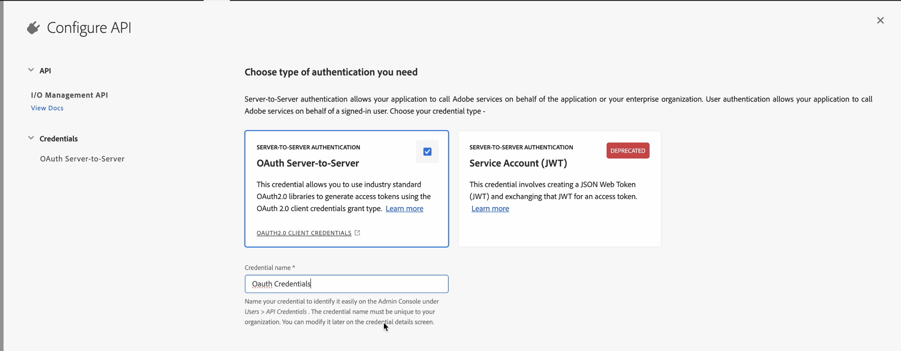

# Configuración del asistente de IA

Como administrador, puede configurar la función Asistente de IA en Experience Manager Guides. El asistente de IA está protegido por la autenticación basada en autenticación IMS de Adobe. Integre su entorno con los flujos de trabajo de autenticación seguros basados en tokens de Adobe y comience a utilizar la función AI Assistant. La siguiente configuración le ayuda a agregar la pestaña **Configuración de IA** al perfil de carpeta. Una vez agregado, puede utilizar la función Asistente de IA en Experience Manager Guides.

Siga estos pasos para configurar el asistente de IA:

1. [Crear configuración de IMS en Adobe Developer Console](#create-ims-configurations-in-adobe-developer-console).
2. [Añadir configuraciones de IMS al entorno](#add-ims-configuration-to-the-environment)
3. [Habilitar el indicador de IA en el entorno](#enable-ai-flag-in-the-environment)
4. [Añada la variable GUIDES_AI_SITE_ID en el entorno](#add-the-guides_ai_site_id-variable-in-the-environment)
5. [Aplicar cambios al entorno](#apply-changes-to-the-environment)
6. [Habilitar el asistente de IA en el perfil de carpeta](#enable-ai-assistant-in-folder-profile)
7. [Configurar sugerencias inteligentes en el perfil de carpeta](./conf-folder-level.md#configure-ai-assistant-for-smart-help-and-authoring)

## Creación de configuraciones de IMS en Adobe Developer Console

Realice los siguientes pasos para crear configuraciones de IMS en Adobe Developer Console:

>[!NOTE]
>
>Si ya ha creado un proyecto de OAuth para configurar la publicación basada en microservicios, puede omitir los siguientes pasos para crear el proyecto.

1. Iniciar [Adobe Developer Console](https://developer.adobe.com/console).
1. Después de iniciar sesión correctamente en Developer Console, verá la pantalla **Inicio**. En la pantalla de **Inicio** encontrará información y vínculos rápidos, incluidos los vínculos de navegación superior a Proyectos y Descargas.
1. Para crear un nuevo proyecto vacío, selecciona **Crear nuevo proyecto** de los vínculos **Inicio rápido**.
    {width="550" align="left"}
   *Crear un nuevo proyecto.*

1. Seleccione **Agregar API** de la pantalla **Proyectos**.  Aparecerá la pantalla **Agregar una API**. Esta pantalla muestra todas las API, los eventos y los servicios disponibles para los productos y las tecnologías de Adobe con los que puede desarrollar aplicaciones.

1. Seleccione la **API de administración de E/S** para agregarla a su proyecto.
   
   *Agregar la API de administración de E/S a su proyecto.*

1. Cree una nueva **credencial de OAuth** y guárdela.

   

   *Configure las credenciales de OAuth en su API.*

1. En la ficha **Proyectos**, elija la opción **Servidor OAuth en Servidor** y, a continuación, seleccione las credenciales recién creadas.

1. Seleccione el vínculo **Servidor a servidor de OAuth** para ver los detalles de credenciales de su proyecto.

    {width="800" align="left"}

   *Conéctese al proyecto para ver los detalles de las credenciales.*

1. Vuelva a la ficha **Proyectos** y seleccione **Información general del proyecto** a la izquierda.

   

   *Empiece en el nuevo proyecto.*

1. Seleccione el botón **Descargar** de la parte superior para descargar el JSON del servicio.

   

   *Descargar los detalles del servicio JSON.*

Ha configurado los detalles de autenticación de OAuth y descargado los detalles del servicio JSON. Mantenga este archivo a mano, ya que es necesario en la siguiente sección.

## Añadir la configuración de IMS al entorno

Siga estos pasos para agregar la configuración de IMS al entorno:

1. Abra Experience Manager y, a continuación, seleccione el programa que contiene el entorno que desea configurar.
1. Cambie a la ficha **Entornos**.
1. Seleccione el nombre del entorno que desea configurar. Esto lo llevará a la página **Información del entorno**.
1. Cambie a la ficha **Configuración**.
1. Actualice el campo JSON SERVICE_ACCOUNT_DETAILS. Asegúrese de utilizar el mismo nombre y configuración que se indican en la siguiente captura de pantalla.

   {width="800" align="left"}

## Habilitar el indicador de IA en el entorno

Para habilitar la característica Asistente de IA en la interfaz de usuario de Experience Manager Guides, agregue el indicador `ENABLE_GUIDES_AI` en el entorno.

Asegúrese de utilizar el mismo nombre y configuración que se indican en la siguiente captura de pantalla.

{width="800" align="left"}

Si se establece el indicador en **true**, se habilita la funcionalidad, mientras que si se establece en **false**, se deshabilita.

## Añada la variable GUIDES_AI_SITE_ID en el entorno

Agregue la variable `GUIDES_AI_SITE_ID` a su entorno (Cloud Manager) y establezca el valor en `id_f651abc807c84f52b425737bb93f87ba` para habilitarla.

Asegúrese de utilizar el mismo nombre y configuración que se indican en la siguiente captura de pantalla.

{width="800" align="left"}

## Aplicar cambios al entorno

Una vez que haya añadido la configuración de IMS y habilitado el indicador del asistente de IA al entorno, realice los siguientes pasos para vincular estas propiedades con AEM Guides mediante OSGi:

1. En el código de su proyecto Git de Cloud Manager, agregue los dos archivos indicados a continuación (para el contenido de los archivos, vea [Apéndice](#appendix)).

   * `com.adobe.aem.guides.eventing.ImsConfiguratorService.cfg.json`
   * `com.adobe.guides.ai.config.service.AiConfigImpl.cfg.json`
1. Asegúrese de que los archivos recién agregados estén cubiertos por su `filter.xml`.
1. Confirme y envíe los cambios de Git.
1. Ejecute la canalización para aplicar los cambios en el entorno.

## Habilitar el asistente de IA en el perfil de carpeta

Una vez aplicados los cambios de configuración, habilite la función Asistente de IA para el perfil de carpeta deseado.

Para obtener más información, vea [Conocer las características del editor](../user-guide/web-editor-features.md).

{width="300" align="left"}

## Configurar sugerencias inteligentes en el perfil de carpeta

Después de habilitar la función Asistente de IA, configure la funcionalidad Sugerencias inteligentes en Perfil de carpeta.

Para obtener más información, consulte [Configurar sugerencias inteligentes en el perfil de carpeta](./conf-folder-level.md#configure-ai-assistant-for-smart-help-and-authoring).


## Apéndice {#appendix}

**Archivo**:
`com.adobe.aem.guides.eventing.ImsConfiguratorService.cfg.json`

**Contenido**:

```
{
 "service.account.details": "$[secret:SERVICE_ACCOUNT_DETAILS]"
}
```

**Archivo**: `com.adobe.guides.ai.config.service.AiConfigImpl.cfg.json`

**Contenido**:

```
{
  "conref.inline.threshold":0.6,
  "conref.block.threshold":0.7,
  "related.link.threshold":0.5,
  "emerald.url":"https://adobeioruntime.net/apis/543112-smartsuggest/emerald/v1",
  "instance.type":"prod",
  "chat.url":"https://aem-guides-ai-v2.adobe.io"
  }
```

## Detalles de configuración del asistente de IA

| Clave | Descripción | Valores permitidos | Valor predeterminado |
|---|---|---|---|
| conref.inline.threshold | Umbral que controla la precisión/recuperación de las sugerencias recuperadas para la etiqueta que el usuario está escribiendo actualmente. | Cualquier valor comprendido entre -1,0 y 1,0. | 0,6 |
| conref.block.threshold | Umbral que controla la precisión/recuperación de las sugerencias recuperadas para las etiquetas en todo el archivo. | Cualquier valor comprendido entre -1,0 y 1,0. | 0,7 |
| emerald.url | Punto final para la base de datos vectorial de sugerencias inteligentes | [https://adobeioruntime.net/apis/543112-smartsuggest/emerald/v1](https://adobeioruntime.net/apis/543112-smartsuggest/emerald/v1) | [https://adobeioruntime.net/apis/543112-smartsuggest/emerald/v1](https://adobeioruntime.net/apis/543112-smartsuggest/emerald/v1) |
| chat.url | Punto de conexión para el servicio de asistente de IA | [https://aem-guides-ai-v2.adobe.io](https://aem-guides-ai-v2.adobe.io) | [https://aem-guides-ai-v2.adobe.io](https://aem-guides-ai-v2.adobe.io) |
| instance.type | Tipo de instancia de AEM. Asegúrese de que sea único para cada instancia de AEM en la que se hayan configurado las sugerencias inteligentes. Un caso de uso sería probar la función en el entorno de ensayo con &quot;instance.type&quot; = &quot;stage&quot; mientras que al mismo tiempo, la función también se configura en &quot;prod&quot;. | Cualquier clave única que identifique el entorno. Solo se permiten *valores alfanuméricos*. &quot;dev&quot;/&quot;stage&quot;/&quot;prod&quot;/&quot;test1&quot;/&quot;stage2&quot; | &quot;prod&quot; |

Una vez configurada, el icono Asistente de IA se muestra en la página de inicio y el editor de Experience Manager Guides. Para obtener más información, consulte la sección [Asistente de IA](../user-guide/ai-assistant.md) en la Guía del usuario de Experience Manager.
