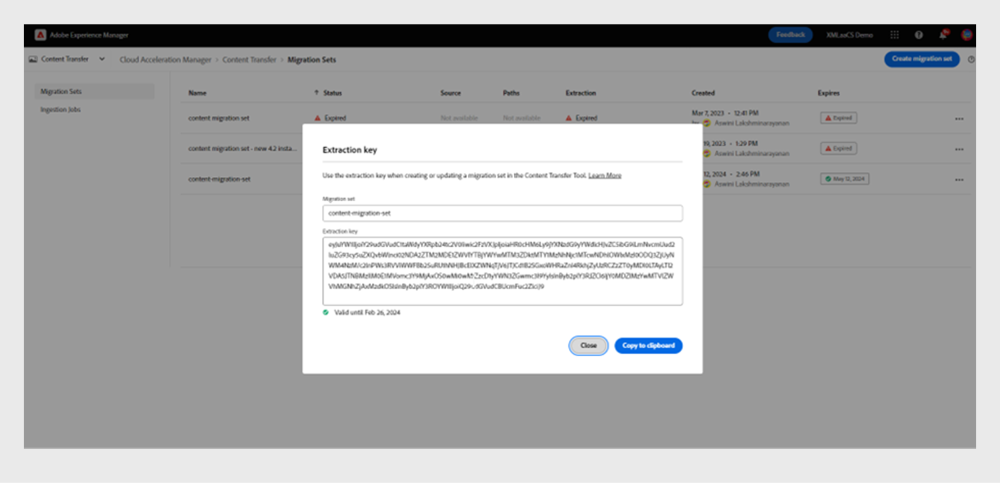

# Migrar contenido de On-Premise a Cloud Service

Experience Manager as a Cloud Service ofrece una base tecnológica escalable, segura y ágil para Experience Manager Assets, Forms y Screens. Esto permite a los especialistas en marketing y a los profesionales de TI centrarse en ofrecer experiencias impactantes a escala.
Con Experience Manager as a Cloud Service, sus equipos pueden centrarse en la innovación en lugar de planificar las actualizaciones de los productos. Las nuevas funciones del producto se prueban a fondo y se entregan a sus equipos sin interrupción para que siempre puedan acceder a la última versión de Adobe Experience Manager.
Este artículo proporciona un proceso detallado paso a paso para migrar el contenido On-Premise o de Managed Services Experience Manager Guides a los Cloud Service, lo que garantiza una transición sin problemas a la plataforma basada en la nube.

## Proceso de migración

**Content Transfer Tool** es una herramienta desarrollada por Adobe que puede usar para iniciar la migración del contenido existente de una instancia On-Premise o Managed Services de Adobe Experience Manager de origen a la instancia Experience Manager Cloud Service de destino.
Esta herramienta también transfiere las entidades principales (usuarios o grupos) automáticamente.

Puede descargar la **herramienta de transferencia de contenido** como archivo ZIP desde el portal de **distribución de software**:

1. Seleccione la ficha **AEM as a Cloud Service** en el portal **Distribución de software**.
1. Buscar **herramienta de transferencia de contenido**.
1. Seleccione **Herramienta de transferencia de contenido** de la lista y descárguela.

A continuación, instale el paquete a través de **Administrador de paquetes** en la instancia de Adobe Experience Manager de origen. Asegúrese de descargar la versión más reciente.
Para obtener más información sobre la versión más reciente, vea [Notas de la versión](https://experienceleague.adobe.com/docs/experience-manager-cloud-service/content/release-notes/release-notes/release-notes-current.html?lang=en).

>[!NOTE]
> 
> Solo es compatible la versión 2.0.0 y posteriores, y se recomienda utilizar la versión más reciente.

### Requisitos previos

* Adobe Experience Manager 6.4 o versiones posteriores
* Se admite un tamaño de repositorio de hasta 20 TB
* Tamaño total del índice Lucene de 25 GB
* La longitud del nombre de un nodo debe ser inferior a 150 bytes

Realice los siguientes pasos para migrar el contenido de Experience Manager Guides a Experience Manager as a Cloud Service.

1. Inicie sesión en [experience.adobe.com](https://experience.adobe.com/) y seleccione **Experience Manager**.

   

1. Haga clic en **Iniciar** en el mosaico **Cloud Acceleration Manager**.
   

1. Cree su primer proyecto.
   

1. Agregue el nombre y la descripción y haga clic en **Crear**. Se crea el proyecto.
1. Seleccione el proyecto creado y abra la pantalla del proyecto.
1. Haga clic en **Revisar** en el mosaico **Transferencia de contenido**.

   

1. Haga clic en **Crear conjunto de migración**.

1. Proporcione el nombre y la descripción para el conjunto de migración.

   

1. Después de la creación, seleccione los tres puntos y seleccione **Copiar clave de extracción**.

1. Haga clic en **Copiar al portapapeles**.
Cree su primer proyecto.
   

1. Seleccione **Adobe Experience Manager** en la parte superior y, a continuación, seleccione el mosaico **Distribución de software**.
   

1. En el portal **Distribución de software**, seleccione **Adobe Experience Manager como Cloud Service**, busque &quot;herramienta de transferencia de contenido&quot; y descargue el paquete de la herramienta de transferencia de contenido.

   >[!NOTE]
   >
   >  Asegúrese de descargar la versión más reciente.

1. Cargue e instale el paquete `content-transfer.all-3.0.10.zip` en el **Administrador de paquetes** de su instancia On-Premise.
   

1. En la instancia local, seleccione **Herramientas** > **Operaciones** > **Migración de contenido** > **Transferencia de contenido**.

1. Seleccione **Transferencia de contenido**, cree un conjunto de migración y pegue la clave de extracción copiada del administrador de aceleración en la nube. Esto establece una conexión entre el origen y el destino. A continuación, comprueba la clave y muestra la validez después de introducir el valor.

1. Habilite la opción **Incluir versiones** para incluir las versiones del archivo.
   

1. Proporcione la ruta que desee migrar y haga clic en **Guardar**.
Por ejemplo, `/content/we-retail`
o
   `/content/dam/wknd-events`
   

   >[!NOTE]
   >
   > Necesita migrar las siguientes rutas obligatoriamente para el contenido de **Experience Manager Guides**.

   * `/content/dam`
   * `/var/dxml`

   Las siguientes rutas están restringidas al crear un conjunto de migración:
   * `/apps`
   * `/libs`
   * `/home`
   * `/etc`: se le permite seleccionar algunas `/etc` rutas en CTT.

1. Haga clic en **Guardar**
1. Seleccione el **conjunto de migración** y, a continuación, seleccione **Extraer** en la parte superior.
   

1. Compruebe los detalles en el elemento emergente **Extracción del conjunto de migración** para las rutas y configuraciones que seleccionó y haga clic en **Extraer**.
La extracción tardará unos minutos y verá el estado como actualizado.
   

1. Una vez completada la extracción y indicada por el estado `finished`, vaya a Cloud Acceleration Manager y seleccione el proyecto que creó en el paso 18.
Para obtener más información, seleccione los tres puntos y, a continuación, seleccione **Ver detalles**.

1. En la ventana emergente de detalles del conjunto de migración, compruebe la configuración del conjunto de migración y cierre la ventana emergente.

   Puede ver las rutas y otras configuraciones como se muestra en la siguiente captura de pantalla:
   

1. Haga clic en **Trabajos de ingesta** > **Nueva ingesta**.
1. Reconozca los valores de marca de verificación necesarios y haga clic en **Crear**.
   

1. Elija el conjunto de migración, seleccione el servidor requerido de su entorno y haga clic en **Ingesta**.

   

## Ejecutar la herramienta de transferencia de contenido en una instancia de Publish

Instale la herramienta de transferencia de contenido en la instancia de Publish de origen para mover contenido a la instancia de Publish de destino.
La herramienta de transferencia de contenido no diferencia entre contenido publicado y no publicado al ingerir contenido en un entorno de Publish. El contenido especificado en el conjunto de migración se ingiere en la instancia de destino elegida. El usuario puede ingerir un conjunto de migración en una instancia de autor, en una instancia de Publish o en ambas.

### Enfoque recomendado

Tenga en cuenta las siguientes recomendaciones:

* Use la misma versión de **Content Transfer Tool** que se usó en la instancia de autor.
* Durante la ingesta en Publish, el nivel de Publish no se reducirá (a diferencia del autor).
* Migre un solo nodo de Publish. Antes de comenzar la extracción, retírela del equilibrador de carga.

>[!NOTE]
>
> Como medida de precaución, asegúrese de que no se produzcan operaciones de escritura en las instancias de Publish, incluidas las acciones iniciadas por el usuario como:
> * Distribución de contenido de AEM as a Cloud Service Author a Publish en ese entorno
> * Sincronización de usuarios entre instancias de Publish

## Resolución de problemas

Si la extracción falla debido al siguiente error, puede resolverlo importando el certificado de CA correspondiente:

`javax.net.ssl.SSLHandshakeException: sun.security.validator.ValidatorException: PKIX path building failed: sun.security.provider.certpath.SunCertPathBuilderException: unable to find valid certification path to requested target`

**Motivo**: el servidor de Adobe Experience Manager tiene restricciones de firewall, así que agregue el siguiente extremo a la lista de permitidos.

`casstorageprod.blob.core.windows.net`

*Habilitar registro SSL.*

