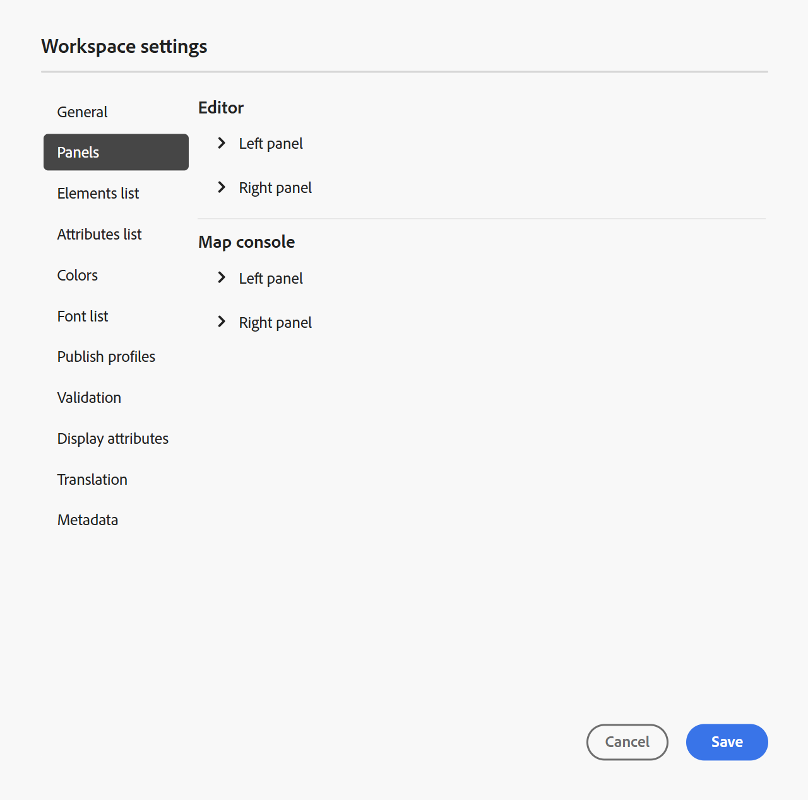
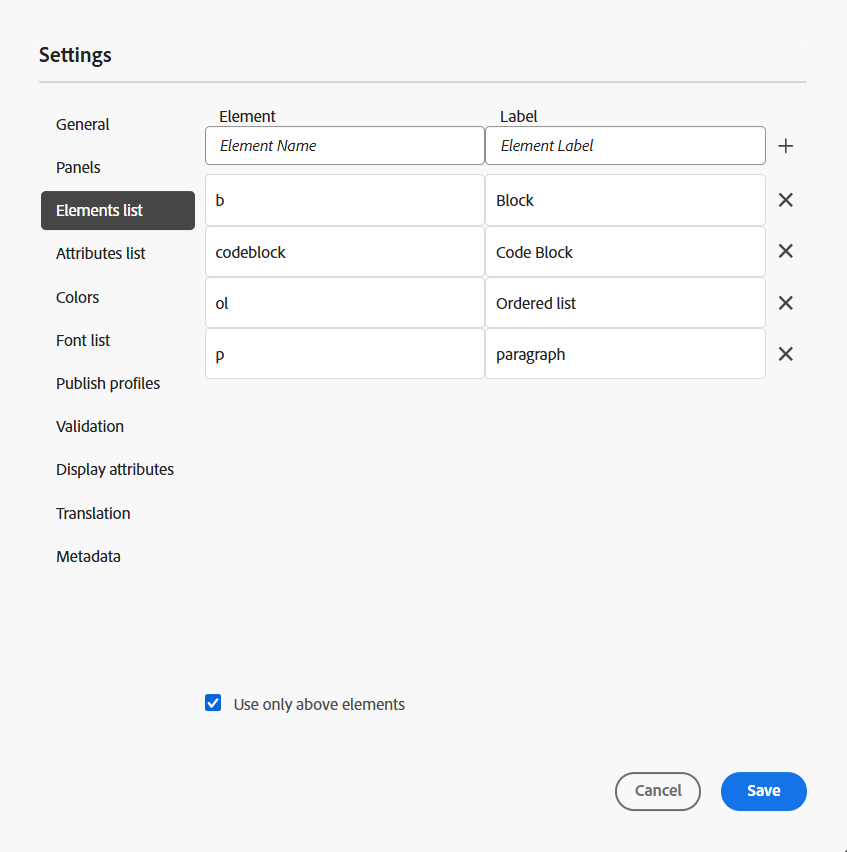

# Configuración de Workspace

La opción **Workspace settings** presente en la [barra de fichas](../user-guide/web-editor-tab-bar.md) del editor solo está disponible para administradores y administradores de perfiles de carpeta, y permite configurar las siguientes opciones:

- [General](#general)
- [Paneles](#panels)
- [Lista de elementos](#elements-list)
- [Lista Atributos](#attributes-list)
- [Colores](#colors)
- [Publicación de perfiles](#publish-profiles)
- [Validación](#validation)
- [Mostrar atributos](#display-attributes)
- [Traducción](#translation)
- [Metadatos](#metadata)

>[!NOTE]
>
> - Si usa Adobe Experience Manager Guides en una configuración local, la opción de configuración de Workspace seguirá apareciendo como **Configuración** en el menú Más acciones.
> - Si va a actualizar cualquier configuración predeterminada, debe volver a abrir los documentos para que los cambios entren en vigor.

## General

La Configuración general permite configurar los ajustes para utilizar el Editor. Esta ficha contiene cinco secciones: **Asistente de IA**, **Creación**, **Citas**, **Condición** y **Corrección ortográfica**.

{width="350" align="left"}

- **Ayudante de IA**
Seleccione esta opción para habilitar la función [Ayudante de IA](../user-guide/ai-assistant.md) en Experience Manager Guides. Anule la selección para deshabilitar la función.

  Después de habilitar la opción **Ayudante de IA**, puede configurar qué opciones aparecen en la **pestaña Creación** para autores mediante el menú **Creación de acciones rápidas**, como se muestra a continuación.\
  Estos cambios se aplican al perfil de carpeta específico con el que está trabajando. Si crea un nuevo perfil de carpeta, heredará la configuración de Workspace definida en el perfil de carpeta **Global** de forma predeterminada. Puede modificar esta configuración según sea necesario mediante la **configuración de Workspace** y guardar la configuración actualizada.\
  Para obtener una descripción detallada de las opciones disponibles para la creación con el Asistente de IA, vea [Crear documentos de forma inteligente con el Asistente de IA](../user-guide/ai-assistant-right-panel.md).

  Desde el menú **Creación de acciones rápidas**, puede:

   - utilice los conmutadores para habilitar o deshabilitar las opciones específicas a las que los autores pueden acceder al trabajar con el Ayudante de IA.

   - Para cambiar el orden en que aparecen las opciones, arrástrelas y suéltelas según sea necesario.

  {width="350" align="left"}

- **Creación**

   - **Habilitar Reemplazar todo**: seleccione esta opción para ver el icono **Reemplazar todo** en el panel **Buscar y reemplazar**.

- **Citas**

  Cambiar el estilo de las citas. Elija el estilo de cita de la lista desplegable que desee utilizar en su proyecto. Para obtener más información, vea [Cambiar estilos de cita](../user-guide/web-editor-apply-citations.md#change-citation-style).

- **Condición**

   - **Resaltar texto condicional en la vista de autor**: seleccione esta opción para resaltar el texto condicional en la vista de autor. El contenido condicional se resalta con el color definido para la condición.

   - **Validar con atributos de condición**: seleccione esta opción para permitir la validación de los valores definidos para los atributos. Esto evita que añada cualquier valor incorrecto.

   - **Mostrar clave con el título en el panel Esquema del asunto**: seleccione esta opción para mostrar las claves junto con los títulos en el esquema del asunto. Si no selecciona esta opción, solo se muestran los títulos. Por ejemplo, aquí las teclas &quot;os&quot;, &quot;audience&quot; y &quot;other&quot; también se muestran junto con los títulos.

     {width="550" align="left"}

   - **Mostrar esquema de asunto en el panel Condiciones**: seleccione esta opción para ver un esquema de asunto en el panel Condiciones. Si anula la selección de esta opción, las condiciones definidas se muestran en el panel Condiciones.

- **Corrección ortográfica**
Hay dos opciones: **revisión ortográfica de AEM** y **revisión ortográfica del explorador**. De forma predeterminada, el editor utiliza la función de revisión ortográfica del explorador, en la que la revisión ortográfica se realiza mediante el diccionario integrado del explorador. Puede cambiar al corrector ortográfico de AEM para utilizar el diccionario de Adobe Experience Manager, que también se puede personalizar para agregar la lista de palabras personalizada. Para obtener más información sobre cómo personalizar el diccionario de AEM, vea la sección [Personalizar el diccionario predeterminado de AEM](../cs-install-guide/customize-aem-custom-dictionary.md) en Instalar y configurar Adobe Experience Manager Guides as a Cloud Service.

## Paneles

Esta opción controla los paneles que se muestran en los paneles izquierdo y derecho de la consola Editor y Mapa. Puede alternar el botón para mostrar u ocultar el panel deseado.

{width="650" align="left"}

También puede definir el orden en que se muestran las funciones presentes en los paneles. Para cambiar el orden predeterminado de las funciones disponibles en los paneles, seleccione las barras de puntos para arrastrar y soltar las pestañas de funciones en la ubicación deseada. También se puede mover una característica de la sección **Más** a la sección principal de un panel y viceversa según sea necesario. Una vez reordenadas, las funciones aparecen en la misma secuencia en los paneles derecho e izquierdo respectivos.

{width="650" align="left"}

Se pueden mostrar un máximo de ocho paneles a la vez. Los cambios realizados en la configuración del panel se aplican inmediatamente.

>[!NOTE]
>
> Si se ha configurado un panel personalizado, también aparecerá en la lista de paneles. Puede alternar el conmutador para mostrar u ocultar el panel personalizado.

## Lista de elementos

Como administrador, puede controlar la lista de elementos que un autor puede insertar en un archivo y también definir el nombre para mostrar del elemento. La configuración de la lista Elementos (Elements) permite especificar el nombre del elemento según las especificaciones de DITA y una etiqueta que se debe utilizar en lugar del nombre del elemento definido por DITA:

{width="650" align="left"}

En la captura de pantalla anterior, al elemento `p` se le ha dado una etiqueta de párrafo y a `codeblock` se le ha dado una etiqueta de bloque de código junto con algunos otros elementos. Si selecciona la opción **Usar solo los elementos anteriores**, solo se mostrarán los elementos válidos \(en el punto de inserción actual\) de esta lista en el cuadro de diálogo **Insertar elemento**.

En la siguiente captura de pantalla, solo se muestran 3 de los 4 elementos configurados de la captura de pantalla anterior en el contexto actual:

{width="300" align="left"}

## Lista Atributos

De forma similar a la lista de elementos, se puede controlar la lista de atributos y sus nombres para mostrar en la lista de atributos de un elemento. En la siguiente captura de pantalla, solo se han configurado 3 atributos para que se muestren en la lista de atributos de un elemento:

{width="650" align="left"}

Con esta configuración, cuando intenta agregar un atributo a un elemento, solo ve la lista de atributos configurados en la lista.

{width="300" align="left"}

## Colores

Muestra una lista de colores de fondo preconfigurados para **Condiciones**. Los usuarios pueden seleccionar un color de fondo al aplicar una condición a un tema. Como administrador, también puede crear y agregar colores de fondo personalizados a la lista. Para agregar un nuevo color, escribe el nombre que desees en el campo **Nombre del color**, elige un color personalizado y selecciona el icono **+**. El color personalizado aparecerá al final de la lista de colores.

## Publicación de perfiles

Contiene los perfiles que se pueden usar para publicar la salida de **Knowledge Base**. Puede crear un nuevo perfil para una base de conocimiento de Target. Por ejemplo, Salesforce o ServiceNow.

**Crear un perfil de Salesforce**

**Requisitos previos**

- Cree una aplicación conectada de para Salesforce. Para obtener más información, consulte [Habilitar la configuración de OAuth para la integración de API](https://help.salesforce.com/s/articleView?id=sf.connected_app_create_api_integration.htm&type=5).

- Al configurar la aplicación conectada, asegúrese de lo siguiente:

   - Especifique la llamada de retorno.

     `URL: http://<server name>:<port>/bin/dxml/thirdparty/callback/salesforce`

   - Seleccione los siguientes ámbitos de OAuth:
      - Acceso completo (completo)
      - Seleccione Administrar datos de usuario mediante API

     Una vez configurada la aplicación, Salesforce proporciona **clave del consumidor** y **secreto del consumidor**. Se pueden utilizar para crear el perfil de Salesforce.

   - Para crear un perfil de Salesforce, seleccione la base de conocimiento **Salesforce** en la lista desplegable **Tipo de servidor**. Introduzca un Nombre de perfil. En la **dirección URL del sitio**, escriba el sitio del consumidor que usaría para publicar la salida y, a continuación, agregue la **clave del consumidor** y el **secreto del consumidor** proporcionados por el sitio del consumidor de Salesforce. A continuación, **Valide** y **guarde** el perfil recién creado.

     {width="550" align="left"}

     >[!NOTE]
     >
     >Para configurar un proxy para Salesforce en Experience Manager Guides, utilice Configuración proxy de componentes HTTP de Apache en AEM. Obtenga información sobre cómo [configurar el proxy para AEM Link Checker](https://helpx.adobe.com/experience-manager/kb/How-to-configure-proxy-for-the-AEM-Link-Checker-AEM.html).

**Crear un perfil de ServiceNow**

**Requisitos previos**

Configure el servidor de ServiceNow para cargar los recursos.

- Conéctese al servidor **ServiceNow**.
- Vaya a **Propiedades del sistema** > **Seguridad**.
- Desmarque la siguiente opción:

  **Esta propiedad debe estar configurada para activar la comprobación de tipo MIME para cargas (todas las versiones de Eureka y superiores). Activa (true) o desactiva (false) la validación de tipo MIME para los archivos adjuntos. Las extensiones de archivo configuradas mediante glide.attachment.extensions se comprobarán en busca del tipo MIME durante la carga.**

- Seleccione **Guardar**.

  Una vez configurada la aplicación, cree el perfil **ServiceNow**.

- Para crear un perfil, seleccione ServiceNow Knowledge Base en la lista desplegable **Tipo de servidor**. Escriba un perfil **Name**. En la **URL de ServiceNow**, introduzca el sitio de consumidores que utilizaría para publicar la salida y, a continuación, agregue el **Nombre de usuario** y la **Contraseña** proporcionados por el sitio de consumidores de ServiceNow. A continuación, **Valide** y **guarde** el perfil recién creado.

  {width="550" align="left"}

  Una vez validado, puede seleccionar el perfil de publicación en los ajustes preestablecidos de salida de un mapa DITA y utilizarlo para generar la salida en el servidor **Salesforce** o **ServiceNow** que haya elegido.

  Obtenga más información sobre el ajuste preestablecido de salida [Knowledge Base](../user-guide/generate-output-knowledge-base.md).

## Validación

Esta pestaña contiene opciones para configurar las validaciones de Schematron en el Editor. Puede activar las siguientes funciones:

- **Ejecute la comprobación de validación antes de guardar el archivo**: Seleccione esta opción para ejecutar las validaciones de Schematron utilizando los archivos de Schematron seleccionados antes de cualquier operación de guardado. Puede añadir un archivo de Schematron seleccionando el icono +. Se muestran los archivos de Schematron seleccionados.

  >[!NOTE]
  >
  >- Los archivos de Schematron seleccionados persistirán para el perfil de carpeta seleccionado.
  >- Cuando se añade un archivo de Schematron no válido, se muestra un mensaje de error, como se muestra a continuación.

  {width="550" align="left"}

  Esto evita que los usuarios guarden cualquier archivo que rompa una regla definida en los archivos de Schematron seleccionados. Si no se selecciona esta opción, el archivo no se validará antes de guardar los cambios.

- **Permitir que todos los usuarios agreguen archivos de Schematron en el panel de validación**: seleccione esta opción para permitir que los usuarios agreguen cualquier archivo de Schematron en el panel Validación del Editor. Esto permite a los usuarios agregar archivos de Schematron y, a continuación, validar los temas con el archivo de Schematron. Si no se selecciona esta opción, la opción para agregar el botón **Agregar archivo de schematron** no estará disponible para los usuarios en el **panel Validación** del Editor.

  {width="550" align="left"}

## Mostrar atributos

Al igual que la lista Atributos, puede controlar la lista de atributos que se mostrarán en la lista de atributos de un elemento. De manera predeterminada, se han configurado cuatro **atributos de visualización**: audiencia, plataforma, producto y props para que se muestren en la lista de atributos de un elemento. También puede agregar un atributo de visualización mediante el icono **Agregar** de la parte superior. También puede eliminar cualquiera de los atributos de visualización mediante el icono **Delete**.

Los atributos definidos para un elemento se muestran en las vistas Diseño y Esquema.

{width="550" align="left"}

## Traducción

Esta pestaña contiene las opciones para crear grupos de idiomas, propagar las etiquetas de origen a la versión de destino y limpiar el proyecto de traducción.

{width="550" align="left"}

- **Grupos de idiomas**: como administrador, puede crear un grupo de idiomas y utilizarlos como un conjunto para traducir el contenido.

  Siga estos pasos para crear un nuevo grupo de idiomas:

   1. Seleccione **Añadir**.
   1. Introduzca el nombre del grupo de idiomas. Cada idioma debe tener un nombre único. Puede ver un error si el campo de nombre está vacío o si el nombre no es único.
   1. Seleccione los idiomas en la lista desplegable. Puede seleccionar varios idiomas.

      Escriba los primeros caracteres del idioma o el código de idioma para filtrar los idiomas deseados. Por ejemplo, escriba &#39;en&#39; para filtrar todos los idiomas que contienen &#39;en&#39; al principio de su nombre o código.

   1. Seleccione el icono Listo para añadir los idiomas seleccionados al grupo. Se muestran los idiomas. Cuando se agregan tres o más idiomas, se muestra la opción **Mostrar más**. Puede seleccionar **Mostrar más** para ver todos los idiomas presentes en el grupo.

      >[!TIP]
      >
      > Cambie **Mostrar más** por **Mostrar menos** y ver solo algunos idiomas.

   1. Pase el ratón sobre los idiomas de un grupo para editar  o eliminar  los grupos de idiomas.
   1. Guardar **configuración**.

      >[!NOTE]
      >
      >Como usuario, puede ver los grupos de idiomas configurados en el perfil de carpeta.

- **Propagar etiquetas de versión de origen a la versión de destino**: seleccione esta opción para pasar la etiqueta de la versión del archivo de origen al archivo traducido. Esta opción está desactivada de forma predeterminada.
- **Limpieza del proyecto de traducción una vez finalizado**: seleccione esta opción para configurar los proyectos de traducción que se deshabilitarán o eliminarán automáticamente después de la traducción. De manera predeterminada, **Ninguno** está seleccionado, de manera que el proyecto existe después de la traducción.

  Puede desactivar los proyectos de traducción si desea utilizarlos más adelante. Al eliminar un proyecto, se eliminan permanentemente todos los archivos y carpetas presentes en el proyecto.

## Metadatos

Puede controlar los metadatos de versión del tema y sus valores para que se muestren en el cuadro de diálogo **Historial de versiones**.  En la ruta de metadatos, especifique la ubicación de los nodos desde los que desea seleccionar los metadatos. También puede definir un nombre personalizado para los metadatos como etiqueta. Las propiedades predeterminadas son Título, Estado del documento y Etiquetas.

Los metadatos se pueden seleccionar desde cualquier propiedad bajo el nodo `/jcr:content` del recurso, de modo que puede agregar la ruta de la propiedad como ruta de metadatos.

Se muestra un error si la ruta de metadatos está en blanco. Si deja la etiqueta en blanco, se selecciona el último elemento como etiqueta.

{width="550" align="left"}

*Configurar los metadatos del cuadro de diálogo **Historial de versiones**.*

También puede definir el orden en que se muestran estas etiquetas de metadatos. Para cambiar el orden predeterminado de estas etiquetas, seleccione las barras de puntos para arrastrar y soltar las etiquetas en la ubicación deseada.
Las etiquetas de metadatos aparecen en la misma secuencia en el cuadro de diálogo **Historial de versiones** del Editor.

