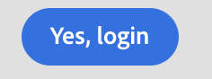

# Botón

Para mostrar un botón utilizamos el componente, botón.
El componente de botón de la JUI representa un HTML `<button/>`.

```js title="buttonJSON.js"
const buttonJSON = {
  "component": "button",//tells the component name
  "label": "Yes, login",//tells the text for the button
  "variant": "cta",//tells the variants for the button which  provides default styles
  "on-click": "done",//tells what function to run after user clicks the button
};
```

Esto producirá un botón con la etiqueta `Yes, login`. Las otras propiedades incluyen, entre otras, variant, label y on-click.
> **_NOTA:_** `on-<events>` es la sintaxis para invocar los comandos en los controladores.

El botón procesado tendrá este aspecto:


