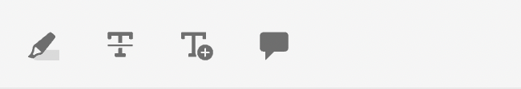

# Componentes de la aplicación Revisar

A continuación se muestran los componentes principales de la aplicación de revisión:

- Panel de revisión en línea: `id: inline_review_panel`
   - Panel derecho donde se representan los comentarios de revisión en el lado del Editor XML.

- Revisiones de temas: `id: topic_reviews`
   - Panel derecho en el que se representan los comentarios en la aplicación de revisión.

- Comentario de revisión: `id: review_comment`
   - El widget para cada comentario de revisión.

Comentario de revisión en la aplicación de revisión:

Revise el comentario en el lado del editor xml:

- Revisar respuesta de comentario: `id: comment_reply`
   - El widget para cada respuesta de comentario de revisión.
     

- Nueva respuesta de comentario de revisión: `id: comment_new_reply`
   - El widget para la nueva respuesta de comentario de revisión.
     

- Cuadro de herramientas de anotaciones: `id: annotation_toolbox`
   - La barra de herramientas superior derecha de la aplicación de revisión.
     
