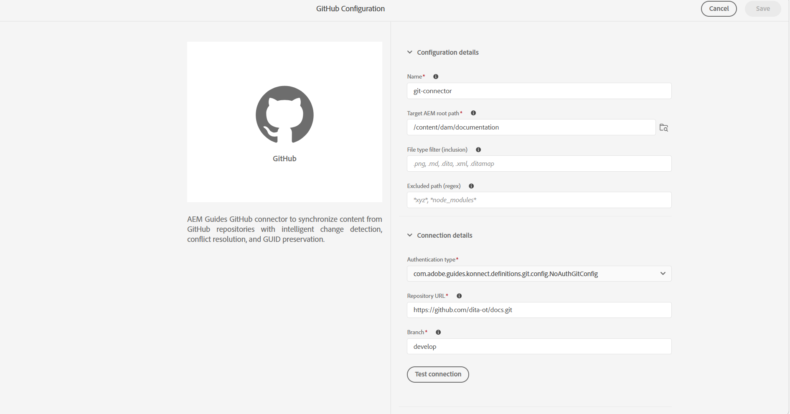
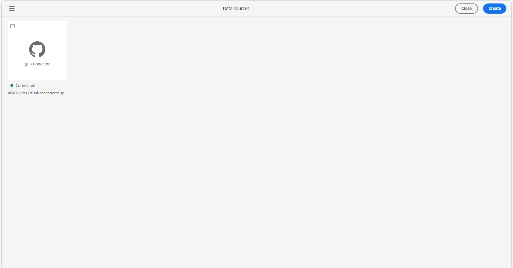

# Crear y configurar el conector Git desde la interfaz de usuario de

Utilice la herramienta Fuentes de datos de Experience Manager Guides para crear y configurar un conector Git desde la interfaz de usuario. Después de configurar el conector correctamente, puede utilizarlo para importar contenido de un repositorio Git a Experience Manager Guides.

1. Seleccione el vínculo **Adobe Experience Manager** de la parte superior y elija **Herramientas**.
1. Seleccione **Guías** de la lista de herramientas.
1. Seleccione el mosaico **Fuentes de datos**. Se muestra la página **Fuentes de datos**.
1. Seleccione **Crear**.
1. En la lista de conectores de origen de datos, seleccione **GitHub**.

   {width="600"}

1. Seleccione **Siguiente**.
1. Introduzca los detalles de configuración y conexión.

   {width="600"}

   >[!TIP]
   >
   >* Pase el ratón sobre  cerca del campo para ver más detalles al respecto.
   >* Los campos con * son obligatorios. Por ejemplo, puede introducir los siguientes detalles para el conector de Elasticsearch.

   * **Nombre**: escriba el nombre del origen de datos.
   * **Ruta de acceso raíz de AEM de destino**: escriba la ruta de acceso en el repositorio de AEM donde se debe almacenar el contenido importado de Git.
   * **Filtro de tipo de archivo (inclusión)**: especifique los tipos de archivo que se incluirán durante la importación.
   * **Ruta de acceso excluida (regex)**: especifique los patrones de ruta que se excluirán de la importación.
   * **Tipo de autenticación**: seleccione el tipo de autenticación en la lista desplegable. Actualmente, **token de acceso personal (PAT)** es el único método de autenticación compatible. Introduzca la RUTA durante la configuración del conector para autenticar y acceder al repositorio Git.
   * **URL del repositorio**: introduzca la URL del repositorio Git desde la que se debe importar el contenido.
   * **Rama**: escriba la rama que se usará para importar contenido.

1. Compruebe la conexión. El botón **Probar conexión** solo se habilita después de que haya especificado los detalles necesarios. Si los detalles de conexión son correctos, aparecerá un mensaje de éxito. De lo contrario, aparecerá un mensaje de error.

   {width="600"}

1. Seleccione **Guardar** en la parte superior para guardar el conector.

   El botón Guardar solo se activa después de introducir todos los detalles necesarios y de que la conexión se haya realizado correctamente. Si el conector se guarda correctamente, puede ver el conector de Github configurado en la página **Fuentes de datos**.

   {width="600"}

