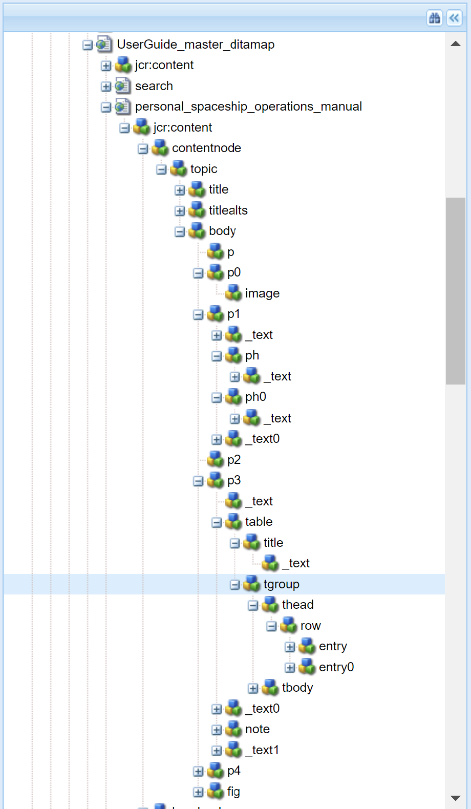
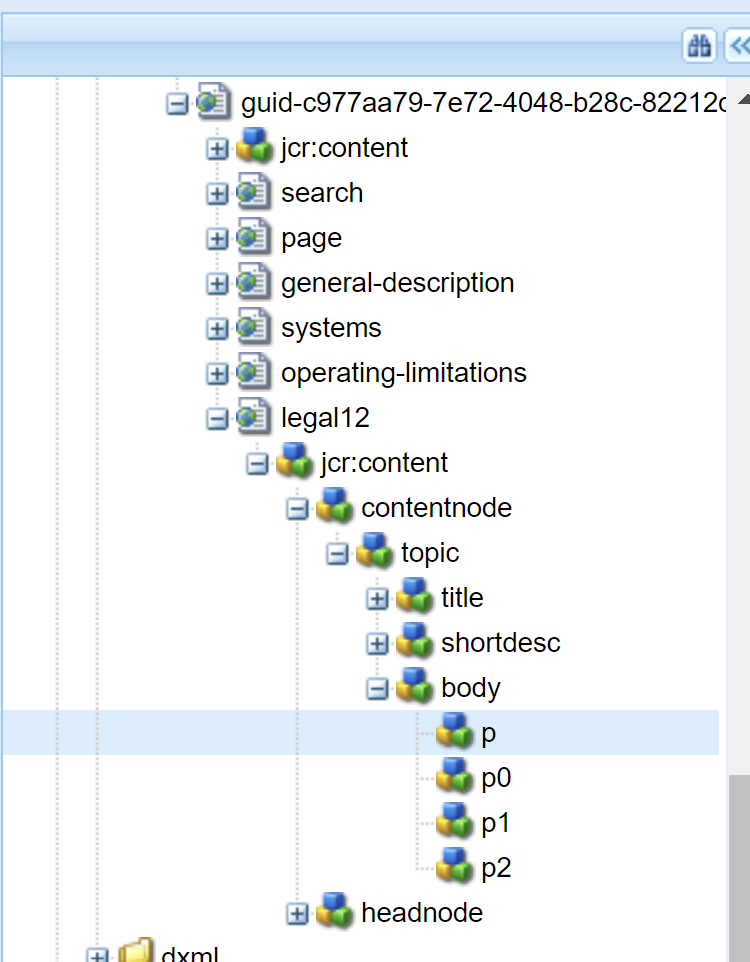

# Personalizar salida del sitio de AEM {#id166TG0B30WR}

AEM Guides admite la creación de salidas en los siguientes formatos:

- Sitio de AEM
- PDF
- HTML5
- EPUB
- Salida personalizada mediante DITA-OT

Para la salida del sitio de AEM, puede asignar diferentes plantillas de diseño con diferentes tareas de salida. Estas plantillas de diseño pueden representar el contenido DITA en diferentes diseños. Por ejemplo, puede especificar distintas plantillas de diseño para audiencias internas y externas.

También puede utilizar complementos personalizados DITA Open Toolkit \(DITA-OT\) con AEM Guides. Puede cargar estos complementos DITA-OT personalizados para generar la salida de PDF de una forma específica.

>[!TIP]
>
> Consulte la sección *Publicación de sitios AEM* en la [Guía de prácticas recomendadas](https://helpx.adobe.com/content/dam/help/en/xml-documentation-solution/cs-mar-22/Adobe-Experience-Manager-Guides_Best-Practices_EN.pdf) para conocer las prácticas recomendadas sobre la creación de resultados de sitios AEM.


## Personalizar la plantilla de diseño para generar resultados {#customize_xml-add-on}

AEM Guides utiliza un conjunto de plantillas de diseño predefinidas para generar la salida del sitio de AEM. Puede personalizar las plantillas de diseño de AEM Guides para generar el resultado que se ajuste a la marca corporativa. Una plantilla de diseño es una colección de varios estilos \(CSS\), secuencias de comandos \(del lado del servidor y del lado del cliente\), recursos \(imágenes, logotipos y otros recursos\) y nodos JCR que unen todos estos recursos. Una plantilla de diseño puede ser tan sencilla como un único script del lado del servidor con solo un par de nodos JCR o una combinación compleja de estilos, recursos y nodos JCR. El subsistema de publicación de AEM Guides utiliza las plantillas de diseño al generar la salida del sitio de AEM y controlan la estructura, el aspecto y la presentación de la salida generada.

No hay restricciones en cuanto a la ubicación de los recursos de la plantilla de diseño en el servidor, pero suelen estar organizados lógicamente según su función. Por ejemplo, la plantilla predeterminada tiene todos sus archivos JavaScript y CSS almacenados en la carpeta `/etc/designs/fmdita/clientlibs/siteoutput/default`. Dondequiera que se encuentren estos archivos, se vinculan entre sí mediante una colección de nodos JCR. Juntos, estos nodos JCR y los archivos constituyen la plantilla de diseño completa.

La plantilla de diseño predeterminada enviada con AEM Guides le permite personalizar los componentes de página de aterrizaje, tema y búsqueda. Se puede realizar una copia del diseño por defecto y de las plantillas de referencia correspondientes, así como especificar diferentes componentes para generar la salida deseada.

Las siguientes pestañas proporcionan instrucciones para especificar su propia plantilla de diseño para utilizarla en la generación de resultados del sitio de AEM en función de su configuración de Experience Manager Guides: Cloud Service o On-Premise.

>[!BEGINTABS]

>[!TAB Cloud Service]

1. Utilice el Administrador de paquetes para descargar la plantilla de diseño predeterminada desde la siguiente ubicación:

   /libs/fmdita/config/templates

1. Cree una copia de los archivos descargados en la siguiente ubicación del repositorio de Git de Cloud Manager:

   /apps/fmdita/config/templates

1. También debe descargar y copiar las plantillas a las que se hace referencia desde el nodo de plantilla predeterminado. Las plantillas a las que se hace referencia se colocan en:

   /libs/fmdita/templates/default/cqtemplates

>[!TAB Local]

1. Inicie sesión en AEM y abra el modo CRXDE Lite.

1. Vaya al nodo de plantilla de diseño predeterminado. La ubicación del nodo de plantilla de diseño predeterminado es:

   `/libs/fmdita/config/templates/`

   {width="300" align="left"}

   >[!NOTE]
   >
   > Realice una copia de las plantillas de diseño predeterminadas de la carpeta `libs` en la carpeta `apps` y realice cambios en la carpeta `apps`. También debe realizar cambios en las plantillas a las que se hace referencia desde el nodo de plantilla predeterminado. Las plantillas a las que se hace referencia se colocan en el nodo `/libs/fmdita/templates/default/cqtemplates`. Realice una copia de las plantillas a las que se hace referencia en la carpeta `apps` antes de realizar los cambios.

1. Haga clic en el componente *default* en el nodo *templates* para acceder a sus propiedades.

>[!ENDTABS]

Las propiedades de la plantilla de diseño de AEM Guides se describen en la tabla siguiente.

| Propiedad | Descripción |
|--------|-----------|
| `landingPageTemplate`, `searchPageTemplate`, `topicPageTemplate`, `shadowPageTemplate` | Especifique el nodo `cq:Template` para estas páginas correspondientes \(aterrizaje, búsqueda y tema\). De manera predeterminada, el nodo `cq:Template` para estas páginas se encuentra en el nodo `/libs/fmdita/templates/default/cqtemplates`. Este nodo define la estructura y las propiedades de las páginas de aterrizaje, búsqueda y tema.<br>: `shadowPageTemplate` se usa para optimizar el contenido fragmentado. Debe establecer el valor de esta propiedad en: `fmdita/templates/default/cqtemplates/shadowpage` <br> **Nota:** Debe especificar un valor para `topicPageTemplate`. `landingPageTemplate` y `searchPageTemplate` son propiedades opcionales. Si no desea que se generen las páginas de búsqueda y de aterrizaje, no especifique estas propiedades. |
| `title` | Un nombre descriptivo de la plantilla de diseño. |
| `topicContentNode` | Ubicación del nodo que contendrá el contenido DITA en una página de tema. La ruta es relativa a la página del tema. |
| `topicHeadNode` | Ubicación del nodo que contendrá los valores \(o metadatos\) del encabezado derivados del contenido DITA. La ruta es relativa a la página del tema. |
| `tocNode` | Ubicación del nodo que contendrá la TDC. La ruta es relativa a la página de aterrizaje o a la ruta de destino. |
| `basePathProp` | Nombre de propiedad para almacenar la ruta de acceso de la raíz del sitio publicado. |
| `indexPathProp` | Nombre de propiedad para almacenar la ruta de la página de aterrizaje/índice del sitio publicado. |
| `pdfPathProp` | Nombre de propiedad para almacenar la ruta de PDF del tema, si la generación de PDF del tema está habilitada. |
| `pdfTypeProp` | Nombre de propiedad para almacenar el tipo de generación de PDF. Actualmente, esta propiedad siempre contiene &quot;Tema&quot;. |
| `searchPathProp` | Nombre de propiedad para almacenar la ruta de la página de búsqueda, si la plantilla incluye una página de búsqueda. |
| `siteTitleProp` | Nombre de propiedad para almacenar el título del sitio que se está publicando. Este título suele ser el mismo que el título del mapa que se está publicando. |
| `sourcePathProp` | Nombre de propiedad para almacenar la ruta del tema DITA de origen de la página actual. |
| `tocPathProp` | Nombre de propiedad para almacenar la ruta de la raíz del índice del sitio publicado. |


>[!NOTE]
>
> Después de crear un nodo de plantilla de diseño personalizado, debe actualizar la opción Diseño en los ajustes preestablecidos de salida del sitio de AEM para utilizar el nodo de plantilla de diseño personalizado.

Para obtener más información, consulte [Creación de su primer sitio web de Adobe Experience Manager](https://experienceleague.adobe.com/docs/experience-manager-learn/getting-started-wknd-tutorial-develop/overview.html?lang=es) y [Aspectos básicos](https://experienceleague.adobe.com/docs/experience-manager-cloud-service/implementing/developing/full-stack/develop-wknd-tutorial.html?lang=es) del desarrollo de su propio sitio web en AEM.

## Usar título de documento para generar salida del sitio de AEM

Al generar la salida del sitio de AEM, la forma en que se generan las direcciones URL desempeña un papel importante en la capacidad de detección del contenido. Si utiliza nombres de archivo basados en UUID, la generación de direcciones URL basadas en el UUID de sus archivos no sería fácil de buscar. Como administrador o editor, tiene el control sobre cómo desea generar las direcciones URL para la salida del sitio de AEM. AEM Guides le proporciona una configuración a través de la cual puede elegir generar las direcciones URL de la salida del sitio de AEM utilizando el título del archivo en lugar de los nombres de archivo basados en UUID. De forma predeterminada, para sistemas de archivos basados en UUID, esta opción está activada. Esto implica que, cuando se genera la salida del sitio de AEM para sistemas de archivos basados en UUID, los títulos del archivo se utilizan para generar las direcciones URL y no los UUID de los archivos.

Para la configuración On-Premise con sistemas de archivos no basados en UUID, la salida del sitio de AEM se genera utilizando los nombres de archivo y no los títulos del archivo. Esta opción está desactivada de forma predeterminada. Esto implica que, cuando se genera la salida del sitio de AEM, los nombres de archivo se utilizan para generar las direcciones URL y no el título del archivo. Puede optar por generar las direcciones URL basadas en los títulos del archivo activando esta opción.

Las siguientes pestañas proporcionan instrucciones para configurar la generación de URL en la salida del sitio de AEM en función de la configuración de Experience Manager Guides: Cloud Service o On-Premise.

>[!NOTE]
>
> Además, puede configurar reglas para permitir solo un conjunto de caracteres en las direcciones URL de la salida de un sitio de AEM. Para obtener más información, consulte [Configurar las reglas de saneamiento de nombres de archivo para crear temas y publicar la salida del sitio de AEM](#id2164D0KD0XA).

>[!BEGINTABS]

>[!TAB Cloud Service]

Siga las instrucciones indicadas en [Anulaciones de configuración](download-install-config-override.md#) para crear el archivo de configuración. En el archivo de configuración, proporcione los siguientes detalles \(property\) para configurar la generación de direcciones URL en la salida del sitio de AEM:

| PID | Clave de propiedad | Valor de propiedad |
|---|------------|--------------|
| `com.adobe.fmdita.config.ConfigManager` | `aemsite.pagetitle` | Boolean \(true/false\). Si desea generar un resultado utilizando el título de página, establezca esta propiedad en true. De manera predeterminada, está establecido para utilizar el nombre de archivo.<br> **Valor predeterminado**: false |


>[!TAB Local]

1. Abra la página Configuración de la consola web de Adobe Experience Manager.

   La URL predeterminada para acceder a la página de configuración es:

   ```http
   http://<server name>:<port>/system/console/configMgr
   ```

1. Busque y haga clic en el paquete **com.adobe.fmdita.config.ConfigManager**.

1. Seleccione la opción **Usar título para nombres de páginas de sitios AEM**.

   >[!NOTE]
   >
   > Si desea generar una salida con los nombres de archivo, anule la selección de esta opción.

1. Haga clic en **Guardar**.

>[!ENDTABS]

## Configure la dirección URL de la salida del sitio de AEM para utilizar el título del documento (solo para Cloud Service)

Puede utilizar los títulos de los documentos en la dirección URL de la salida del sitio de AEM. Si el nombre del archivo no existe o contiene todos los caracteres especiales, puede configurar el sistema para que reemplace los caracteres especiales con un separador en la dirección URL de la salida del sitio de AEM. También puede configurarlo para que los reemplace por el nombre del primer tema secundario.


Para configurar los nombres de página, realice los siguientes pasos:

1. Siga las instrucciones indicadas en [Anulaciones de configuración](download-install-config-override.md#) para crear el archivo de configuración.
1. En el archivo de configuración, proporcione los siguientes detalles (propiedad) para configurar los nombres de página de los temas.

| PID | Clave de propiedad | Valor de propiedad |
|---|------------|--------------|
| `com.adobe.fmdita.common.SanitizeNodeName` | `nodename.systemDefinedPageName` | Boolean (`true/false`). **Valor predeterminado**: `false` |

Por ejemplo, si el *@navtitle* de `<topichead>` tiene todos los caracteres especiales y usted establece la propiedad `aemsite.pagetitle` en true, de manera predeterminada, usa un separador. Si establece la propiedad `nodename.systemDefinedPageName` en true, se muestra el nombre del primer tema secundario.


## Configure las reglas de saneamiento de nombres de archivo para crear temas y publicar resultados en AEM Sites y otros formatos {#id2164D0KD0XA}

Como administrador, puede definir una lista de caracteres especiales válidos permitidos en los nombres de archivo, que finalmente forman la dirección URL de la salida de un sitio de AEM. En versiones anteriores, se permitía a los usuarios definir nombres de archivo que contenían caracteres especiales como `@`, `$`, `>`, etc. Estos caracteres especiales provocaban URL codificadas en la generación de páginas del sitio de AEM.

A partir de la versión 3.8, se han añadido configuraciones para definir una lista de caracteres especiales permitidos en los nombres de archivo. De manera predeterminada, la configuración de nombre de archivo válida contiene &quot;`a-z A-Z 0-9 - _`&quot;. Esto implica que, al crear un archivo, puede tener cualquier carácter especial en el título del archivo, pero internamente se reemplazará con un guión \(`-`\) en el nombre del archivo. Por ejemplo, puede tener el título del archivo como Introducción 1 o Introduction@1, el nombre de archivo correspondiente generado para ambos casos sería Introducción-1.

Cuando defina una lista de caracteres válidos, recuerde que estos caracteres &quot;`*/:[\]|#%{}?&<>"/+`&quot; y `a space` se reemplazarán siempre con un guión \(`-`\).

>[!NOTE]
>
> Si no configura la lista de caracteres especiales válidos, el proceso de creación de archivos podría dar algunos resultados inesperados.

Las siguientes pestañas proporcionan instrucciones para configurar los caracteres especiales válidos en los nombres de archivo y la salida del sitio de AEM en función de la configuración de Experience Manager Guides: Cloud Service o On-Premise.

>[!BEGINTABS]

>[!TAB Cloud Service]

Siga las instrucciones indicadas en [Anulaciones de configuración](download-install-config-override.md#) para crear el archivo de configuración. En el archivo de configuración, proporcione los siguientes detalles \(property\) para configurar los caracteres especiales válidos en los nombres de archivo y en la salida del sitio de AEM:

| PID | Clave de propiedad | Valor de propiedad |
|---|------------|--------------|
| `com.adobe.fmdita.common.SanitizeNodeNameImpl` | `aemsite.DisallowedFileNameChars` | Asegúrese de que la propiedad está establecida en ``'<>`@$``. Puede agregar más caracteres especiales a esta lista. |

>[!NOTE]
> 
> La configuración anterior se aplica a todos los formatos de salida. Esto significa que, al generar una salida de PDF, HTML o personalizada, la salida final sigue las reglas de saneamiento de nombres de archivo configuradas.

También puede configurar otras propiedades, como el uso de minúsculas en los nombres de archivo, el separador para controlar los caracteres no válidos y el número máximo de caracteres permitidos en los nombres de archivo. Para configurar estas propiedades, agregue los siguientes pares de valor clave en el archivo de configuración:

| Clave de propiedad | Valor de propiedad |
|------------|--------------|
| `nodename.uselower` | Booleano \(true/false\).<br> **Valor predeterminado**: true |
| `nodename.separator` | Cualquier carácter. <br> **Valor predeterminado**: \_ *\(guion bajo\)* |
| `nodename.maxlength` | Valor entero.<br> **Valor predeterminado**: 50 |

>[!TAB Local]

1. Abra la página Configuración de la consola web de Adobe Experience Manager.

   La URL predeterminada para acceder a la página de configuración es:

   ```http
   http://<server name>:<port>/system/console/configMgr
   ```

1. Busque y haga clic en el paquete *com.adobe.fmdita.common.SanitizeNodeNameImpl*.

1. En el conjunto de caracteres **No permitido para la publicación en la propiedad AEM Sites**, asegúrese de que la propiedad está establecida en ```'<>`@$```. Puede agregar más caracteres especiales a esta lista, pero debe tener estos caracteres especiales necesarios.

   >[!NOTE]
   >
   > También puede configurar otras propiedades como **Usar minúsculas** en los nombres de archivo, **Separador** para controlar caracteres no válidos y **Número máximo de caracteres** permitidos en los nombres de archivo.

1. Haga clic en **Guardar**.

1. Busque y haga clic en el paquete **com.adobe.fmdita.config.ConfigManager**.

1. En la propiedad **Regex for Valid Characters**, asegúrese de que la propiedad está establecida en `[-a-zA-Z0-9_]`. Puede agregar más caracteres a esta lista, pero debe tener estos caracteres básicos y la lista debe comenzar con un guión \(`-`\).

   >[!NOTE]
   >
   > Esta propiedad define la lista de caracteres válidos utilizados para crear un nuevo archivo.

1. Haga clic en **Guardar**.

>[!ENDTABS]

## Configuración del acoplamiento de la estructura de nodos del sitio de AEM

Cuando se genera la salida del sitio de AEM, se crea internamente un nodo para cada elemento de los temas. Para un mapa DITA con miles de temas, esta estructura de nodos puede llegar a ser demasiado profunda. Este tipo de estructura de nodos profundamente anidados puede tener problemas de rendimiento para sitios más grandes. La siguiente instantánea muestra la estructura de nodos profundamente anidados para una salida de sitio de AEM:



En la instantánea anterior, observe que hay un nodo creado para cada elemento `p` y sus subelementos subsiguientes, y que se crea una estructura similar para todos los demás elementos utilizados en el tema.

AEM Guides le permite configurar cómo se crea internamente la estructura de nodos de la salida del sitio de AEM. Puede aplanar la estructura del nodo en elementos especificados, lo que significa que puede definir un elemento que se considerará como el elemento principal y todos los subelementos dentro de él se combinarán con el elemento principal. Por ejemplo, si decide acoplar el elemento `p`, cualquier elemento que aparezca dentro del elemento `p` se combinará con el elemento principal `p`. No se crearía una nota independiente para ningún subelemento dentro del elemento `p`. La siguiente instantánea muestra la estructura de nodos acoplada en el elemento `p`:



Las siguientes pestañas proporcionan instrucciones para acoplar la estructura de nodos del sitio de AEM en función de la configuración de Experience Manager Guides: Cloud Service o On-Premise.

>[!BEGINTABS]

>[!TAB Cloud Service]

1. Identifique los elementos en los que desea acoplar la estructura del nodo:

1. Superposición del nodo `libs` en el nodo `apps` y abra el archivo elementmapping.xml.

1. Agregue la propiedad `<flatten>true</flatten>` en la definición del elemento en el que desea acoplar la estructura del nodo. Por ejemplo, si desea acoplar la estructura del nodo en el elemento `p`, agregue el atributo flatten en la definición del elemento `p` como se muestra a continuación:

   ```XML
   <ditaelement>
         <name>p</name>
         <class>- topic/p</class>
         <componentpath>fmdita/components/dita/wrapper</componentpath>
         <type>COMPOSITE</type>
         <target>para</target>
         <flatten>true</flatten>
         <wrapelement>div</wrapelement>
      </ditaelement>
   ```

   >[!NOTE]
   >
   > De forma predeterminada, la propiedad acoplar nodo se ha configurado en el elemento `p`.

1. Siga las instrucciones indicadas en [Anulaciones de configuración](download-install-config-override.md#) para crear el archivo de configuración.
1. En el archivo de configuración, proporcione los siguientes detalles \(property\):

   | PID | Clave de propiedad | Valor de propiedad |
   |---|------------|--------------|
   | `com.adobe.dxml.flattening.FlatteningConfigurationService` | `flattening.enabled` | Booleano \(true/false\).<br> **Valor predeterminado**: `false` |


Ahora, cuando genere la salida del sitio de AEM, los nodos dentro del elemento `p` se acoplan y almacenan dentro del propio elemento `p`. Puede encontrar las nuevas propiedades de acoplamiento para el elemento `p` en CRXDE.


>[!TAB Local]

1. Especifique el elemento en el que desea acoplar la estructura del nodo.

   1. Superposición del nodo `libs` en el nodo `apps` y abra el archivo elementmapping.xml.

   1. Agregue la propiedad `<flatten>true</flatten>` en la definición del elemento en el que desea acoplar la estructura del nodo. Por ejemplo, si desea acoplar la estructura del nodo en el elemento `p`, agregue el atributo flatten en la definición del elemento `p` como se muestra a continuación:

      ```XML
      <ditaelement>
          <name>p</name>
          <class>- topic/p</class>
          <componentpath>fmdita/components/dita/wrapper</componentpath>
          <type>COMPOSITE</type>
          <target>para</target>
          <flatten>true</flatten>
          <wrapelement>div</wrapelement>
      </ditaelement>
      ```

      >[!NOTE]
      >
      > De forma predeterminada, la propiedad acoplar nodo se ha configurado en el elemento `p`.

1. Habilite la configuración de acoplamiento del nodo de sitio en configMgr.

   1. Abra la página Configuración de la consola web de Adobe Experience Manager.

      La URL predeterminada para acceder a la página de configuración es:

      ```http
      http://<server name>:<port>/system/console/configMgr
      ```

   1. Busque y haga clic en el paquete *com.adobe.xml.flattening.FlateningConfigurationService*.

   1. Seleccione la opción **Acoplamiento de propiedades.enabled**.

   1. Haga clic en **Guardar**.


>[!IMPORTANT]
>
> Si ha realizado algún cambio en el archivo elementmapping.xml, asegúrese de abrir configMgr y guardar cualquier paquete para que los cambios entren en vigor.

Ahora, cuando genere la salida del sitio de AEM, los nodos dentro del elemento `p` se acoplan y almacenan dentro del propio elemento `p`. Puede encontrar las nuevas propiedades de acoplamiento para el elemento `p` en CRXDE.

{width="650" align="left"}

>[!ENDTABS]

**Busque una cadena dentro del contenido en la salida del sitio de AEM (solo para Cloud Service)**

De forma predeterminada, solo puede buscar una cadena en los títulos dentro de la salida del sitio de AEM. Puede configurar el sistema para que busque una cadena tanto en los títulos como en el contenido o el cuerpo de la salida del sitio de AEM.

>[!NOTE]
>
> A veces, la búsqueda puede funcionar para algunos elementos del contenido, pero se puede configurar para que funcione para todo el contenido.


Para habilitar la búsqueda, debe configurar el acoplamiento de la estructura de nodos del sitio de AEM.

ATENCIÓN:

Puede buscar hasta 1 MB de contenido plano. Por ejemplo, en la captura de pantalla anterior, puede buscar si el contenido de la etiqueta &lt;p\> es &lt;= 1Mb.

>[!NOTE]
>
> La búsqueda funciona en los elementos solamente si el atributo `<flatten>` está establecido en true. De manera predeterminada, AEM Guides tiene el atributo `<flatten>` establecido en true para los elementos de texto que se utilizan con más frecuencia, como &lt;p\> &lt;ul\> &lt;lId\>. Sin embargo, si ha creado algunos elementos personalizados, debe establecer el atributo `<flatten>` en true en el archivo elementmapping.xml.

**Impedir el acoplamiento de la estructura de nodos del sitio de AEM**

De forma similar a especificar el nodo que se acoplará en la salida del sitio de AEM, también puede especificar el elemento que desee excluir de esta configuración. Por ejemplo, si desea acoplar nodos en el elemento `body`, pero no desea acoplar ningún elemento `table` dentro de `body`, puede agregar la propiedad de exclusión dentro de la definición del elemento `table`.

Para excluir el elemento `table` del acoplamiento, agregue la siguiente propiedad a la definición del elemento `table`:

`<preventancestorflattening>true|false</preventancestorflattening>`

## Configuración de las versiones para las páginas eliminadas en la salida del sitio de AEM

Cuando genera la salida del sitio de AEM con la opción **Eliminar y** Crear **&#x200B;**&#x200B;seleccionada para la configuración Páginas de salida existentes, se crea una versión para las páginas que se están eliminando. Puede configurar el sistema para que detenga la creación de una versión antes de la eliminación.

Las siguientes pestañas proporcionan instrucciones para detener la creación de una versión para la página que se está eliminando en función de la configuración de Experience Manager Guides: Cloud Service o Local.

>[!BEGINTABS]

>[!TAB Cloud Service]

1. Siga las instrucciones indicadas en [Anulaciones de configuración](download-install-config-override.md#) para crear el archivo de configuración.
1. En el archivo de configuración, proporcione los siguientes detalles \(property\) para configurar la opción **No crear versión para páginas eliminadas**:

   | PID | Clave de propiedad | Valor de propiedad |
   |---|------------|--------------|
   | `com.adobe.fmdita.confi g.ConfigManager` | `no.version.creation.on.deletion` | Booleano \(true/false\).<br> **Valor predeterminado**: `true` |

   >[!NOTE]
   >
   > Con esta opción seleccionada, los usuarios podrán eliminar directamente cualquier página sin crear ninguna versión para ellos. Si la opción no está seleccionada, se crea una versión antes de que se eliminen las páginas.

>[!TAB Local]

1. Abra la página Configuración de la consola web de Adobe Experience Manager.

   La URL predeterminada para acceder a la página de configuración es:

   ```http
   http://<server name>:<port>/system/console/configMgr
   ```

1. Busque y haga clic en el paquete *com.adobe.fmdita.config.ConfigManager*.

1. Seleccione la opción **No crear versión para páginas eliminadas**.

   >[!NOTE]
   >
   > Con esta opción seleccionada, los usuarios podrán eliminar directamente cualquier página sin crear ninguna versión para ellos. Si la opción no está seleccionada, se crea una versión antes de que se eliminen las páginas.

1. Haga clic en **Guardar**.

>[!ENDTABS]

## Configuración del reescritor personalizado con Experience Manager Guides (solo para Cloud Service) {#custom-rewriter}

Experience Manager Guides tiene un módulo sling [**rewriter**](https://sling.apache.org/documentation/bundles/output-rewriting-pipelines-org-apache-sling-rewriter.html) personalizado para administrar los vínculos generados en caso de mapas cruzados (vínculos entre los temas de dos mapas diferentes). Esta configuración de reescritura está instalada en la siguiente ruta: <br> `/apps/fmdita/config/rewriter/fmdita-crossmap-link-patcher`.

Si tiene otra reescritura de sling personalizada en la base de código, utilice un valor de `'order'` mayor que 50, ya que la reescritura de sling de Experience Manager Guides utiliza `'order'` 50.  Para anular esto, necesita un valor >50 . Para obtener más información, vea [Canalizaciones de reescritura de salida](https://sling.apache.org/documentation/bundles/output-rewriting-pipelines-org-apache-sling-rewriter.html).


