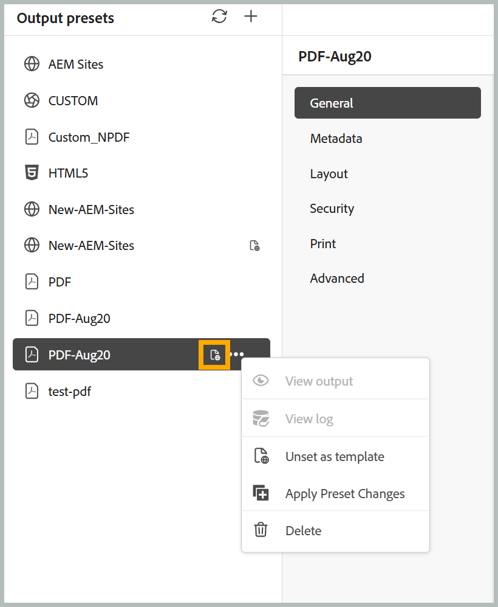

# Configurar ajustes preestablecidos de plantilla para la generación de resultados

>[!NOTE]
>
> El ajuste preestablecido de plantilla está disponible en Experience Manager Guides as a Cloud Service a partir de la versión 2026.08.0. Póngase en contacto con el equipo de éxito del cliente para habilitar esta función.

Los ajustes preestablecidos de plantilla permiten a los administradores estandarizar las configuraciones de ajustes preestablecidos de salida en varios mapas DITA. En lugar de configurar el mismo ajuste preestablecido de salida individualmente para cada mapa, puede definir un ajuste preestablecido como plantilla y aplicarlo a todas las asignaciones asociadas a un perfil de carpeta.

Esta capacidad le ayuda a mantener configuraciones de publicación coherentes en todos los proyectos y reduce el esfuerzo de configuración manual.

## Ventajas

El uso de ajustes preestablecidos de plantilla ofrece las siguientes ventajas:

- Garantiza configuraciones de publicación coherentes en varias asignaciones.
- Reduce el esfuerzo manual al eliminar la configuración preestablecida repetitiva.
- Permite la administración centralizada de los ajustes preestablecidos de salida.

## Tipos de salida admitidos

Los ajustes preestablecidos de plantilla son compatibles con todos los tipos de ajustes preestablecidos de salida, excepto con los siguientes:

- Edge Delivery Services
- Base de conocimiento
- SCORM

## Crear y administrar ajustes preestablecidos de plantilla

>[!NOTE]
>
> - Solo **Administradores** y **Administradores de perfil de carpeta** pueden crear y administrar ajustes preestablecidos de plantilla.
> - Los ajustes preestablecidos de plantilla están pensados para la administración de la configuración y no se utilizan directamente para la generación de resultados.

1. Configure el perfil de carpeta que desee utilizar para las carpetas.
2. Abra **Ajustes preestablecidos de salida** desde la consola Mapa para la carpeta asociada.
3. Cree o seleccione el ajuste preestablecido de salida que desee utilizar como plantilla.

   >[!NOTE]
   >
   > Al crear o seleccionar el ajuste preestablecido de salida que desea utilizar como plantilla, asegúrese de que se añade al perfil de carpeta actual.

4. Seleccione **Establecer como plantilla** en el menú **Opciones** del ajuste preestablecido.

   {width="650"}

   El ajuste preestablecido de salida seleccionado se convierte en un ajuste preestablecido de plantilla. Los ajustes preestablecidos de plantilla se identifican mediante un icono de plantilla que los distingue de los ajustes preestablecidos normales. Para quitar el estado de la plantilla, seleccione **Anular configuración como plantilla** en el menú **Opciones** del ajuste preestablecido de la plantilla en cualquier momento.

   {width="650"}

5. Seleccione **Aplicar cambios de ajuste preestablecido** del menú **Opciones** del ajuste preestablecido de plantilla para aplicar la configuración del ajuste preestablecido actualizada a todas las asignaciones existentes en el perfil de carpeta seleccionado.

   Se abre el cuadro de diálogo **Aplicar cambios preestablecidos**.

   {width="350"}

6. Para sobrescribir el ajuste preestablecido existente, seleccione la casilla de verificación **Sobrescribir ajuste preestablecido existente** y seleccione **Aceptar**. Al sobrescribir, se actualiza el ajuste preestablecido, pero no se modifican los ajustes de Línea base, Ajuste preestablecido de condición, DITAVAL, Lista de temas o Contexto de publicación en el ajuste preestablecido de destino. Esta configuración permanece sin cambios.

   Se abre un cuadro de diálogo **Confirmar acción** que indica a cuántas asignaciones se aplican los cambios de ajustes preestablecidos.

   {width="350"}

7. Seleccione **Aceptar**.

Los cambios se aplican a todos los ajustes preestablecidos de todas las asignaciones dentro de las carpetas asociadas.

>[!NOTE]
>
> Al crear una asignación nueva en la carpeta asociada, la copia local del ajuste preestablecido de plantilla también estaría disponible para esa asignación recién creada.

## Comportamiento de generación de salida

Los ajustes preestablecidos de plantilla son plantillas de configuración y no están pensados para una publicación directa. Cuando un ajuste preestablecido está marcado como plantilla:

- Generar salida no está disponible.
- No se puede utilizar el ajuste preestablecido de plantilla para la publicación.
- Los resultados generados existentes para el ajuste preestablecido de plantilla siguen siendo accesibles si se crearon antes de que el ajuste preestablecido se convirtiera en una plantilla.

