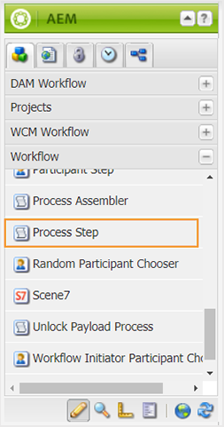

# Configuración de estados de documento {#id181GB0400UI}

AEM Guides permite definir los estados del documento para los temas DITA según los requisitos de la organización. Puede definir diferentes estados del documento desde el principio hasta el final. Por ejemplo, el primer estado puede ser Borrador y pasar a Revisar, Aprobado, Traducido y, finalmente, Publicado.

Existen dos maneras en las que un tema puede pasar de un estado a otro: manual y automático. Los estados del documento definidos en un perfil se pueden utilizar para cambiar manualmente el estado del documento. Esto se puede hacer desde la página Propiedades de un archivo de tema. Además, puede definir quién puede mover el documento de un estado a otro. Por ejemplo, un autor puede crear un documento y el estado predeterminado del documento puede ser Borrador. Cuando la autora envía el documento para su revisión, puede cambiar el estado del documento a En revisión. El revisor puede cambiar el estado del documento a Aprobado o a Borrador de nuevo según el proceso de revisión. Si el documento es Aprobado, el editor puede cambiar el estado del documento a Traducido o Publicado según el flujo de trabajo.

>[!NOTE]
>
> Si un usuario pertenece al grupo *administradores*, el usuario puede cambiar el estado de un documento de cualquier estado, independientemente de las transiciones de estado del documento definidas en el sistema.

## Crear un estado de documento

AEM Guides se envía con un conjunto de estados de documento predeterminados. Estos estados son:

- Borrador
- Editar
- En revisión
- Aprobados
- Revisado
- Listo

Estos estados predeterminados están disponibles para todos los temas DITA creados en DAM. Puede crear sus propios estados de documento y asignarlos a una carpeta específica. Todos los ficheros DITA creados en esa carpeta tendrán acceso a los estados de documento recién creados.

Para crear estados de documento utilizando el Perfil de carpeta, realice los siguientes pasos:

1. Haga clic en el vínculo Adobe Experience Manager en la parte superior y elija **Herramientas**.
1. Seleccione **Guías** de la lista de herramientas.
1. Haga clic en el mosaico Estados del documento.

   Se muestra la página Estados de Assets. De forma predeterminada, la página muestra un perfil predeterminado.

1. Haga clic en **Crear perfil** e introduzca los siguientes detalles:
   - Introduzca el nombre del perfil en el campo Perfil.
   - Especifique la ruta en la que desea aplicar el nuevo perfil.
   - Especifique los estados del documento en **Estados permitidos** en **Estados**. Los estados de documento predeterminados son Borrador, Editar, En revisión, Aprobado y Listo.

     Haga clic en el botón **Agregar** para agregar un estado de documento.

      - Haga clic en el icono Eliminar para eliminar un estado de documento.

     >[!NOTE]
     >
     > No elimine un estado de documento si los documentos siguen en ese estado. Si elimina un estado de documento, no podrá cambiar el estado de dicho documento a menos que pertenezca al grupo de usuarios *administrador*.

   - Especifique el estado inicial del documento en **Estado inicial**.
   - Especifique el estado final del documento en **Estado final**.
   - Especifique la transición de estado del documento en **De** y **A** en **Transición de estado**.

      - Especifique los usuarios y grupos de usuarios que pueden cambiar el estado del documento en **Grupos**.

      - Haga clic en el botón **Agregar** para agregar una transición de estado.

      - Haga clic en el icono Eliminar para eliminar una transición de estado.

     >[!NOTE]
     >
     > No elimine una transición de estado si los documentos siguen en el estado `From`. Si elimina una transición de estado, no podrá cambiar el estado del documento de dichos documentos a menos que pertenezca al grupo de usuarios *administrador*.

1. Haga clic en **Listo**.

## Crear una copia de un perfil de estado de documento

Según sus necesidades, puede crear una copia de un perfil de estado de documento existente. Puede utilizar la copia como base para crear otro perfil de documento.

Para crear una copia de un perfil de estado de documento, realice los siguientes pasos:

1. Haga clic en el vínculo Adobe Experience Manager en la parte superior y elija **Herramientas**.
1. Seleccione **Guías** de la lista de herramientas.
1. Haga clic en el mosaico Estados del documento.

   Se muestra la página Estados de Assets.

1. Seleccione el perfil de estado del documento que desea duplicar y haga clic en **Duplicar perfil**.
1. Realice los cambios necesarios y haga clic en **Listo**.

## Eliminar un estado de documento o una transición de estado

>[!NOTE]
>
> No elimine un estado de documento o una transición de estado si los documentos siguen en el estado o en la transición de estado. Si elimina un estado o una transición de estado, no podrá cambiar el estado del documento de dichos documentos a menos que pertenezca al grupo de usuarios *administrador*.

Realice los siguientes pasos para eliminar un estado de documento o una transición de estado de un perfil de estado de documento:

1. Haga clic en el vínculo Adobe Experience Manager en la parte superior y elija **Herramientas**.
1. Seleccione **Guías** de la lista de herramientas.
1. Haga clic en el mosaico Estados del documento.

   Se muestra la página Estados de Assets.

1. Seleccione el perfil de estado del documento desde el que desea eliminar el estado del documento y haga clic en **Editar perfil**.
1. Elimine el estado o la transición de estado del documento y haga clic en **Listo**.

## Eliminar un perfil de estado de documento

Para eliminar un perfil de estado de documento, realice los siguientes pasos:

1. Haga clic en el vínculo Adobe Experience Manager en la parte superior y elija **Herramientas**.
1. Seleccione **Guías** de la lista de herramientas.
1. Haga clic en el mosaico Estados del documento.

   Se muestra la página Estados de Assets.

1. Seleccione el perfil de estado del documento que desea eliminar y haga clic en **Eliminar perfil**.

## Automatizar el cambio de estado del documento

Si no desea cambiar manualmente los estados del documento, puede crear un flujo de trabajo y automatizar el cambio de estado del documento.

>[!NOTE]
>
> Los flujos de trabajo automatizados deben cumplir con los estados y transiciones del documento definidos en la configuración. El sistema no realiza ninguna comprobación de los cambios de estado realizados mediante flujos de trabajo automatizados.

Siga estos pasos para automatizar el cambio de estado del documento:

1. AEM Abra la página de flujo de trabajo desde la URL del servidor de.

   `<AEM_Server_URL>:<port>/workflow`

1. Abra un flujo de trabajo desde la página de flujo de trabajo. Por ejemplo, Revisar tema.
1. AEM Seleccione **Paso de proceso** de la sección **Flujo de trabajo** del cuadro de diálogo de la y arrastre y suelte en el flujo de trabajo.

   

1. Haga doble clic en el proceso y abra el cuadro de diálogo **Propiedades del paso**.
1. Escriba los siguientes detalles en la ficha **Proceso** del cuadro de diálogo y haga clic en Aceptar:
   - Seleccione **Establecer estado del documento para cualquier recurso DAM** de la lista desplegable Proceso.
   - Active la casilla de verificación Avance del controlador.
   - Escriba el nombre del estado del documento en el cuadro de texto **Argumentos**.

     >[!NOTE]
     >
     > Asegúrese de introducir el estado correcto del documento en el cuadro de texto Argumento. Si escribe un nombre incorrecto, el documento se establecerá en un estado de documento incorrecto.

1. Haga clic en **Guardar** para guardar el flujo de trabajo.

## Habilitar flujo de trabajo de aprobación

AEM Guides proporciona un flujo de trabajo de aprobación de documentos, que le ayuda a controlar el ciclo de vida del proceso de desarrollo de documentos. Para habilitar el flujo de trabajo de aprobación, realice los siguientes pasos:

1. AEM Inicie sesión en la aplicación y abra el modo CRXDE Lite.

1. Vaya al archivo de configuración predeterminado disponible en la siguiente ubicación:

   `/libs/fmdita/clientlibs/clientlibs/xmleditor/ui_config.json`

1. Cree una copia del archivo de configuración predeterminado en la siguiente ubicación:

   `/apps/fmdita/xmleditor/ui_config.json`

1. Vaya y abra el archivo `ui_config.json` en el nodo `apps` para editarlo.

1. En el archivo `ui_config.json`, habilite la característica de flujo de trabajo de aprobación cambiando la sección *características* como se muestra a continuación:

   ```json
   "features":  
   { 
      "approvalWorkflow":  true 
   }
   ```
