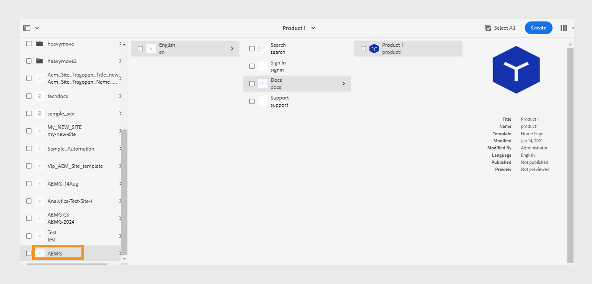
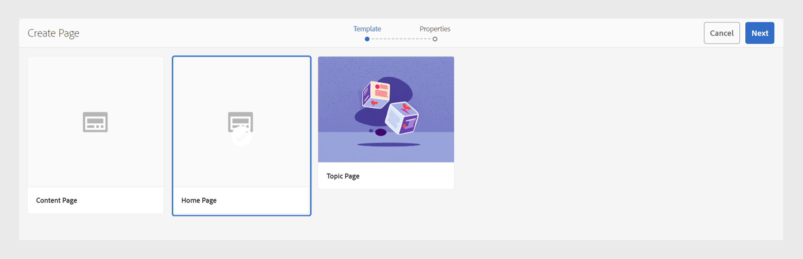
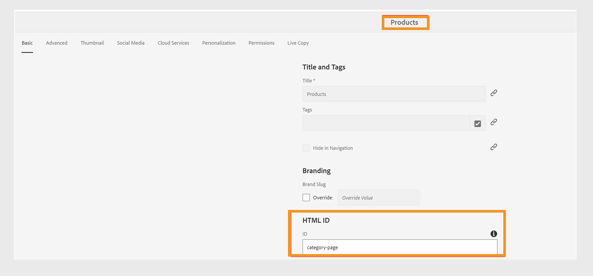

# Descargar e instalar plantillas de AEM Sites

Siga estos pasos para descargar e instalar plantillas de AEM Sites en Experience Manager Guides para software On-Premise:


## Instalación de paquetes

1. Descargue los siguientes paquetes

   - Componentes: [guides-components-all.zip](https://github.com/adobe/aemg-sites-components/releases/tag/v1.0.0)

   - Sitios para software local: [Documentos](https://github.com/adobe/aemg-docs/releases/tag/v1.0.0)

1. AEM Inicie sesión en la instancia de y vaya al Administrador de paquetes de CRX. La URL predeterminada para acceder al administrador de paquetes es:

   ```http
   http://<server name>:<port>/crx/packmgr/index.jsp
   ```

   AEM El Administrador de paquetes administra los paquetes en la instalación local de la. AEM Para obtener más información sobre cómo trabajar con el Administrador de paquetes, vea [Cómo trabajar con paquetes](https://helpx.adobe.com/es/experience-manager/6-5/sites/administering/using/package-manager.html) en la documentación de la.

1. Para cargar el paquete, haga clic en **Cargar paquete**.

1. En el cuadro de diálogo **Cargar paquete**, vaya al archivo que descargó en el paso 1 y haga clic en **Aceptar**.

   AEM El paquete se cargará en la instancia de la.

1. Para instalar el paquete, haz clic en **Instalar**.

1. En el cuadro de diálogo **Instalar paquete**, haga clic en **Instalar** para instalar los paquetes.


## Configuración de las plantillas para utilizarlas con los ajustes preestablecidos de AEM Sites

Una vez instalados los paquetes, se crea un sitio denominado **AEMG** en la interfaz de usuario de Sites. Este sitio de ejemplo muestra cómo puede configurar la estructura del sitio para generar la salida de AEM Sites. Esto es solo una muestra. Puede crear sitios personalizados según sus necesidades.




**AEMG** contiene los siguientes componentes.
- Hay una carpeta para el idioma inglés en la carpeta **AEMG**. Puede crear copias de idioma similares según sus necesidades. Por ejemplo, un sitio web multilingüe incluye copias en inglés (en), alemán (de) y francés (fr).  Obtenga más información acerca de cómo crear una copia de idioma con el [Asistente para copia de idioma](https://experienceleague.adobe.com/es/docs/experience-manager-65/content/sites/administering/introduction/tc-wizard).
- Dentro de la carpeta de idioma inglés(en), Experience Manager Guides proporciona muchas páginas de muestra listas para usar como **Search**, **Sign in**, **Docs** y **Support**.

- **Documentos** es la página de inicio de documentación de ejemplo. Sirve como ubicación central para toda la documentación relacionada con el producto
y muestra cada producto para el que hay documentación disponible como mosaicos individuales.

- Junto con la página de inicio de la documentación, hay páginas de muestra de **Buscar**, **Iniciar sesión** y **Soporte técnico**. Puede personalizar estos ejemplos según sus necesidades.
- Puede tener páginas de inicio de productos individuales como Product1. Hay una página de muestra **Product1** en **Docs**, que es la página de inicio de la documentación.

- Experience Manager Guides también proporciona las siguientes plantillas predefinidas:

   - Plantilla de **página de contenido**: use esta plantilla para crear las páginas estándar que contienen la mayor parte del contenido del sitio del producto. Pueden incluir texto, imágenes, vídeos y otros elementos de contenido. Esta plantilla contiene únicamente el encabezado y el pie de página. Personalícelo y utilícelo para crear cualquier página según sus necesidades. Por ejemplo, puede crear la página de soporte técnico o la página de inicio de sesión del producto.
   - Plantilla de **página de inicio**: la página de aterrizaje principal de un sitio web que incluye información general, secciones clave como elementos y características clave y vínculos de navegación. Por ejemplo, la página principal de un producto ABC se conecta a las demás páginas de contenido o características.
   - Plantilla de **página de tema**: páginas utilizadas para organizar y presentar contenido basado en temas. Por ejemplo, una guía del usuario contiene diferentes páginas de temas, cada una de las cuales contiene un tema específico relacionado con las funciones y la solución de problemas.

  

Utilice estos ejemplos y plantillas para generar las salidas de AEM Sites:
- Una página de inicio del producto corresponde a una página de inicio del mapa y se crea con la plantilla Página de inicio. Seleccione esta ruta en el ajuste preestablecido de AEM Sites para publicar el contenido del mapa debajo de ella. La página de inicio del producto puede incluir otras páginas de inicio.
- Por ejemplo, tiene un producto como Experience Manager Guides y necesita tres manuales para usuarios, administradores y desarrolladores.  Cree una página de inicio para cada manual con la plantilla Página de inicio y, a continuación, seleccione la página de inicio correspondiente en el ajuste preestablecido de salida de AEM Sites.

Obtenga más información sobre cómo crear y configurar [ajustes preestablecidos de AEM Sites en el editor web](../user-guide/generate-output-aem-site-web-editor.md).

## Crear una página de inicio con la plantilla

Siga estos pasos para crear la página principal del producto:
1. Una vez instalado el paquete, seleccione **Sitios** en Navegación global.
1. Seleccione la plantilla &quot;AEM Docs&quot; instalada en la interfaz de usuario de Sites.
1. En la interfaz de usuario de Sites, haga clic en el botón **Crear** en la esquina superior derecha.
1. Seleccione **Página** de la lista desplegable **Crear**.
1. Seleccione **Página principal** y haga clic en **Siguiente**.
1. Escriba el título del sitio y el nombre del sitio y haga clic en **Crear** en la esquina superior derecha. AEM Se crea una plantilla del sitio de la con la plantilla del sitio **Página de inicio**. Por ejemplo, puede crear una página de inicio para el producto `Product ABC`.


>[!NOTE]
>
>Una vez creada la página principal, puede usar esta ruta como **ruta de Publish** para generar el resultado de los ajustes preestablecidos de AEM Sites. Por ejemplo, `aemg-docs-en/docs/product-abc`.

## Editar plantillas de temas para AEM Sites

También puede personalizar las plantillas de temas para su AEM Sites. AEM Puede editar el contenido o configurar las propiedades de los diferentes componentes de la en el tema. Por ejemplo, puede agregar o quitar componentes según sus necesidades.\
Siga estos pasos para editar las plantillas de temas:
1. Seleccione la plantilla que desee editar.
1. Seleccione el icono **Editar** de la parte superior.

AEM Se abre el Editor de plantillas de. Puede editar la plantilla de tema. Más información sobre [Creación de plantillas de página](https://experienceleague.adobe.com/es/docs/experience-manager-65/content/sites/authoring/siteandpage/templates#editing-a-template-structure-template-author).


## Personalizar plantillas de AEM Sites existentes

Además de las plantillas predefinidas, también puede utilizar las plantillas existentes con los ajustes preestablecidos de AEM Sites. Siga estos pasos para personalizar las plantillas de AEM Sites existentes:

### Configuración de plantilla

Necesita los dos tipos de plantillas siguientes:

- Categoría o plantilla de aterrizaje: esta plantilla se utiliza para la página de aterrizaje de la documentación del producto y corresponde a un mapa DITA.  AEM La página de sitio para un mapa DITA se genera mediante esta plantilla. Puede utilizar esta plantilla en cualquier nivel.
: Añada un componente de texto a la plantilla existente. El componente de texto debe tener una propiedad obligatoria, `text="$category.html$"`.
: por ejemplo, puede elegir plantillas de comercio minorista web y utilizar la plantilla de página de sección como plantilla de página de aterrizaje para el mapa DITA. Para ello, realice los cambios que se muestran en la siguiente captura de pantalla:
  
   - Plantilla de página de detalles o de página de tema: utilice esta plantilla para el contenido de los temas de un mapa. Todas las páginas de Sites de contenido DITA/XML se crean mediante plantillas de página de temas. Para crear estas plantillas, existen dos requisitos previos:
      - Agregue un componente de texto a la plantilla, contenido en un componente contenedor, con una propiedad obligatoria. `text="$topic.content$"`.

        
      - Refleje el mismo contenedor y componente de texto en la estructura de la misma plantilla, como se muestra en la siguiente captura de pantalla:

        

### Etiquetar página de categoría como contenedor de documentación

Suponiendo que se crea una jerarquía de sitios para las páginas de documentación que utilizan la plantilla anterior, elija una de las páginas de categoría creadas en esa jerarquía de sitios. Etiquete la página de categoría como un contenedor de documentación, para ello asígnele un ID.
Para ello, asigne a su propiedad `id` un valor `category-page`. Consulte la siguiente captura de pantalla:

