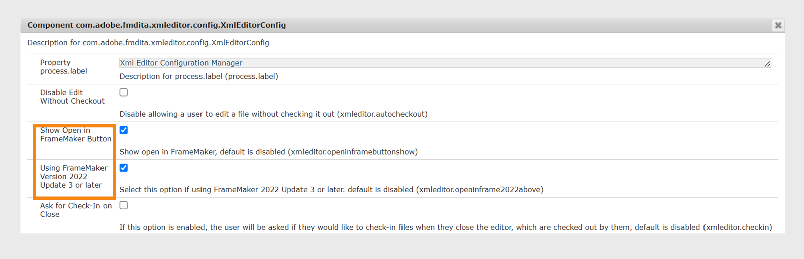

# Integración de editores XML basados en escritorio {#id181GB01G0HS}

Hay muchos editores XML disponibles en el mercado, y es posible que ya esté utilizando uno. Adobe FrameMaker AEM es uno de los editores XML más poderosos, que viene con conector de la. AEM Con el conector de la en FrameMaker AEM, puede conectarse fácilmente con el repositorio de la, extraer y archivar archivos, y editar archivos directamente en FrameMaker. También puede configurar Experience Manager Guides para que inicie el FrameMaker desde el Editor web. Una vez que haya abierto el archivo en el FrameMaker AEM, puede editarlo y volver a registrarlo en el repositorio de.

## Habilitar la edición de archivos en el FrameMaker desde el Editor web

Puede utilizar el FrameMaker o cualquier otro editor DITA para crear y actualizar contenido DITA. Sin embargo, si su organización utiliza el FrameMaker como editor DITA, puede ofrecer a los usuarios una opción para abrir documentos DITA directamente en el FrameMaker AEM desde el punto de vista de la.

De manera predeterminada, los usuarios no ven el botón **Abrir en el FrameMaker AEM** en la barra de herramientas de la barra de herramientas de la aplicación de la barra de herramientas de la aplicación de la. AEM Siga estos pasos para agregar este botón en la barra de herramientas de la barra de herramientas de la:

1. Abra la página Configuración de la consola web de Adobe Experience Manager.

   La URL predeterminada para acceder a la página de configuración es:

   ```http
   http://<server name>:<port>/system/console/configMgr
   ```

1. Busque y haga clic en el paquete **com.adobe.fmdita.xmleditor.config.XmlEditorConfig**.
   

1. Seleccione la opción **Mostrar botón Abrir en FrameMaker**.

1. Si usa la versión 4.6 y la actualización 3 de septiembre de FrameMaker 2022, debe habilitar la **Actualización 3 o superior de la versión 2022 de FrameMaker** para que los usuarios pasen los detalles del servidor de Experience Manager Guides al FrameMaker. De forma predeterminada, está desactivada.


1. Haga clic en **Guardar**.


Cuando se activa la opción **Mostrar apertura en el botón de FrameMaker**, el botón **Abrir en el FrameMaker AEM** se muestra al seleccionar cualquier archivo DITA en el repositorio de. Si esta opción está *no habilitada*, el botón **Abrir en el FrameMaker** solo se muestra al seleccionar un archivo .fm o .book en el repositorio.


