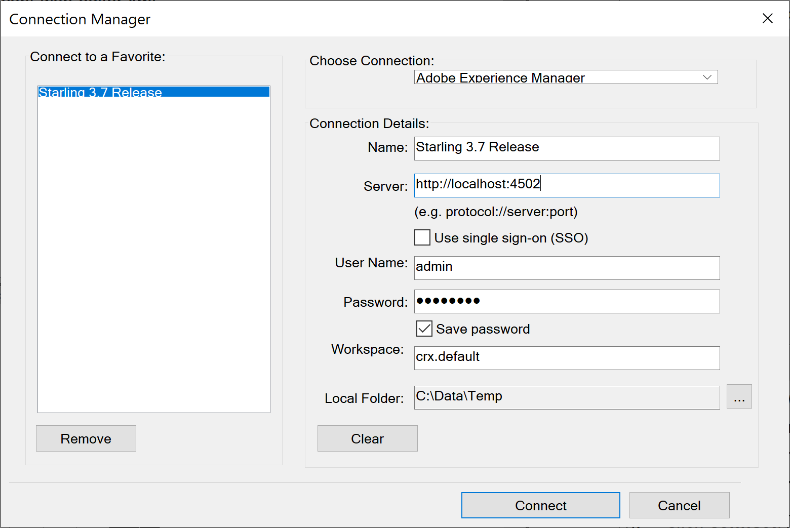

# Cargar contenido DITA existente {#id176FF000JUI}

Lo más probable es que tenga un repositorio de contenido DITA existente que desee utilizar con AEM Guides. AEM Para dicho contenido existente, puede utilizar cualquiera de los siguientes métodos para cargar el contenido en lote en el repositorio de.

## Uso de una herramienta WebDAV

Si está creando los temas y mapas en cualquier otro editor DITA, puede utilizar cualquier herramienta WebDAV para cargar los archivos. El procedimiento que se describe en esta sección utiliza WinSCP como herramienta WebDAV para cargar contenido.

Siga estos pasos para usar WinSCP para cargar archivos:

1. Descargue e instale WinSCP en su equipo.

1. Inicie la aplicación WinSCP.

   Aparecerá el cuadro de diálogo Inicio de sesión.

1. En el cuadro de diálogo Inicio de sesión, especifique una configuración de Nuevo sitio eligiendo WebDAV como **Protocolo de archivos** y proporcionando otros detalles de conexión como:

   - AEM la URL donde se aloja el servidor de la,

   - el número de puerto \(el valor predeterminado es 4502\), y

   - AEM Utilice el nombre de usuario y la contraseña para acceder a su servidor de.

1. Haga clic en **Login**.

   Si la conexión se realiza correctamente, verá el contenido de AEM Assets en la interfaz de usuario de WinSCP. Puede examinar, crear, actualizar o eliminar fácilmente el contenido mediante el explorador de archivos WinSCP.


## Usar FrameMaker

Adobe FrameMaker AEM incluye un potente conector de que permite cargar fácilmente los documentos DITA y de FrameMaker AEM \(.book y .fm\) existentes en la interfaz de usuario de. Puede utilizar varias funcionalidades de carga de archivos, como cargar un solo archivo o cargar una carpeta completa con o sin dependencias \(como referencias de contenido, referencias cruzadas y gráficos\).

Siga estos pasos para utilizar el conector de de FrameMaker AEM para cargar contenido:

1. Iniciar FrameMaker.

1. Abra el cuadro de diálogo **Connection Manager**.

   {width="550" align="left"}

1. AEM Introduzca los siguientes detalles para conectarse al repositorio de la:

   - AEM **Nombre**: escriba un nombre descriptivo para identificar la conexión con el servidor de la.
   - AEM **Servidor**: Escriba la dirección URL y el número de puerto del servidor de la.

   - AEM **Nombre de usuario**/**Contraseña**: Escriba el nombre de usuario y la contraseña para tener acceso al servidor de.

1. Haga clic en **Conectar**.

   Una vez que la conexión se haya establecido correctamente, Assets AEM del repositorio de se mostrará en la ventana Administrador de repositorios.

   {width="550" align="left"}

   Hacer clic con el botón derecho en cualquier archivo o carpeta le permite realizar operaciones relacionadas. Por ejemplo, si hace clic con el botón derecho en una carpeta, obtiene opciones para cargar un archivo, cargar archivo con dependencias, cargar una carpeta completa, etc.


## Configurar patrón de nombre de archivo UUID

Al importar contenido, no es necesario que los nombres de archivo estén basados en el UUID. En un sistema que utiliza nombres de archivo basados en UUID, es obligatorio que se haga referencia a todos los archivos utilizando sus UUID en lugar de sus nombres de archivo originales. Si un archivo importado no tiene nombres de archivo basados en UUID, puede configurar el sistema para agregar un UUID a su propiedad de archivo. A continuación, este UUID se utiliza para hacer referencia a estos archivos donde UUID no se utiliza para nombrar los archivos.

Realice los siguientes pasos para comprobar los nombres de archivo con un patrón UUID y asignar UUID a archivos que no tienen un UUID asignado:

1. Abra la página Configuración de la consola web de Adobe Experience Manager.

   La URL predeterminada para acceder a la página de configuración es:

   ```http
   http://<server name>:<port>/system/console/configMgr
   ```

1. Busque y haga clic en el paquete *com.adobe.fmdita.config.ConfigManager*.

1. En la propiedad **UUID Filename Patterns**, especifique un motivo para comprobar los nombres de los archivos importados.

   Si un archivo no sigue el patrón especificado, se agrega un UUID a la propiedad del archivo y todas las referencias al archivo se actualizan con el UUID asignado al archivo.

1. Haga clic en **Guardar**.


## Carga de contenido con UUID mediante una herramienta WebDav {#id201MI0I04Y4}

Puede utilizar cualquiera de los siguientes métodos para cargar el contenido con UUID:

- Arrastre y suelte contenido desde el sistema local.
- AEM Use el flujo de trabajo **Crear** \> **Archivos** desde la interfaz de usuario de Assets de la.
- Utilice una herramienta como WinSCP.

Si usa una herramienta como WinSCP, puede definir la acción que se realizará en un archivo duplicado estableciendo la opción **Mover archivo antiguo con el mismo UUID a una carpeta nueva** en configMgr. AEM Esta opción define qué acción se realiza en un archivo que está disponible en alguna otra ubicación del repositorio de. Esta opción está disponible en el paquete *com.adobe.fmdita.config.ConfigManager* de configMgr.

De manera predeterminada, la opción **Mover el archivo antiguo con el mismo UUID a la carpeta nueva** está activada. Esto implica que cuando el archivo que se está cargando está presente en alguna otra carpeta del repositorio, el archivo existente se mueve a la ubicación actual y se sobrescribe con el archivo que se está cargando. Si no selecciona esta opción, el archivo se sobrescribe en su ubicación existente.

**Notas adicionales sobre cómo trabajar con archivos basados en UUID**:

AEM Se deben tener en cuenta los siguientes puntos al mover o copiar contenido dentro del repositorio de:

- Al copiar uno o más archivos de una ubicación a otra, se genera un nuevo UUID para los archivos que no tienen ningún UUID. Este UUID se agrega a los metadatos del archivo.

- Si un archivo tiene un conflicto o está duplicado, se generará un nombre de archivo único para el nuevo archivo que se está copiando o moviendo.

- Dos archivos no pueden tener el mismo UUID. Se asigna un UUID único a todos los archivos nuevos.


AEM Se deben tener en cuenta los siguientes puntos al mover o copiar contenido del sistema local al repositorio de:

- Si dos usuarios diferentes están cargando un archivo al mismo tiempo, el archivo que se procese más adelante sobrescribirá el archivo anterior. Sin embargo, esta práctica es poco frecuente y debe evitarse.

- AEM Cuando extraiga contenido del repositorio de y realice cambios en el sistema local, asegúrese de que el nombre del archivo no cambie en el momento de cargarlo.


## Usar comandos curl

También puede utilizar comandos curl para crear una carpeta en DAM, cargar archivos y agregar metadatos al contenido cargado.

**Crear una carpeta**

AEM Ejecute el siguiente comando para crear una carpeta en el repositorio de:

```curl
curl --user <username>:<password> --data jcr:primaryType=sling:Folder "<server folder path>"
```

Especifique los siguientes parámetros para crear una carpeta:

- AEM `<username>:<passowrd>`: especifique el nombre de usuario y la contraseña para tener acceso al repositorio de. Este usuario debe tener los privilegios de creación de carpetas.

- `jcr:primaryType=sling:Folder`: especifique este parámetro *como está* para crear un recurso de tipo carpeta.

- AEM `<server folder path>`: ruta de acceso completa de la carpeta, incluido el nombre de la nueva carpeta que desea crear en el repositorio de la. Por ejemplo, si especifica la ruta como `http://192.168.1.1:4502/content/dam/projects/AEM-Guides`, la carpeta `AEM-Guides` se creará dentro de la carpeta `projects` en DAM.


**Cargar un archivo**

AEM Ejecute el siguiente comando para cargar un archivo en el repositorio de:

```curl
curl --user <username>:<password> -T "<local file path>" "<server folder path>"
```

Especifique los siguientes parámetros para cargar un archivo:

- AEM `<username>:<passowrd>`: especifique el nombre de usuario y la contraseña para tener acceso al repositorio de. Este usuario debe tener privilegios de escritura en `server folder path`.

- ``local file path``: ruta de archivo completa del sistema local que desea cargar.

- AEM `<server folder path>`: complete la ruta de acceso a la carpeta en el servidor de donde desee cargar el archivo.


**Agregar metadatos**

Ejecute el siguiente comando para agregar metadatos a un archivo:

```curl
curl --user <username>:<password> -F<attribute name>=<value> <metadata node path>
```

Especifique los siguientes parámetros para agregar información de metadatos:

- AEM `<username>:<passowrd>`: especifique el nombre de usuario y la contraseña para tener acceso al repositorio de. Este usuario debe tener privilegios de escritura en ``metadata node path``.

- ``-F<attribute name>=<value>``: `<attribute name>` es el nombre del atributo de metadatos, como `audience` y `<value>` podría ser `internal`. Puede especificar varios pares de nombre-valor de atributo separados por espacio.

- `<metadata node path>`: ruta de carpeta completa que incluye el nombre de archivo y su nodo de metadatos. Por ejemplo, si especifica la ruta de acceso como `http://192.168.1.1:4502/content/dam/projects/AEM-Guides/intro.xml/jcr:content/metadata`, la información de metadatos especificada se establecerá en el archivo `intro.xml`.


**Tema principal:**&#x200B;[&#x200B; Migrar contenido existente](migrate-content.md)
