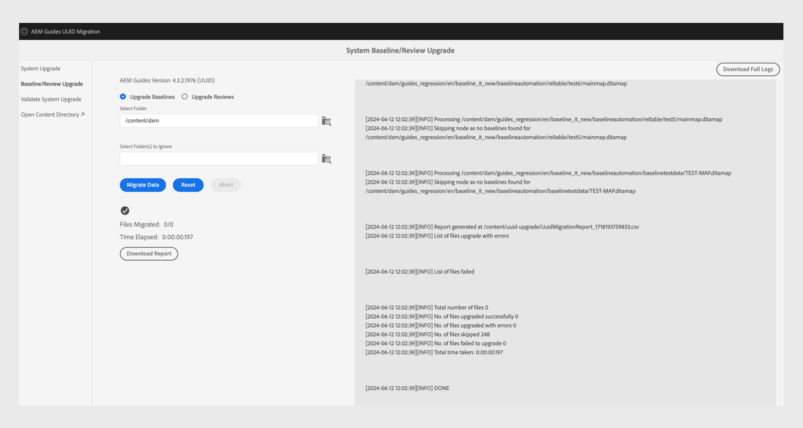

# Migración de contenido 4.3.1 sin UUID a 4.3.2 UUID

Siga estos pasos para migrar el contenido de la versión 4.3.1 sin UUID a la versión 4.3.2 con UUID.

>[!IMPORTANT]
>
> * Antes de iniciar el proceso de migración, asegúrese de lo siguiente:
>
>   1. Se cerraron todas las revisiones activas.
>   1. Se cerraron todas las tareas de traducción.
> * Antes de migrar contenido al servidor UUID, asegúrese de que tiene instalado un servidor que no sea UUID con una versión de AEM Guides compatible.
> * Si utiliza una versión anterior a la 4.3.1, actualice a la versión 4.3.1. Siga las [instrucciones de actualización](./upgrade-xml-documentation.md) específicas de la versión con licencia del producto.
> * Actualmente, las versiones posteriores a la 4.3.1 no son compatibles con la migración.

## Instalación de paquetes

Descargue los paquetes necesarios desde el Portal de distribución de software de Adobe en función de su versión:

1. **Premigración**: [com.adobe.guides.pre-uuid-migration-1.2.27.zip](https://experience.adobe.com/#/downloads/content/software-distribution/en/aem.html?package=%2Fcontent%2Fsoftware-distribution%2Fen%2Fdetails.html%2Fcontent%2Fdam%2Faem%2Fpublic%2Faemdox%2Fother-packages%2Fuuid-migration%2F3-0%2Fcom.adobe.guides.pre-uuid-migration-1.2.27.zip)
1. **Descargar UUID versión 4.3.2**: [com.adobe.fmdita-6.5-uuid-4.3.2.1977.zip](https://experience.adobe.com/#/downloads/content/software-distribution/en/aem.html?package=%2Fcontent%2Fsoftware-distribution%2Fen%2Fdetails.html%2Fcontent%2Fdam%2Faem%2Fpublic%2Faemdox%2Fother-packages%2Fuuid-migration%2F3-0%2Fcom.adobe.fmdita-6.5-uuid-4.3.2.1977.zip)
1. **Migración**: [com.adobe.guides.uuid-upgrade-1.2.110.zip](https://experience.adobe.com/#/downloads/content/software-distribution/en/aem.html?package=%2Fcontent%2Fsoftware-distribution%2Fen%2Fdetails.html%2Fcontent%2Fdam%2Faem%2Fpublic%2Faemdox%2Fother-packages%2Fuuid-migration%2F3-0%2Fcom.adobe.guides.uuid-upgrade-1.2.110.zip)

## Comprobaciones previas a la migración

Realice las siguientes comprobaciones en la versión 4.3.1 que no sea UUID:

1. Instale el paquete previo a la migración [com.adobe.guides.pre-uuid-migration-1.2.27.zip](https://experience.adobe.com/#/downloads/content/software-distribution/en/aem.html?package=%2Fcontent%2Fsoftware-distribution%2Fen%2Fdetails.html%2Fcontent%2Fdam%2Faem%2Fpublic%2Faemdox%2Fother-packages%2Fuuid-migration%2F3-0%2Fcom.adobe.guides.pre-uuid-migration-1.2.27.zip) en la versión 4.3.1.

   >[!NOTE]
   >
   >* Necesita permiso de administrador para ejecutar la migración.
   >* Se recomienda corregir los archivos con errores antes de continuar con la migración.

1. Si hay más de 100 000 archivos DITA en el sistema, actualice las configuraciones de límite de consultas para que funcione la secuencia de comandos:

   * Vaya a `/system/console/configMgr and increase both the configs to more than number of assets - queryLimitInMemory` y `queryLimitReads under org.apache.jackrabbit.oak.query.QueryEngineSettingsService`

1. Iniciar `http://<server-name>/libs/fmdita/clientlibs/xmleditor_uuid_upgrade/page.html`.
1. Seleccione **Evaluación de compatibilidad** en el panel izquierdo y busque todos los recursos en la ruta de carpeta `/content/dam`.
1. Compruebe la compatibilidad para enumerar la siguiente información:
   * Total de archivos
   * Tiempo estimado para la migración
   * Número de archivos con errores
   * Archivos con nombre de archivo GUID

   

1. Si aparece el error, analice los registros y corríjalos. Puede volver a ejecutar la matriz de compatibilidad después de corregir los errores.

1. Seleccione **Configurar validaciones** en el panel izquierdo. A continuación, **seleccione el mapa** y **seleccione el ajuste preestablecido** del mapa para configurarlos. La lista de validación de salida actual muestra los archivos de salida presentes antes de la migración y se pueden validar con los archivos de salida generados después de la migración.

   Si selecciona varias asignaciones DITA y grandes, puede validar que todo el contenido se ha migrado correctamente sin problemas. La selección de ajustes preestablecidos con líneas de base en ellos, también garantiza que las líneas de base y las versiones se migren correctamente.

   

1. (Opcional) Realice la depuración de versiones en el contenido para eliminar versiones innecesarias y acelerar el proceso de migración. Para realizar la depuración de versiones, seleccione la opción **Depuración de versiones** en la pantalla de migración y vaya a la interfaz de usuario mediante la dirección URL `http://<server- name>/libs/fmdita/clientlibs/xmleditor_uuid_upgrade/page.html`.
   >[!NOTE]
   >
   >Esta utilidad no elimina ninguna versión utilizada en las líneas de base o revisiones, ni tiene etiquetas.

Para obtener más información, vea [purgar versiones anteriores](../install-guide/version-management.md#purge-older-versions-of-dita-files).

## Requisitos previos de migración

1. Ejecute la migración de UUID solo en una instancia de autor.
1. Asegúrese de que la infraestructura está preparada:
   * La instancia de autor se amplía en términos de CPU y memoria para admitir un procesamiento más rápido y la memoria adicional necesaria para la actividad masiva. por ejemplo, si el CPU y la memoria asignados actualmente son 8 vCPU y 24 GB de pila, utilice el doble del tamaño para esta actividad.
   * El espacio en disco general y el espacio en disco temporal `(crx-quickstart directory)` deben tener un búfer de 10 veces lo que ya se ha consumido. Una vez completada la migración, puede recuperar la mayor parte del espacio en disco ejecutando compactación.
   * Ejecute **compactación Tar sin conexión** antes de iniciar esta actividad.
   * Asegúrese de que no se ha planificado ninguna indexación ni mantenimiento del sistema durante la ventana de esta migración.

1. Instale la versión UUID de la versión compatible sobre la versión que no es UUID. Por ejemplo, si utiliza la versión 4.3.1 sin UUID, debe instalar la versión 4.3.2 de UUID [com.adobe.fmdita-6.5-uuid-4.3.2.1977.zip](https://experience.adobe.com/#/downloads/content/software-distribution/en/aem.html?package=%2Fcontent%2Fsoftware-distribution%2Fen%2Fdetails.html%2Fcontent%2Fdam%2Faem%2Fpublic%2Faemdox%2Fother-packages%2Fuuid-migration%2F3-0%2Fcom.adobe.fmdita-6.5-uuid-4.3.2.1977.zip)) y ejecutar la migración.

1. Instale el paquete de actualización de migración uuid [com.adobe.guides.uuid-upgrade-1.2.110.zip](https://experience.adobe.com/#/downloads/content/software-distribution/en/aem.html?package=%2Fcontent%2Fsoftware-distribution%2Fen%2Fdetails.html%2Fcontent%2Fdam%2Faem%2Fpublic%2Faemdox%2Fother-packages%2Fuuid-migration%2F3-0%2Fcom.adobe.guides.uuid-upgrade-1.2.110.zip).
1. Deshabilite iniciadores para los siguientes flujos de trabajo mediante la dirección URL: `http://<server-name>/libs/cq/workflow/content/console.html`.

   * Flujo de trabajo de recursos de actualización DAM
   * Flujo de trabajo de reescritura de metadatos DAM

   >[!NOTE]
   >
   >Idealmente, cualquier iniciador de flujo de trabajo que se ejecute en cualquier ruta de acceso dentro de `content/dam` debería deshabilitarse.

1. Actualice las siguientes configuraciones según los cambios sugeridos:

   | Configuración | Propiedad | Valor |
   |---|---|---|
   | `com.adobe.fmdita.config.ConfigManager` | Activar iniciadores de flujo de trabajo de procesamiento posterior | Disable |
   | `com.adobe.fmdita.config.ConfigManager` | uuid. regex | `^GUID-(?<id>.*)` |
   | `com.adobe.fmdita.postprocess.version.PostProcessVersionObservation` | Habilitar procesamiento posterior de la versión | Disable |
   | Servicio de etiquetado CQ por día | Habilitar validación (validation.enabled) | Disable |

1. Agregar un registrador independiente para:
   * `com.adobe.fmdita.uuid`
   * `com.adobe.guides.uuid`.

1. (Si no se ha realizado anteriormente) Si hay más de 100 000 archivos DITA en el sistema, actualice `queryLimitReads` en `org.apache.jackrabbit.oak.query.QueryEngineSettingsService` a un valor mayor (cualquier valor mayor que el número de recursos presentes, por ejemplo 200 000).

   | PID | Clave de propiedad | Valor de propiedad |
   |---|---|---|
   | org.apache.jackrabbit.oak.query.QueryEngineSettingsService | queryLimitReads | Valor: 200000   Valor predeterminado: 100000 |

## Migración

1. Iniciar `http://<server-name>/libs/fmdita/clientlibs/xmleditor_uuid_upgrade/page.html`.

   
   >[!NOTE]
   >
   > Si elige &quot;Habilitar copia de seguridad de recursos DITA&quot;, los archivos de copia de seguridad temporales se almacenan en `/content/uuid-upgrade` y las copias de seguridad de los archivos DITA se eliminan cuando finaliza la migración de un archivo.

1. Seleccione **Actualización del sistema** en el panel izquierdo para ejecutar la migración. Se recomienda migrar todos los datos a la vez, ya que el sistema gestiona de forma óptima el agrupamiento interno. Solo se pueden omitir para la migración los archivos que no son recursos DITA y no se utilizan en ningún recurso DITA.

1. (Opcional) Seleccione las carpetas para las que desea omitir la migración. Utilice esta opción para migrar estas carpetas más adelante u omitir la migración. Asegúrese de que estas carpetas no tengan recursos DITA y de que no se haga referencia a ellas por ningún recurso DITA (y en el futuro no se hará referencia a ellas). Por ejemplo, `content/dam/projects`.

1. Seleccione *Habilitar la copia de seguridad de recursos de datos* para crear una copia de seguridad de los recursos antes de la migración. Esta copia de seguridad se utiliza para revertir en caso de que se produzca un error al migrar un archivo. La copia de seguridad se elimina si la migración se realiza correctamente. Sin embargo, esto ralentiza el proceso de migración.

1. Inicie la migración.
   >[!NOTE]
   >
   > Descargue los registros completos y observe si hay algún error. Si se encuentra algún error o excepción *No continuar*, pero primero corrija el error. Los errores comunes se enumeran al final de este artículo.

1. Una vez completada la migración, el informe está disponible para descargar y también se pueden descargar registros completos.

1. Seleccione **Descargar informe** mientras se ejecuta la migración para comprobar si todos los archivos de la carpeta se han actualizado correctamente y si todas las características funcionan únicamente para esa carpeta.

   >[!NOTE]
   >
   > La migración de contenido se puede ejecutar en un nivel de carpeta, en la carpeta completa `/content/dam` o en la misma carpeta (volver a ejecutar la migración).

   Además, es importante asegurarse de que la migración de contenido se realiza para todos los recursos multimedia, como imágenes y gráficos, que se han utilizado en el contenido DITA.

1. Una vez migrados todos los archivos, seleccione **Actualización de línea de base/revisión** en el panel izquierdo para migrar las líneas de base y revisarlas en el nivel de carpeta.

>[!NOTE]
>
>Si reinicia el sistema o se anula la migración, la secuencia de comandos se reanudará cuando vuelva a ejecutarla con los mismos parámetros que antes. Póngase en contacto con el equipo de éxito del cliente si tiene problemas debido al cierre.

## Análisis de los informes de cada paso

**Paso: Actualización del sistema**

| Resumen tras la finalización del proceso | ¿Cómo interpretar? | Acción |
|---|---|---|
| Número total de archivos: 345997 | Número total de archivos procesados en el conjunto determinado de carpetas. | ND |
| Número de archivos actualizados correctamente: 344516 | Número de archivos migrados correctamente a UUID. | ND |
| Número de archivos actualizados con errores: 29 | Se han producido errores en estos archivos y deben ser los mismos que se notificaron en el paso de premigración. | ND |
| Número de archivos omitidos: 1452 | Algunos archivos del repositorio de DAM pueden tener subrecursos, que se omiten porque no cumplen los requisitos para la migración de UUID. | ND |
| Número de archivos que no se pudieron actualizar: 0 | Si el recuento no es 0, se deben analizar los registros para detectar cualquier problema. | Compruebe la excepción; es posible que tenga que corregir el error y volver a ejecutar la migración. |
| Tiempo total empleado: 2:40:06.157 |  |  |

**Paso: actualizar líneas base**

| Resumen tras la finalización del proceso | ¿Cómo interpretar? | Acción |
|---|---|---|
| Número total de archivos: 4833 | Número de mapas DITA con al menos una línea de base. |  |
| Número de archivos actualizados correctamente: 4705 | Número de mapas DITA, actualizados correctamente con todas las líneas de base. |  |
| Número de archivos actualizados con errores: 0 | Número de mapas DITA cuyas líneas base no se actualizaron. |  |
| Número de archivos omitidos: 1647 | Número de mapas DITA sin línea base. |  |
| Número de archivos que no se pudieron actualizar: 128 | El número de objetos de línea de base que no eran válidos (estaban vacíos) se muestra en el informe (Excel). | Comprobar si hay errores distintos de: `baselineObj not found on` |

## Después de la migración

1. Una vez completada la migración, seleccione **Validar la actualización del sistema** en el panel izquierdo y valide los archivos de salida antes y después de la migración para garantizar que la migración se realice correctamente.

   

1. Después de migrar el servidor, habilite correctamente los siguientes flujos de trabajo y configuraciones (incluidos todos los demás flujos de trabajo que se deshabilitaron inicialmente durante la migración) para seguir trabajando en el servidor:

   * Flujo de trabajo de recursos de actualización DAM
   * Flujo de trabajo de metadatos DAM

   >[!NOTE]
   >
   >Lo ideal sería cualquier lanzador de flujo de trabajo que se ejecutara en cualquier ruta de acceso dentro de `content/dam` antes de que se habilitara la migración.

1. Habilite las siguientes configuraciones:

   | Configuración | Propiedad | Valor |
   |---|---|---|
   | `com.adobe.fmdita.config.ConfigManager` | *Habilitar iniciadores de flujo de trabajo de procesamiento posterior* | Habilitar |
   | `com.adobe.fmdita.postprocess.version.PostProcessVersionObservation` | *Habilitar procesamiento posterior de la versión* | Habilitar |
   | Servicio de etiquetado CQ por día | *Habilitar validación (validation.enabled)* | Habilitar |

1. Propiedades de Assets para revisar después de la migración:

   | Configuración | Propiedad | Valor previo a la migración en no UUID | Valor posterior a la migración en UUID |
   |---|---|---|---|
   | `com.adobe.fmdita.config.ConfigManager` | **Usar título para nombres de páginas de sitios AEM** | False (valor predeterminado) | Verdadero |

   >[!NOTE]
   >
   > Si antes de la migración, la propiedad **Use el título para los nombres de página del sitio AEM** dentro de `com.adobe.fmdita.config.ConfigManager`, se establece en *False*, después de la migración esta propiedad deberá actualizarse.

1. Una vez completada la validación, se puede recuperar la mayor parte del espacio en disco ejecutando la compactación (consulte `https://experienceleague.adobe.com/docs/experience-manager-65/deploying/deploying/revision-cleanup.html?lang=en`).

