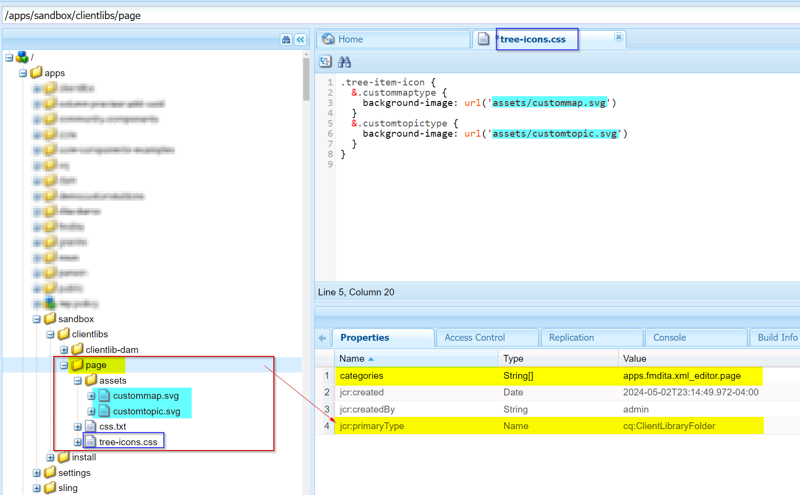

# Configuración del icono para tipos de datos personalizados/especializados (tema o mapa)


## Declaración de problema

Con el esquema personalizado utilizado en AEM Guides, puede crear tipos de temas o mapas personalizados y, con él, puede observar que los tipos de temas o mapas personalizados no se muestran en el editor web o en la interfaz de usuario de Assets. Vea la siguiente captura de pantalla como referencia


Por lo tanto, para asignar un icono a los tipos de tema o mapa personalizados, debe hacer lo siguiente:
- Buscar el tipo de tema o asignación personalizado
- Escriba estilos para añadir el icono deseado para el tipo personalizado


Podemos implementar los pasos anteriores para mostrar los iconos en el editor web (vista de repositorio) así como en la interfaz de usuario de Assets. A continuación se muestran los pasos para ambas


## Icono para mostrar un tema o un mapa personalizado en la vista del editor web

_Paso 1:_ Determine el tipo de datos para el tema/aplicación de datos personalizado
- Abra la vista del repositorio en web-editor > abra la consola del desarrollador en el explorador
- Inspect el espacio de iconos junto al tema o mapa enumerado.
- Compruebe la clase asignada al tema personalizado
- Vea la captura de pantalla siguiente para obtener más detalles 
- Utilizaremos esta clase para asignar un icono y escribir css para esto

_Paso 2:_ Crear css y asignar un icono a este tipo de datos
- Cree una biblioteca de cliente en /apps, supongamos que crea una cq:ClientLibraryFolder en la ruta deseada
   - agréguele las categorías &quot;apps.fmdita.xml_editor.page&quot;
- cree una carpeta &quot;assets&quot; en este directorio y añada todos los iconos que desee utilizar para los tipos de datos personalizados
- agregue un archivo css en la carpeta de la biblioteca de cliente, por ejemplo &quot;tree-icon.css&quot;.
   - agréguele el siguiente código

```
            .tree-item-icon {
                &.custommaptype {
                    background-image: url('assets/custommap.svg')
                }
                &.customtopictype {
                    background-image: url('assets/customtopic.svg')
                }
            }
```

- agregue css.txt en la carpeta de la biblioteca de cliente y agregue referencia a &quot;tree-icon.css&quot; que acaba de crear.
- guardar/implementar estos cambios

Consulte la siguiente captura de pantalla para obtener más detalles.


Y el resultado final se muestra en la siguiente captura de pantalla


## Mostrando icono para tema/mapa personalizado en la IU de Assets

_Paso 1:_ que determina el tipo de dita del tema o mapa de dita personalizado
- esto se explica en el paso 1 de los métodos anteriores

_Paso 2:_ Cree Javacscript para definir qué iconos se cargarán para el tipo de datos personalizado para los tipos de temas/mapas personalizados
- Cree una biblioteca de cliente en /apps, supongamos que crea una cq:ClientLibraryFolder en la ruta deseada
   - agréguele las siguientes propiedades:
      - valor de &quot;categories&quot;(multivalor string) como &quot;dam.gui.admin.coral&quot;
      - valor &quot;dependencies&quot;(cadena de varios valores) como &quot;libs.fmdita.versioncontrol&quot;
- Cree una copia del archivo &quot;/libs/fmdita/clientlibs/clientlibs/xmleditor/clientlib-dam/topic_type.js&quot; en este directorio /apps
   - edite el &quot;topic_type.js&quot; copiado y cambie/agregue customtopictype en la variable &quot;typeImageNameMap&quot;
   - También puede cambiar la ruta de la carpeta de imágenes cambiando el valor de la variable &quot;parentImagePath&quot; a donde se almacenan los iconos personalizados
- Cree un archivo llamado js.txt en la carpeta de biblioteca del cliente y agregue una referencia a &quot;topic_type.js&quot;
- guardar/implementar estos cambios
Consulte la siguiente captura de pantalla para obtener más detalles.
  

Y el resultado final aparecerá como se muestra en la captura de pantalla 
