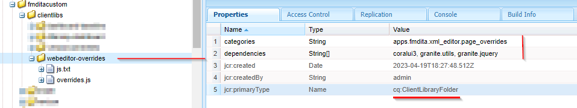

# Agregar nuevo botón procesable personalizado en la barra de herramientas del editor web

En este artículo aprenderemos a añadir un nuevo botón personalizado en la barra de herramientas del editor web y a llamar a javascript para realizar la operación personalizada que desee.

Añadir un botón procesable al editor web implica los siguientes pasos:
- Agregando el botón en *ui_config.json* en la posición donde se necesita
- Registrar el evento de botón al hacer clic en el editor web para que el usuario realice una acción cuando haga clic en él


## Implementación de mediante un ejemplo

Comprendamos esto con un ejemplo en el que un autor desea añadir una referencia jira a una sección de prólogo de tema. La sección de prólogo con el identificador de referencia jira incrustado puede tener el siguiente aspecto:


El elemento &quot;change-request-id&quot; que contiene el ID de JIRA debe recuperarse de la API (por ejemplo, en función de una consulta JIRA específica que se representa mediante la aplicación). Cuando el usuario está creando la sección de prólogo, debe poder hacer clic en un botón e insertar un ID de referencia de jira desde la barra de herramientas del editor web, algo así como:


Y cuando el usuario hace clic en el botón, debe mostrar un cuadro de diálogo que debe extraer las posibles opciones y permitir al usuario seleccionar el ID de JIRA deseado, algo así como:


que debería añadir &quot;change-request-id&quot; al prólogo:


## Implementación de esto


### Agregue el botón en el editor web configurándolo en *ui_config.json*

Use los perfiles de carpeta para comprobar *ui_config.json* en la pestaña &quot;Configuración del editor XML&quot; y agregue el botón de configuración JSON a la sección deseada del grupo &quot;barra de herramientas&quot;

```
{
    "on-click":"insertJIRARef",
    "icon":"linkCheck",
    "variant":"quiet",
    "type":"button",
    "title":"Insert JIRA Reference"
}
```

[use este vínculo para obtener más información acerca del perfil de carpeta y la configuración de ui_config.json](https://experienceleague.adobe.com/docs/experience-manager-guides-learn/videos/advanced-user-guide/editor-configuration.html?lang=es)


### Controlar el evento en el que se hace clic para el botón nuevo

    NOTA: los pasos que se mencionan a continuación están disponibles como paquete adjunto en esta publicación


- Después de guardar el perfil de carpeta, cree una &quot;cq:ClientLibraryFolder&quot; en un directorio de proyecto (puede estar en */apps*) y agregue propiedades como se muestra en la captura de pantalla siguiente:
  

```
This example uses "coralui3" library to show a dialog as it is used in the Javascript sample we presented.
You may use different library of your choice.
```

- En esta carpeta de biblioteca de cliente, cree dos archivos como se menciona a continuación:
   - *overrides.js*: que tendrá el código javascript para manejar el evento en el que se hace clic para &quot;insertJIRARef&quot; (use el paquete adjunto para obtener el contenido de este javascript)
   - *js.txt*: que incluirá &quot;overrides.js&quot; para habilitar este javascript

- Guarde los cambios y estará listo para probarlos.


### Pruebas

- Abrir editor web
- En las preferencias del usuario, elige el perfil de carpeta en el que agregaste el *ui_config.json* personalizado. Si lo ha agregado al perfil Global, probablemente ya esté utilizando.
- Al abrir un tema, notará que la barra de herramientas tiene un nuevo botón &quot;Insertar referencia Jira&quot;
- A continuación, puede añadir la sección de prólogo como se indica a continuación al tema y probar haciendo clic en el botón &quot;Insertar referencia Jira&quot; dentro del elemento de prólogo &quot;change-request-reference&quot;

```
<prolog>
    <change-historylist>
        <change-item>
            <change-request-reference>
            </change-request-reference>
            <change-completed></change-completed>
            <change-summary></change-summary>
        </change-item>
    </change-historylist>
</prolog>
```

Consulte la siguiente captura de pantalla para saber cómo se verá:


### Archivos adjuntos

- Paquete clientlibs de muestra que instalará la biblioteca de cliente de webeditor con código javascript para la acción del botón de barra de herramientas: [descargar mediante este vínculo](../../../assets/authoring/webeditor-addbuttonontoolbar-insertjira-clientlib.zip)
- Muestra *ui_config.json* que puede cargar en un perfil de carpeta: [descargar muestra ui_config.json](../../../assets/authoring/sample_ui_config_Guides4.2-InsertJiraReference.json)

```
Please note this is compatible to AEM 6.5 and AEM Guides version 4.2.
If you are using a different version please add the toolbar button to the ui_config.json manually.
```
