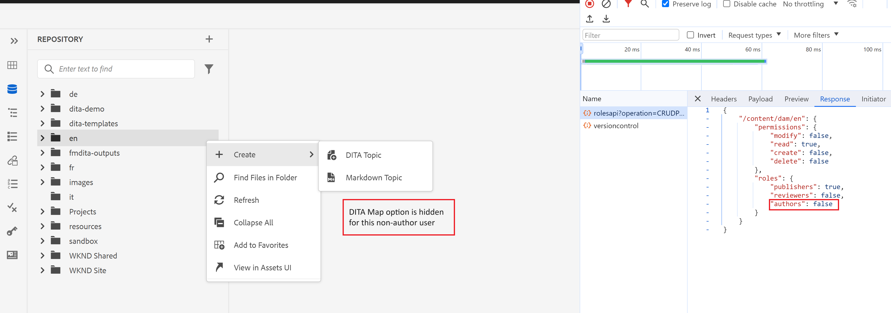

# Mostrar/ocultar &quot;Crear DitaMAP&quot; del menú contextual de carpeta en el editor web

En este artículo, aprenderemos a personalizar el Editor web de guías para ocultar o mostrar la opción &quot;Crear DitaMap&quot; en el menú contextual de la carpeta en función de los permisos de usuario/grupo.
En este caso de uso, ocultaremos esta opción para todos los usuarios que no sean autores.

## Requisitos previos

Aprovecharemos el paquete de extensión de AEM Guides que le permite personalizar la interfaz de usuario de su aplicación según sus necesidades.
Consulte esta [documentación](https://github.com/adobe/guides-extension/tree/main) para obtener más información sobre cómo funciona el marco de trabajo de extensión de guías.

Ahora vamos a empezar y aprender a personalizar el menú contextual de la carpeta para ocultar esta opción para todos los usuarios que no sean autores.

Como puede ver en el siguiente fragmento, la opción &quot;create DitaMap&quot; es visible para un usuario autor.


Ahora veamos cómo podemos ocultar esta opción mediante el marco de trabajo de extensión de Guides.

## Pasos de implementación

La implementación se desglosa en las siguientes partes:

- **Cambios en el controlador Folder_options**

  Cada menú contextual tiene asociado un identificador de controlador. Este controlador administra la funcionalidad en el evento para las distintas opciones del menú contextual.

  En este ejemplo, personalizaremos el menú contextual de la carpeta para ocultar la opción &quot;Crear DitaMap&quot; para los no autores. Para ello, realizaremos cambios en el archivo folder_options.ts presente en /src en el repositorio del marco de trabajo de la extensión de guías.

  Se utiliza &quot;viewState&quot; como &quot;REPLACE&quot; para ocultar esta opción en el menú contextual.
Estamos llamando a un nuevo widget en esta folder_options a través de la clave &quot;id&quot;.

```typescript
const folderOptions = {
  id: "folder_options",
  contextMenuWidget: "repository_panel",
  view: {
    items: [
      {
        component: "widget",
        id: "customditamap",
        target: {
          key: "displayName",
          value: "DITA Map",
          viewState: VIEW_STATE.REPLACE,
        },
      },
    ],
  },
};
```

- **Creación de un widget nuevo para controlar la lógica**

  Se necesita una nueva creación de widget (customoptions.ts) para escribir la lógica que oculte esta opción solo para usuarios que no sean autores. Para lograrlo, hemos utilizado la clave &quot;show&quot; que actúa como alternativa en nuestra estructura JSON.

  Puede escribir su propio servlet externo para comprobar los detalles del grupo. De este modo, también puede personalizar las opciones del menú de carpeta para su grupo personalizado.
En este ejemplo, hemos aprovechado la llamada &quot;rolesapi&quot; de OOTB AEM para recuperar los detalles del usuario y establecer la respuesta en &quot;isAuthor&quot; como se muestra en fragmentos anteriores.

```typescript
const folderOptions = {
  id: "customditamap",
  view: {
    component: "button",
    quiet: true,
    icon: "breakdownAdd",
    label: "DITA Map",
    "on-click": "createNewDitaMap",
    show: "@extraProps.isAuthor",
  },
};
```

A través de esto, podemos ocultar el botón con la etiqueta como &quot;Mapa de datos&quot; en función del valor de &quot;mostrar&quot;.

Se ha agregado un controlador para establecer el atributo isAuthor en el modelo. Esto se puede hacer con la siguiente sintaxis en el controlador.

```typescript
this.model.extraProps.set("key", value);
```

Aquí la clave es &quot;isAuthor&quot; y el valor es la respuesta de la llamada a rolesapi.
También se ha definido el evento &quot;createNewDitaMap&quot; para activar la opción &quot;createDitaMap&quot; (para usuarios autores).

```typescript
controller: {
    init: function () {
      this.model.extraProps.set("isAuthor", false);

      rolesApiResponse.then((result) => {
        console.log(result);
        this.model.extraProps.set(
          "isAuthor",
          result["/content/dam"].roles.authors
        );

        console.log("testresult" + result["/content/dam"].roles.authors);
      });
    },
    createNewDitaMap() {
      repositoryController && repositoryController.next("create_new.map");
    },
  },
```

- **Agregando el código personalizado**

  Importe folder_options.ts y customoptions.ts al archivo index.ts en /src.

## Pruebas

- Inicie sesión en AEM con un usuario que no forme parte del grupo de autores. La opción Crear DitaMap estaría oculta en cualquier menú contextual de carpeta, como se muestra a continuación.
Este caso de uso se ha añadido a GIT; consulte los recursos relacionados a continuación.



### Recursos relacionados

- **Repositorio base de módulo de extensión** - [GIT](https://github.com/adobe/guides-extension/tree/main)

- **Documentación** - [en Experience League](../../../../../guides-ui-extensions/aem_guides_framework/basic-customisation.md)

- **Casos de uso común documentados** - [en Experience League](../../../../../guides-ui-extensions/aem_guides_framework/jui-framework.md)

- **Repositorio público con ejemplos** - [en GIT](https://github.com/adobe/guides-extension/tree/sc-expert-session). Rama de referencia sc-expert-session

```

```
