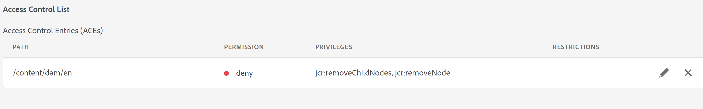

# Quitar la opción &quot;Eliminar&quot; del menú contextual del archivo en el editor web

AEM En este artículo aprenderemos a ocultar la opción &quot;Eliminar&quot; del menú contextual del archivo en el Editor Web de guías para usuarios o grupos específicos. Para otras personalizaciones en las opciones del menú contextual de archivo, consulte Extensión de las guías. Se pueden encontrar más detalles [aquí](https://github.com/adobe/guides-extension/tree/main).

Como puede ver en el siguiente fragmento, el menú contextual del archivo tiene la opción &#39;Eliminar&#39; disponible para este usuario específico.


Ahora veamos cómo podemos ocultar la opción &quot;Eliminar&quot; para este usuario.

## Pasos de implementación:

- AEM Navegue hasta Herramientas > Seguridad > Permisos desde la página de inicio de la aplicación de.
- Elija el grupo o usuario en el cuadro de búsqueda.
- Haga clic en &quot;Añadir ACE&quot; en la esquina superior derecha.
- Elija la ruta de la carpeta.
- Incluya privilegios &quot;jcr:removeChildNodes&quot; y &quot;jcr:removeNode&quot;.
- Elija &quot;Tipo de permiso&quot; como &quot;denegado&quot; y haga clic en &quot;Agregar&quot; como se muestra a continuación.




### Pruebas

- AEM Inicie sesión en la lista de usuarios para los que se ha agregado la lista de control de acceso (ACE).
- Abra el editor web.
- Vaya a la vista del repositorio y elija la carpeta para la que se han agregado las ACE.
- Abra el menú contextual del archivo.
- La opción &quot;Eliminar&quot; no aparecerá en el menú contextual.

El menú contextual del archivo ahora tendrá este aspecto:


```
Please note that these steps would also remove 'move' and 'rename' options from the Web Editor as they are also tied to delete process at the backend.
```
