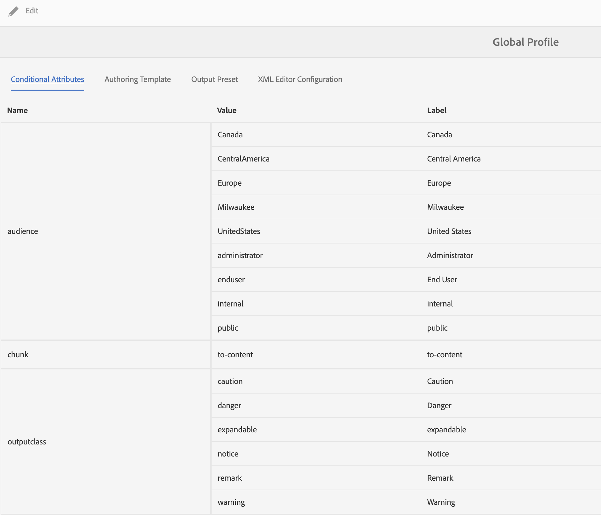

# Trabajo con contenido condicional

**Caso de uso**

* Los autores pueden establecer condiciones en un fragmento de contenido para poder controlar si se muestra en la salida.

* Los autores pueden elegir al publicar la publicación mostrar u ocultar diferentes condiciones.

* Por ejemplo, los autores pueden agregar atributos como versión 1.0 y versión 2.0 en el contenido y utilizar condiciones para incluir la versión 1.0 para la versión 1.0 y excluir la versión 2.0.

**Paso 1**

Defina las condiciones relevantes para la documentación en [!UICONTROL Perfiles de carpeta]:
Consulte la sección **Configurar atributos condicionales para perfiles globales o de nivel de carpeta** en [Página 69 de la Guía de instalación y configuración](https://helpx.adobe.com/content/dam/help/en/xml-documentation-solution/4-2/Adobe-Experience-Manager-Guides_Installation-Configuration-Guide_EN.pdf)

**Paso 2**

Seleccione el **[!UICONTROL Perfil de carpeta]** definido en el paso 1 de **Preferencias de usuario** en el Editor XML:
Consulte la sección **Preferencias de usuario** en [Página 41 de la Guía del usuario](https://helpx.adobe.com/content/dam/help/en/xml-documentation-solution/4-2/Adobe-Experience-Manager-Guides_User-Guide_EN.pdf)

**Paso 3**

Utilice las condiciones para condicionalizar secciones de contenido:
Consulte la sección **Condiciones** en [Página 90 de la Guía del usuario](https://helpx.adobe.com/content/dam/help/en/xml-documentation-solution/4-2/Adobe-Experience-Manager-Guides_User-Guide_EN.pdf)

**Paso 4**

Defina los ajustes preestablecidos de condición en el nivel de mapa para elegir qué condiciones habilitar en la salida
Consulte la sección **Usar ajustes preestablecidos de condición** en [Página 249 de la Guía del usuario](https://helpx.adobe.com/content/dam/help/en/xml-documentation-solution/4-2/Adobe-Experience-Manager-Guides_User-Guide_EN.pdf)
