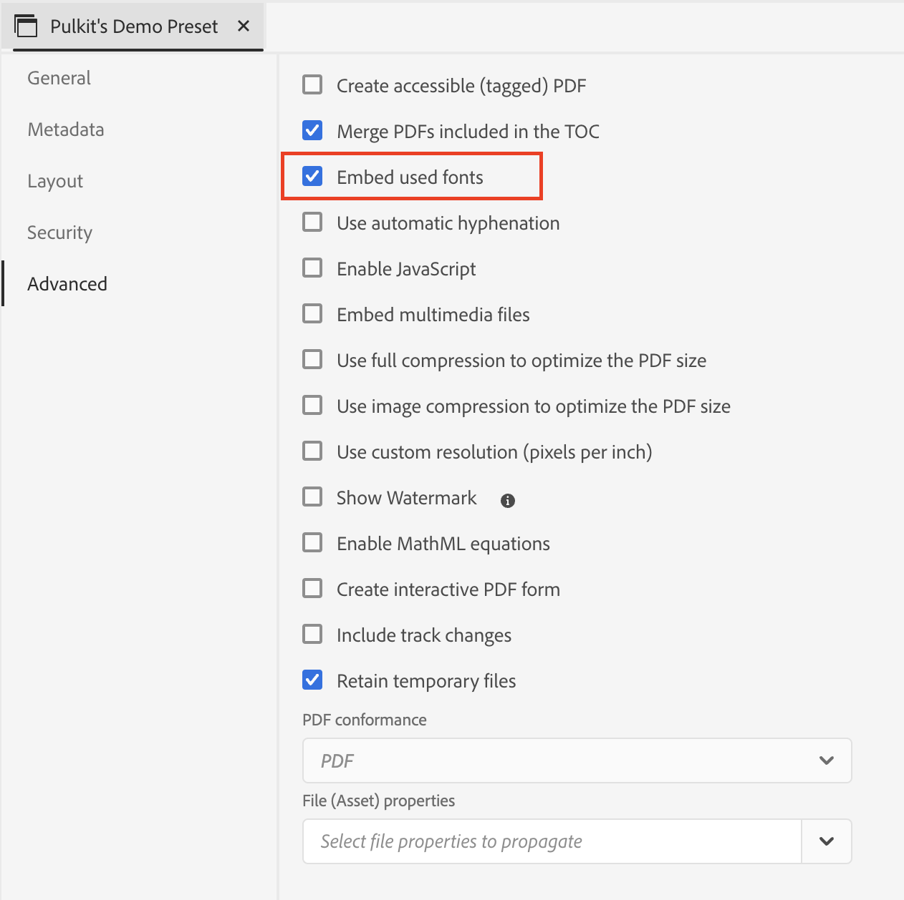

# Añadir fuentes personalizadas al PDF nativo de DITA

## Este artículo trata sobre:

Añadir la fuente personalizada para reforzar la identidad de la marca y la coherencia visual en todo el contenido.

Este proceso consta de 3 pasos:

- [Cargar la fuente personalizada](#step-1--upload-the-custom-font-to-the-resource-folder-of-your-template)
- [Realice los cambios necesarios en la hoja de estilos de las plantillas de PDF](#step-2--make-necessary-changes-in-pdf-templatess-stylesheet)

- [Incrustar fuentes utilizadas (opcional)](#step-3-optional--embed-used-font-in-pdf)

## Paso 1 : Cargue la fuente personalizada en la carpeta de recursos de la plantilla

## Paso 2: Realice los cambios necesarios en la hoja de estilo de las plantillas de PDF

## Paso 3 (opcional) : Fuente utilizada incrustada en el PDF

## Preguntas más frecuentes

- ### ¿Puedo usar Adobe Fonts?

> Sí, vaya a fonts.adobe.com y haga clic en &quot;Agregar a proyecto web&quot;.
> 
> Copiar código de importación como `" @import url("https://use.typekit.net/xxxx.css")`;
>
> Pegue en el CSS de contenido y realice los cambios deseados en el archivo CSS.

- ### Mi fuente no se muestra en el PDF

> Comprobar la ortografía del nombre de la fuente (error más común)
>
> Asegúrese de incrustar la fuente si las fuentes no están disponibles en el sistema donde se abre el PDF

- ## Para cualquier otra consulta, póngase en contacto con sus respectivos CSM

## Otros recursos:

- [Cómo incluir la tabla de contenido de DITA Bookmap en PDF](./how-to-include-bookmap-toc-in-pdf-publishing.md)
- [Cómo incluir el índice en la publicación de PDF](./how-to-include-bookmap-toc-in-pdf-publishing.md)
- [Vídeo de sesión de expertos sobre un PDF nativo](../../expert-sessions/native-pdf-publishing-eamples-part1-june2023.md)