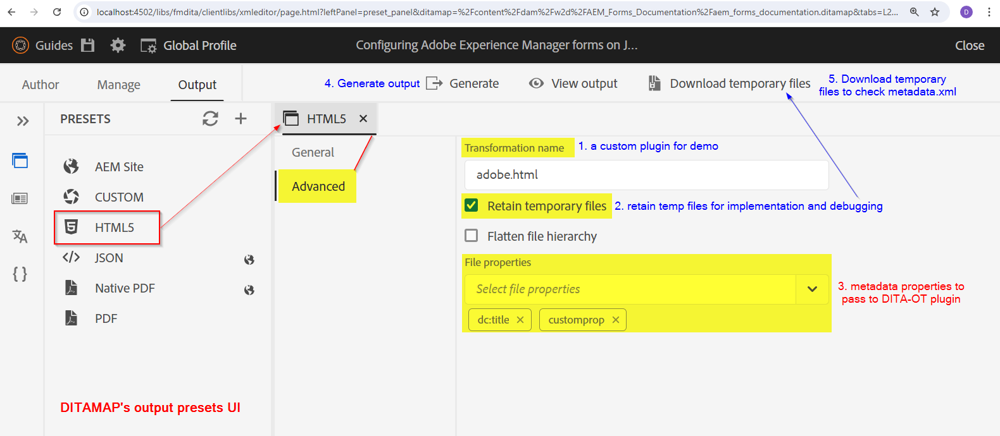

# Acerca de este artículo

En este artículo explicaremos cómo implementar cambios en el complemento DITA-OT para leer el archivo metadata.xml _(disponible en archivos temporales)_ y utilizar las propiedades, pasadas por el flujo de trabajo de publicación de AEM Guides, en los complementos DITA-OT y establecerlo en la salida generada.

En un nivel superior, a continuación se muestran los pasos que aprenderá en este artículo:
- Establecer metadatos en el ajuste preestablecido de salida de un mapa de diámetros en AEM Guides
- En la generación de salida, acceda a este metadata.xml en el directorio temporal DITA-OT
- Implementación en el complemento DITA-OT para leer este _metadata.xml_ y usar las propiedades disponibles en la salida generada
- Comprobación de la salida generada para ver los metadatos propagados

## Fondo

Con AEM Guides, puede utilizar los complementos DITA-OT para publicar en los formatos de salida que desee mediante los complementos configurados.
AEM también puede pasar metadatos de los recursos administrados en DAM de la al proceso DITA-OT para usarlos en la salida generada; consulte la documentación sobre [cómo configurar ditamap/topics para pasar metadatos a través de ajustes preestablecidos de salida](https://experienceleague.adobe.com/en/docs/experience-manager-guides/using/user-guide/output-gen/pass-metadata-dita-ot)


## Suposiciones

AEM Tiene una configuración de con AEM Guides versión 4.4.0/2024.6 o superior
Tiene conocimientos previos sobre el funcionamiento de DITA-OT y su estructura de directorios


## Pasos explicados

### Estableciendo metadatos en el recurso

Con el esquema de metadatos de AEM Assets puede crear campos de propiedad personalizados para Assets AEM en la, y los usuarios pueden asignar metadatos a los recursos. Tomando un ejemplo de un recurso _topic_ en el que se puede establecer un metadato denominado _customprop_ para un ejemplo, consulte la siguiente captura de pantalla:


### Configuración de los metadatos en el ajuste preestablecido de salida ditamap para pasarlos a DITA-OT

Configure el ajuste preestablecido de salida que desee en el mapa para exportar metadatos y pasarlos a DITA-OT
Supongamos que estamos generando una salida de HTML5 con un complemento DITA-OT, por ejemplo _adobe.html_.
Consulte la captura de pantalla siguiente para comprender cómo configurar el ajuste preestablecido de salida de un mapa para pasar metadatos al complemento DITA-OT.
1. Abra un mapa, vaya a la ficha _Salida_ de este mapa, abra el ajuste preestablecido de HTML 5 y haga clic en la ficha _Avanzado_; establezca el nombre de la transformación como _adobe.html_ (este es el complemento que configuraremos y utilizaremos para nuestro ejemplo; también puede definir el complemento personalizado)
2. Establezca _Conservar archivos temporales_ para poder descargar los archivos temporales y comprobar cómo se forma metadata.xml. Puede utilizarlo para el desarrollo
3. Seleccione las propiedades de metadatos que desee pasar a DITA-OT mediante metadata.xml. En este ejemplo supongamos que queremos pasar _dc:title_ y _customprop_
4. Guarde el ajuste preestablecido y Genere la salida
5. Descargue el archivo temporal con el botón que se muestra en el ajuste preestablecido

Consulte la siguiente captura de pantalla para comprender los pasos descritos anteriormente:



### Implementación del complemento DITA-OT

#### Acceso al archivo metadata.xml en el directorio temporal

En el paquete de archivos temporales descargado verá un archivo metadata.xml donde puede ver la estructura de las propiedades y los valores (véase la captura de pantalla siguiente)


##### Comprender metadata.xml

- Este archivo contiene una lista de todos los recursos publicados, cada uno de los cuales tiene:
   - ruta de acceso del archivo en el directorio DITA [id atributo del elemento Path]
   - y lista de pares de valor de propiedad de metadatos [bajo _metadatos_ elemento]

```
        <Path id="topics\about-this-document.dita">
            <sourceProps>
                ...
            </sourceProps>
            <metadata>
                <meta isArray="false" key="dc:title">About This Document</meta>
                <meta isArray="false" key="customprop">customval</meta>
            </metadata>
        </Path>
```

#### Acceso a los metadatos de cada recurso en el complemento DITA-OT

Para que el complemento DITA-OT lea _metadata.xml_ y las propiedades disponibles, debemos hacer lo siguiente:
- Defina la configuración del complemento personalizado en _plugins.xml_, donde define los parámetros y el integrador para la iniciación del complemento. Nuestro archivo de complemento de muestra tendrá el siguiente aspecto:

```
<?xml version="1.0" encoding="UTF-8"?>
<plugin id="com.adobe.html">
    <require plugin="org.dita.html5"/>
    <feature extension="dita.conductor.transtype.check" value="adobe.html"/>
    <feature extension="ant.import" file="integrator.xml"/>
    <feature extension="dita.conductor.html5.param" file="params.xml"/>
    <feature extension="package.version" value="2024.1"/>
</plugin>
```

- Al iniciar el complemento:
   - configure una variable para que apunte al archivo metadata.xml, es decir, en _integrator.xml_, en el complemento establezca una propiedad para definir la ruta del archivo de metadatos.
   - defina el archivo que ejecuta las reglas de transformación xsl personalizadas, por ejemplo _args.xsl_, que en nuestro caso apuntará al archivo _xsl/adobe-html5.xsl_.
Consulte el siguiente código:

```
    <property name="adobe.html.xsl.dir" value="${dita.plugin.com.adobe.html.dir}${file.separator}xsl${file.separator}"/>
    <property name="args.xsl" location="${adobe.html.xsl.dir}adobe-html5.xsl" />
    <dirname property="input.dirname" file="${args.input}"/>
    <makeurl file="${input.dirname}/metadata.xml" property="metadata.url"/>
```

- Pase el valor de la variable _metadata.url_ al XSL personalizado para utilizarlo según lo necesite, es decir, en el _param.xml_ existente o creado para pasar el parámetro al complemento, consulte a continuación un archivo params.xml de ejemplo:

```
    <?xml version="1.0" encoding="UTF-8"?>
    <params xmlns:if="ant:if">
        <param name="metadata.url" expression="${metadata.url}" if:set="metadata.url"/>
    </params>
```

- En el archivo de transformación XSL personalizado _xsl/adobe-html5.xsl_ puede leer los valores de metadatos del archivo de metadatos y establecerlos en la salida como desee. En este ejemplo, añadiremos los valores de los metadatos al encabezado html > etiquetas meta. Consulte el siguiente código:

```
<xsl:import href="plugin:org.dita.html5:xsl/dita2html5.xsl"/>
    <xsl:param name="metadata.url"/>
    <xsl:template name="copyright">
        <xsl:if test="doc-available( $metadata.url )">
            <xsl:variable name="docName" select="tokenize( base-uri(), '/' )[ last() ]"/>
            <xsl:variable name="doc" select="doc( $metadata.url )"/>
            <xsl:for-each select="$doc//Path[ ends-with( @id, concat( '\', $docName ) ) ]/metadata/meta">
                <meta name="{ @key }" content="{ . }"/>
            </xsl:for-each>
        </xsl:if>
    </xsl:template>
```

Consulte la captura de pantalla siguiente para resaltar los pasos anteriores


### Prueba de la implementación del complemento

AEM Puede probar el complemento ejecutando el siguiente comando para probarlo con los archivos temporales descargados de (que tiene contenido de mapa y sus metadatos.xml), que se descargan de la aplicación y que se descargan de la aplicación.

```
./dita --input=docsrc/samples/HTML5/aem_forms_documentation.ditamap --format=adobe.html
```

Suponiendo que ha copiado los ficheros temporales descargados en el directorio &quot;DITA-OT/docsrc/samples/HTML 5&quot;.
También puede descargar el ejemplo que aparece en la sección de recursos a continuación.

Cuando se ejecute el comando anterior, puede comprobar el resultado en el directorio &quot;DITA-OT/bin/out&quot;, donde puede comprobar los archivos html generados para el tema &quot;about-this-document.dita&quot;, que tendrá los metadatos personalizados en el elemento _head_

```
<head>
    <meta http-equiv="Content-Type" content="text/html; charset=UTF-8">
    <meta charset="UTF-8">
    <meta name="copyright" content="(C) Copyright 2024">
    <meta name="DC.format" content="HTML5">
    <meta name="DC.identifier" content="GUID-f193ea85-989d-4d80-99e2-2f5dea3d5310">
    <meta name="DC.language" content="en-US">
    <meta name="dc:title" content="About This Document">
    <meta name="customprop" content="customval">
    <title>About This Document</title>
</head>
```

### Implementación

AEM Una vez que haya desarrollado el complemento DITA-OT, puede integrarlo en DITA-OT mediante el comando _dita —install_ del directorio DITA-OT e implementarlo en el servidor de la [consulte este artículo para obtener más información](https://experienceleaguecommunities.adobe.com/t5/experience-manager-guides/steps-to-setup-a-custom-dita-ot/td-p/407659)


## Recursos

1. Archivos temporales de muestra descargados del mapa de datos de muestra: [descargar mediante este vínculo](../../assets/publishing/sample-temp-html5-adobe.html-content.zip)
2. Complemento DITA-OT con implementación explicada anteriormente [descargar mediante este vínculo](../../assets/publishing/sample-custom-plugin-com.adobe.html.zip)