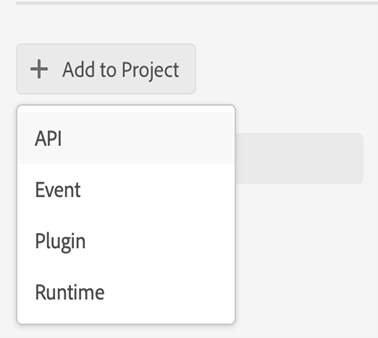

# Configuración de la publicación basada en microservicios con autenticación JWT

[!BADGE Cloud Service]{type=Informative}

>[!NOTE]
>
> Las credenciales de la cuenta de servicio (JWT) han quedado obsoletas y pasan a ser credenciales de servidor a servidor OAuth. Las aplicaciones que utilizan las credenciales de la cuenta de servicio (JWT) dejarán de funcionar a partir del 1 de enero de 2025. Debe migrar a la nueva credencial antes del 1 de enero de 2025 para garantizar que la aplicación siga funcionando. Más información sobre [migración de la credencial de cuenta de servicio (JWT) a la credencial de servidor a servidor OAuth](https://developer.adobe.com/developer-console/docs/guides/authentication/ServerToServerAuthentication/migration/).


La publicación basada en microservicios en para guías de Adobe Experience Manager as a Cloud Service admite los tipos de ajustes preestablecidos de salida PDF (tanto nativos como basados en DITA-OT), HTML 5, JSON y PERSONALIZADO.

Como las credenciales de la cuenta de servicio (JWT) han quedado obsoletas, se recomienda utilizar la autenticación basada en OAuth de Adobe IMS. Obtenga información sobre cómo [configurar la publicación basada en microservicios con autenticación OAuth](configure-microservices-imt-config.md).

Para el servicio de publicación en la nube protegido por la autenticación basada en JWT de Adobe IMS, los clientes deben seguir los pasos indicados a continuación para integrar sus entornos con los flujos de trabajo de autenticación seguros basados en tokens de Adobe y comenzar a utilizar la nueva solución de publicación escalable basada en la nube.


## Creación de configuraciones de IMS en la consola de Adobe Developer

**Función necesaria para crear las confusiones**: administrador del sistema

Realice los siguientes pasos para crear configuraciones de IMS en la consola de Adobe Developer:

1. Abra Developer Console: `https://developer.adobe.com/console`.

1. Cambiar a **Proyectos** desde la parte superior.

   

1. Para crear un nuevo proyecto vacío, seleccione **Proyecto vacío** desde el **Crear nuevo proyecto** desplegable.

   

1. Seleccionar **API** desde el **Agregar al proyecto** para agregar la API de administración de E/S a su proyecto.

   

   

1. Cree un nuevo par de claves pública y privada al agregar la API. Esto descargará automáticamente la clave privada en el sistema.

   

1. Guarde la API configurada.

   

1. Volver atrás a **Proyectos** y haga clic en **Resumen del proyecto** a la izquierda.

   

1. Clic **Descargar** en la parte superior para descargar el servicio JSON.

   

Ahora ha configurado los detalles de autenticación JWT y también ha descargado la clave privada y los detalles del servicio JSON. Mantenga estos dos archivos a mano, ya que estos archivos son necesarios en la siguiente sección.

### Añadir la configuración de IMS al entorno

Siga estos pasos para agregar la configuración de IMS al entorno:

1. Abra Experience Manager y, a continuación, seleccione el programa que contiene el entorno que desea configurar.
1. Cambiar a **Entornos** pestaña.
1. Haga clic en el nombre del entorno que desea configurar. Debe ir a la página Información del entorno.
1. Cambiar a **Configuración** pestaña.
1. Cargue la clave privada y el JSON del proyecto como se muestra en la captura de pantalla siguiente. Asegúrese de utilizar los mismos nombres y configuraciones que se resaltan a continuación.

   

>[!NOTE]
>
> Debe abrir, copiar y pegar el contenido de la clave privada y el archivo JSON de detalles de servicio en la columna de valor del panel Configuración, como se muestra en la captura de pantalla anterior.

Una vez añadida la configuración de IMS al entorno, realice los siguientes pasos para vincular estas propiedades con las guías del Experience Manager mediante OSGi:

1. En su código de proyecto Git de Cloud Manager, agregue los dos archivos siguientes (Para ver el contenido de los archivos, consulte [Apéndice](#appendix)).

   * `com.adobe.aem.guides.eventing.ImsConfiguratorService.cfg.json`
   * `com.adobe.fmdita.publishworkflow.PublishWorkflowConfigurationService.xml`
1. Asegúrese de que los archivos recién agregados estén cubiertos por su `filter.xml`.
1. Confirme y envíe los cambios de Git.
1. Ejecute la canalización para aplicar los cambios en el entorno.

Una vez hecho esto, debería poder usar la nueva publicación en la nube basada en microservicios.

## Preguntas frecuentes

1. ¿Se puede utilizar una sola clave en varios entornos de nube?
   * Sí, puede generar una clave privada y utilizarla para todos los entornos, pero debe configurar variables de entorno para todos los entornos y utilizar la misma clave.
1. AEM Si las configuraciones de OSGi para utilizar microservicios están habilitadas, ¿funcionará el proceso de publicación en un servidor local con la misma base de código?
   * No, si el indicador `dxml.use.publish.microservice` se establece en `true` a continuación, siempre busca configuraciones de microservicio. Establecer `dxml.use.publish.microservice` hasta `false` para que la publicación funcione en su local.
1. ¿Cuánta memoria se asigna al proceso DITA cuando se utiliza la publicación basada en microservicios? ¿Se conduce mediante parámetros de hormiga de perfil DITA?
   * Con la publicación basada en microservicios, la asignación de memoria no se controla mediante parámetros de hormiga de perfil DITA. La memoria total disponible en el contenedor de servicios es de 8 GB, de los cuales 6 GB se asignan al proceso DITA-OT.


## Apéndice {#appendix}

**Archivo**:
`com.adobe.aem.guides.eventing.ImsConfiguratorService.cfg.json`

**Contenido**:

```
{
  "service.account.details": "$[secret:SERVICE_ACCOUNT_DETAILS]",
  "private.key": "$[secret:PRIVATE_KEY]"
}
```

**Archivo**: `com.adobe.fmdita.publishworkflow.PublishWorkflowConfigurationService.xml`

**Contenido**:
* `dxml.use.publish.microservice`: cambie para habilitar la publicación basada en microservicios mediante DITA-OT
* `dxml.use.publish.microservice.native.pdf`: cambie para habilitar la publicación de PDF nativos basada en microservicios

```
<?xml version="1.0" encoding="UTF-8"?>
<jcr:root xmlns:jcr="http://www.jcp.org/jcr/1.0" xmlns:sling="http://sling.apache.org/jcr/sling/1.0"
          jcr:primaryType="sling:OsgiConfig"
          dxml.publish.microservice.url="https://adobeioruntime.net/api/v1/web/543112-guidespublisher/default/publishercaller.json"
          dxml.use.publish.microservice="{Boolean}true"
          dxml.use.publish.microservice.native.pdf="{Boolean}true"
/>
```
