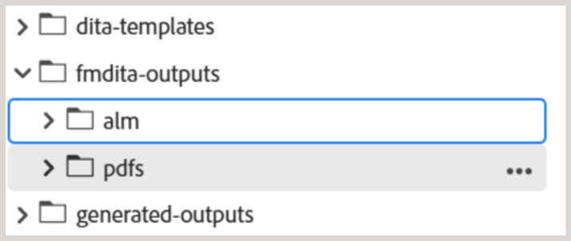

# Prácticas recomendadas para configurar la estructura de carpetas

Este artículo proporciona los pasos esenciales y las prácticas recomendadas para que los administradores configuren estructuras de carpetas en Adobe Experience Manager Guides. Una jerarquía de carpetas bien organizada garantiza flujos de trabajo de creación, publicación y traducción fluidos para el contenido de aprendizaje y formación.

## Configuración de la estructura de carpetas

Para permitir el acceso a varias funciones de creación, publicación y traducción de Experience Manager Guides, asegúrese de configurar las carpetas en la jerarquía correcta como se explica a continuación.

**Crear una carpeta raíz**

Comience creando una carpeta raíz para su organización. Esto sirve de base para todas las carpetas de nivel de departamento y los recursos compartidos comúnmente.

Ejemplo: `/content/dam/ABC-Corp/`

Dentro de esta carpeta raíz, cree una carpeta dedicada para administrar los recursos que se utilizarán en varios departamentos. Por ejemplo, crea una carpeta **Común** para incluir recursos compartidos, como imágenes, vídeos y mucho más.

**Crear carpetas de nivel de departamento**

Cree carpetas independientes para cada departamento, como RRHH, Finanzas o Legal, para que puedan administrar su propio contenido.

*Pie de ilustración: estructura de carpetas independiente creada para el departamento de recursos humanos en la carpeta raíz*

**Prácticas recomendadas para configurar carpetas de nivel de departamento**

- Cree una carpeta **Común** > **assets** dedicada en cada departamento para los recursos comunes de nivel de departamento (si es necesario).
- Si desea compartir el contenido para su traducción, cree carpetas específicas del idioma (por ejemplo, en, de, fr). Los autores deben crear o actualizar contenido solo en la carpeta del idioma de origen (como en), ya que el contenido fuera de la carpeta del idioma de origen no se incluye en el flujo de trabajo de traducción. Las otras carpetas de idioma se pueden mantener vacías como marcadores de posición. Más información sobre [traducción de contenido](../user-guide/translation.md).
- Los permisos se pueden aprovechar para limitar el acceso de departamentos o usuarios específicos a la estructura de carpetas recién creada. Por ejemplo, asigne permisos para garantizar que solo los usuarios del departamento de recursos humanos puedan crear o modificar contenido dentro de la carpeta designada.

Repita la misma estructura para otros departamentos como Finanzas, Jurídico, etc.

## Configurar la estructura de carpetas de salida

La carpeta `fm-ditaoutputs` sirve como ubicación de almacenamiento predeterminada para los resultados generados a partir del contenido de aprendizaje y formación. Estas salidas suelen incluir paquetes SCORM (archivos ZIP) en la carpeta **alm** y archivos PDF en la carpeta **pdf**. Puede cambiar esta ruta de salida predeterminada en el nivel preestablecido desde la **consola de mapas** si es necesario.

Cuando trabaje con varios departamentos, considere la posibilidad de crear carpetas específicas del departamento dentro de la estructura de carpetas `fm-ditaoutputs` para garantizar que los usuarios de un departamento específico tengan acceso a las carpetas de salida relevantes.

## Cree usuarios y asígnelos a los grupos adecuados

Una vez establecida la jerarquía de carpetas, puede empezar a crear usuarios y agregarlos a grupos para que tengan acceso a las funciones relevantes de Experience Manager Guides. Experience Manager Guides proporciona tres grupos predeterminados: autores, revisores y editores. Según el grupo con el que esté asociado un usuario, se le permite realizar tareas específicas. Por ejemplo, la tarea de publicación solo la puede realizar un editor, pero no un autor.

Para crear usuarios nuevos y agregarlos a grupos, vaya a **Herramientas** > **Seguridad** > **Usuarios**.

En la página Administración de usuarios, seleccione **Crear** para crear un nuevo usuario. Agregue detalles del usuario y asígnelos a un grupo.

Para obtener más información, vea [Administración de usuarios y seguridad](../cs-install-guide/user-admin-sec.md)

## Asignar permisos a cada grupo de usuarios

Una vez añadidos los usuarios a los grupos adecuados, configure los permisos en el nivel de grupo para asegurarse de que tienen acceso a las carpetas de creación y salida correctas del repositorio.

Para asignar permisos, vaya a **Herramientas** > **Seguridad** > **Permisos**.

Estos permisos ayudan a garantizar que los usuarios puedan crear o modificar contenido únicamente dentro de sus carpetas designadas.

Para obtener más información, vea [Permisos en AEM](https://experienceleague.adobe.com/en/docs/experience-manager-65/content/security/security#permissions-in-aem).

