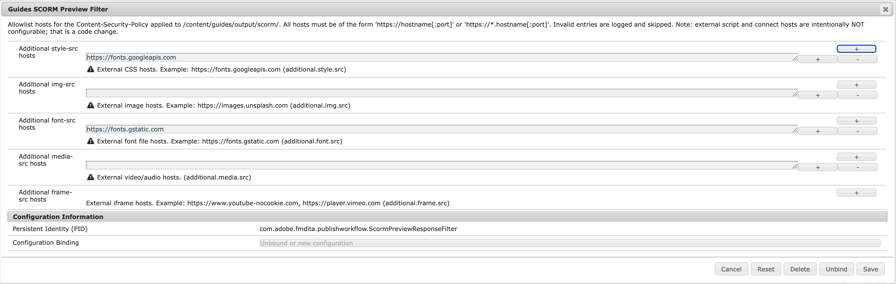

# Configuración de la previsualización SCORM

En este artículo se explica cómo configurar la vista previa de SCORM de Experience Manager Guides para administrar qué dominios externos pueden proporcionar hojas de estilo, imágenes, fuentes, medios y contenido incrustado en la salida de vista previa de SCORM. Los siguientes pasos explican cómo configurar varios filtros para la vista previa de SCORM según la configuración que utilice:

>[!BEGINTABS]

>[!TAB Cloud Service]

1. Siga las instrucciones indicadas en [Anulaciones de configuración](../install-conf-guide/download-install-config-override.md) para crear el archivo de configuración.

1. En el archivo de configuración, proporcione los siguientes detalles de propiedad:

   | PID | Clave de propiedad | Valor predeterminado |
   |---|---|---|
   | `com.adobe.fmdita.publishworkflow.ScormPreviewResponseFilter` | `additional.style.src` | `https://fonts.googleapis.com` |
   | `com.adobe.fmdita.publishworkflow.ScormPreviewResponseFilter` | `additional.img.src` | - |
   | `com.adobe.fmdita.publishworkflow.ScormPreviewResponseFilter` | `additional.font.src` | `https://fonts.gstatic.com` |
   | `com.adobe.fmdita.publishworkflow.ScormPreviewResponseFilter` | `additional.media.src` | - |
   | `com.adobe.fmdita.publishworkflow.ScormPreviewResponseFilter` | `additional.frame.src` | `https://www.youtube-nocookie.com`, `https://www.youtube.com` |


1. Guarde el archivo de configuración e impleméntelo en su entorno de Cloud Service.

Una vez guardada, la vista previa de SCORM comienza a aplicar la lista de permitidos de dominio actualizada. Los recursos externos de dominios que no se hayan agregado a esta configuración no estarán disponibles en la vista previa.

>[!NOTE]
>
> Esto solo se aplica al entorno de vista previa; el paquete descargable SCORM sigue entregando todo el contenido creado según lo previsto.


>[!TAB Local]

1. Abra la página Configuración de la consola web de Adobe Experience Manager.

   La URL predeterminada para acceder a la página de configuración es:

   ```http
   http://<server name>:<port>/system/console/configMgr
   ```

1. Busque y seleccione el paquete **Filtro de vista previa de Guides SCORM (com.adobe.fmdita.publishworkflow.ScormPreviewResponseFilter)**.

   {width="600"}


1. En la configuración del paquete, agregue las direcciones URL de dominio permitidas para cada tipo de recurso según sea necesario:

   | Campo | Descripción |
   |---|---|
   | **Host adicional de style-src** | Dominios desde los que se puede cargar hojas de estilo CSS externas (de forma predeterminada, `https://fonts.googleapis.com`). |
   | **Host adicional de image-src** | Dominios desde los que se autoriza la carga de imágenes externas. |
   | **Host font-src adicional** | Dominios desde los que se autoriza la carga de archivos de fuentes externas (OTF, WOFF, etc.) (de forma predeterminada, `https://fonts.gstatic.com`). |
   | **Host adicional de media-src** | Dominios desde los que se autoriza la carga de archivos multimedia externos. |
   | **Host adicional de frame-src** | Dominios desde los cuales se permite incrustar contenido de iframe (de forma predeterminada, `https://www.youtube.com` para permitir incrustaciones de vídeo de YouTube). |

1. Seleccione **Guardar**.

Una vez guardada, la vista previa de SCORM comienza a aplicar la lista de permitidos de dominio actualizada. Los recursos externos de dominios que no se hayan agregado a esta configuración no estarán disponibles en la vista previa.

>[!NOTE]
>
> Esto solo se aplica al entorno de vista previa; el paquete descargable SCORM sigue entregando todo el contenido creado según lo previsto.

>[!ENDTABS]