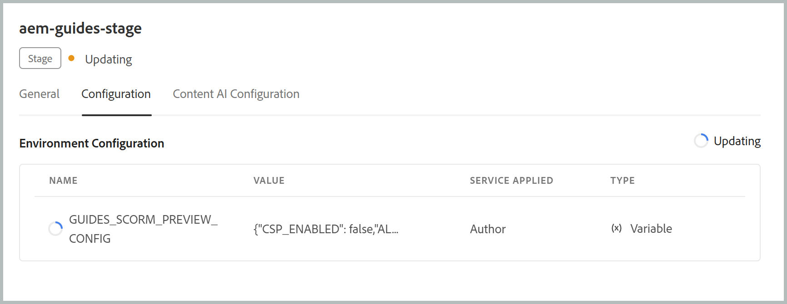

# Configurar la política de seguridad de contenido (CSP) para la vista previa de SCORM

La vista previa de Experience Manager Guides SCORM se administra mediante una variable de entorno específica que rige la Política de seguridad de contenido (CSP) aplicada a la experiencia de vista previa. Una vez habilitada, los administradores pueden ampliarla agregando fuentes de confianza adicionales. Estas fuentes pueden incluir secuencias de comandos, estilos, fuentes, imágenes, medios, marcos y mucho más, necesarios para que los paquetes SCORM carguen y procesen las vistas previas correctamente en Experience Manager Guides.

En este artículo se explica cómo agregar y configurar la variable de entorno en Cloud Manager, se desglosa lo que hace cada campo del valor JSON y se muestra cómo actualizar el valor más adelante si cambian sus necesidades.

## Campos de configuración

La variable `GUIDES_SCORM_PREVIEW_CONFIG` acepta el objeto JSON como su valor. Cada valor controla un aspecto específico del CSP aplicado durante la previsualización de SCORM:

| Campos | Tipo | Descripción |
|---|---|---|
| `CSP_ENABLED` | Booleano | Activa o desactiva la aplicación CSP (`true`) para la vista previa de SCORM.`false` |
| `ALLOW_UNSAFE_EVAL` | Booleano | Permite el uso de `eval()` y métodos de evaluación de JavaScript similares no seguros cuando se establece en `true`. |
| `ADDITIONAL_SCRIPT_SRC` | Matriz | Fuentes de confianza adicionales permitidas para JavaScript. |
| `ADDITIONAL_STYLE_SRC` | Matriz | Fuentes de confianza adicionales permitidas para servir hojas de estilo. |
| `ADDITIONAL_FONT_SRC` | Matriz | Fuentes de confianza adicionales permitidas para servir fuentes. |
| `ADDITIONAL_FRAME_SRC` | Matriz | Se permite cargar fuentes de confianza adicionales en `<iframe>` elementos. |
| `ADDITIONAL_IMG_SRC` | Matriz | Fuentes de confianza adicionales permitidas para proporcionar imágenes. |
| `ADDITIONAL_MEDIA_SRC` | Matriz | Fuentes de confianza adicionales permitidas para proporcionar contenido de audio/vídeo. |
| `ADDITIONAL_WORKER_SRC` | Matriz | Fuentes de confianza adicionales permitidas para servir a los trabajadores web. |
| `ADDITIONAL_CONNECT_SRC` | Matriz | Fuentes de confianza adicionales a las que se permite conectar la vista previa (por ejemplo, llamadas XHR/fetch). |
| `ADDITIONAL_MANIFEST_SRC` | Matriz | Fuentes de confianza adicionales permitidas para proporcionar manifiestos de aplicaciones web. |
| `ADDITIONAL_OBJECT_SRC` | Matriz | Se permite cargar fuentes de confianza adicionales a través de `<object>`, `<embed>` o `<applet>`. |


## Valores predeterminados para los campos de configuración

```json
{
  "CSP_ENABLED": true,
  "ALLOW_UNSAFE_EVAL": false,
  "ADDITIONAL_STYLE_SRC": ["https://fonts.googleapis.com"],
  "ADDITIONAL_FONT_SRC": ["https://fonts.gstatic.com"],
  "ADDITIONAL_FRAME_SRC": ["https://www.youtube-nocookie.com", "https://www.youtube.com"],
  "ADDITIONAL_SCRIPT_SRC": [],
  "ADDITIONAL_WORKER_SRC": [],
  "ADDITIONAL_IMG_SRC": [],
  "ADDITIONAL_MEDIA_SRC": [],
  "ADDITIONAL_CONNECT_SRC": [],
  "ADDITIONAL_MANIFEST_SRC": [],
  "ADDITIONAL_OBJECT_SRC": []
}
```

Según sus necesidades, no tiene que rellenar todos los valores; deje cualquier tipo de origen como una matriz vacía si no necesita permitir orígenes adicionales para él.

>[!NOTE]
>
> Si desea deshabilitar el cumplimiento de CSP para la vista previa de SCORM, establezca `"CSP_ENABLED": false` en el valor JSON.

## Añadir la variable en Cloud Manager

1. Inicie sesión en Cloud Manager y seleccione el entorno en el que desea aplicar la configuración.
2. Vaya a la pestaña **Configuración** del entorno.
3. Seleccione **Agregar/Actualizar** para agregar una variable de entorno.

   {width="650"}

4. Escriba el nombre de la variable (`GUIDES_SCORM_PREVIEW_CONFIG`) en el campo **Nombre**.

   {width="650"}

5. Escriba la configuración completa de JSON, incluidas las listas de fuentes permitidas que necesita para el curso, en el campo **Valor**.
6. Seleccione el **servicio aplicado** para elegir si la variable se debe aplicar a **Autor**, **Publicar** o ambos. Para la creación de Experience Manager Guides, seleccione **Autor**.
7. Seleccione **Variable** en el campo **Tipo**.
8. Seleccione **Añadir**.
9. Seleccione **Guardar**.

   {width="650"}

Una vez guardado, Cloud Manager aplica la configuración al entorno seleccionado. Esto suele tardar entre 10 y 12 minutos en propagarse, por lo que se debe dejar un margen para que se complete la actualización. Una vez finalizado, la nueva configuración estará activa para la vista previa de SCORM en ese entorno.

## Actualizar los valores de las variables

Si sus requisitos cambian, puede volver a visitar la variable `GUIDES_SCORM_PREVIEW_CONFIG` en cualquier momento desde la misma pestaña Configuración en Cloud Manager. Busque la variable existente y seleccione su opción **Agregar/Actualizar** para abrirla y editarla; a continuación, revise el valor según sea necesario.