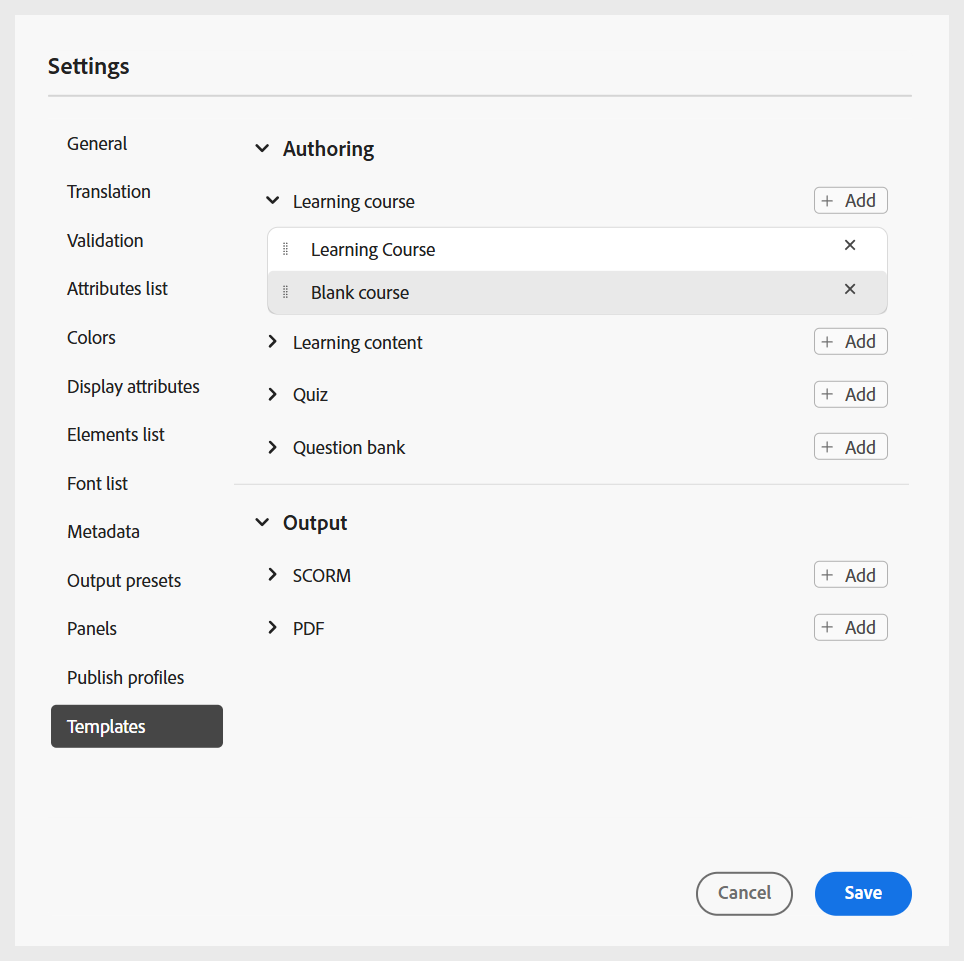
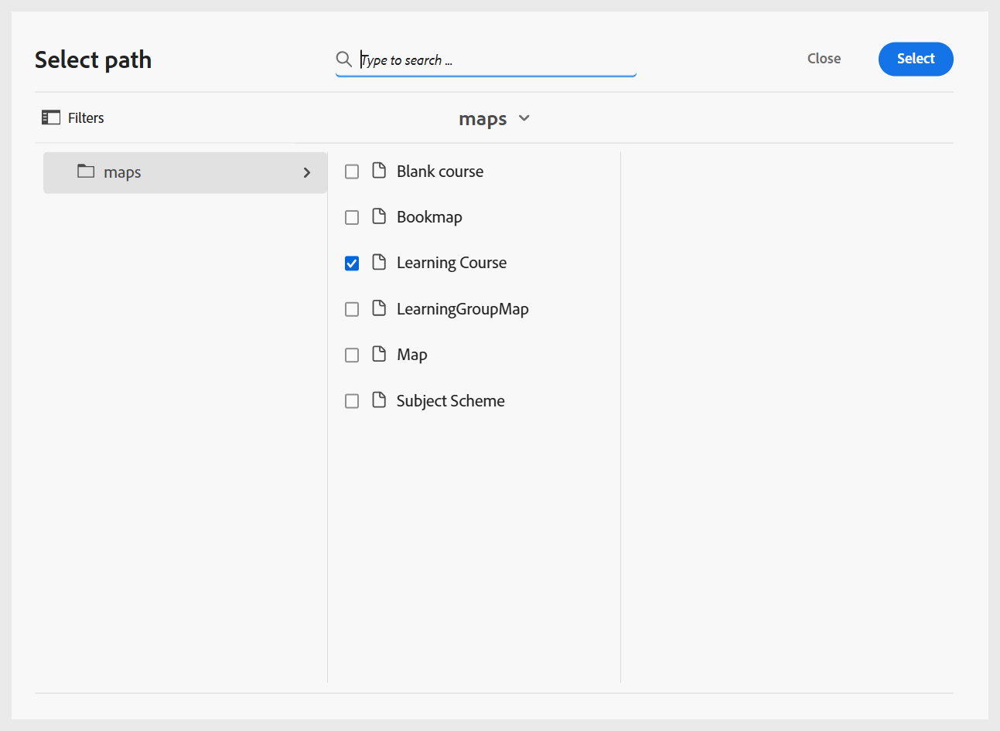
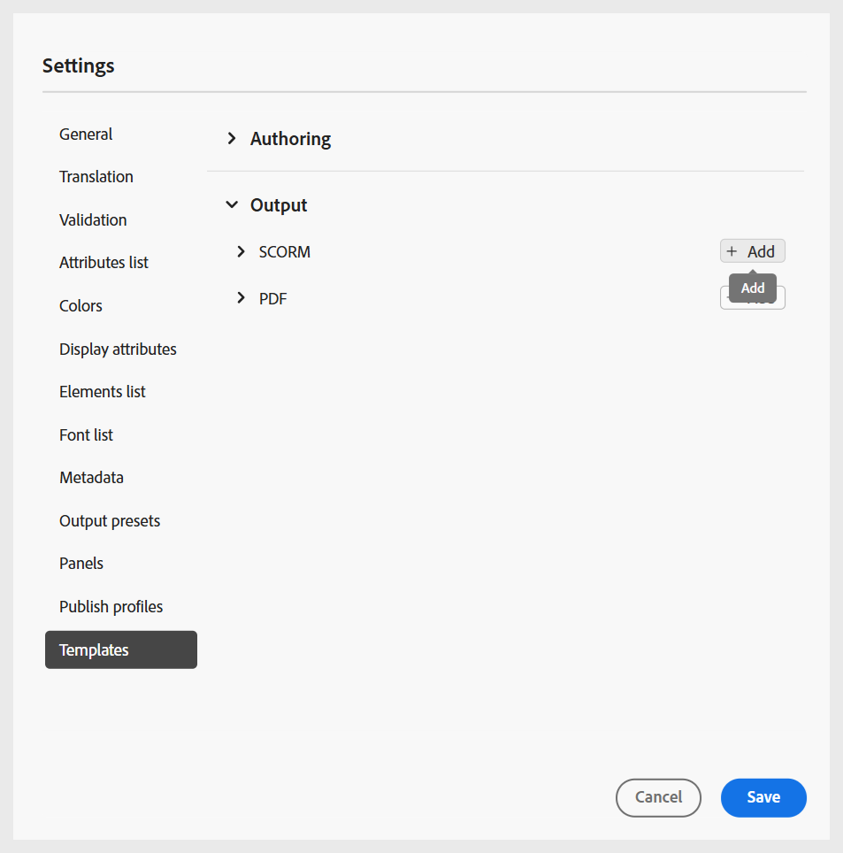

# Configuración de perfiles de carpeta

Se requiere un perfil de carpeta para separar las configuraciones de diferentes departamentos o productos en la empresa. Para el contenido de aprendizaje y formación, puede crear y configurar un perfil de nivel de carpeta para administrar la creación de plantillas, plantillas de salida, ajustes preestablecidos de salida y otras configuraciones de nivel de carpeta.

Para empezar a configurar el perfil de la carpeta para el contenido de aprendizaje y formación, debe:

1. [Crear un perfil de carpeta](../cs-install-guide/conf-folder-level.md#create-and-configure-a-folder-level-profile).
2. **Seleccione el perfil de carpeta que desea configurar**: Una vez creado el perfil de carpeta, debe seleccionar el perfil de carpeta en la página [Preferencias de usuario](../user-guide/intro-home-page.md#user-preferences) para asegurarse de que los autores y los editores tienen acceso a las plantillas correctas.

   {width="650" align="left"}

3. **Configurar la configuración del perfil de la carpeta**: Para el contenido de aprendizaje y formación, se puede configurar lo siguiente en el nivel de carpeta:
   - [Paneles](#configure-panels)
   - [Plantillas](#configure-templates)
   - [Valores de salida](#configure-output-presets)
   - [Editor de HTML](#html-editor-settings)
   - [Publicar perfiles](#manage-publish-profiles)

Para obtener acceso a esta configuración, cambie a la vista Editor y seleccione **Configuración** en el menú **Opciones**, como se muestra a continuación:

## Configuración de paneles

Esta opción controla los paneles que se muestran en los paneles izquierdo y derecho de **Editor** y **Consola de mapas** en Experience Manager Guides. Puede alternar el botón para mostrar u ocultar el panel deseado.

Para el contenido de aprendizaje y formación, asegúrese de que solo están habilitadas las siguientes funciones para la consola Editor y Mapa.

{width="350" align="left"}

### Editor

**Panel izquierdo**

- **Colecciones**: permite organizar y guardar archivos usados con frecuencia o acceder rápidamente a archivos compartidos.
- **Repositorio**: permite ver y obtener acceso a todos los mapas, temas, imágenes y otros recursos almacenados en el repositorio de contenido.
- **Administrador de cursos**: proporciona un área de trabajo dedicada para crear y administrar cursos.
- **Fragmentos**: permite crear y reutilizar fragmentos de contenido pequeños en diversos temas de los cursos de aprendizaje.
- **Condiciones**: permite configurar atributos condicionales a nivel global y de carpeta.
- **Variables**: permite crear y administrar variables para usarlas en el contenido de aprendizaje.
- **Variables de idioma**: permite definir cadenas localizadas para el texto estático o de salida publicado en plantillas.
- **Plantillas**: Permite crear y administrar plantillas para que las utilicen los autores.
- **Plantillas de salida**: Permite crear y administrar plantillas de salida para generar resultados en varios formatos.
- **Buscar y reemplazar**: proporciona opciones para buscar y reemplazar texto en los archivos de un mapa o una carpeta dentro del repositorio. 

**Panel derecho**

- **Propiedades de contenido**: contiene información sobre el tipo y los atributos del elemento seleccionado actualmente en el Editor.
- **Propiedades del archivo**: permite ver y administrar las propiedades del archivo seleccionado.
- **Estilos**: muestra las opciones globales de estilo basadas en clases que se utilizarán en el contenido de aprendizaje.
- **Filtros**: permite filtrar contenido en función de las condiciones aplicadas en el modo de vista previa de un tema.

### Consola de mapas

**Panel izquierdo**

- **Ajustes preestablecidos**: Permite configurar ajustes preestablecidos de salida para publicar el curso de aprendizaje.
- **Traducción**: proporciona opciones para traducir el contenido a varios idiomas.
- **Informes**: le permite generar y administrar informes para obtener un insight útil en el estado general del contenido del curso.
- **Ajustes preestablecidos de condición**: Proporciona opciones para configurar ajustes preestablecidos de salida basados en condiciones para distintas audiencias, departamentos y mucho más.

**Panel derecho**

- **Filtros**: permite usar filtros cuando se trabaja con informes y traducciones.

## Configurar plantillas

Esta configuración le permite administrar las plantillas de creación y publicación presentes en el [panel izquierdo del editor](../user-guide/web-editor-left-panel.md). Puede agregar, quitar o reordenar las plantillas de creación y salida, a las que los autores y editores podrán tener acceso.

{width="350" align="left"}

Las plantillas de creación están disponibles en cuatro categorías: curso de aprendizaje, contenido de aprendizaje, prueba y banco de preguntas. Si hay alguna plantilla predefinida configurada en su instancia, se muestra de forma predeterminada.

{width="350" align="left"}

### Añadir plantillas

Siga estos pasos para agregar una plantilla nueva:

1. Vaya a la categoría de plantilla donde desee agregar una plantilla y seleccione **Agregar**.
2. En el cuadro de diálogo Seleccionar ruta, seleccione la plantilla deseada.
3. Elija **Seleccionar**.

   {width="350" align="left"}

La plantilla se agrega en la categoría correspondiente del panel Configuración.

Del mismo modo, puede agregar otras plantillas de creación y salida. Una vez añadidas, estas plantillas se ponen a disposición de los autores y editores en sus respectivos cuadros de diálogo de cursos. Por ejemplo, la plantilla de curso de aprendizaje añadida por el administrador estará disponible para los autores cuando creen un nuevo curso.

{width="350" align="left"}

### Trabajo con nuevas plantillas de creación y salida

Para usar una plantilla diferente a las mostradas en el cuadro de diálogo **Seleccionar ruta**, cree una plantilla de creación o de salida personalizada.

**Crear nuevas plantillas**

Para utilizar una plantilla de tema o mapa diferente, cree una nueva plantilla de creación desde el panel Plantillas del Editor. Utilice plantillas de mapas para crear cursos de aprendizaje y plantillas de temas para el contenido de aprendizaje, las pruebas o el resumen de aprendizaje.

Para obtener más información, vea [Crear plantillas personalizadas desde el editor](../user-guide/create-maps-customized-templates.md).

{width="350" align="left"}

**Crear nuevas plantillas de salida**

Siga estos pasos para crear una nueva plantilla de salida para el contenido de aprendizaje y formación:

1. En el panel izquierdo del editor, seleccione **Más** > **Plantillas de salida**.

   Se muestra el panel Plantillas de salida.

   {width="350" height="" align="left"}
2. En el panel Plantillas de salida, seleccione (+) para crear una nueva plantilla de salida.

   {width="350" align="left"}
3. Seleccione una Plantilla de salida en el menú desplegable.

   {width="650" align="left"}
4. En función del tipo de plantilla de salida seleccionado, se muestra un cuadro de diálogo en el que puede crear una nueva plantilla basada en las plantillas disponibles.

   {width="350" align="left"}

5. Seleccione **Crear**.

   Se crea una nueva plantilla de salida.

6. Para acceder y agregar la plantilla de salida para editores, ve a **Configuración** > **Plantillas** > **Plantillas de salida** y selecciona **Agregar**.

   {width="350" align="left"}

   La plantilla de salida se muestra en el cuadro de diálogo Seleccionar ruta.
7. Seleccione la plantilla y elija **Confirmar**.

   {width="350" align="left"}

   La plantilla de salida seleccionada se agrega ahora al panel Configuración.

   {width="350" align="left"}

### Eliminación o reordenación de plantillas

Una vez agregadas, puede quitar o reordenar las plantillas del panel Configuración.

Para quitar una plantilla, selecciona el icono **Quitar** que hay junto a ella.

{width="350" align="left"}

También puede definir el orden en que se muestran las plantillas presentes dentro de una categoría. Para cambiar el orden de visualización de las plantillas, seleccione las barras de puntos y arrastre una plantilla a la posición deseada.

{width="350" align="left"}

## Configurar ajustes preestablecidos de salida

La pestaña Ajustes preestablecidos de salida permite definir qué formatos de salida están disponibles para publicar un curso. Contiene dos secciones: **Tipos de ajustes preestablecidos de salida permitidos** y **Ajustes preestablecidos de salida comunes**.

{width="350" align="left"}

- **Tipos de ajustes preestablecidos de salida permitidos**: en esta sección se enumeran todos los ajustes preestablecidos de salida admitidos en la instancia de Experience Manager Guides. Para la publicación del curso, solo se aplican los formatos **SCORM** y **PDF**. Puede seleccionar una o ambas opciones. Los ajustes preestablecidos seleccionados estarán disponibles para los editores al generar la salida del curso.

  {width="350" align="left"}

- **Ajustes preestablecidos de salida comunes**: en esta sección se muestran los ajustes preestablecidos de salida que los editores crean y agregan normalmente a un perfil de carpeta específico. También puede eliminar cualquier ajuste preestablecido que ya no sea necesario.

  {width="350" align="left"}

## Configuración del editor de HTML

Esta configuración le permite configurar el Editor para la creación basada en HTML. Las opciones de configuración clave presentes en esta configuración son las siguientes:

{width="350" align="left"}

- **Ocultar estilo en línea**: habilite esta opción para evitar que los autores apliquen formato en línea al contenido del curso. Cuando se habilita, todas las opciones de estilo en línea como Fuentes, Borde, Diseño, Fondo y Columnas presentes en el panel derecho del Editor permanecen ocultas para los autores. Sin embargo, los autores aún pueden usar las opciones de estilo globales basadas en clases disponibles en el panel **Estilos**. Esto ayuda a mantener la coherencia con las directrices de estilo de su organización.
- **Ocultar la vista de Source para autores**: habilite esta opción para restringir el acceso al código fuente de HTML. Esto resulta útil cuando desea simplificar la edición o evitar cambios accidentales en el código subyacente.

## Administrar perfiles de publicación

Esta sección le permite ver, crear y administrar los perfiles de publicación utilizados para publicar cursos en SCORM Cloud. Cada perfil define los ajustes de conexión y los detalles de configuración necesarios para publicar un curso de aprendizaje en un entorno específico de SCORM Cloud.

Puede crear varios perfiles si necesita publicarlos en diferentes cuentas de SCORM Cloud, lo que garantiza flexibilidad y control sobre el proceso de publicación.

Proporcione los detalles del servidor junto con el ID de cliente y el secreto de cliente de la aplicación de nube SCORM asociada para configurar el perfil de publicación para la nube SCORM.

{width="350" align="left"}