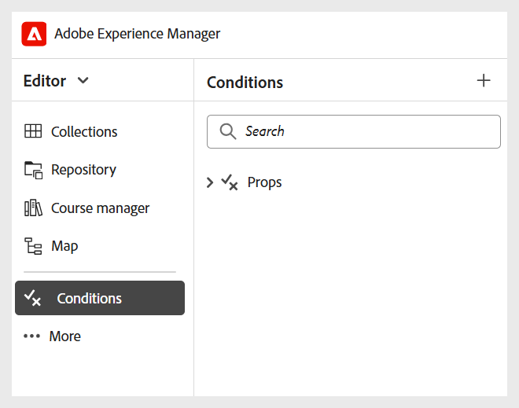

# Configurar otras opciones

Como administrador, también puede configurar las siguientes opciones para Autores y editores del curso de aprendizaje:

- **Fragmentos de código**: puede configurar fragmentos de código en el nivel de carpeta para garantizar que los autores tengan acceso a los fragmentos de código correctos. Solo los administradores pueden crear fragmentos de código en Experience Manager Guides, que luego pueden utilizar los autores en el Editor.

  Puede acceder a los fragmentos de código desde el panel izquierdo del Editor.

  {width="350"}
- **Condiciones**: como administrador, puede configurar atributos condicionales estándar compatibles con DITA en los niveles global o de carpeta. A continuación, los autores utilizan las condiciones configuradas simplemente arrastrando y soltando la condición deseada en el contenido.

  Puede acceder a Condiciones desde el panel izquierdo del Editor.

  {width="350"}
- **Variables**: puede definir variables para que el contenido sea más portátil, coherente y fácil de actualizar. Durante la generación de resultados, las variables se sustituyen por los valores del conjunto de variables seleccionado, lo que permite producir resultados personalizados de forma eficaz.

  Para obtener más información, vea [Crear una variable nueva](../native-pdf/native-pdf-variables.md#create-a-new-variable)

- **Barra de herramientas del editor**: puede personalizar la barra de herramientas del editor según sus necesidades organizativas. Por ejemplo, puede preferir cambiar el nombre de un botón de la barra de herramientas, cambiar su ubicación, etc.

  Para obtener más información, vea [Configurar y personalizar el Editor XML](../cs-install-guide/conf-folder-level.md#configure-and-customize-the-xml-editor-id2065g300o5z).
